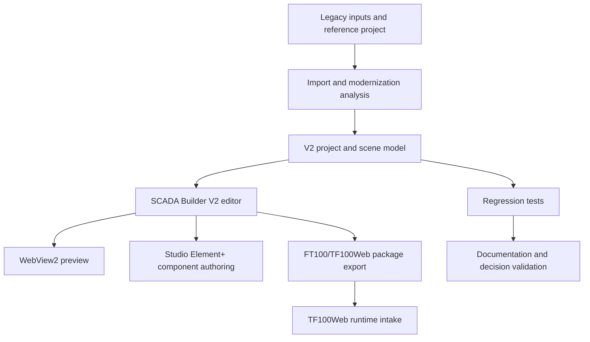

# SCADA Builder V2 - Application Objectives

Date: 2026-06-16
Status: Active product objective baseline
Document version: `V2.1.1.0039`

## Historique des changements

| Date | Version | Commit | Changement |
| --- | --- | --- | --- |
| 2026-06-16 | `V2.1.1.0039` | `PENDING` | Creation des objectifs applicatifs actifs de SCADA Builder V2. |

## 1. Objective

SCADA Builder V2 is a desktop SCADA/HMI authoring environment for modernizing legacy AMR/FT100 screens into a controlled V2 project model, previewing them faithfully, and exporting deterministic FT100/TF100Web runtime packages.

## 2. Product Goals

1. Preserve legacy visual fidelity during migration.
2. Replace ad hoc runtime output with a governed V2 project model.
3. Provide reliable editor commands, state, selection, properties, menus, and undo/redo.
4. Support Studio Element+ as a separate component authoring application.
5. Export normalized FT100/TF100Web packages without editor-only artifacts.
6. Maintain regression coverage for every contract-sensitive behavior.
7. Keep documentation, decisions, diagrams, code documentation, and tests synchronized.

## 3. Non-Goals

1. Treating legacy HTML as the permanent source of truth.
2. Letting WebView DOM state become durable project state.
3. Exporting editor overlays, handles, diagnostics, workzone geometry, or test UI.
4. Maintaining undocumented behavior in commands, menus, selection, export, or Studio Element+.

## 4. Product Flow

