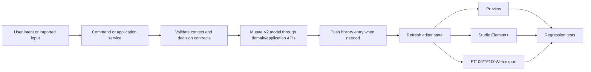
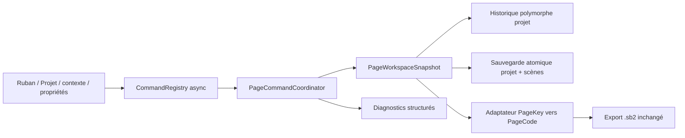

# SCADA Builder V2 - Application Flow

Date: 2026-07-14
Status: Active flow contract
Document version: `V2.1.1.0040`

## Historique des changements

| Date | Version | Commit | Changement |
| --- | --- | --- | --- |
| 2026-07-14 | `V2.1.1.0040` | `PENDING` | Ajout du flux partagé des commandes de page, de l'historique projet, de la sauvegarde atomique et des diagnostics. |
| 2026-06-16 | `V2.1.1.0039` | `PENDING` | Creation du flow applicatif global pour relier import, edition, preview, Studio Element+, export et validation. |

## 1. Flow Contract

Application behavior flows from user intent or imported input into the V2 project model, then to preview, Studio Element+, export, and validation.

### Page lifecycle flow

## 2. Validation Points

1. Commands validate context before mutating state.
2. State changes are captured in undo/redo where behavior is destructive or geometry-changing.
3. Preview and export must not diverge silently.
4. Studio Element+ exchange must preserve source traceability without exporting editor artifacts.
5. Documentation changes must update decision and generated maps when contracts change.
