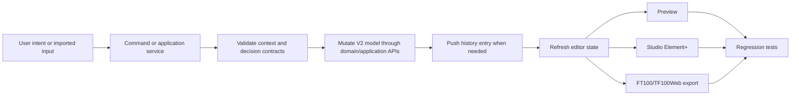
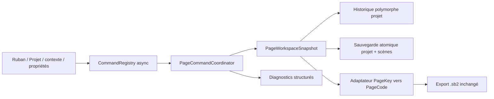
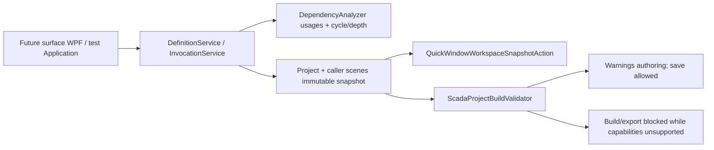

# SCADA Builder V2 - Application Flow

Date: 2026-07-14
Status: Active flow contract
Document version: `V2.1.5.0022`

## Historique des changements

| Date | Version | Commit | Changement |
| --- | --- | --- | --- |
| 2026-08-13 | `V2.1.5.0022` | `436d38f` | Ajout du flux Application QuickWindow Phase 2 : services immuables, dépendances, historique atomique et validation build fail-closed. |
| 2026-07-29 | `V2.1.5.0000` | `8fe1077` | Ajout du flux `DEC-0049` de création, ouverture, sauvegarde, fermeture et récents. |
| 2026-07-14 | `V2.1.1.0040` | `50b2ad9` | Ajout du flux partagé des commandes de page, de l'historique projet, de la sauvegarde atomique et des diagnostics. |
| 2026-06-16 | `V2.1.1.0039` | `2c5a0b4` | Creation du flow applicatif global pour relier import, edition, preview, Studio Element+, export et validation. |

## 1. Flow Contract

Application behavior flows from user intent or imported input into the V2 project model, then to preview, Studio Element+, export, and validation.

Le cycle de vie projet suit `surface WPF -> ProjectLifecycleCoordinator -> IProjectWorkspaceRepository/IRecentProjectStore -> host de session -> PageWorkspaceController`. La cible est préparée et validée avant activation; les transitions dirty partagent `Save`, `Discard`, `Cancel`.

```mermaid
flowchart LR
  A[User intent or imported input] --> B[Command or application service]
  B --> C[Validate context and decision contracts]
  C --> D[Mutate V2 model through domain/application APIs]
  D --> E[Push history entry when needed]
  E --> F[Refresh editor state]
  F --> G[Preview]
  F --> H[Studio Element+]
  F --> I[FT100/TF100Web export]
  G --> J[Regression tests]
  H --> J
  I --> J
```

### Page lifecycle flow

```mermaid
flowchart LR
  Surface["Ruban / Projet / contexte / propriétés"] --> Registry["CommandRegistry async"]
  Registry --> Coordinator["PageCommandCoordinator"]
  Coordinator --> Snapshot["PageWorkspaceSnapshot"]
  Snapshot --> History["Historique polymorphe projet"]
  Snapshot --> Store["Sauvegarde atomique projet + scènes"]
  Coordinator --> Diagnostics["Diagnostics structurés"]
  Snapshot --> Identity["Adaptateur PageKey vers PageCode"]
  Identity --> Sb2["Export .sb2 inchangé"]
```

### QuickWindow Phase 2 flow

```mermaid
flowchart LR
  Intent["Future surface WPF / test Application"] --> Services["DefinitionService / InvocationService"]
  Services --> Dependencies["DependencyAnalyzer usages + cycle/depth"]
  Services --> Snapshot["Project + caller scenes immutable snapshot"]
  Snapshot --> History["QuickWindowWorkspaceSnapshotAction"]
  Snapshot --> BuildValidation["ScadaProjectBuildValidator"]
  BuildValidation --> Authoring["Warnings authoring; save allowed"]
  BuildValidation --> Blocked["Build/export blocked while capabilities unsupported"]
```

La Phase 2 n’ajoute ni surface WPF, ni preview produit, ni compilateur/export QuickWindow. Les services et l’historique sont prêts pour la Phase 3, tandis que le validateur bloque explicitement les profils antérieurs, les graphes invalides, les liaisons incompatibles et les capacités non promues.

## 2. Validation Points

1. Commands validate context before mutating state.
2. State changes are captured in undo/redo where behavior is destructive or geometry-changing.
3. Preview and export must not diverge silently.
4. Studio Element+ exchange must preserve source traceability without exporting editor artifacts.
5. Documentation changes must update decision and generated maps when contracts change.
