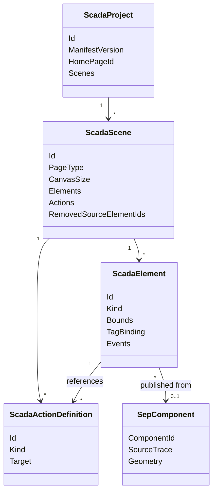

# SCADA Builder V2 - Data Model Overview

Date: 2026-06-16
Status: Active data model overview
Document version: `V2.1.1.0039`

## Historique des changements

| Date | Version | Commit | Changement |
| --- | --- | --- | --- |
| 2026-06-16 | `V2.1.1.0039` | `PENDING` | Creation de la vue d'ensemble du modele projet, scene, elements, actions, Studio et export. |

## 1. Model Families

1. Project model: project identity, scene inventory, home page, build inclusion, and page composition.
2. Scene model: canvas, page type, background, elements, actions, removed source ids, and composition references.
3. Element model: source projections, modern Element+ objects, groups, bindings, events, and geometry.
4. Studio model: `.ft1` transfer package and `.sep` reusable component package.
5. Runtime package model: root manifest, page manifests, page HTML, CSS, images, and runtime action metadata.

## 2. Relationship Diagram

