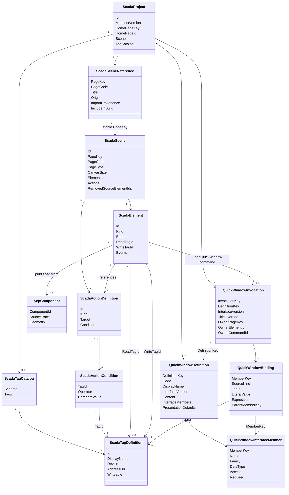

# SCADA Builder V2 - Data Model Overview

Date: 2026-07-14
Status: Active data model overview
Document version: `V2.1.6.0004`

## Historique des changements

| Date | Version | Commit | Changement |
| --- | --- | --- | --- |
| 2026-09-08 | `V2.1.6.0004` | `PENDING` | Les Fenêtres rapides entrent dans le diagramme de modèle : définitions, Interface locale, invocations et liaisons typées. |
| 2026-07-14 | `V2.1.2.0011` | `50b2ad9` | Ajout du modèle de page moderne, des clés internes, de la provenance, du snapshot workspace et des diagnostics structurés. |
| 2026-06-17 | `V2.1.2.0010` | `5302022` | Ajout de la relation conditionnelle entre action runtime et tag importe. |
| 2026-06-17 | `V2.1.2.0009` | `7e3610c` | Ajout des relations `ReadTagId` et `WriteTagId` sur les donnees Element+. |
| 2026-06-17 | `V2.1.2.0008` | `f78e8cd` | Ajout du catalogue tags TF100Web au modele projet et aux relations runtime. |
| 2026-06-16 | `V2.1.1.0039` | `2c5a0b4` | Creation de la vue d'ensemble du modele projet, scene, elements, actions, Studio et export. |

## 1. Model Families

1. Project model: project identity, scene inventory, home page, build inclusion, page composition, imported TF100Web tag catalog, quick-window definitions and quick-window invocations.
2. Scene model: canvas, page type, background, elements, actions, removed source ids, and composition references.
3. Element model: source projections, modern Element+ objects, groups, bindings, events, and geometry.
4. Studio model: `.ft1` transfer package and `.sep` reusable component package.
5. Runtime package model: root manifest, page manifests, page HTML, CSS, images, and runtime action metadata.

## 2. Relationship Diagram

```mermaid
classDiagram
  class ScadaProject {
    Id
    ManifestVersion
    HomePageKey
    HomePageId
    Scenes
    TagCatalog
  }
  class ScadaSceneReference {
    PageKey
    PageCode
    Title
    Origin
    ImportProvenance
    IncludeInBuild
  }
  class ScadaTagCatalog {
    Schema
    Tags
  }
  class ScadaTagDefinition {
    Id
    DisplayName
    Device
    AddressUri
    Writeable
  }
  class ScadaScene {
    Id
    PageKey
    PageCode
    PageType
    CanvasSize
    Elements
    Actions
    RemovedSourceElementIds
  }
  class ScadaElement {
    Id
    Kind
    Bounds
    ReadTagId
    WriteTagId
    Events
  }
  class ScadaActionDefinition {
    Id
    Kind
    Target
    Condition
  }
  class ScadaActionCondition {
    TagId
    Operator
    CompareValue
  }
  class SepComponent {
    ComponentId
    SourceTrace
    Geometry
  }
  class QuickWindowDefinition {
    DefinitionKey
    Code
    DisplayName
    InterfaceVersion
    Content
    InterfaceMembers
    PresentationDefaults
  }
  class QuickWindowInterfaceMember {
    MemberKey
    Name
    Family
    DataType
    Access
    Required
  }
  class QuickWindowInvocation {
    InvocationKey
    DefinitionKey
    InterfaceVersion
    TitleOverride
    OwnerPageKey
    OwnerElementId
    OwnerCommandId
  }
  class QuickWindowBinding {
    MemberKey
    SourceKind
    TagId
    LiteralValue
    Expression
    ParentMemberKey
  }
  ScadaProject "1" --> "*" ScadaSceneReference
  ScadaSceneReference "1" --> "1" ScadaScene : stable PageKey
  ScadaProject "1" --> "0..1" ScadaTagCatalog
  ScadaTagCatalog "1" --> "*" ScadaTagDefinition
  ScadaScene "1" --> "*" ScadaElement
  ScadaScene "1" --> "*" ScadaActionDefinition
  ScadaElement "1" --> "*" ScadaActionDefinition : references
  ScadaActionDefinition "0..1" --> "0..1" ScadaActionCondition
  ScadaActionCondition "*" --> "1" ScadaTagDefinition : TagId
  ScadaElement "*" --> "0..1" ScadaTagDefinition : ReadTagId
  ScadaElement "*" --> "0..1" ScadaTagDefinition : WriteTagId
  ScadaElement "*" --> "0..1" SepComponent : published from
  ScadaProject "1" --> "*" QuickWindowDefinition
  ScadaProject "1" --> "*" QuickWindowInvocation
  QuickWindowDefinition "1" --> "*" QuickWindowInterfaceMember
  QuickWindowInvocation "*" --> "1" QuickWindowDefinition : DefinitionKey
  QuickWindowInvocation "1" --> "*" QuickWindowBinding
  QuickWindowBinding "*" --> "1" QuickWindowInterfaceMember : MemberKey
  QuickWindowBinding "*" --> "0..1" ScadaTagDefinition : TagId
  ScadaElement "*" --> "0..1" QuickWindowInvocation : OpenQuickWindow command
```
