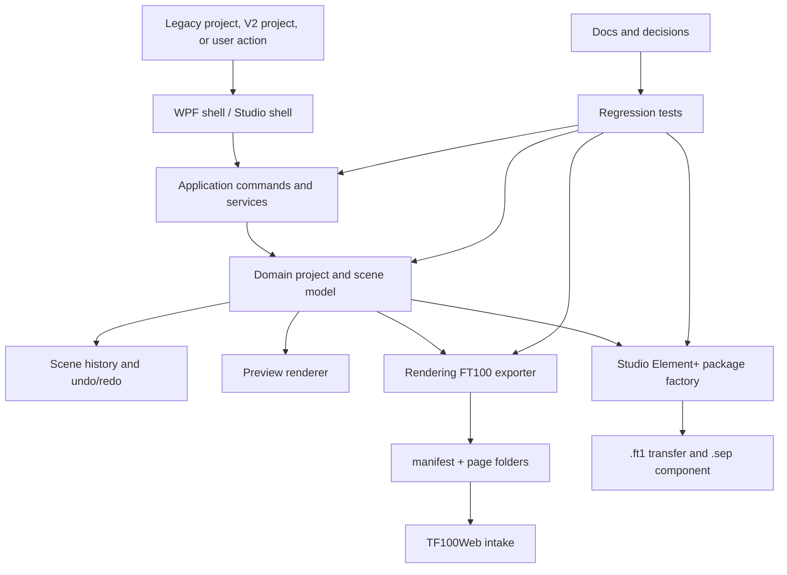

# SCADA Builder V2 - Global Architecture

Date: 2026-06-16
Status: Active architecture contract
Document version: `V2.1.1.0039`

## Historique des changements

| Date | Version | Commit | Changement |
| --- | --- | --- | --- |
| 2026-06-16 | `V2.1.1.0039` | `PENDING` | Creation du document d'architecture globale avec objectifs logiciels, modules et flow. |

## 1. Objective

This document owns the global software architecture for SCADA Builder V2.

SCADA Builder V2 must remain a layered .NET application where UI surfaces collect user intent, application services and commands apply behavior, domain models own durable state, rendering/export consumes the same model, and tests validate contracts without relying only on UI automation.

## 2. Layers

1. `ScadaBuilderV2.Domain`: project, scene, element, selection-adjacent domain types, versioning, and pure rules.
2. `ScadaBuilderV2.Application`: commands, conversion, history, Studio package factories, and application-level workflows.
3. `ScadaBuilderV2.Infrastructure`: file system persistence, legacy/reference readers, Studio package IO, and adapters.
4. `ScadaBuilderV2.Rendering`: preview/build/export rendering and FT100/TF100Web package generation.
5. `ScadaBuilderV2.App`: WPF editor shell and WebView2 bridge.
6. `ScadaBuilderV2.ElementStudio.App`: separate Studio Element+ editor application.
7. `ScadaBuilderV2.Tests`: regression suite protecting contracts.

## 3. Global Flow

## 4. Architecture Rules

1. UI must not own durable project rules.
2. WebView state is projection state, not the source of truth.
3. Preview/build/export must consume the same V2 model.
4. Editor-only overlays must be generated separately from runtime/export geometry.
5. Infrastructure returns domain/application results, diagnostics, or reports; it must not return UI controls.
6. Tests must protect domain, command, rendering, Studio, and WebView bridge contracts.

## 5. Related Decisions

1. `DEC-0001` - Enterprise Documentation Architecture.
2. `DEC-0004` - Shared Preview Build Export Model.
3. `DEC-0009` - Code Documentation And Generated Maps.
