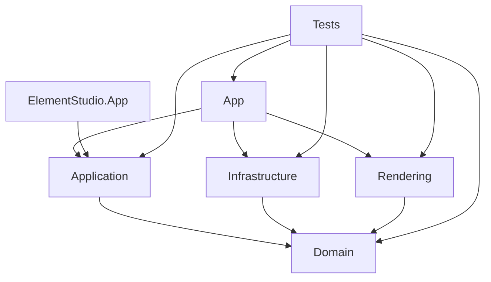

# SCADA Builder V2 - Module Boundaries

Date: 2026-06-16
Status: Active module boundary contract
Document version: `V2.1.4.0016`

## Historique des changements

| Date | Version | Commit | Changement |
| --- | --- | --- | --- |
| 2026-07-14 | `V2.1.4.0016` | `PENDING` | Frontiere Tableau explicitee : regles Domain, coordination/clipboard/catalogue Application, rendu Rendering et adaptation WPF/WebView App hors `MainWindow`. |
| 2026-06-16 | `V2.1.1.0039` | `PENDING` | Creation de la matrice de responsabilites par module logiciel. |

## 1. Boundary Matrix

| Module | Owns | Must not own |
| --- | --- | --- |
| Domain | Durable model and pure rules | WPF controls, WebView DOM, file dialogs |
| Application | Commands, history, conversion, Studio workflows | Runtime HTML details, UI styling |
| Infrastructure | Persistence and adapters | Business decisions, UI commands |
| Rendering | Preview/export output | Editor selection state ownership |
| App | User surfaces and WebView bridge | Durable contracts without commands/domain |
| ElementStudio.App | Studio UI and source editing surface | SCADA project persistence |
| Tests | Regression contracts | Production behavior |

Pour l'Element+ Tableau, `MainWindow` ne possede que le branchement au workspace actif. `ScadaTableOperations` et `ScadaTableStyleResolver` appartiennent au Domain; `TableEditCoordinator`, `TableClipboard`, `TableContextMenuProvider` et `InsertToolCatalog` appartiennent a Application; le HTML/CSS exporte appartient a Rendering; les dialogues et le script WebView appartiennent aux composants dedies de App.

## 2. Dependency Direction

