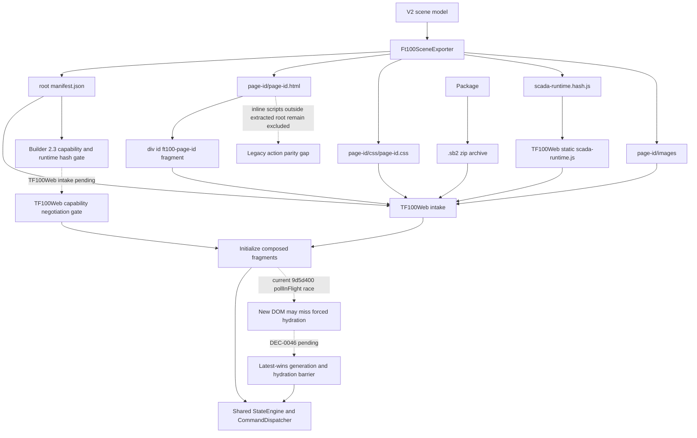

# SCADA Builder V2 - FT100 TF100Web Package Contract

Date: 2026-06-19
Status: Active runtime package contract
Document version: `V2.1.4.0056`

## Historique des changements

| Date | Version | Commit | Changement |
| --- | --- | --- | --- |
| 2026-07-16 | `V2.1.4.0056` | TF100Web `1fc3ac4` | Cycle latest-wins implemente avec AbortController, ownership generationnel, disposal et hydration forcee coalescee. |
| 2026-07-16 | `V2.1.4.0055` | TF100Web `cab2733` | HostAdapter 1.0 unique installe; intents canoniques/compatibles convergent vers les memes services host et l'ecriture protegee existante. |
| 2026-07-16 | `V2.1.4.0054` | TF100Web `7d60c63` | Intake 2.3 negocie version/capabilities/SHA avant remplacement; fixture `fb06431e...08404` vendoree. |
| 2026-07-16 | `V2.1.4.0053` | `PENDING` | ActionDispatcher partage ajoute; bindings/registre DOM canoniques; fixture regeneree au SHA-256 `fb06431e...08404`. |
| 2026-07-16 | `V2.1.4.0052` | `PENDING` | Command runtime canonique et intents 1.0 ajoutes; fixture regeneree au SHA-256 `4381347c...40a6`. |
| 2026-07-16 | `V2.1.4.0051` | `PENDING` | Runtime Etat/Expression/Effet complete; fixture regeneree au SHA-256 `6976e192...15ef`. |
| 2026-07-16 | `V2.1.4.0050` | `PENDING` | Fixture 2.3 deterministe et sanitisee ajoutee avec index exhaustif, archive stable et SHA-256 `9e64bb33...e274`. |
| 2026-07-16 | `V2.1.4.0049` | `PENDING` | Builder emet 2.3 strict par defaut avec capabilities triees et SHA-256 runtime; validateur fail-closed, profils 2.1/2.2 explicites; intake TF100Web encore pending. |
| 2026-07-16 | `V2.1.4.0046` | `PENDING` | `DEC-0047` approuvee : cible manifest 2.3 avec capabilities requises, hash runtime et rejet strict des gaps; 2.2 demeure actif jusqu'a implementation. |
| 2026-07-16 | `V2.1.4.0045` | `PENDING` | `DEC-0046` approuvee : contrat cible latest-wins et hydratation obligatoire; la course de `9d5d400` demeure un gap jusqu'a implementation. |
| 2026-07-16 | `V2.1.4.0044` | `de37a35`, TF100Web `9d5d400` | `DEC-0045` : effets Etat reversibles, overlay sous le contenu, snapshot initial force et ValueBinding numerique commun pour Element+ et cellules Tableau. |
| 2026-07-16 | `V2.1.4.0043` | `8489dbd` | Runtime Etat/Commande partage confirme : runtime package deploye, fragments initialises, mappings de commande collectes et texte de bouton cible via `[data-scada-text]`. |
| 2026-07-15 | `V2.1.4.0039` | `PENDING` | Manifest 2.2 et `Objects[].TableCellBindings` implementes; TF100Web accepte 2.1/2.2, cible le `<td>` page-scope et reutilise l'input numerique enfant. |
| 2026-07-14 | `V2.1.4.0016` | `10cfa72` | Le Tableau Element+ est exporte dans le HTML/CSS de page du contrat `.sb2` existant; les inputs cellule restent locaux et les artefacts editeur sont exclus. |
| 2026-07-13 | `V2.1.4.0003` | `b954d46` | Confirmation du contrat réel TF100Web pour les styles Element+ : HTML/CSS opaque, manifest PascalCase, runtime HTML camelCase et preuve de conservation après déploiement. |
| 2026-06-19 | `V2.1.2.0038` | `6f76dc8` | Clarification de la parite metadata wrapper preview/export pour boutons Element+. |
| 2026-06-19 | `V2.1.2.0037` | `2a540d6` | Ajout des evenements runtime de boutons HMI standards. |
| 2026-06-19 | `V2.1.2.0036` | `8cc4d33` | Ajout du contrat runtime disabled reel pour boutons Element+. |
| 2026-06-19 | `V2.1.2.0035` | `588d712` | Ajout du contrat runtime d'etat on/off pour boutons Toggle Element+. |
| 2026-06-19 | `V2.1.2.0034` | `61eef34` | Ajout du contrat CSS `:active` et etat toggle actif pour les boutons Element+. |
| 2026-06-18 | `V2.1.2.0032` | `d5ee1fd` | Ajout du contrat export des styles Element+ opacite et rotation. |
| 2026-06-18 | `V2.1.2.0030` | `cae57c9` | Ajout du champ manifest `ButtonKind` et de l'attribut HTML `data-scada-button-kind` pour les boutons Element+. |
| 2026-06-17 | `V2.1.2.0026` | `876a6be` | Correction du contrat manifest des affichages numeriques: `Data.DisplayFormat` est exporte, et TF100Web aligne le formatage sur les datatypes `RegisterMapping.DataType`. |
| 2026-06-17 | `V2.1.2.0025` | `58567eb` | Synchronisation avec TF100Web commit `3c795c2`: interpretation runtime des masques `DisplayFormat` `#`. |
| 2026-06-17 | `V2.1.2.0024` | `PENDING` | Clarification que `DisplayFormat` est le signal d'affichage numerique actif exporte vers TF100Web. |
| 2026-06-17 | `V2.1.2.0023` | `PENDING` | Ajout de la matrice de parite des events SCADA Builder V2 / TF100Web et du plan de prochaine tranche runtime. |
| 2026-06-17 | `V2.1.2.0022` | `PENDING` | Harmonisation de l'intake TF100Web `.sb2` pour consommer les events de binding `ValueBindings` exportes par SCADA Builder V2. |
| 2026-06-17 | `V2.1.2.0020` | `c2f0b6f` | Correction de la validation CSS page-scopee indentee et de l'export `.sb2` non bloquant cote WPF. |
| 2026-06-17 | `V2.1.2.0019` | `bd6515e` | Ajout de l'export `.sb2` FT100 et du validateur anti-collision/compatibilite TF100Web. |
| 2026-06-17 | `V2.1.2.0018` | `ad364a6` | Documentation du contrat d'intake FT100 reel audite dans TF100Web commit `7d57600`. |
| 2026-06-17 | `V2.1.2.0017` | `PENDING` | Ajout des effets visuels runtime standards. |
| 2026-06-17 | `V2.1.2.0017` | `PENDING` | Ajout du bridge lifecycle runtime global. |
| 2026-06-17 | `V2.1.2.0017` | `PENDING` | Ajout de l'evaluation runtime des groupes de conditions `All/Any`. |
| 2026-06-17 | `V2.1.2.0017` | `PENDING` | Ajout des options runtime avancees pour popup Fragment. |
| 2026-06-17 | `V2.1.2.0016` | `PENDING` | Ajout du runtime de bordure ciblee via classe CSS page-scopee. |
| 2026-06-17 | `V2.1.2.0015` | `PENDING` | Ajout des runtimes popup `ClosePopup` et `TogglePopup`. |
| 2026-06-17 | `V2.1.2.0014` | `PENDING` | Ajout du runtime popup pour actions `MountFragment`. |
| 2026-06-17 | `V2.1.2.0012` | `PENDING` | Ajout du protocole runtime `scadaBuilderSetTagValue` pour appliquer les valeurs lues. |
| 2026-06-17 | `V2.1.2.0010` | `PENDING` | Ajout de l'evaluation runtime des conditions tag pour actions objet Element+. |
| 2026-06-17 | `V2.1.2.0009` | `PENDING` | Remplacement du hook `WriteTag` authorable par les attributs runtime de binding valeur. |
| 2026-06-17 | `V2.1.2.0008` | `PENDING` | Ajout du catalogue tags et du hook runtime `WriteTag` au contrat FT100/TF100Web. |
| 2026-06-16 | `V2.1.2.0007` | `PENDING` | Ajout du contrat `cursor: pointer` pour les boutons et elements avec events runtime. |
| 2026-06-16 | `V2.1.2.0006` | `PENDING` | Ajout du contrat de wrapper runtime transparent pour les groupes Element+ portant des events. |
| 2026-06-16 | `V2.1.1.0039` | `PENDING` | Creation du contrat actif FT100/TF100Web avec namespace, manifest et deprecation `index.html`. |

## 1. Package Shape

Current FT100/TF100Web exports use:

```text
scada-builder-v2-ft100-package/
  manifest.json
  README.txt
  <page-id>/
    <page-id>.html
    css/
      <page-id>.css
    images/
    manifest.json
    README.txt
```

`index.html` is deprecated for current packages.

SCADA Builder V2 packages this folder as a `.sb2` archive for direct FT100 upload. The `.sb2` file is the operator transfer artifact. It is a ZIP archive whose top-level entry is `scada-builder-v2-ft100-package/`; that directory name is the internal extracted package root and must not be exposed as a separate operator workflow or contain an arbitrary parent folder above it.

## 2. Runtime Rules

1. Root `manifest.json` is the authoritative package inventory.
2. Each compiled page has a complete page root.
3. Header and footer are composed as complete page roots, not flattened child nodes.
4. Page dimensions come from manifest values and HTML diagnostics.
5. Viewport scale applies once to the composed page container.
6. HTML source-layer elements with saved bounds may carry inline geometry as a deployment guardrail.
7. SVG source shapes keep SVG geometry attributes and must not receive HTML absolute-position inline styles.
8. CSS, DOM ids, and runtime action lookup must be page-namespaced under the exported root id.
9. Element+ groups without runtime events may be flattened in exported HTML.
10. Element+ groups with object actions export a transparent page-scoped runtime wrapper carrying `data-scada-action-bindings`; the page root carries the matching `data-scada-action-registry`. The obsolete host-interpreted `data-scada-events` attribute remains decommissioned. A wrapper is runtime hit-test geometry only and must not add editor overlays, selection handles, labels, or visual decoration.
11. Element+ buttons and any exported element carrying `data-scada-action-bindings` must expose `cursor: pointer` by default, including descendants and active click state, so TF100Web operators see a button cursor on hover and click.
12. Element+ style opacity and rotation are exported as inline CSS `opacity`, `transform-origin: center center`, and `transform: rotate(...deg)`. Editor overlays, handles, and selection rectangles remain excluded from exported geometry.
13. Element+ button presets are exported as `Objects[].ButtonKind` in root/page manifests and as `data-scada-button-kind` on the Element+ wrapper and generated `<button>`. Supported values are `Command`, `Toggle`, `Navigation`, `AlarmAcknowledge`, and `EmergencyStop`.
14. Element+ button pressed metadata is exported under `Objects[].ButtonBehavior.Pressed`. When enabled and not disabled, FT100 export emits page-scoped `:active` CSS and a `[data-scada-toggle-state="on"]` selector for active toggle presentation.
15. Toggle buttons export `data-scada-toggle-state="off"` on the Element+ wrapper. The exported page runtime toggles that wrapper state between `off` and `on` on click and emits `scada-builder-toggle-state-changed`.
16. Disabled buttons export `data-scada-disabled="true"` and `aria-disabled="true"` on the Element+ wrapper, a native disabled generated `<button>`, suppressed hover/pressed CSS, excluded toggle-state event wiring, and a runtime event guard that blocks object-owned actions.
17. Preview and FT100 export share the wrapper-level button metadata contract: `data-scada-button-kind`, behavior metadata, disabled metadata, and Toggle initial state must stay coherent even though preview keeps generated buttons non-interactive for editing.
18. Enabled button wrappers emit `scada-builder-button-activated` on click plus a kind-specific event: `scada-builder-command-button-activated`, `scada-builder-navigation-button-activated`, `scada-builder-alarm-acknowledge-requested`, `scada-builder-emergency-stop-requested`, or `scada-builder-toggle-button-activated`.
19. Root and page manifests may include `Tags` from the project tag catalog and per-element `ValueBindings` metadata.
20. Exported page HTML emits `data-scada-read-tag` and `data-scada-write-tag` when an Element+ has value bindings.
21. Exported page runtime emits `scada-builder-read-tag-request` for read-bound elements and handles write-bound input changes by calling `window.tf100webScadaBuilder.writeTag(tagId, value, payload)` when available, then emitting `scada-builder-write-value`.
22. `DisplayFormat` is the active numeric display signal exported to TF100Web. For `InputNumeric` objects, page and root manifests must carry it under `Objects[].Data.DisplayFormat`; the page HTML may still show the mask as initial content, but the manifest field is the canonical runtime contract.
23. Hash masks such as `##.#` and `###.#` define visible digit budget and decimal placement. TF100Web interprets those masks against `RegisterMapping.DataType`: `FLOAT32` and `FLOAT64` round the raw value directly, integer datatypes `SINT8`, `UINT8`, `INT16`, `UINT16`, `INT32`, `UINT32`, `INT64`, and `UINT64` are scaled by the decimal count, and unknown datatypes fall back to direct rounding rather than integer scaling. `fixed:n` remains a compatibility format.
24. TF100Web host intake must treat `ReadTagId` and `WriteTagId` as binding events. Current `.sb2` intake resolves `ValueBindings.ReadTagId` and `ValueBindings.WriteTagId` values shaped as `tf100.mapping.<id>` into TF100Web `RegisterMapping` ids, injects `data-scada-role`, `data-scada-mapping-id`, `data-scada-writeable`, `data-scada-writable`, and `data-scada-format`, and maps page-scoped DOM ids such as `ft100-win00007__elementplus_numeric_display_111` back to manifest object ids such as `elementplus_numeric_display_111`.
25. If a read and write binding target different mappings, TF100Web keeps the read mapping in `data-scada-mapping-id` and carries the write mapping in `data-scada-write-mapping-id`; the host browser runtime writes to `data-scada-write-mapping-id` when present.
26. Object actions may include one `Condition` and/or one `ConditionGroup`; shared `ActionDispatcher` resolves values through `TagBridge` and delegates comparisons to `ExpressionEvaluator` before execution. Condition groups support `All`, `Any`, and explicit `BlockAction`/`AllowAction` missing-tag policy. Unknown operators, missing single-condition values and empty groups fail closed.
27. TF100Web may push live values into read-bound Element+ objects with `window.scadaBuilderSetTagValue(tagId, value, meta)` or by dispatching `scada-builder-tag-value` with `{ tagId, value }`. The page updates all matching `data-scada-read-tag` elements, stores the value in `window.scadaBuilderTagValues`, and emits `scada-builder-tag-value-applied`.
28. `MountFragment`, `ClosePopup`, and `TogglePopup` normalize to `openPopup`, `closePopup`, and `togglePopup` host intents. Optional `PopupOptions` are transported unchanged; popup mounting, placement, focus, multi-instance policy and fragment lifecycle remain host services and are never reimplemented by the portable dispatcher.
29. `SetClass`, `RemoveClass`, and `ToggleClass` actions with the standard `scada-runtime-border-highlight` class add, remove, or toggle a page-scoped runtime border on the target Element+. This visual class is runtime-only and must not represent editor selection overlays or `.sep` geometry.
30. `ScadaRuntime.initPage(root, pageId)` initializes the page-scoped action registry and bindings in addition to state, command and input modules. `disposePage(root)` removes action listeners before DOM replacement. Successful binding attempts emit `scada-builder-action-executed`; unsupported/missing definitions fail closed with diagnostics.
31. Standard visual effect actions use page-scoped CSS classes and keyframes for blink, glow, pulse, alarm highlight, and degraded treatment. Effects are applied through `SetClass`, `RemoveClass`, and `ToggleClass`.
32. `.sb2` archive export must validate the generated staging package before writing the archive. Blocking validation errors include missing root manifest, unsafe relative paths, missing page root `ft100-<page-id>`, duplicate DOM ids in a page, unscoped DOM ids, unscoped CSS selectors, invalid header/footer references, and wrong header/footer page types.
33. Missing page CSS is a compatibility warning because TF100Web accepts the package but reports `missing-css:<page-id>`.
34. DOM ids emitted by SCADA Builder V2 must be page-scoped. The only accepted page root id is `ft100-<page-id>` and Element+ DOM ids must use `ft100-<page-id>__<element-id>`. Raw global ids such as `Button1`, `group_001`, or `text_001` are invalid in `.sb2` export.
35. Legacy source fragment ids must be rewritten during export under `ft100-<page-id>__legacy-*` before validation. Duplicate legacy source ids receive deterministic occurrence suffixes so the final fragment contains no duplicate DOM id.
36. Generated CSS must not emit package-global `:root`, `html`, `body`, raw `[data-id="..."]`, raw `.ft100-*`, or raw `#Button1`-style selectors. Selectors must remain rooted under `#ft100-<page-id>` for TF100Web header/body/footer composition. Leading whitespace before a page-scoped id selector is formatting only and must not make a valid scoped selector fail `.sb2` validation.
37. The WPF `.sb2` export command must show bottom status-bar progress while export is running and must run archive generation asynchronously enough to keep the editor shell responsive.

## 3. Current TF100Web Intake Contract

Audit source: `F:\Projet\Git\TF100Web`, branch `codex/adding-table-cell-numeric-input`, commit `29ebd35`.

TF100Web currently consumes SCADA Builder V2 packages through these Django/runtime files:

1. `frontend/scada_package.py`.
2. `frontend/scada_projects.py`.
3. `frontend/views.py`.
4. `templates/frontend/station/visualisation.html`.
5. `static/asset/js/station/visualisation_import.js`.
6. `frontend/tests_scada_package.py`.

The active TF100Web intake contract is:

1. The package directory name remains `scada-builder-v2-ft100-package`.
2. TF100Web accepts uploaded `.sb2` or `.zip` packages through the SCADA Builder admin surface, extracts them into a project repository, and stores active project state outside the package. SCADA Builder V2 `.sb2` export is the preferred current transfer format.
3. The repository root is `SCADA_BUILDER_PROJECTS_ROOT` when configured, `/var/lib/ft100/scada-builder-projects` in production, or `var/scada-builder-projects` in development.
4. TF100Web also supports the repository-local fallback import root `F:\Projet\Git\TF100Web\import\scada-builder-v2-ft100-package` when no active uploaded project is selected.
5. The root `manifest.json` is mandatory. Missing, unreadable, non-object, or empty compiled-page manifests invalidate the package.
6. Compiled pages are read from `Pages` where `IncludeInBuild` is not false and each page has a non-empty `Id`.
7. Page type is read from `PageType` or `Type`, case-insensitive, with `default`, `header`, and `footer` used for composition validation.
8. `HomePageId` selects the initial page when present. If missing or invalid, TF100Web falls back to the first compiled default page, then to the first compiled page.
9. Page HTML is read from `RelativePath` when present, otherwise `<page-id>/<page-id>.html`.
10. Relative paths are normalized as package-local POSIX paths; absolute paths and `..` traversal are rejected.
11. TF100Web extracts only the HTML fragment whose root is `<div id="ft100-<page-id>">`. It does not inject the complete page document.
12. TF100Web loads page CSS from the sibling path `css/<page-id>.css` relative to the page HTML path. Missing CSS is a warning, not a hard validation error.
13. Relative `src` and `href` asset references inside the extracted fragment are rewritten through the Django package asset endpoint.
14. Header and footer composition is performed by loading the referenced header root, selected page root, and footer root as separate fragments.
15. The composed runtime width is the maximum page width in the composition; the composed runtime height is the sum of composed page heights.
16. TF100Web injects `--ft100-scada-width` and `--ft100-scada-height` CSS variables onto each extracted page root and onto the host.
17. TF100Web serves page navigation through a JSON endpoint that returns the extracted fragment, CSS URLs, dimensions, actions, and warnings for a requested page id.
18. The station visualisation page activates this runtime only when the station type is `SCADA_BUILDER_2`.
19. TF100Web `9d5d400` handles legacy same-package navigation and binding events resolved from manifest `ValueBindings`, and initializes the shared package `StateEngine`/`CommandDispatcher`. Canonical `ActionDispatcher` and manifest 2.3 negotiation are Builder-complete but not yet proven/deployed on that host baseline.
20. TF100Web extracts and renders the page root fragment only, but `deploy_scada_builder` also installs the package `scada-runtime.*.js` as `static/scada/js/scada-runtime.js`. The station template loads that shared runtime and `visualisation_import.js` initializes it on each composed fragment. Inline scripts emitted after the page root remain outside fragment execution and are not a semantic fallback; state, command and canonical action metadata live inside the extracted root.
21. TF100Web runtime value display/write is driven by TF100Web-injected `data-scada-role`, `data-scada-mapping-id`, `data-scada-write-mapping-id`, `data-scada-writeable`, `data-scada-writable`, `data-scada-format`, and related mapping attributes. `data-scada-format` supports `fixed:n` and hash masks made of `#` plus an optional decimal point. TF100Web first reads the canonical manifest value `Objects[].Data.DisplayFormat`; for legacy `.sb2` packages generated before that field was exported, it may fall back to an initial hash-mask text content such as `###.#`. One target-agnostic handler updates the existing numeric input and writes through `tf100webScadaBuilder.writeTag` for both standard Element+ and Table cells.
22. TF100Web derives those mapping attributes from SCADA Builder V2 `ValueBindings.ReadTagId` / `ValueBindings.WriteTagId`, legacy `Binding`, `RuntimeBinding`, `Bindings`, `RuntimeBindings`, `TagBinding`, manual page bindings, or `scada-runtime-overrides.json`.
23. TF100Web exports tags to SCADA Builder V2 through the `tf100web-scada-tags-v1` JSON schema from `frontend/scada_tags.py`.
24. `ScadaTagCache` collects and deduplicates mapping dependencies from canonical value-binding attributes, resolved `data-scada-mapping-id`/`data-scada-write-mapping-id` attributes, state configuration tag ids, and command `readTagId`/`writeTagId` fields before requesting snapshots. `TagBridge`, `StateEngine`, numeric ValueBindings and `CommandDispatcher` consume the same cache; all writes continue through the single `tf100webScadaBuilder.writeTag` bridge. The current `9d5d400` forced-first-snapshot implementation has a confirmed `pollInFlight` race and must not be treated as reliable navigation hydration.
25. Approved target under `DEC-0046`, pending TF100Web implementation: body navigation is generation-owned and latest-wins. Stale page/snapshot results cannot mutate DOM, dimensions, history or loading state. Every accepted composed DOM awaits a forced hydration that recomputes current dependencies and notifies the shared runtime even when cached values are unchanged. A forced request made during an in-flight poll is queued or coalesced, never silently discarded.
26. Builder implementation under `DEC-0047`: new operator exports use manifest 2.3 and add a root `RuntimeContract` with `Version = "1.0"`, ordinal-sorted unique `RequiredCapabilities`, and the 64-character lowercase SHA-256 of the exact packaged `scada-runtime.<short-hash>.js`. Strict export rejects any registry capability marked `Blocked` before replacing package staging output. Validation rejects unknown, duplicate, unsorted or blocked ids; absent/unsupported contract versions; missing/invalid/mismatched hashes; altered runtimes; and filenames not matching the first eight hash characters.
27. Compatibility manifests 2.1 and 2.2 are available only through explicit `Ft100ManifestProfile.Compatibility21` / `Compatibility22` selection and omit `RuntimeContract`. Current TF100Web `9d5d400` accepts only these compatibility contracts; the Builder 2.3 default must not be delivered to operators until TF100Web negotiation is deployed first.
28. Under the 2.3 target, expression, state, effect, command, action and condition semantics execute only in the shared package runtime. TF100Web supplies host adapters for composition, navigation/history, popup mounting, snapshots/quality, permissions/write, URL policy and diagnostics. A host-side duplicate semantic engine is forbidden.
29. The canonical Builder-side conformance artifact is `tests/conformance/artifacts/scada-v2-runtime-conformance.sb2`; its lowercase SHA-256 is `fb06431eafbdb39f8e75aaa5216a8e6517e36a8f04bde6f6b1945aea90b08404`. ZIP entries are ordinal-sorted and use the fixed `1980-01-01T00:00:00Z` timestamp, so identical models produce byte-identical packages. `tests/conformance/expected-runtime-capabilities.json` indexes all 162 registry entries: the 118 `Supported` capabilities name a `conformance:` fixture and the 44 `Blocked` capabilities name their expected strict-rejection diagnostic. The fixture contains no client page, workstation path, secret or industrial tag mapping. TF100Web must execute this exact artifact by SHA rather than regenerate a divergent package.
30. Shared commands emit one `scada-runtime-intent` envelope with `version = "1.0"` and an `intent` containing `id`, `kind` and kind-specific fields. `navigate`, `openPopup`, `togglePopup`, `closePopup`, `openUrl` and `back` never execute browser/host semantics directly. When available, `ScadaRuntime.HostAdapter.dispatchIntent` receives the envelope; otherwise `postMessage` transports it. Top-level `action`/`pageId`/`options` aliases preserve explicit 2.1/2.2 compatibility until the TF100Web adapter migration. Tag writes are excluded from that host-intent route and continue exclusively through `TagBridge.writeTag`.
31. Shared object actions consume `data-scada-action-registry` on the initialized page root and ordered `data-scada-action-bindings` on source objects. The nine persisted action kinds are interpreted once by `ActionDispatcher`: visibility/read/write stay portable and page-scoped; navigation/popup reuse the command intent envelope. Event order, `PreventDefault`, `StopPropagation`, disabled sources, missing actions/tags/targets and disposal are deterministic. Strict 2.3 still blocks action/popup capabilities lacking TF100Web fixture evidence before export.
32. TF100Web `7d60c63` accepts manifest 2.3 only when `RuntimeContract.Version` is supported, `RequiredCapabilities` is valid/sorted/unique and every id belongs to its explicit 118-capability registry, exactly one runtime file has the declared eight-character filename prefix, and its complete SHA-256 matches. The CLI and admin validator share this gate before the active static package is removed. The exact Builder fixture and SHA are vendored under `frontend/test_fixtures`; 2.1/2.2 remain explicit compatibility paths.
33. TF100Web `cab2733` installs exactly one `ScadaRuntime.HostAdapter` for Runtime 1.0 intents. Canonical direct dispatch and the explicit 2.1/2.2 `postMessage` compatibility shape converge into the same validator and service map. The adapter owns only navigation/history, popup mounting, URL policy, protected mapping writes and diagnostics; it rejects invalid versions/kinds/page ids, duplicate delivery, untrusted message origin, stale declared source pages and denied writes. `TagBridge.writeTag` delegates to the existing endpoint with same-origin credentials and CSRF; TF100Web does not re-evaluate expressions, conditions, commands or object actions.
34. TF100Web `1fc3ac4` implements `DEC-0046`. A navigation generation plus AbortController owns fetch, DOM/runtime replacement, popup closure, dimensions, history and loading teardown. Superseded work returns without mutation; timeout, HTTP/session and offline failures preserve a recoverable host. Existing page runtime listeners are disposed before replacement. Snapshot requests are generation-bound and abort on navigation. A forced hydration requested during an in-flight poll is coalesced into a mandatory awaited follow-up cycle that recollects dependencies from the accepted DOM and notifies the runtime even when values are unchanged or the dependency set is empty.

## 4. Element+ Style Transport Contract

The current TF100Web intake was verified against the local repository `F:\Projet\Git\TF100Web` through commit `9d5d400`, including `frontend.views.scada_package_page`, `frontend.scada_builder_composition.load_composed_page`, `frontend.views._inject_scada_element_attrs`, and `core.management.commands.deploy_scada_builder`.

1. `deploy_scada_builder` copies the root `.sb2` manifest to `STATIC_ROOT/scada/manifest.json`, pages to `STATIC_ROOT/scada/pages/<page-id>/<page-id>.html`, page CSS/assets beside the deployed page, and shared images to `STATIC_ROOT/scada/images/`.
2. `load_composed_page` resolves manifest fields `Pages`, `Id`, `IncludeInBuild`, `PageType`/`Type`, `HeaderPageId`, `FooterPageId`, extracts only `id="ft100-<page-id>"`, and reads CSS hashes/dimensions from page HTML.
3. The modern composition path treats Element+ HTML and CSS as opaque static content. It does not parse or reinterpret `ScadaElementStyle`, `data-scada-state-config`, or arbitrary CSS declarations.
4. `_inject_scada_element_attrs` may add runtime binding attributes derived from manifest objects, but it must not replace or reinterpret Element+ style declarations.
5. Project persistence and manifest JSON retain the existing .NET/PascalCase naming contract. Runtime JSON embedded in HTML attributes uses the Builder camelCase naming contract. These are separate contracts and must not be collapsed.
6. New style fields such as `FontWeight`, `FontStyle`, `TextDecoration`, `Foreground`, `BorderStyle`, and `BorderRadius` require no TF100Web semantic parser. Builder must emit valid HTML/CSS; TF100Web must preserve it through deployment and fragment composition.
7. Any change that makes TF100Web parse, normalize, or mutate these style fields is a contract change requiring a new decision, implementation, and integration coverage.

The required proof is an integration test in `F:\Projet\Git\TF100Web\frontend\tests_scada_deploy.py` that deploys a package containing the new style declarations, calls `scada_package_page`, and verifies that the returned page fragment preserves the HTML/CSS without server-side style interpretation.

## 5. Event Runtime Parity Matrix

SCADA Builder V2 and TF100Web do not currently have identical event coverage. The distinction is:

1. `SCADA Builder export`: the event can be authored, persisted, validated, and emitted by SCADA Builder V2.
2. `TF100Web active runtime`: the event is executed by the current TF100Web fragment intake and host JavaScript after a `.sb2` upload.
3. `Next tranche`: the event needs TF100Web host-side implementation or a deliberate decision to execute the exporter-emitted page runtime script.

| Event family | SCADA Builder export | TF100Web active runtime | Current evidence | Next tranche requirement |
| --- | --- | --- | --- | --- |
| `Clic -> Changer de page` / `Navigate` | Implemented through shared `ActionDispatcher` | Current legacy navigation exists; canonical 2.3 adapter proof pending | `data-scada-action-registry`, ordered `data-scada-action-bindings`, shared versioned intent | Install the single TF100Web HostAdapter and execute the committed fixture. |
| Group-carried `Clic -> Changer de page` | Implemented through canonical transparent wrapper | Canonical 2.3 adapter proof pending | Page-scoped wrapper carries `data-scada-action-bindings`; no `data-scada-events` | Validate grouped target through the shared fixture and industrial candidate. |
| `ReadTag` / `Lire valeur` binding event | Implemented through `ValueBindings.ReadTagId` | Functional through TF100Web host mapping refresh after `.sb2` intake | TF100Web resolves `tf100.mapping.<id>` to `RegisterMapping` and injects `data-scada-mapping-id` | Production validation on `win00007 / Element+ Text20 / tf100.mapping.180`. |
| `WriteTag` / `Ecrire valeur` binding event | Implemented through `ValueBindings.WriteTagId` | Functional for writable mappings and writable input Element+ objects | TF100Web uses `data-scada-write-mapping-id` when read/write mappings differ | Add or identify a production candidate with a writeable mapping and verify POST behavior on the unit. |
| Legacy `Binding`, `RuntimeBinding`, `TagBinding`, and overrides | Compatibility only | Functional as TF100Web compatibility paths | TF100Web still reads legacy binding shapes and `scada-runtime-overrides.json` | Do not use as the primary SCADA Builder V2 acceptance path. |
| Etat `StateConfig` | Implemented | Functional through shared package runtime | `ScadaTagCache -> TagBridge -> StateEngine -> EffectApplier`; canonical `tf100.mapping.*` AST refs; effect baseline restored before each transition and filter overlay below semantic content | Keep runtime JS and composed-fragment initialization regressions. |
| Commande `CommandConfig` (`WriteTag` Toggle included) | Implemented | Functional through shared package runtime | Command read/write mappings are collected and `CommandDispatcher` uses the existing `writeTag` bridge | Validate operator permissions and PLC feedback in the authorized industrial environment. |
| Lifecycle bridge | Shared `initPage`/`disposePage` implemented | Fragment initialization exists; latest-wins disposal/hydration remains pending | State, command, input and action modules share the same page root lifecycle | Complete `DEC-0046` generation ownership in TF100Web. |
| Popup open/close/toggle and popup options | Shared action adapter implemented; host-owned variants strict-blocked | Canonical 2.3 host proof pending | `MountFragment`, `ClosePopup`, `TogglePopup` normalize to one intent with `PopupOptions` | Implement popup services in the single HostAdapter; do not duplicate action semantics. |
| Visibility actions | Shared portable implementation complete; strict promotion pending | Canonical fixture proof pending | `Show`, `Hide`, `ToggleVisibility` resolve targets only in the initialized page root | Execute and promote per-capability evidence after TF100Web negotiation. |
| Border and visual effect legacy actions | Deprecated from the current domain | Not applicable to the canonical action model | `SetClass`, `RemoveClass`, `ToggleClass` authoring was removed; model-backed `StateConfig` owns effects | Keep deprecated compatibility named; do not reintroduce a second class-action engine. |
| Action conditions and condition groups | Shared portable implementation complete; strict promotion pending | Canonical fixture proof pending | `TagBridge -> ExpressionEvaluator -> ActionDispatcher`; `All`/`Any` and both missing policies tested | Execute committed fixture; keep condition semantics out of TF100Web host code. |
| Custom/page scripts | Roadmap or exporter-controlled depending on source | Not active in current TF100Web fragment intake | No safe host execution contract is active | Decide between controlled script execution and explicit host-side handlers. |

## 6. Current And Next TF100Web Event Tranches

The portable State/Command/Action tranches are implemented without a parallel host dispatcher. TF100Web must deploy the shared package runtime, initialize/dispose composed roots, feed its tag cache and retain one host-service adapter plus one write bridge. The next intake tranche is:

1. Lock production evidence for the binding-event fix:
   - Upload a fresh `.sb2` through TF100Web.
   - Open `win00007`.
   - Confirm `ft100-win00007__elementplus_numeric_display_111` has `data-scada-mapping-id="180"`.
   - Confirm `data-scada-format` is injected, for example `##.#`.
   - Confirm the displayed value refreshes from `tf100.mapping.180` and follows the format contract, for example raw `999` displays as `99.9` with `##.#`.
2. Install manifest 2.3 negotiation and the single host adapter:
   - Accept only capabilities supported by the host-service registry and matching runtime SHA.
   - Route navigation/history/popup/URL/write services from canonical intents.
   - Remove/decommission host branches that interpret action definitions or conditions themselves.
3. Initialize the shared runtime on every accepted composed page root:
   - Call `disposePage` before replacing an owned root.
   - Call `initPage` once after accepted DOM insertion and before mandatory hydration.
   - Keep action lookup, target resolution and condition evaluation in `ActionDispatcher`.
4. Complete `DEC-0046` latest-wins navigation and popup lifecycle ownership.
5. Add TF100Web tests before production rollout:
   - Intake tests for manifest action payloads.
   - Browser-runtime unit tests for dispatcher decisions when feasible.
   - A manual production checklist when local TF100Web runtime testing is unavailable.

## 7. Integration Gap

SCADA Builder V2 now owns portable state, expression, effect, command and object-action semantics in the shared package runtime. TF100Web `9d5d400` has not yet negotiated manifest 2.3 or executed the canonical action fixture.

The remaining integration gaps are host services and lifecycle, not a second action engine:

1. Manifest 2.3 capability/hash negotiation and atomic rejection.
2. One `HostAdapter` for navigation/history, popup mounting, write permission, URL policy and diagnostics.
3. Popup placement/focus/multi-instance/host-region services behind that adapter.
4. `DEC-0046` latest-wins disposal, initialization and mandatory hydration.
5. Exact-SHA execution of the canonical fixture and promotion evidence for currently blocked capabilities.

Until that integration is implemented, SCADA Builder V2 documentation must distinguish:

1. Exporter contract: what `Ft100SceneExporter` writes.
2. TF100Web intake contract: what `F:\Projet\Git\TF100Web` commit `9d5d400` validates, extracts, serves, and executes.
3. Parity gaps: exported runtime behavior not executed by the current TF100Web host.

## 8. Package Flow



## 9. Related Decisions

1. `DEC-0003` - Current FT100/TF100Web Package Contract.
2. `DEC-0007` - Page-Scoped Runtime Namespace.
3. `DEC-0013` - Runtime Group Event Wrapper Export.
4. `DEC-0014` - Runtime Pointer Cursor For Clickable Targets.
5. `DEC-0015` - TF100Web Tag Catalog Import And WriteTag Authoring.
6. `DEC-0016` - Element Value Bindings For Imported Tags.
7. `DEC-0017` - Conditional Object Visibility Actions.
8. `DEC-0018` - Runtime Read Tag Value Application.
9. `DEC-0019` - Fragment Popup Runtime Action.
10. `DEC-0020` - Popup Close And Toggle Runtime Actions.
11. `DEC-0021` - Runtime Object Border Actions.
12. `DEC-0022` - Advanced Fragment Popup Runtime Options.
13. `DEC-0023` - Compound Runtime Conditions And Missing Tag Policy.
14. `DEC-0024` - Global Runtime Lifecycle Bridge.
15. `DEC-0025` - Standard Runtime Visual Effects.
16. `DEC-0026` - Audited TF100Web Fragment Intake Contract.
17. `DEC-0027` - FT100 .sb2 Archive Export And Collision Gate.
18. `DEC-0028` - Nonblocking FT100 .sb2 Export Feedback.
19. `DEC-0029` - TF100Web Host Intake For SCADA Builder Binding Events.
20. `DEC-0030` - Element+ Data Tab Active Numeric Display Contract.
21. `DEC-0046` - Latest Navigation Wins And Every Accepted DOM Is Hydrated.
22. `DEC-0047` - Versioned Runtime Capabilities And One Semantic Executor.

## 10. Related Tests

1. `tests/ScadaBuilderV2.Tests/Ft100SceneExporterTests.cs`
2. `F:\Projet\Git\TF100Web\frontend\tests_scada_package.py`

## 11. Numeric Table Cell Binding Contract (Manifest 2.2/2.3)

New SCADA Builder exports declare `ManifestVersion = "2.3"`; explicit compatibility fixtures may still declare 2.2. Both versions permit `TableCellBindings`. A Table manifest object keeps its normal object-level `ValueBindings` and may additionally expose `TableCellBindings` for anchored `InputNumeric` cells that have at least one read or write tag.

Each entry carries `Row`, `Column`, unscoped `TargetId = <normalized-table-id>__cell-<row>-<column>`, `Kind = InputNumeric`, numeric `Data`, and `ValueBindings`. The page HTML owns the corresponding `ft100-<page-id>__<TargetId>` `<td>` and its existing `<input type="number">`; `min`, `max`, `step`, placeholder, value and readonly remain native input attributes. No cell becomes a synthetic manifest object and no runtime mapping attribute is emitted on the Table wrapper.

TF100Web commits `d1b4944`, `eba1b52`, `30587f9`, `3fc4f3b` and `9d5d400` currently gate deployment on manifest 2.1/2.2, preserve `TableCellBindings` through composition, inject mapping metadata on the `<td>`, collect those resolved mappings in the shared cache, and reuse the existing input without destructive `replaceChildren`. The local WSL smoke deployed both a compatibility 2.1 package and the generated 2.2 package; 2.3 intake remains pending. Builder validation accepts table bindings in 2.2/2.3 and rejects them in 2.1.

Polling, POST feedback, focus/Enter/blur/Escape and permission guards are implemented through the same target-agnostic runtime path. Their operation against real industrial mappings and PLC feedback remains a delivery gate until an explicitly authorized TF100Web environment is available.
