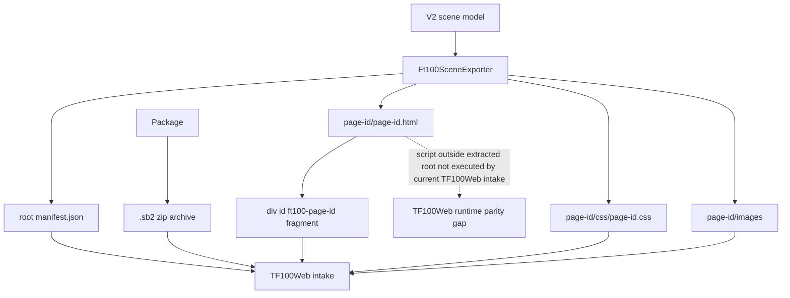

# SCADA Builder V2 - FT100 TF100Web Package Contract

Date: 2026-06-17
Status: Active runtime package contract
Document version: `V2.1.2.0019`

## Historique des changements

| Date | Version | Commit | Changement |
| --- | --- | --- | --- |
| 2026-06-17 | `V2.1.2.0019` | `PENDING` | Ajout de l'export `.sb2` FT100 et du validateur anti-collision/compatibilite TF100Web. |
| 2026-06-17 | `V2.1.2.0018` | `ad364a6` | Documentation du contrat d'intake FT100 reel audite dans TF100Web commit `7d57600`. |
| 2026-06-17 | `V2.1.2.0017` | `PENDING` | Ajout des effets visuels runtime standards. |
| 2026-06-17 | `V2.1.2.0017` | `PENDING` | Ajout du bridge lifecycle runtime global. |
| 2026-06-17 | `V2.1.2.0017` | `PENDING` | Ajout de l'evaluation runtime des groupes de conditions `All/Any`. |
| 2026-06-17 | `V2.1.2.0017` | `PENDING` | Ajout des options runtime avancees pour popup Fragment. |
| 2026-06-17 | `V2.1.2.0016` | `PENDING` | Ajout du runtime de bordure ciblee via classe CSS page-scopee. |
| 2026-06-17 | `V2.1.2.0015` | `PENDING` | Ajout des runtimes popup `ClosePopup` et `TogglePopup`. |
| 2026-06-17 | `V2.1.2.0014` | `PENDING` | Ajout du runtime popup pour actions `MountFragment`. |
| 2026-06-17 | `V2.1.2.0012` | `PENDING` | Ajout du protocole runtime `scadaBuilderSetTagValue` pour appliquer les valeurs lues. |
| 2026-06-17 | `V2.1.2.0010` | `PENDING` | Ajout de l'evaluation runtime des conditions tag pour actions objet Element+. |
| 2026-06-17 | `V2.1.2.0009` | `PENDING` | Remplacement du hook `WriteTag` authorable par les attributs runtime de binding valeur. |
| 2026-06-17 | `V2.1.2.0008` | `PENDING` | Ajout du catalogue tags et du hook runtime `WriteTag` au contrat FT100/TF100Web. |
| 2026-06-16 | `V2.1.2.0007` | `PENDING` | Ajout du contrat `cursor: pointer` pour les boutons et elements avec events runtime. |
| 2026-06-16 | `V2.1.2.0006` | `PENDING` | Ajout du contrat de wrapper runtime transparent pour les groupes Element+ portant des events. |
| 2026-06-16 | `V2.1.1.0039` | `PENDING` | Creation du contrat actif FT100/TF100Web avec namespace, manifest et deprecation `index.html`. |

## 1. Package Shape

Current FT100/TF100Web exports use:

```text
scada-builder-v2-ft100-package/
  manifest.json
  README.txt
  <page-id>/
    <page-id>.html
    css/
      <page-id>.css
    images/
    manifest.json
    README.txt
```

`index.html` is deprecated for current packages.

SCADA Builder V2 may package this folder as a `.sb2` archive for direct FT100 upload. A `.sb2` file is a ZIP archive whose top-level entry is `scada-builder-v2-ft100-package/`; it must not contain an arbitrary parent folder above that package root.

## 2. Runtime Rules

1. Root `manifest.json` is the authoritative package inventory.
2. Each compiled page has a complete page root.
3. Header and footer are composed as complete page roots, not flattened child nodes.
4. Page dimensions come from manifest values and HTML diagnostics.
5. Viewport scale applies once to the composed page container.
6. HTML source-layer elements with saved bounds may carry inline geometry as a deployment guardrail.
7. SVG source shapes keep SVG geometry attributes and must not receive HTML absolute-position inline styles.
8. CSS, DOM ids, and runtime action lookup must be page-namespaced under the exported root id.
9. Element+ groups without runtime events may be flattened in exported HTML.
10. Element+ groups with runtime events must export a transparent page-scoped runtime wrapper carrying `data-scada-events`; the wrapper is runtime hit-test geometry only and must not add editor overlays, selection handles, labels, or visual decoration.
11. Element+ buttons and any exported element carrying `data-scada-events` must expose `cursor: pointer` by default, including descendants and active click state, so TF100Web operators see a button cursor on hover and click.
12. Root and page manifests may include `Tags` from the project tag catalog and per-element `ValueBindings` metadata.
13. Exported page HTML emits `data-scada-read-tag` and `data-scada-write-tag` when an Element+ has value bindings.
14. Exported page runtime emits `scada-builder-read-tag-request` for read-bound elements and handles write-bound input changes by calling `window.tf100webScadaBuilder.writeTag(tagId, value, payload)` when available, then emitting `scada-builder-write-value`.
15. Object visibility actions may include one `Condition` and/or one `ConditionGroup`; exported runtime evaluates them with `window.tf100webScadaBuilder.getTagValue(tagId)` or `window.scadaBuilderTagValues[tagId]` before applying `show`, `hide`, or `toggleVisibility`. Condition groups support `All`, `Any`, and explicit missing-tag policy.
16. TF100Web may push live values into read-bound Element+ objects with `window.scadaBuilderSetTagValue(tagId, value, meta)` or by dispatching `scada-builder-tag-value` with `{ tagId, value }`. The page updates all matching `data-scada-read-tag` elements, stores the value in `window.scadaBuilderTagValues`, and emits `scada-builder-tag-value-applied`.
17. `MountFragment` actions open compiled `Fragment` pages in a page-local popup iframe. `ClosePopup` and `TogglePopup` actions close or toggle the same target fragment popup. Optional `PopupOptions` control placement, size preset, multi-instance behavior, iframe reset policy, and Element+ host-region placement. The runtime emits `scada-builder-popup-opened` and `scada-builder-popup-closed` diagnostics and accepts iframe-to-parent popup requests for fragment-authored close/toggle controls.
18. `SetClass`, `RemoveClass`, and `ToggleClass` actions with the standard `scada-runtime-border-highlight` class add, remove, or toggle a page-scoped runtime border on the target Element+. This visual class is runtime-only and must not represent editor selection overlays or `.sep` geometry.
19. Each exported page exposes `window.scadaBuilderRuntime` with page id, root id, actions, and a dispatch helper. The runtime emits `scada-builder-page-ready`, `scada-builder-action-executed`, and `scada-builder-runtime-error` lifecycle events.
20. Standard visual effect actions use page-scoped CSS classes and keyframes for blink, glow, pulse, alarm highlight, and degraded treatment. Effects are applied through `SetClass`, `RemoveClass`, and `ToggleClass`.
21. `.sb2` archive export must validate the generated staging package before writing the archive. Blocking validation errors include missing root manifest, unsafe relative paths, missing page root `ft100-<page-id>`, duplicate DOM ids in a page, unscoped DOM ids, unscoped CSS selectors, invalid header/footer references, and wrong header/footer page types.
22. Missing page CSS is a compatibility warning because TF100Web accepts the package but reports `missing-css:<page-id>`.
23. DOM ids emitted by SCADA Builder V2 must be page-scoped. The only accepted page root id is `ft100-<page-id>` and Element+ DOM ids must use `ft100-<page-id>__<element-id>`. Raw global ids such as `Button1`, `group_001`, or `text_001` are invalid in `.sb2` export.
24. Legacy source fragment ids must be rewritten during export under `ft100-<page-id>__legacy-*` before validation. Duplicate legacy source ids receive deterministic occurrence suffixes so the final fragment contains no duplicate DOM id.
25. Generated CSS must not emit package-global `:root`, `html`, `body`, raw `[data-id="..."]`, raw `.ft100-*`, or raw `#Button1`-style selectors. Selectors must remain rooted under `#ft100-<page-id>` for TF100Web header/body/footer composition.

## 3. Current TF100Web Intake Contract

Audit source: `F:\Projet\Git\TF100Web`, branch `implementation_scada_builder`, commit `7d57600`.

TF100Web currently consumes SCADA Builder V2 packages through these Django/runtime files:

1. `frontend/scada_package.py`.
2. `frontend/scada_projects.py`.
3. `frontend/views.py`.
4. `templates/frontend/station/visualisation.html`.
5. `static/asset/js/station/visualisation_import.js`.
6. `frontend/tests_scada_package.py`.

The active TF100Web intake contract is:

1. The package directory name remains `scada-builder-v2-ft100-package`.
2. TF100Web accepts uploaded `.sb2` or `.zip` packages through the SCADA Builder admin surface, extracts them into a project repository, and stores active project state outside the package. SCADA Builder V2 `.sb2` export is the preferred current transfer format.
3. The repository root is `SCADA_BUILDER_PROJECTS_ROOT` when configured, `/var/lib/ft100/scada-builder-projects` in production, or `var/scada-builder-projects` in development.
4. TF100Web also supports the repository-local fallback import root `F:\Projet\Git\TF100Web\import\scada-builder-v2-ft100-package` when no active uploaded project is selected.
5. The root `manifest.json` is mandatory. Missing, unreadable, non-object, or empty compiled-page manifests invalidate the package.
6. Compiled pages are read from `Pages` where `IncludeInBuild` is not false and each page has a non-empty `Id`.
7. Page type is read from `PageType` or `Type`, case-insensitive, with `default`, `header`, and `footer` used for composition validation.
8. `HomePageId` selects the initial page when present. If missing or invalid, TF100Web falls back to the first compiled default page, then to the first compiled page.
9. Page HTML is read from `RelativePath` when present, otherwise `<page-id>/<page-id>.html`.
10. Relative paths are normalized as package-local POSIX paths; absolute paths and `..` traversal are rejected.
11. TF100Web extracts only the HTML fragment whose root is `<div id="ft100-<page-id>">`. It does not inject the complete page document.
12. TF100Web loads page CSS from the sibling path `css/<page-id>.css` relative to the page HTML path. Missing CSS is a warning, not a hard validation error.
13. Relative `src` and `href` asset references inside the extracted fragment are rewritten through the Django package asset endpoint.
14. Header and footer composition is performed by loading the referenced header root, selected page root, and footer root as separate fragments.
15. The composed runtime width is the maximum page width in the composition; the composed runtime height is the sum of composed page heights.
16. TF100Web injects `--ft100-scada-width` and `--ft100-scada-height` CSS variables onto each extracted page root and onto the host.
17. TF100Web serves page navigation through a JSON endpoint that returns the extracted fragment, CSS URLs, dimensions, actions, and warnings for a requested page id.
18. The station visualisation page activates this runtime only when the station type is `SCADA_BUILDER_2`.
19. TF100Web's active browser runtime handles `Navigate` actions from `data-scada-events` and legacy same-package page links; other SCADA Builder exported action kinds are not currently interpreted by `visualisation_import.js`.
20. TF100Web extracts and renders the page root fragment only. Scripts emitted after the exported page root in `<page-id>.html`, including SCADA Builder's `window.scadaBuilderRuntime`, popup runtime, condition runtime, tag push runtime, and visual-effect runtime, are not executed by the current TF100Web intake path.
21. TF100Web runtime value display/write is currently driven by TF100Web-injected `data-scada-role`, `data-scada-mapping-id`, `data-scada-writeable`, `data-scada-writable`, `data-scada-format`, and related mapping attributes.
22. TF100Web derives those mapping attributes from legacy `Binding`, `RuntimeBinding`, `Bindings`, `RuntimeBindings`, `TagBinding`, manual page bindings, or `scada-runtime-overrides.json`. It does not currently consume SCADA Builder V2 `ValueBindings.ReadTagId` / `ValueBindings.WriteTagId` as the primary active binding schema.
23. TF100Web exports tags to SCADA Builder V2 through the `tf100web-scada-tags-v1` JSON schema from `frontend/scada_tags.py`.

## 4. Integration Gap

SCADA Builder V2 currently exports more runtime behavior than TF100Web executes through its active fragment intake.

The following SCADA Builder V2 export capabilities are implemented and regression-covered on the exporter side, but are not proven as active TF100Web behavior until TF100Web either executes the exported page script or implements equivalent host-side handlers:

1. `window.scadaBuilderRuntime` lifecycle bridge.
2. `window.scadaBuilderSetTagValue` and `scada-builder-tag-value` read-value push bridge.
3. `window.tf100webScadaBuilder.writeTag` / `getTagValue` integration hooks from the exported page script.
4. Popup fragment open, close, toggle, and host-region runtime behavior.
5. Visibility, border, class/effect actions other than `Navigate`.
6. Compound condition evaluation from exported actions.

Until that integration is implemented, SCADA Builder V2 documentation must distinguish:

1. Exporter contract: what `Ft100SceneExporter` writes.
2. TF100Web intake contract: what `F:\Projet\Git\TF100Web` commit `7d57600` validates, extracts, serves, and executes.
3. Parity gaps: exported runtime behavior not executed by the current TF100Web host.

## 5. Package Flow



## 6. Related Decisions

1. `DEC-0003` - Current FT100/TF100Web Package Contract.
2. `DEC-0007` - Page-Scoped Runtime Namespace.
3. `DEC-0013` - Runtime Group Event Wrapper Export.
4. `DEC-0014` - Runtime Pointer Cursor For Clickable Targets.
5. `DEC-0015` - TF100Web Tag Catalog Import And WriteTag Authoring.
6. `DEC-0016` - Element Value Bindings For Imported Tags.
7. `DEC-0017` - Conditional Object Visibility Actions.
8. `DEC-0018` - Runtime Read Tag Value Application.
9. `DEC-0019` - Fragment Popup Runtime Action.
10. `DEC-0020` - Popup Close And Toggle Runtime Actions.
11. `DEC-0021` - Runtime Object Border Actions.
12. `DEC-0022` - Advanced Fragment Popup Runtime Options.
13. `DEC-0023` - Compound Runtime Conditions And Missing Tag Policy.
14. `DEC-0024` - Global Runtime Lifecycle Bridge.
15. `DEC-0025` - Standard Runtime Visual Effects.
16. `DEC-0026` - Audited TF100Web Fragment Intake Contract.
17. `DEC-0027` - FT100 .sb2 Archive Export And Collision Gate.

## 7. Related Tests

1. `tests/ScadaBuilderV2.Tests/Ft100SceneExporterTests.cs`
2. `F:\Projet\Git\TF100Web\frontend\tests_scada_package.py`
