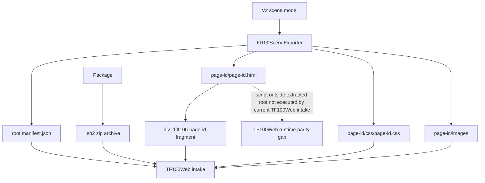

# SCADA Builder V2 - FT100 TF100Web Package Contract

Date: 2026-06-19
Status: Active runtime package contract
Document version: `V2.1.2.0037`

## Historique des changements

| Date | Version | Commit | Changement |
| --- | --- | --- | --- |
| 2026-06-19 | `V2.1.2.0037` | `PENDING` | Ajout des evenements runtime de boutons HMI standards. |
| 2026-06-19 | `V2.1.2.0036` | `8cc4d33` | Ajout du contrat runtime disabled reel pour boutons Element+. |
| 2026-06-19 | `V2.1.2.0035` | `588d712` | Ajout du contrat runtime d'etat on/off pour boutons Toggle Element+. |
| 2026-06-19 | `V2.1.2.0034` | `61eef34` | Ajout du contrat CSS `:active` et etat toggle actif pour les boutons Element+. |
| 2026-06-18 | `V2.1.2.0032` | `d5ee1fd` | Ajout du contrat export des styles Element+ opacite et rotation. |
| 2026-06-18 | `V2.1.2.0030` | `cae57c9` | Ajout du champ manifest `ButtonKind` et de l'attribut HTML `data-scada-button-kind` pour les boutons Element+. |
| 2026-06-17 | `V2.1.2.0026` | `876a6be` | Correction du contrat manifest des affichages numeriques: `Data.DisplayFormat` est exporte, et TF100Web aligne le formatage sur les datatypes `RegisterMapping.DataType`. |
| 2026-06-17 | `V2.1.2.0025` | `58567eb` | Synchronisation avec TF100Web commit `3c795c2`: interpretation runtime des masques `DisplayFormat` `#`. |
| 2026-06-17 | `V2.1.2.0024` | `PENDING` | Clarification que `DisplayFormat` est le signal d'affichage numerique actif exporte vers TF100Web. |
| 2026-06-17 | `V2.1.2.0023` | `PENDING` | Ajout de la matrice de parite des events SCADA Builder V2 / TF100Web et du plan de prochaine tranche runtime. |
| 2026-06-17 | `V2.1.2.0022` | `PENDING` | Harmonisation de l'intake TF100Web `.sb2` pour consommer les events de binding `ValueBindings` exportes par SCADA Builder V2. |
| 2026-06-17 | `V2.1.2.0020` | `c2f0b6f` | Correction de la validation CSS page-scopee indentee et de l'export `.sb2` non bloquant cote WPF. |
| 2026-06-17 | `V2.1.2.0019` | `bd6515e` | Ajout de l'export `.sb2` FT100 et du validateur anti-collision/compatibilite TF100Web. |
| 2026-06-17 | `V2.1.2.0018` | `ad364a6` | Documentation du contrat d'intake FT100 reel audite dans TF100Web commit `7d57600`. |
| 2026-06-17 | `V2.1.2.0017` | `PENDING` | Ajout des effets visuels runtime standards. |
| 2026-06-17 | `V2.1.2.0017` | `PENDING` | Ajout du bridge lifecycle runtime global. |
| 2026-06-17 | `V2.1.2.0017` | `PENDING` | Ajout de l'evaluation runtime des groupes de conditions `All/Any`. |
| 2026-06-17 | `V2.1.2.0017` | `PENDING` | Ajout des options runtime avancees pour popup Fragment. |
| 2026-06-17 | `V2.1.2.0016` | `PENDING` | Ajout du runtime de bordure ciblee via classe CSS page-scopee. |
| 2026-06-17 | `V2.1.2.0015` | `PENDING` | Ajout des runtimes popup `ClosePopup` et `TogglePopup`. |
| 2026-06-17 | `V2.1.2.0014` | `PENDING` | Ajout du runtime popup pour actions `MountFragment`. |
| 2026-06-17 | `V2.1.2.0012` | `PENDING` | Ajout du protocole runtime `scadaBuilderSetTagValue` pour appliquer les valeurs lues. |
| 2026-06-17 | `V2.1.2.0010` | `PENDING` | Ajout de l'evaluation runtime des conditions tag pour actions objet Element+. |
| 2026-06-17 | `V2.1.2.0009` | `PENDING` | Remplacement du hook `WriteTag` authorable par les attributs runtime de binding valeur. |
| 2026-06-17 | `V2.1.2.0008` | `PENDING` | Ajout du catalogue tags et du hook runtime `WriteTag` au contrat FT100/TF100Web. |
| 2026-06-16 | `V2.1.2.0007` | `PENDING` | Ajout du contrat `cursor: pointer` pour les boutons et elements avec events runtime. |
| 2026-06-16 | `V2.1.2.0006` | `PENDING` | Ajout du contrat de wrapper runtime transparent pour les groupes Element+ portant des events. |
| 2026-06-16 | `V2.1.1.0039` | `PENDING` | Creation du contrat actif FT100/TF100Web avec namespace, manifest et deprecation `index.html`. |

## 1. Package Shape

Current FT100/TF100Web exports use:

```text
scada-builder-v2-ft100-package/
  manifest.json
  README.txt
  <page-id>/
    <page-id>.html
    css/
      <page-id>.css
    images/
    manifest.json
    README.txt
```

`index.html` is deprecated for current packages.

SCADA Builder V2 packages this folder as a `.sb2` archive for direct FT100 upload. The `.sb2` file is the operator transfer artifact. It is a ZIP archive whose top-level entry is `scada-builder-v2-ft100-package/`; that directory name is the internal extracted package root and must not be exposed as a separate operator workflow or contain an arbitrary parent folder above it.

## 2. Runtime Rules

1. Root `manifest.json` is the authoritative package inventory.
2. Each compiled page has a complete page root.
3. Header and footer are composed as complete page roots, not flattened child nodes.
4. Page dimensions come from manifest values and HTML diagnostics.
5. Viewport scale applies once to the composed page container.
6. HTML source-layer elements with saved bounds may carry inline geometry as a deployment guardrail.
7. SVG source shapes keep SVG geometry attributes and must not receive HTML absolute-position inline styles.
8. CSS, DOM ids, and runtime action lookup must be page-namespaced under the exported root id.
9. Element+ groups without runtime events may be flattened in exported HTML.
10. Element+ groups with runtime events must export a transparent page-scoped runtime wrapper carrying `data-scada-events`; the wrapper is runtime hit-test geometry only and must not add editor overlays, selection handles, labels, or visual decoration.
11. Element+ buttons and any exported element carrying `data-scada-events` must expose `cursor: pointer` by default, including descendants and active click state, so TF100Web operators see a button cursor on hover and click.
12. Element+ style opacity and rotation are exported as inline CSS `opacity`, `transform-origin: center center`, and `transform: rotate(...deg)`. Editor overlays, handles, and selection rectangles remain excluded from exported geometry.
13. Element+ button presets are exported as `Objects[].ButtonKind` in root/page manifests and as `data-scada-button-kind` on the Element+ wrapper and generated `<button>`. Supported values are `Command`, `Toggle`, `Navigation`, `AlarmAcknowledge`, and `EmergencyStop`.
14. Element+ button pressed metadata is exported under `Objects[].ButtonBehavior.Pressed`. When enabled and not disabled, FT100 export emits page-scoped `:active` CSS and a `[data-scada-toggle-state="on"]` selector for active toggle presentation.
15. Toggle buttons export `data-scada-toggle-state="off"` on the Element+ wrapper. The exported page runtime toggles that wrapper state between `off` and `on` on click and emits `scada-builder-toggle-state-changed`.
16. Disabled buttons export `data-scada-disabled="true"` and `aria-disabled="true"` on the Element+ wrapper, a native disabled generated `<button>`, suppressed hover/pressed CSS, excluded toggle-state event wiring, and a runtime event guard that blocks object-owned actions.
17. Enabled button wrappers emit `scada-builder-button-activated` on click plus a kind-specific event: `scada-builder-command-button-activated`, `scada-builder-navigation-button-activated`, `scada-builder-alarm-acknowledge-requested`, `scada-builder-emergency-stop-requested`, or `scada-builder-toggle-button-activated`.
18. Root and page manifests may include `Tags` from the project tag catalog and per-element `ValueBindings` metadata.
19. Exported page HTML emits `data-scada-read-tag` and `data-scada-write-tag` when an Element+ has value bindings.
20. Exported page runtime emits `scada-builder-read-tag-request` for read-bound elements and handles write-bound input changes by calling `window.tf100webScadaBuilder.writeTag(tagId, value, payload)` when available, then emitting `scada-builder-write-value`.
21. `DisplayFormat` is the active numeric display signal exported to TF100Web. For `InputNumeric` objects, page and root manifests must carry it under `Objects[].Data.DisplayFormat`; the page HTML may still show the mask as initial content, but the manifest field is the canonical runtime contract.
22. Hash masks such as `##.#` and `###.#` define visible digit budget and decimal placement. TF100Web interprets those masks against `RegisterMapping.DataType`: `FLOAT32` and `FLOAT64` round the raw value directly, integer datatypes `SINT8`, `UINT8`, `INT16`, `UINT16`, `INT32`, `UINT32`, `INT64`, and `UINT64` are scaled by the decimal count, and unknown datatypes fall back to direct rounding rather than integer scaling. `fixed:n` remains a compatibility format.
23. TF100Web host intake must treat `ReadTagId` and `WriteTagId` as binding events. Current `.sb2` intake resolves `ValueBindings.ReadTagId` and `ValueBindings.WriteTagId` values shaped as `tf100.mapping.<id>` into TF100Web `RegisterMapping` ids, injects `data-scada-role`, `data-scada-mapping-id`, `data-scada-writeable`, `data-scada-writable`, and `data-scada-format`, and maps page-scoped DOM ids such as `ft100-win00007__elementplus_numeric_display_111` back to manifest object ids such as `elementplus_numeric_display_111`.
24. If a read and write binding target different mappings, TF100Web keeps the read mapping in `data-scada-mapping-id` and carries the write mapping in `data-scada-write-mapping-id`; the host browser runtime writes to `data-scada-write-mapping-id` when present.
25. Object visibility actions may include one `Condition` and/or one `ConditionGroup`; exported runtime evaluates them with `window.tf100webScadaBuilder.getTagValue(tagId)` or `window.scadaBuilderTagValues[tagId]` before applying `show`, `hide`, or `toggleVisibility`. Condition groups support `All`, `Any`, and explicit missing-tag policy.
26. TF100Web may push live values into read-bound Element+ objects with `window.scadaBuilderSetTagValue(tagId, value, meta)` or by dispatching `scada-builder-tag-value` with `{ tagId, value }`. The page updates all matching `data-scada-read-tag` elements, stores the value in `window.scadaBuilderTagValues`, and emits `scada-builder-tag-value-applied`.
27. `MountFragment` actions open compiled `Fragment` pages in a page-local popup iframe. `ClosePopup` and `TogglePopup` actions close or toggle the same target fragment popup. Optional `PopupOptions` control placement, size preset, multi-instance behavior, iframe reset policy, and Element+ host-region placement. The runtime emits `scada-builder-popup-opened` and `scada-builder-popup-closed` diagnostics and accepts iframe-to-parent popup requests for fragment-authored close/toggle controls.
28. `SetClass`, `RemoveClass`, and `ToggleClass` actions with the standard `scada-runtime-border-highlight` class add, remove, or toggle a page-scoped runtime border on the target Element+. This visual class is runtime-only and must not represent editor selection overlays or `.sep` geometry.
29. Each exported page exposes `window.scadaBuilderRuntime` with page id, root id, actions, and a dispatch helper. The runtime emits `scada-builder-page-ready`, `scada-builder-action-executed`, `scada-builder-runtime-error`, button activation diagnostics, and toggle state diagnostics.
30. Standard visual effect actions use page-scoped CSS classes and keyframes for blink, glow, pulse, alarm highlight, and degraded treatment. Effects are applied through `SetClass`, `RemoveClass`, and `ToggleClass`.
31. `.sb2` archive export must validate the generated staging package before writing the archive. Blocking validation errors include missing root manifest, unsafe relative paths, missing page root `ft100-<page-id>`, duplicate DOM ids in a page, unscoped DOM ids, unscoped CSS selectors, invalid header/footer references, and wrong header/footer page types.
32. Missing page CSS is a compatibility warning because TF100Web accepts the package but reports `missing-css:<page-id>`.
33. DOM ids emitted by SCADA Builder V2 must be page-scoped. The only accepted page root id is `ft100-<page-id>` and Element+ DOM ids must use `ft100-<page-id>__<element-id>`. Raw global ids such as `Button1`, `group_001`, or `text_001` are invalid in `.sb2` export.
34. Legacy source fragment ids must be rewritten during export under `ft100-<page-id>__legacy-*` before validation. Duplicate legacy source ids receive deterministic occurrence suffixes so the final fragment contains no duplicate DOM id.
35. Generated CSS must not emit package-global `:root`, `html`, `body`, raw `[data-id="..."]`, raw `.ft100-*`, or raw `#Button1`-style selectors. Selectors must remain rooted under `#ft100-<page-id>` for TF100Web header/body/footer composition. Leading whitespace before a page-scoped id selector is formatting only and must not make a valid scoped selector fail `.sb2` validation.
36. The WPF `.sb2` export command must show bottom status-bar progress while export is running and must run archive generation asynchronously enough to keep the editor shell responsive.

## 3. Current TF100Web Intake Contract

Audit source: `F:\Projet\Git\TF100Web`, branch `implementation_scada_builder`, commit `3c795c2`.

TF100Web currently consumes SCADA Builder V2 packages through these Django/runtime files:

1. `frontend/scada_package.py`.
2. `frontend/scada_projects.py`.
3. `frontend/views.py`.
4. `templates/frontend/station/visualisation.html`.
5. `static/asset/js/station/visualisation_import.js`.
6. `frontend/tests_scada_package.py`.

The active TF100Web intake contract is:

1. The package directory name remains `scada-builder-v2-ft100-package`.
2. TF100Web accepts uploaded `.sb2` or `.zip` packages through the SCADA Builder admin surface, extracts them into a project repository, and stores active project state outside the package. SCADA Builder V2 `.sb2` export is the preferred current transfer format.
3. The repository root is `SCADA_BUILDER_PROJECTS_ROOT` when configured, `/var/lib/ft100/scada-builder-projects` in production, or `var/scada-builder-projects` in development.
4. TF100Web also supports the repository-local fallback import root `F:\Projet\Git\TF100Web\import\scada-builder-v2-ft100-package` when no active uploaded project is selected.
5. The root `manifest.json` is mandatory. Missing, unreadable, non-object, or empty compiled-page manifests invalidate the package.
6. Compiled pages are read from `Pages` where `IncludeInBuild` is not false and each page has a non-empty `Id`.
7. Page type is read from `PageType` or `Type`, case-insensitive, with `default`, `header`, and `footer` used for composition validation.
8. `HomePageId` selects the initial page when present. If missing or invalid, TF100Web falls back to the first compiled default page, then to the first compiled page.
9. Page HTML is read from `RelativePath` when present, otherwise `<page-id>/<page-id>.html`.
10. Relative paths are normalized as package-local POSIX paths; absolute paths and `..` traversal are rejected.
11. TF100Web extracts only the HTML fragment whose root is `<div id="ft100-<page-id>">`. It does not inject the complete page document.
12. TF100Web loads page CSS from the sibling path `css/<page-id>.css` relative to the page HTML path. Missing CSS is a warning, not a hard validation error.
13. Relative `src` and `href` asset references inside the extracted fragment are rewritten through the Django package asset endpoint.
14. Header and footer composition is performed by loading the referenced header root, selected page root, and footer root as separate fragments.
15. The composed runtime width is the maximum page width in the composition; the composed runtime height is the sum of composed page heights.
16. TF100Web injects `--ft100-scada-width` and `--ft100-scada-height` CSS variables onto each extracted page root and onto the host.
17. TF100Web serves page navigation through a JSON endpoint that returns the extracted fragment, CSS URLs, dimensions, actions, and warnings for a requested page id.
18. The station visualisation page activates this runtime only when the station type is `SCADA_BUILDER_2`.
19. TF100Web's active browser runtime handles `Navigate` actions from `data-scada-events`, legacy same-package page links, and binding events resolved from manifest `ValueBindings`.
20. TF100Web extracts and renders the page root fragment only. Scripts emitted after the exported page root in `<page-id>.html`, including SCADA Builder's `window.scadaBuilderRuntime`, popup runtime, condition runtime, tag push runtime, and visual-effect runtime, are not executed by the current TF100Web intake path.
21. TF100Web runtime value display/write is driven by TF100Web-injected `data-scada-role`, `data-scada-mapping-id`, `data-scada-write-mapping-id`, `data-scada-writeable`, `data-scada-writable`, `data-scada-format`, and related mapping attributes. `data-scada-format` supports `fixed:n` and hash masks made of `#` plus an optional decimal point. TF100Web first reads the canonical manifest value `Objects[].Data.DisplayFormat`; for legacy `.sb2` packages generated before that field was exported, it may fall back to an initial hash-mask text content such as `###.#`.
22. TF100Web derives those mapping attributes from SCADA Builder V2 `ValueBindings.ReadTagId` / `ValueBindings.WriteTagId`, legacy `Binding`, `RuntimeBinding`, `Bindings`, `RuntimeBindings`, `TagBinding`, manual page bindings, or `scada-runtime-overrides.json`.
23. TF100Web exports tags to SCADA Builder V2 through the `tf100web-scada-tags-v1` JSON schema from `frontend/scada_tags.py`.

## 4. Event Runtime Parity Matrix

SCADA Builder V2 and TF100Web do not currently have identical event coverage. The distinction is:

1. `SCADA Builder export`: the event can be authored, persisted, validated, and emitted by SCADA Builder V2.
2. `TF100Web active runtime`: the event is executed by the current TF100Web fragment intake and host JavaScript after a `.sb2` upload.
3. `Next tranche`: the event needs TF100Web host-side implementation or a deliberate decision to execute the exporter-emitted page runtime script.

| Event family | SCADA Builder export | TF100Web active runtime | Current evidence | Next tranche requirement |
| --- | --- | --- | --- | --- |
| `Clic -> Changer de page` / `Navigate` | Implemented | Functional through host runtime | `data-scada-events`, root manifest `Actions`, TF100Web `visualisation_import.js` navigation | Keep regression coverage while adding other action families. |
| Group-carried `Clic -> Changer de page` | Implemented | Functional when wrapper carries `data-scada-events` | FT100 transparent runtime wrapper export | Validate on a grouped production candidate when available. |
| `ReadTag` / `Lire valeur` binding event | Implemented through `ValueBindings.ReadTagId` | Functional through TF100Web host mapping refresh after `.sb2` intake | TF100Web resolves `tf100.mapping.<id>` to `RegisterMapping` and injects `data-scada-mapping-id` | Production validation on `win00007 / Element+ Text20 / tf100.mapping.180`. |
| `WriteTag` / `Ecrire valeur` binding event | Implemented through `ValueBindings.WriteTagId` | Functional for writable mappings and writable input Element+ objects | TF100Web uses `data-scada-write-mapping-id` when read/write mappings differ | Add or identify a production candidate with a writeable mapping and verify POST behavior on the unit. |
| Legacy `Binding`, `RuntimeBinding`, `TagBinding`, and overrides | Compatibility only | Functional as TF100Web compatibility paths | TF100Web still reads legacy binding shapes and `scada-runtime-overrides.json` | Do not use as the primary SCADA Builder V2 acceptance path. |
| Lifecycle bridge | Exported by SCADA Builder page script | Not active in current TF100Web fragment intake | Scripts outside the extracted root are not executed | Implement host-side lifecycle emission or execute the exporter runtime script safely. |
| Popup open/close/toggle and popup options | Exported by SCADA Builder page script | Not active in current TF100Web fragment intake | `MountFragment`, `ClosePopup`, `TogglePopup`, `PopupOptions` are exporter-side behavior | Add TF100Web host handlers for popup actions and fragment mounting. |
| Visibility actions | Exported by SCADA Builder page script | Not active in current TF100Web fragment intake | `Show`, `Hide`, `ToggleVisibility` actions are present in manifests | Add TF100Web host dispatcher for non-navigation action kinds. |
| Border and visual effect actions | Exported by SCADA Builder page script and CSS | Not active in current TF100Web fragment intake | `SetClass`, `RemoveClass`, `ToggleClass` with standard classes are exporter-side behavior | Add class action handlers in TF100Web and verify scoped CSS is loaded. |
| Action conditions and condition groups | Exported by SCADA Builder page script | Not active in current TF100Web fragment intake for host-handled actions | Conditions rely on tag cache and exporter runtime evaluation | Add host-side condition evaluation before dispatching actions. |
| Custom/page scripts | Roadmap or exporter-controlled depending on source | Not active in current TF100Web fragment intake | No safe host execution contract is active | Decide between controlled script execution and explicit host-side handlers. |

## 5. Next TF100Web Event Tranche Plan

The next implementation tranche should be prepared in this order:

1. Lock production evidence for the binding-event fix:
   - Upload a fresh `.sb2` through TF100Web.
   - Open `win00007`.
   - Confirm `ft100-win00007__elementplus_numeric_display_111` has `data-scada-mapping-id="180"`.
   - Confirm `data-scada-format` is injected, for example `##.#`.
   - Confirm the displayed value refreshes from `tf100.mapping.180` and follows the format contract, for example raw `999` displays as `99.9` with `##.#`.
2. Choose the runtime strategy for remaining events:
   - Preferred near-term path: implement TF100Web host-side handlers for SCADA Builder action kinds.
   - Alternative path: safely execute the exporter-emitted runtime script after fragment extraction.
   - Do not mix both paths for the same event family without an explicit decision entry.
3. Implement a host-side action dispatcher in TF100Web for non-navigation actions:
   - Read actions from the page JSON response and/or `data-scada-events`.
   - Resolve page-scoped target DOM ids.
   - Apply conditions before action execution.
   - Emit diagnostics for action executed and runtime errors.
4. Add action families in small validated slices:
   - Visibility first (`Show`, `Hide`, `ToggleVisibility`).
   - Class-based border/effects next (`SetClass`, `RemoveClass`, `ToggleClass`).
   - Popup fragment actions after fragment mounting behavior is agreed.
   - Lifecycle diagnostics after the dispatcher is stable.
5. Add TF100Web tests before production rollout:
   - Intake tests for manifest action payloads.
   - Browser-runtime unit tests for dispatcher decisions when feasible.
   - A manual production checklist when local TF100Web runtime testing is unavailable.

## 6. Integration Gap

SCADA Builder V2 currently exports more runtime behavior than TF100Web executes through its active fragment intake.

The following SCADA Builder V2 export capabilities are implemented and regression-covered on the exporter side, but are not proven as active TF100Web behavior until TF100Web either executes the exported page script or implements equivalent host-side handlers:

1. `window.scadaBuilderRuntime` lifecycle bridge.
2. Exporter page-script `window.scadaBuilderSetTagValue` and `scada-builder-tag-value` bridge when relying on scripts outside the extracted root. TF100Web host-side mapping refresh/write now covers `.sb2` binding events resolved from `ValueBindings`.
3. `window.tf100webScadaBuilder.writeTag` / `getTagValue` integration hooks from the exported page script.
4. Popup fragment open, close, toggle, and host-region runtime behavior.
5. Visibility, border, class/effect actions other than `Navigate`.
6. Compound condition evaluation from exported actions.

Until that integration is implemented, SCADA Builder V2 documentation must distinguish:

1. Exporter contract: what `Ft100SceneExporter` writes.
2. TF100Web intake contract: what `F:\Projet\Git\TF100Web` commit `3c795c2` validates, extracts, serves, and executes.
3. Parity gaps: exported runtime behavior not executed by the current TF100Web host.

## 7. Package Flow



## 8. Related Decisions

1. `DEC-0003` - Current FT100/TF100Web Package Contract.
2. `DEC-0007` - Page-Scoped Runtime Namespace.
3. `DEC-0013` - Runtime Group Event Wrapper Export.
4. `DEC-0014` - Runtime Pointer Cursor For Clickable Targets.
5. `DEC-0015` - TF100Web Tag Catalog Import And WriteTag Authoring.
6. `DEC-0016` - Element Value Bindings For Imported Tags.
7. `DEC-0017` - Conditional Object Visibility Actions.
8. `DEC-0018` - Runtime Read Tag Value Application.
9. `DEC-0019` - Fragment Popup Runtime Action.
10. `DEC-0020` - Popup Close And Toggle Runtime Actions.
11. `DEC-0021` - Runtime Object Border Actions.
12. `DEC-0022` - Advanced Fragment Popup Runtime Options.
13. `DEC-0023` - Compound Runtime Conditions And Missing Tag Policy.
14. `DEC-0024` - Global Runtime Lifecycle Bridge.
15. `DEC-0025` - Standard Runtime Visual Effects.
16. `DEC-0026` - Audited TF100Web Fragment Intake Contract.
17. `DEC-0027` - FT100 .sb2 Archive Export And Collision Gate.
18. `DEC-0028` - Nonblocking FT100 .sb2 Export Feedback.
19. `DEC-0029` - TF100Web Host Intake For SCADA Builder Binding Events.
20. `DEC-0030` - Element+ Data Tab Active Numeric Display Contract.

## 9. Related Tests

1. `tests/ScadaBuilderV2.Tests/Ft100SceneExporterTests.cs`
2. `F:\Projet\Git\TF100Web\frontend\tests_scada_package.py`
