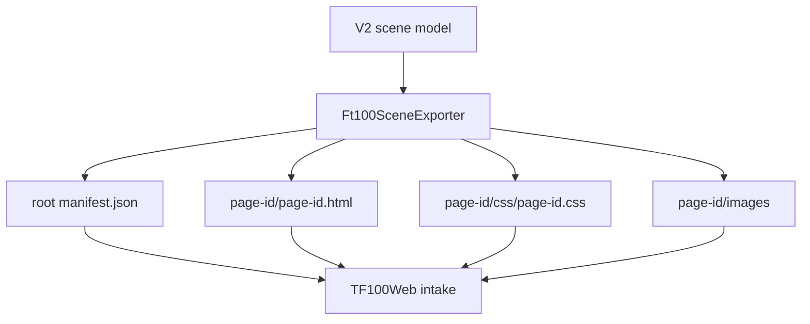

# SCADA Builder V2 - FT100 TF100Web Package Contract

Date: 2026-06-16
Status: Active runtime package contract
Document version: `V2.1.1.0039`

## Historique des changements

| Date | Version | Commit | Changement |
| --- | --- | --- | --- |
| 2026-06-16 | `V2.1.1.0039` | `PENDING` | Creation du contrat actif FT100/TF100Web avec namespace, manifest et deprecation `index.html`. |

## 1. Package Shape

Current FT100/TF100Web exports use:

```text
scada-builder-v2-ft100-package/
  manifest.json
  README.txt
  <page-id>/
    <page-id>.html
    css/
      <page-id>.css
    images/
    manifest.json
    README.txt
```

`index.html` is deprecated for current packages.

## 2. Runtime Rules

1. Root `manifest.json` is the authoritative package inventory.
2. Each compiled page has a complete page root.
3. Header and footer are composed as complete page roots, not flattened child nodes.
4. Page dimensions come from manifest values and HTML diagnostics.
5. Viewport scale applies once to the composed page container.
6. HTML source-layer elements with saved bounds may carry inline geometry as a deployment guardrail.
7. SVG source shapes keep SVG geometry attributes and must not receive HTML absolute-position inline styles.
8. CSS, DOM ids, and runtime action lookup must be page-namespaced under the exported root id.

## 3. Package Flow



## 4. Related Decisions

1. `DEC-0003` - Current FT100/TF100Web Package Contract.
2. `DEC-0007` - Page-Scoped Runtime Namespace.

## 5. Related Tests

1. `tests/ScadaBuilderV2.Tests/Ft100SceneExporterTests.cs`
