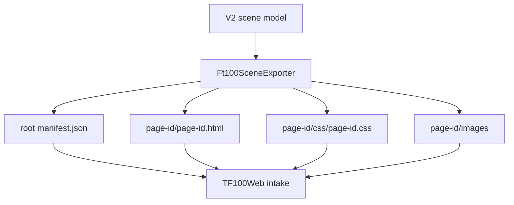

# SCADA Builder V2 - FT100 TF100Web Package Contract

Date: 2026-06-17
Status: Active runtime package contract
Document version: `V2.1.2.0016`

## Historique des changements

| Date | Version | Commit | Changement |
| --- | --- | --- | --- |
| 2026-06-17 | `V2.1.2.0016` | `PENDING` | Ajout du runtime de bordure ciblee via classe CSS page-scopee. |
| 2026-06-17 | `V2.1.2.0015` | `PENDING` | Ajout des runtimes popup `ClosePopup` et `TogglePopup`. |
| 2026-06-17 | `V2.1.2.0014` | `PENDING` | Ajout du runtime popup pour actions `MountFragment`. |
| 2026-06-17 | `V2.1.2.0012` | `PENDING` | Ajout du protocole runtime `scadaBuilderSetTagValue` pour appliquer les valeurs lues. |
| 2026-06-17 | `V2.1.2.0010` | `PENDING` | Ajout de l'evaluation runtime des conditions tag pour actions objet Element+. |
| 2026-06-17 | `V2.1.2.0009` | `PENDING` | Remplacement du hook `WriteTag` authorable par les attributs runtime de binding valeur. |
| 2026-06-17 | `V2.1.2.0008` | `PENDING` | Ajout du catalogue tags et du hook runtime `WriteTag` au contrat FT100/TF100Web. |
| 2026-06-16 | `V2.1.2.0007` | `PENDING` | Ajout du contrat `cursor: pointer` pour les boutons et elements avec events runtime. |
| 2026-06-16 | `V2.1.2.0006` | `PENDING` | Ajout du contrat de wrapper runtime transparent pour les groupes Element+ portant des events. |
| 2026-06-16 | `V2.1.1.0039` | `PENDING` | Creation du contrat actif FT100/TF100Web avec namespace, manifest et deprecation `index.html`. |

## 1. Package Shape

Current FT100/TF100Web exports use:

```text
scada-builder-v2-ft100-package/
  manifest.json
  README.txt
  <page-id>/
    <page-id>.html
    css/
      <page-id>.css
    images/
    manifest.json
    README.txt
```

`index.html` is deprecated for current packages.

## 2. Runtime Rules

1. Root `manifest.json` is the authoritative package inventory.
2. Each compiled page has a complete page root.
3. Header and footer are composed as complete page roots, not flattened child nodes.
4. Page dimensions come from manifest values and HTML diagnostics.
5. Viewport scale applies once to the composed page container.
6. HTML source-layer elements with saved bounds may carry inline geometry as a deployment guardrail.
7. SVG source shapes keep SVG geometry attributes and must not receive HTML absolute-position inline styles.
8. CSS, DOM ids, and runtime action lookup must be page-namespaced under the exported root id.
9. Element+ groups without runtime events may be flattened in exported HTML.
10. Element+ groups with runtime events must export a transparent page-scoped runtime wrapper carrying `data-scada-events`; the wrapper is runtime hit-test geometry only and must not add editor overlays, selection handles, labels, or visual decoration.
11. Element+ buttons and any exported element carrying `data-scada-events` must expose `cursor: pointer` by default, including descendants and active click state, so TF100Web operators see a button cursor on hover and click.
12. Root and page manifests may include `Tags` from the project tag catalog and per-element `ValueBindings` metadata.
13. Exported page HTML emits `data-scada-read-tag` and `data-scada-write-tag` when an Element+ has value bindings.
14. Exported page runtime emits `scada-builder-read-tag-request` for read-bound elements and handles write-bound input changes by calling `window.tf100webScadaBuilder.writeTag(tagId, value, payload)` when available, then emitting `scada-builder-write-value`.
15. Object visibility actions may include one `Condition`; exported runtime evaluates it with `window.tf100webScadaBuilder.getTagValue(tagId)` or `window.scadaBuilderTagValues[tagId]` before applying `show`, `hide`, or `toggleVisibility`.
16. TF100Web may push live values into read-bound Element+ objects with `window.scadaBuilderSetTagValue(tagId, value, meta)` or by dispatching `scada-builder-tag-value` with `{ tagId, value }`. The page updates all matching `data-scada-read-tag` elements, stores the value in `window.scadaBuilderTagValues`, and emits `scada-builder-tag-value-applied`.
17. `MountFragment` actions open compiled `Fragment` pages in a page-local popup iframe. `ClosePopup` and `TogglePopup` actions close or toggle the same target fragment popup. The runtime emits `scada-builder-popup-opened` and `scada-builder-popup-closed` diagnostics and accepts iframe-to-parent popup requests for fragment-authored close/toggle controls.
18. `SetClass`, `RemoveClass`, and `ToggleClass` actions with the standard `scada-runtime-border-highlight` class add, remove, or toggle a page-scoped runtime border on the target Element+. This visual class is runtime-only and must not represent editor selection overlays or `.sep` geometry.

## 3. Package Flow



## 4. Related Decisions

1. `DEC-0003` - Current FT100/TF100Web Package Contract.
2. `DEC-0007` - Page-Scoped Runtime Namespace.
3. `DEC-0013` - Runtime Group Event Wrapper Export.
4. `DEC-0014` - Runtime Pointer Cursor For Clickable Targets.
5. `DEC-0015` - TF100Web Tag Catalog Import And WriteTag Authoring.
6. `DEC-0016` - Element Value Bindings For Imported Tags.
7. `DEC-0017` - Conditional Object Visibility Actions.
8. `DEC-0018` - Runtime Read Tag Value Application.
9. `DEC-0019` - Fragment Popup Runtime Action.
10. `DEC-0020` - Popup Close And Toggle Runtime Actions.
11. `DEC-0021` - Runtime Object Border Actions.

## 5. Related Tests

1. `tests/ScadaBuilderV2.Tests/Ft100SceneExporterTests.cs`
