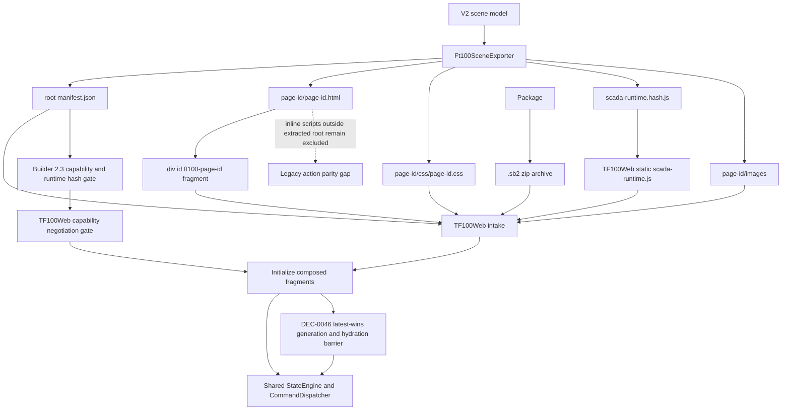

# SCADA Builder V2 - FT100 TF100Web Package Contract

Date: 2026-07-30
Status: Active runtime package contract
Document version: `V2.1.5.0047`

## Historique des changements

| Date | Version | Commit | Changement |
| --- | --- | --- | --- |
| 2026-08-25 | `V2.1.5.0047` | `dce0941` | Conformance cross-runtime des Fenetres rapides, mesure de SLA, epreuves canary et rollback (section 12.8). |
| 2026-08-25 | `V2.1.5.0046` | `705077c` | Host TF100Web des Fenetres rapides : intentions, service du fragment par namespace et cycle de vie SinglePerDefinition (section 12.7). |
| 2026-08-25 | `V2.1.5.0045` | `40e300a` | Ingestion TF100Web des registres Fenetre rapide : validation fail-closed avant activation et deploiement (section 12.6). |
| 2026-08-25 | `V2.1.5.0041` | `5ae5ff4` | Round-trip package Fenetre rapide execute dans TF100Web : intake de production accepte le paquet et le runtime embarque execute les scenarios. |
| 2026-08-24 | `V2.1.5.0040` | `d98d753` | `quick-window-runtime.js` entre dans le bundle runtime exporte, inerte tant que les capacites restent `Blocked`; le hash du runtime et les octets du package changent en consequence. |
| 2026-08-24 | `V2.1.5.0037` | `c4f7391` | Task 4.0 : layout package et layout déployé des Fenêtres rapides figés avant toute compilation, vérifiés contre `scada_package.py`, `scada_builder_composition.py` et `deploy_scada_builder.py`. |
| 2026-08-23 | `V2.1.5.0030` | `6c55fdb` | Module runtime `quick-window-host.js` ajoute pour l'apercu editeur uniquement : il n'entre pas dans le bundle runtime exporte tant que les capacites `quick-window.*` restent `Blocked`. |
| 2026-07-30 | `V2.1.5.0002` | `0168f2f` | Les formes SVG générées exposent des cibles sémantiques de fond/bordure; le runtime applique les effets sur `fill`/`stroke` visibles et conserve le repli wrapper. |
| 2026-07-18 | `V2.1.4.0067` | `23daac2` | Builder normalise les lectures `InputNumeric` vers le tag canonique de `StateConfig.ReadVariable`, bloque toute divergence residuelle et couvre toutes les pages compilees. |
| 2026-07-17 | `V2.1.4.0065` | `4bee5ab` | Runtime Etat corrige pour rendre les filtres visibles sur SVG opaques sans modifier l'ordre auteur des objets ni couvrir les controles semantiques. |
| 2026-07-17 | `V2.1.4.0064` | `f73b3e3` | Acceptance industrielle regeneree avec les 14 boutons de depart manuel et 14 voyants sans mapping de `win00012`; runtime et 46 capabilities inchanges. |
| 2026-07-17 | `V2.1.4.0063` | Builder `6603992`, TF100Web `f9afcba` | Gate 2.3 renforce : un resultat et un evaluateur exact par capability Supported, mutation independante et fixture SHA `bf41c4c3...02cc4`. |
| 2026-07-16 | `V2.1.4.0062` | `370641d` | Contrat 2.3 final synchronise : 118 Supported executes, 44 Blocked rejetes et promotion distante separee. |
| 2026-07-16 | `V2.1.4.0061` | Builder `c56c5af`/`3fc1fc8`, TF100Web `33c5846` | Artefact industriel 2.3 lie a 46 capabilities et accepte par le gate TF100Web. |
| 2026-07-16 | `V2.1.4.0060` | Builder `22c787f`, TF100Web `6fac468` | Parite preview/export/manifest et identite runtime package/deploiement prouvees. |
| 2026-07-16 | `V2.1.4.0059` | TF100Web `2fb46e6` | Fixture exacte executee : negotiation, composition, runtime, host, snapshot, securite et blocages. |
| 2026-07-16 | `V2.1.4.0058` | TF100Web `9e85844` | Composition/caches bornes par generation et revisions; publication statique atomique avec rollback. |
| 2026-07-16 | `V2.1.4.0057` | TF100Web `c304af3` | Binding numerique commun et exhaustif : politiques read/write, edition/readback, formats et qualite mapping absente. |
| 2026-07-16 | `V2.1.4.0056` | TF100Web `1fc3ac4` | Cycle latest-wins implemente avec AbortController, ownership generationnel, disposal et hydration forcee coalescee. |
| 2026-07-16 | `V2.1.4.0055` | TF100Web `cab2733` | HostAdapter 1.0 unique installe; intents canoniques/compatibles convergent vers les memes services host et l'ecriture protegee existante. |
| 2026-07-16 | `V2.1.4.0054` | TF100Web `7d60c63` | Intake 2.3 negocie version/capabilities/SHA avant remplacement; fixture `fb06431e...08404` vendoree. |
| 2026-07-16 | `V2.1.4.0053` | `bcec075` | ActionDispatcher partage ajoute; bindings/registre DOM canoniques; fixture regeneree au SHA-256 `fb06431e...08404`. |
| 2026-07-16 | `V2.1.4.0052` | `a76e220` | Command runtime canonique et intents 1.0 ajoutes; fixture regeneree au SHA-256 `4381347c...40a6`. |
| 2026-07-16 | `V2.1.4.0051` | `9878fb1` | Runtime Etat/Expression/Effet complete; fixture regeneree au SHA-256 `6976e192...15ef`. |
| 2026-07-16 | `V2.1.4.0050` | `c626442` | Fixture 2.3 deterministe et sanitisee ajoutee avec index exhaustif, archive stable et SHA-256 `9e64bb33...e274`. |
| 2026-07-16 | `V2.1.4.0049` | `f9659ae` | Builder emet 2.3 strict par defaut avec capabilities triees et SHA-256 runtime; validateur fail-closed et profils 2.1/2.2 explicites. |
| 2026-07-16 | `V2.1.4.0046` | `b2e4f5f` | `DEC-0047` approuvee : cible manifest 2.3 avec capabilities requises, hash runtime et rejet strict des gaps. |
| 2026-07-16 | `V2.1.4.0045` | `2f4010c` | `DEC-0046` approuvee : contrat cible latest-wins et hydratation obligatoire; la course de `9d5d400` demeure un gap jusqu'a implementation. |
| 2026-07-16 | `V2.1.4.0044` | `de37a35`, TF100Web `9d5d400` | `DEC-0045` : effets Etat reversibles, overlay sous le contenu, snapshot initial force et ValueBinding numerique commun pour Element+ et cellules Tableau. |
| 2026-07-16 | `V2.1.4.0043` | `8489dbd` | Runtime Etat/Commande partage confirme : runtime package deploye, fragments initialises, mappings de commande collectes et texte de bouton cible via `[data-scada-text]`. |
| 2026-07-15 | `V2.1.4.0039` | `ce99ff9` | Manifest 2.2 et `Objects[].TableCellBindings` implementes; TF100Web accepte 2.1/2.2, cible le `<td>` page-scope et reutilise l'input numerique enfant. |
| 2026-07-14 | `V2.1.4.0016` | `10cfa72` | Le Tableau Element+ est exporte dans le HTML/CSS de page du contrat `.sb2` existant; les inputs cellule restent locaux et les artefacts editeur sont exclus. |
| 2026-07-13 | `V2.1.4.0003` | `b954d46` | Confirmation du contrat réel TF100Web pour les styles Element+ : HTML/CSS opaque, manifest PascalCase, runtime HTML camelCase et preuve de conservation après déploiement. |
| 2026-06-19 | `V2.1.2.0038` | `6f76dc8` | Clarification de la parite metadata wrapper preview/export pour boutons Element+. |
| 2026-06-19 | `V2.1.2.0037` | `2a540d6` | Ajout des evenements runtime de boutons HMI standards. |
| 2026-06-19 | `V2.1.2.0036` | `8cc4d33` | Ajout du contrat runtime disabled reel pour boutons Element+. |
| 2026-06-19 | `V2.1.2.0035` | `588d712` | Ajout du contrat runtime d'etat on/off pour boutons Toggle Element+. |
| 2026-06-19 | `V2.1.2.0034` | `61eef34` | Ajout du contrat CSS `:active` et etat toggle actif pour les boutons Element+. |
| 2026-06-18 | `V2.1.2.0032` | `d5ee1fd` | Ajout du contrat export des styles Element+ opacite et rotation. |
| 2026-06-18 | `V2.1.2.0030` | `cae57c9` | Ajout du champ manifest `ButtonKind` et de l'attribut HTML `data-scada-button-kind` pour les boutons Element+. |
| 2026-06-17 | `V2.1.2.0026` | `876a6be` | Correction du contrat manifest des affichages numeriques: `Data.DisplayFormat` est exporte, et TF100Web aligne le formatage sur les datatypes `RegisterMapping.DataType`. |
| 2026-06-17 | `V2.1.2.0025` | `58567eb` | Synchronisation avec TF100Web commit `3c795c2`: interpretation runtime des masques `DisplayFormat` `#`. |
| 2026-06-17 | `V2.1.2.0024` | `49cedc7` | Clarification que `DisplayFormat` est le signal d'affichage numerique actif exporte vers TF100Web. |
| 2026-06-17 | `V2.1.2.0023` | `3b67c3a` | Ajout de la matrice de parite des events SCADA Builder V2 / TF100Web et du plan de prochaine tranche runtime. |
| 2026-06-17 | `V2.1.2.0022` | `3b67c3a` | Harmonisation de l'intake TF100Web `.sb2` pour consommer les events de binding `ValueBindings` exportes par SCADA Builder V2. |
| 2026-06-17 | `V2.1.2.0020` | `c2f0b6f` | Correction de la validation CSS page-scopee indentee et de l'export `.sb2` non bloquant cote WPF. |
| 2026-06-17 | `V2.1.2.0019` | `bd6515e` | Ajout de l'export `.sb2` FT100 et du validateur anti-collision/compatibilite TF100Web. |
| 2026-06-17 | `V2.1.2.0018` | `ad364a6` | Documentation du contrat d'intake FT100 reel audite dans TF100Web commit `7d57600`. |
| 2026-06-17 | `V2.1.2.0017` | `789a433` | Ajout des effets visuels runtime standards. |
| 2026-06-17 | `V2.1.2.0017` | `b465ba9` | Ajout du bridge lifecycle runtime global. |
| 2026-06-17 | `V2.1.2.0017` | `1b5df61` | Ajout de l'evaluation runtime des groupes de conditions `All/Any`. |
| 2026-06-17 | `V2.1.2.0017` | `95af4bb` | Ajout des options runtime avancees pour popup Fragment. |
| 2026-06-17 | `V2.1.2.0016` | `32d9227` | Ajout du runtime de bordure ciblee via classe CSS page-scopee. |
| 2026-06-17 | `V2.1.2.0015` | `6ac2245` | Ajout des runtimes popup `ClosePopup` et `TogglePopup`. |
| 2026-06-17 | `V2.1.2.0014` | `06652c6` | Ajout du runtime popup pour actions `MountFragment`. |
| 2026-06-17 | `V2.1.2.0012` | `a73be05` | Ajout du protocole runtime `scadaBuilderSetTagValue` pour appliquer les valeurs lues. |
| 2026-06-17 | `V2.1.2.0010` | `5302022` | Ajout de l'evaluation runtime des conditions tag pour actions objet Element+. |
| 2026-06-17 | `V2.1.2.0009` | `7e3610c` | Remplacement du hook `WriteTag` authorable par les attributs runtime de binding valeur. |
| 2026-06-17 | `V2.1.2.0008` | `f78e8cd` | Ajout du catalogue tags et du hook runtime `WriteTag` au contrat FT100/TF100Web. |
| 2026-06-16 | `V2.1.2.0007` | `5c7d617` | Ajout du contrat `cursor: pointer` pour les boutons et elements avec events runtime. |
| 2026-06-16 | `V2.1.2.0006` | `5c7d617` | Ajout du contrat de wrapper runtime transparent pour les groupes Element+ portant des events. |
| 2026-06-16 | `V2.1.1.0039` | `2c5a0b4` | Creation du contrat actif FT100/TF100Web avec namespace, manifest et deprecation `index.html`. |

## 1. Package Shape

Current FT100/TF100Web exports use:

```text
scada-builder-v2-ft100-package/
  manifest.json
  README.txt
  <page-id>/
    <page-id>.html
    css/
      <page-id>.css
    images/
    manifest.json
    README.txt
```

`index.html` is deprecated for current packages.

SCADA Builder V2 packages this folder as a `.sb2` archive for direct FT100 upload. The `.sb2` file is the operator transfer artifact. It is a ZIP archive whose top-level entry is `scada-builder-v2-ft100-package/`; that directory name is the internal extracted package root and must not be exposed as a separate operator workflow or contain an arbitrary parent folder above it.

## 2. Runtime Rules

1. Root `manifest.json` is the authoritative package inventory.
2. Each compiled page has a complete page root.
3. Header and footer are composed as complete page roots, not flattened child nodes.
4. Page dimensions come from manifest values and HTML diagnostics.
5. Viewport scale applies once to the composed page container.
6. HTML source-layer elements with saved bounds may carry inline geometry as a deployment guardrail.
7. SVG source shapes keep SVG geometry attributes and must not receive HTML absolute-position inline styles.
8. CSS, DOM ids, and runtime action lookup must be page-namespaced under the exported root id.
9. Element+ groups without runtime events may be flattened in exported HTML.
10. Element+ groups with object actions export a transparent page-scoped runtime wrapper carrying `data-scada-action-bindings`; the page root carries the matching `data-scada-action-registry`. The obsolete host-interpreted `data-scada-events` attribute remains decommissioned. A wrapper is runtime hit-test geometry only and must not add editor overlays, selection handles, labels, or visual decoration.
11. Element+ buttons and any exported element carrying `data-scada-action-bindings` must expose `cursor: pointer` by default, including descendants and active click state, so TF100Web operators see a button cursor on hover and click.
12. Element+ style opacity and rotation are exported as inline CSS `opacity`, `transform-origin: center center`, and `transform: rotate(...deg)`. Editor overlays, handles, and selection rectangles remain excluded from exported geometry.
13. Element+ button presets are exported as `Objects[].ButtonKind` in root/page manifests and as `data-scada-button-kind` on the Element+ wrapper and generated `<button>`. Supported values are `Command`, `Toggle`, `Navigation`, `AlarmAcknowledge`, and `EmergencyStop`.
14. Element+ button pressed metadata is exported under `Objects[].ButtonBehavior.Pressed`. When enabled and not disabled, FT100 export emits page-scoped `:active` CSS and a `[data-scada-toggle-state="on"]` selector for active toggle presentation.
15. Toggle buttons export `data-scada-toggle-state="off"` on the Element+ wrapper. The exported page runtime toggles that wrapper state between `off` and `on` on click and emits `scada-builder-toggle-state-changed`.
16. Disabled buttons export `data-scada-disabled="true"` and `aria-disabled="true"` on the Element+ wrapper, a native disabled generated `<button>`, suppressed hover/pressed CSS, excluded toggle-state event wiring, and a runtime event guard that blocks object-owned actions.
17. Preview and FT100 export share the wrapper-level button metadata contract: `data-scada-button-kind`, behavior metadata, disabled metadata, and Toggle initial state must stay coherent even though preview keeps generated buttons non-interactive for editing.
18. Enabled button wrappers emit `scada-builder-button-activated` on click plus a kind-specific event: `scada-builder-command-button-activated`, `scada-builder-navigation-button-activated`, `scada-builder-alarm-acknowledge-requested`, `scada-builder-emergency-stop-requested`, or `scada-builder-toggle-button-activated`.
19. Root and page manifests may include `Tags` from the project tag catalog and per-element `ValueBindings` metadata.
20. Exported page HTML emits `data-scada-read-tag` and `data-scada-write-tag` when an Element+ has value bindings.
21. Exported page runtime emits `scada-builder-read-tag-request` for read-bound elements and handles write-bound input changes by calling `window.tf100webScadaBuilder.writeTag(tagId, value, payload)` when available, then emitting `scada-builder-write-value`.
22. `DisplayFormat` is the active numeric display signal exported to TF100Web. For `InputNumeric` objects, page and root manifests must carry it under `Objects[].Data.DisplayFormat`; the page HTML may still show the mask as initial content, but the manifest field is the canonical runtime contract.
23. Hash masks such as `##.#` and `###.#` define visible digit budget and decimal placement. TF100Web interprets those masks against `RegisterMapping.DataType`: `FLOAT32` and `FLOAT64` round the raw value directly, integer datatypes `SINT8`, `UINT8`, `INT16`, `UINT16`, `INT32`, `UINT32`, `INT64`, and `UINT64` are scaled by the decimal count, and unknown datatypes fall back to direct rounding rather than integer scaling. `fixed:n` remains a compatibility format.
24. TF100Web host intake must treat `ReadTagId` and `WriteTagId` as binding events. Current `.sb2` intake resolves `ValueBindings.ReadTagId` and `ValueBindings.WriteTagId` values shaped as `tf100.mapping.<id>` into TF100Web `RegisterMapping` ids, injects `data-scada-role`, `data-scada-mapping-id`, `data-scada-writeable`, `data-scada-writable`, and `data-scada-format`, and maps page-scoped DOM ids such as `ft100-win00007__elementplus_numeric_display_111` back to manifest object ids such as `elementplus_numeric_display_111`.
25. If a read and write binding target different mappings, TF100Web keeps the read mapping in `data-scada-mapping-id` and carries the write mapping in `data-scada-write-mapping-id`; the host browser runtime writes to `data-scada-write-mapping-id` when present.
26. Object actions may include one `Condition` and/or one `ConditionGroup`; shared `ActionDispatcher` resolves values through `TagBridge` and delegates comparisons to `ExpressionEvaluator` before execution. Condition groups support `All`, `Any`, and explicit `BlockAction`/`AllowAction` missing-tag policy. Unknown operators, missing single-condition values and empty groups fail closed.
27. TF100Web may push live values into read-bound Element+ objects with `window.scadaBuilderSetTagValue(tagId, value, meta)` or by dispatching `scada-builder-tag-value` with `{ tagId, value }`. The page updates all matching `data-scada-read-tag` elements, stores the value in `window.scadaBuilderTagValues`, and emits `scada-builder-tag-value-applied`.
28. `MountFragment`, `ClosePopup`, and `TogglePopup` normalize to `openPopup`, `closePopup`, and `togglePopup` host intents. Optional `PopupOptions` are transported unchanged; popup mounting, placement, focus, multi-instance policy and fragment lifecycle remain host services and are never reimplemented by the portable dispatcher.
29. `SetClass`, `RemoveClass`, and `ToggleClass` actions with the standard `scada-runtime-border-highlight` class add, remove, or toggle a page-scoped runtime border on the target Element+. This visual class is runtime-only and must not represent editor selection overlays or `.sep` geometry.
30. `ScadaRuntime.initPage(root, pageId)` initializes the page-scoped action registry and bindings in addition to state, command and input modules. `disposePage(root)` removes action listeners before DOM replacement. Successful binding attempts emit `scada-builder-action-executed`; unsupported/missing definitions fail closed with diagnostics.
31. Standard visual effect actions use page-scoped CSS classes and keyframes for blink, glow, pulse, alarm highlight, and degraded treatment. Effects are applied through `SetClass`, `RemoveClass`, and `ToggleClass`.
32. `.sb2` archive export must validate the generated staging package before writing the archive. Blocking validation errors include missing root manifest, unsafe relative paths, missing page root `ft100-<page-id>`, duplicate DOM ids in a page, unscoped DOM ids, unscoped CSS selectors, invalid header/footer references, and wrong header/footer page types.
33. Missing page CSS is a compatibility warning because TF100Web accepts the package but reports `missing-css:<page-id>`.
34. DOM ids emitted by SCADA Builder V2 must be page-scoped. The only accepted page root id is `ft100-<page-id>` and Element+ DOM ids must use `ft100-<page-id>__<element-id>`. Raw global ids such as `Button1`, `group_001`, or `text_001` are invalid in `.sb2` export.
35. Legacy source fragment ids must be rewritten during export under `ft100-<page-id>__legacy-*` before validation. Duplicate legacy source ids receive deterministic occurrence suffixes so the final fragment contains no duplicate DOM id.
36. Generated CSS must not emit package-global `:root`, `html`, `body`, raw `[data-id="..."]`, raw `.ft100-*`, or raw `#Button1`-style selectors. Selectors must remain rooted under `#ft100-<page-id>` for TF100Web header/body/footer composition. Leading whitespace before a page-scoped id selector is formatting only and must not make a valid scoped selector fail `.sb2` validation.
37. The WPF `.sb2` export command must show bottom status-bar progress while export is running and must run archive generation asynchronously enough to keep the editor shell responsive.
38. For an `InputNumeric` carrying `StateConfig.ReadVariable`, SCADA Builder V2 must normalize `ValueBindings.ReadTagId` to the same canonical tag before build/export. Build validation rejects any residual mismatch, and reference-project acceptance scans every compiled page before locking the `win00017` mappings `TE-EXT -> tf100.mapping.165`, `PT-95 -> tf100.mapping.162`, and `PT-96 -> tf100.mapping.163`.
39. Generated basic Shape SVG geometry carries `data-scada-effect-background-target` on its visible fill node and `data-scada-effect-border-target` on its stroke node. `EffectApplier` maps `BackgroundColor` to SVG `fill`, and maps `BorderColor`/`BorderWidth` to SVG `stroke`/`stroke-width`, restoring the authored baseline before transitions or reset. Elements without explicit targets keep the wrapper `backgroundColor`/`borderColor`/`borderWidth` behavior for backward compatibility; the runtime must not recolor arbitrary `svg *` descendants.

## 3. Current TF100Web Intake Contract

Audit source: `F:\Projet\Git\TF100Web`, branch `codex/adding-table-cell-numeric-input`, commit `29ebd35`.

TF100Web currently consumes SCADA Builder V2 packages through these Django/runtime files:

1. `frontend/scada_package.py`.
2. `frontend/scada_projects.py`.
3. `frontend/views.py`.
4. `templates/frontend/station/visualisation.html`.
5. `static/asset/js/station/visualisation_import.js`.
6. `frontend/tests_scada_package.py`.

The active TF100Web intake contract is:

1. The package directory name remains `scada-builder-v2-ft100-package`.
2. TF100Web accepts uploaded `.sb2` or `.zip` packages through the SCADA Builder admin surface, extracts them into a project repository, and stores active project state outside the package. SCADA Builder V2 `.sb2` export is the preferred current transfer format.
3. The repository root is `SCADA_BUILDER_PROJECTS_ROOT` when configured, `/var/lib/ft100/scada-builder-projects` in production, or `var/scada-builder-projects` in development.
4. TF100Web also supports the repository-local fallback import root `F:\Projet\Git\TF100Web\import\scada-builder-v2-ft100-package` when no active uploaded project is selected.
5. The root `manifest.json` is mandatory. Missing, unreadable, non-object, or empty compiled-page manifests invalidate the package.
6. Compiled pages are read from `Pages` where `IncludeInBuild` is not false and each page has a non-empty `Id`.
7. Page type is read from `PageType` or `Type`, case-insensitive, with `default`, `header`, and `footer` used for composition validation.
8. `HomePageId` selects the initial page when present. If missing or invalid, TF100Web falls back to the first compiled default page, then to the first compiled page.
9. Page HTML is read from `RelativePath` when present, otherwise `<page-id>/<page-id>.html`.
10. Relative paths are normalized as package-local POSIX paths; absolute paths and `..` traversal are rejected.
11. TF100Web extracts only the HTML fragment whose root is `<div id="ft100-<page-id>">`. It does not inject the complete page document.
12. TF100Web loads page CSS from the sibling path `css/<page-id>.css` relative to the page HTML path. Missing CSS is a warning, not a hard validation error.
13. Relative `src` and `href` asset references inside the extracted fragment are rewritten through the Django package asset endpoint.
14. Header and footer composition is performed by loading the referenced header root, selected page root, and footer root as separate fragments.
15. The composed runtime width is the maximum page width in the composition; the composed runtime height is the sum of composed page heights.
16. TF100Web injects `--ft100-scada-width` and `--ft100-scada-height` CSS variables onto each extracted page root and onto the host.
17. TF100Web serves page navigation through a JSON endpoint that returns the extracted fragment, CSS URLs, dimensions, actions, and warnings for a requested page id.
18. The station visualisation page activates this runtime only when the station type is `SCADA_BUILDER_2`.
19. TF100Web branch commits `7d60c63` through `33c5846` handle manifest 2.3 negotiation, one HostAdapter, latest-wins navigation/hydration, generic bindings, linear composition and the exact-SHA conformance/industrial gates. The remote industrial server observed during acceptance still served the older `9d5d400` baseline; branch implementation and remote promotion are therefore distinct states.
20. TF100Web extracts and renders the page root fragment only, but `deploy_scada_builder` also installs the package `scada-runtime.*.js` as `static/scada/js/scada-runtime.js`. The station template loads that shared runtime and `visualisation_import.js` initializes it on each composed fragment. Inline scripts emitted after the page root remain outside fragment execution and are not a semantic fallback; state, command and canonical action metadata live inside the extracted root.
21. TF100Web runtime value display/write is driven by TF100Web-injected `data-scada-role`, `data-scada-mapping-id`, `data-scada-write-mapping-id`, `data-scada-writeable`, `data-scada-writable`, `data-scada-format`, and related mapping attributes. `data-scada-format` supports `fixed:n` and hash masks made of `#` plus an optional decimal point. TF100Web first reads the canonical manifest value `Objects[].Data.DisplayFormat`; for legacy `.sb2` packages generated before that field was exported, it may fall back to an initial hash-mask text content such as `###.#`. One target-agnostic handler updates the existing numeric input and writes through `tf100webScadaBuilder.writeTag` for both standard Element+ and Table cells.
22. TF100Web derives those mapping attributes from SCADA Builder V2 `ValueBindings.ReadTagId` / `ValueBindings.WriteTagId`, legacy `Binding`, `RuntimeBinding`, `Bindings`, `RuntimeBindings`, `TagBinding`, manual page bindings, or `scada-runtime-overrides.json`.
23. TF100Web exports tags to SCADA Builder V2 through the `tf100web-scada-tags-v1` JSON schema from `frontend/scada_tags.py`.
24. `ScadaTagCache` collects and deduplicates mapping dependencies from canonical value-binding attributes, resolved `data-scada-mapping-id`/`data-scada-write-mapping-id` attributes, state configuration tag ids, and command `readTagId`/`writeTagId` fields before requesting snapshots. `TagBridge`, `StateEngine`, numeric ValueBindings and `CommandDispatcher` consume the same cache; all writes continue through the single `tf100webScadaBuilder.writeTag` bridge.
25. Under `DEC-0046`, body navigation is generation-owned and latest-wins. Stale page/snapshot results cannot mutate DOM, dimensions, history or loading state. Every accepted composed DOM awaits a forced hydration that recomputes current dependencies and notifies the shared runtime even when cached values are unchanged. A forced request made during an in-flight poll is queued or coalesced, never silently discarded. TF100Web `1fc3ac4` implements and tests this contract.
26. Builder implementation under `DEC-0047`: new operator exports use manifest 2.3 and add a root `RuntimeContract` with `Version = "1.0"`, ordinal-sorted unique `RequiredCapabilities`, and the 64-character lowercase SHA-256 of the exact packaged `scada-runtime.<short-hash>.js`. Strict export rejects any registry capability marked `Blocked` before replacing package staging output. Validation rejects unknown, duplicate, unsorted or blocked ids; absent/unsupported contract versions; missing/invalid/mismatched hashes; altered runtimes; and filenames not matching the first eight hash characters.
27. Compatibility manifests 2.1 and 2.2 are available only through explicit `Ft100ManifestProfile.Compatibility21` / `Compatibility22` selection and omit `RuntimeContract`. The remote `9d5d400` deployment accepts only these compatibility contracts; the Builder 2.3 default must not be delivered there until the tested TF100Web branch is promoted first.
28. Under the 2.3 target, expression, state, effect, command, action and condition semantics execute only in the shared package runtime. TF100Web supplies host adapters for composition, navigation/history, popup mounting, snapshots/quality, permissions/write, URL policy and diagnostics. A host-side duplicate semantic engine is forbidden.
29. The canonical Builder-side conformance artifact is `tests/conformance/artifacts/scada-v2-runtime-conformance.sb2`; its lowercase SHA-256 is `b5e4ea7fe32a928fd27b4ac1531d6940b887804662585892628340e2d6b1cf48`. ZIP entries are ordinal-sorted and use the fixed `1980-01-01T00:00:00Z` timestamp, so identical models produce byte-identical packages. `tests/conformance/expected-runtime-capabilities.json` indexes all 162 registry entries: each of the 118 `Supported` capabilities owns a unique `probe:<capability-id>` expected result and each of the 44 `Blocked` capabilities names its strict-rejection diagnostic. The fixture contains no client page, workstation path, secret or industrial tag mapping. TF100Web must execute this exact artifact by SHA rather than regenerate a divergent package.
30. Shared commands emit one `scada-runtime-intent` envelope with `version = "1.0"` and an `intent` containing `id`, `kind` and kind-specific fields. `navigate`, `openPopup`, `togglePopup`, `closePopup`, `openUrl` and `back` never execute browser/host semantics directly. When available, `ScadaRuntime.HostAdapter.dispatchIntent` receives the envelope; otherwise `postMessage` transports it. Top-level `action`/`pageId`/`options` aliases preserve explicit 2.1/2.2 compatibility until the TF100Web adapter migration. Tag writes are excluded from that host-intent route and continue exclusively through `TagBridge.writeTag`.
31. Shared object actions consume `data-scada-action-registry` on the initialized page root and ordered `data-scada-action-bindings` on source objects. The nine persisted action kinds are interpreted once by `ActionDispatcher`: visibility/read/write stay portable and page-scoped; navigation/popup reuse the command intent envelope. Event order, `PreventDefault`, `StopPropagation`, disabled sources, missing actions/tags/targets and disposal are deterministic. Strict 2.3 still blocks action/popup capabilities lacking TF100Web fixture evidence before export.
32. TF100Web `7d60c63` accepts manifest 2.3 only when `RuntimeContract.Version` is supported, `RequiredCapabilities` is valid/sorted/unique and every id belongs to its explicit 118-capability registry, exactly one runtime file has the declared eight-character filename prefix, and its complete SHA-256 matches. The CLI and admin validator share this gate before the active static package is removed. The exact Builder fixture and SHA are vendored under `frontend/test_fixtures`; 2.1/2.2 remain explicit compatibility paths.
33. TF100Web `cab2733` installs exactly one `ScadaRuntime.HostAdapter` for Runtime 1.0 intents. Canonical direct dispatch and the explicit 2.1/2.2 `postMessage` compatibility shape converge into the same validator and service map. The adapter owns only navigation/history, popup mounting, URL policy, protected mapping writes and diagnostics; it rejects invalid versions/kinds/page ids, duplicate delivery, untrusted message origin, stale declared source pages and denied writes. `TagBridge.writeTag` delegates to the existing endpoint with same-origin credentials and CSRF; TF100Web does not re-evaluate expressions, conditions, commands or object actions.
34. TF100Web `1fc3ac4` implements `DEC-0046`. A navigation generation plus AbortController owns fetch, DOM/runtime replacement, popup closure, dimensions, history and loading teardown. Superseded work returns without mutation; timeout, HTTP/session and offline failures preserve a recoverable host. Existing page runtime listeners are disposed before replacement. Snapshot requests are generation-bound and abort on navigation. A forced hydration requested during an in-flight poll is coalesced into a mandatory awaited follow-up cycle that recollects dependencies from the accepted DOM and notifies the runtime even when values are unchanged or the dependency set is empty.
35. TF100Web `c304af3` uses one numeric binding policy, edit controller, value formatter, tag cache and write bridge for Element+ and Table targets in header/body/footer/popup slots. Read-only, write-only, same-mapping and split read/write combinations are explicit. Focus and pending writes are not overwritten by polls; Enter commits once, Escape restores without writing, invalid/denied/rejected/offline writes restore the confirmed read value, and subsequent snapshots own divergent readback. `fixed:n`, hash masks, FLOAT32/FLOAT64 and every integer datatype share one formatter. Missing mappings delete stale cache values, set deterministic `data-scada-quality`/`---` fallback and emit mapping-id-only diagnostics without blocking other controls or fabricating tags.
36. TF100Web `9e85844` composes each fragment with one tag pass and one bulk mapping-catalog resolution per response. Structural caches are keyed by the atomically published package generation; rendered-response caches additionally include catalog and override revisions. Package deployment validates and stages before an atomic active-directory swap, restores the previous generation if publication fails, and invalidates local structural caches only after success. `Server-Timing`, generation/cache headers and structured logs expose phase durations and cardinalities without PLC values.
37. TF100Web vendors the complete machine-readable expectation index beside the exact Builder conformance package. The Node harness returns one result object for each Supported capability, including its canonical expected result, fixture id, concrete evidence and diagnostic. Static transport checks and runtime execution are selected by exact capability id; no family-prefix boolean can promote several capabilities at once. A manifest mutation test changes `shape.rectangle` only and requires that exact probe, and no other probe, to fail. Every Blocked capability is still injected individually and rejected before deployment. SHA and sanitized-diagnostic assertions prevent fixture drift or client data leakage.
38. Builder `22c787f` locks native preview and export to equivalent conformance markup after normalizing only the expected CSS hash/runtime-script transport differences. Analyzer output, manifest capabilities, complete evidence, page namespaces, model objects, editor-artifact exclusion and runtime SHA are compared in one fixture path. TF100Web `6fac468` then proves the packaged runtime bytes equal both deployed stable and hashed files and executes the stable deployed file, preventing tests from validating a different runtime than production serves.
39. The industrial acceptance artifact regenerated at Builder `V2.1.4.0065` has manifest 2.3, package SHA-256 `a7d338930d32b1ceb49863732c65127ee78850b6834394cf807bad6011d047a1`, runtime SHA-256 `0ea0a9a1fb727d211af9c34b3c468286e9cb704d1aacd4a4c16479eaad548c89`, 25 pages and 46 required capabilities. Builder evidence validates the four critical pages, including the SVG color-filter stacking regression on `win00008`, 14 unmapped manual-departure buttons and 14 unmapped rectangular defrost-status indicators. TF100Web verifies exact artifact SHA, capability subset and production negotiation. Live PLC writes are explicitly excluded from this automated gate.

## 4. Element+ Style Transport Contract

The current branch intake was verified in `F:\Projet\Git\TF100Web` through commit `33c5846`, including production manifest validation, deployment, composition, runtime execution and industrial evidence gates.

1. `deploy_scada_builder` copies the root `.sb2` manifest to `STATIC_ROOT/scada/manifest.json`, pages to `STATIC_ROOT/scada/pages/<page-id>/<page-id>.html`, page CSS/assets beside the deployed page, and shared images to `STATIC_ROOT/scada/images/`.
2. `load_composed_page` resolves manifest fields `Pages`, `Id`, `IncludeInBuild`, `PageType`/`Type`, `HeaderPageId`, `FooterPageId`, extracts only `id="ft100-<page-id>"`, and reads CSS hashes/dimensions from page HTML.
3. The modern composition path treats Element+ HTML and CSS as opaque static content. It does not parse or reinterpret `ScadaElementStyle`, `data-scada-state-config`, or arbitrary CSS declarations.
4. `_inject_scada_element_attrs` may add runtime binding attributes derived from manifest objects, but it must not replace or reinterpret Element+ style declarations.
5. Project persistence and manifest JSON retain the existing .NET/PascalCase naming contract. Runtime JSON embedded in HTML attributes uses the Builder camelCase naming contract. These are separate contracts and must not be collapsed.
6. New style fields such as `FontWeight`, `FontStyle`, `TextDecoration`, `Foreground`, `BorderStyle`, and `BorderRadius` require no TF100Web semantic parser. Builder must emit valid HTML/CSS; TF100Web must preserve it through deployment and fragment composition.
7. Any change that makes TF100Web parse, normalize, or mutate these style fields is a contract change requiring a new decision, implementation, and integration coverage.

The required proof is an integration test in `F:\Projet\Git\TF100Web\frontend\tests_scada_deploy.py` that deploys a package containing the new style declarations, calls `scada_package_page`, and verifies that the returned page fragment preserves the HTML/CSS without server-side style interpretation.

## 5. Event Runtime Parity Matrix

SCADA Builder V2 and TF100Web do not currently have identical event coverage. The distinction is:

1. `SCADA Builder export`: the event can be authored, persisted, validated, and emitted by SCADA Builder V2.
2. `TF100Web active runtime`: the event is executed by the current TF100Web fragment intake and host JavaScript after a `.sb2` upload.
3. `Next tranche`: the event needs TF100Web host-side implementation or a deliberate decision to execute the exporter-emitted page runtime script.

| Event family | SCADA Builder export | TF100Web active runtime | Current evidence | Next tranche requirement |
| --- | --- | --- | --- | --- |
| `Clic -> Changer de page` / `Navigate` | Implemented through shared `ActionDispatcher` | Supported by canonical 2.3 HostAdapter | `data-scada-action-registry`, ordered bindings, fixture gate and eight industrial navigation commands | Preserve latest-wins and exact-SHA gates during remote promotion. |
| Group-carried `Clic -> Changer de page` | Implemented through canonical transparent wrapper | Supported by the same adapter | Page-scoped wrapper carries `data-scada-action-bindings`; no parallel dispatcher | Preserve wrapper/scope regression coverage. |
| `ReadTag` / `Lire valeur` binding event | Implemented through `ValueBindings.ReadTagId` | Functional through TF100Web host mapping refresh after `.sb2` intake | TF100Web resolves `tf100.mapping.<id>` to `RegisterMapping` and injects `data-scada-mapping-id` | Production validation on `win00007 / Element+ Text20 / tf100.mapping.180`. |
| `WriteTag` / `Ecrire valeur` binding event | Implemented through `ValueBindings.WriteTagId` | Functional for writable mappings and writable input Element+ objects | TF100Web uses `data-scada-write-mapping-id` when read/write mappings differ | Add or identify a production candidate with a writeable mapping and verify POST behavior on the unit. |
| Legacy `Binding`, `RuntimeBinding`, `TagBinding`, and overrides | Compatibility only | Functional as TF100Web compatibility paths | TF100Web still reads legacy binding shapes and `scada-runtime-overrides.json` | Do not use as the primary SCADA Builder V2 acceptance path. |
| Etat `StateConfig` | Implemented | Functional through shared package runtime | `ScadaTagCache -> TagBridge -> StateEngine -> EffectApplier`; canonical `tf100.mapping.*` AST refs; effect baseline restored before each transition and filter overlay below semantic content | Keep runtime JS and composed-fragment initialization regressions. |
| Commande `CommandConfig` (`WriteTag` Toggle included) | Implemented | Functional through shared package runtime | Command read/write mappings are collected and `CommandDispatcher` uses the existing `writeTag` bridge | Validate operator permissions and PLC feedback in the authorized industrial environment. |
| Lifecycle bridge | Shared `initPage`/`disposePage` implemented | Latest-wins disposal/hydration implemented | State, command, input and action modules share the same page root lifecycle; stale mutations are gated | Run remote navigation smoke after ordered deployment. |
| Popup open/close/toggle and popup options | Shared action adapter implemented; host-owned variants strict-blocked | Canonical 2.3 host proof pending | `MountFragment`, `ClosePopup`, `TogglePopup` normalize to one intent with `PopupOptions` | Implement popup services in the single HostAdapter; do not duplicate action semantics. |
| Visibility actions | Shared portable implementation complete; strict promotion blocked | Exact-SHA suite proves rejection, not active host promotion | `Show`, `Hide`, `ToggleVisibility` resolve targets only in the initialized page root | Add active three-layer evidence before registry promotion. |
| Border and visual effect legacy actions | Deprecated from the current domain | Not applicable to the canonical action model | `SetClass`, `RemoveClass`, `ToggleClass` authoring was removed; model-backed `StateConfig` owns effects | Keep deprecated compatibility named; do not reintroduce a second class-action engine. |
| Action conditions and condition groups | Shared portable implementation complete; strict promotion blocked | Exact-SHA suite proves rejection, not active host promotion | `TagBridge -> ExpressionEvaluator -> ActionDispatcher`; `All`/`Any` and both missing policies tested | Add active three-layer evidence; keep semantics out of TF100Web host code. |
| Custom/page scripts | Roadmap or exporter-controlled depending on source | Not active in current TF100Web fragment intake | No safe host execution contract is active | Decide between controlled script execution and explicit host-side handlers. |

## 6. Current And Next TF100Web Event Tranches

The portable State/Command/Action tranches are implemented without a parallel host dispatcher. TF100Web deploys the shared package runtime, initializes/disposes composed roots, feeds its tag cache and retains one host-service adapter plus one write bridge. The remaining delivery tranche is:

1. Lock production evidence for the binding-event fix:
   - Upload a fresh `.sb2` through TF100Web.
   - Open `win00007`.
   - Confirm `ft100-win00007__elementplus_numeric_display_111` has `data-scada-mapping-id="180"`.
   - Confirm `data-scada-format` is injected, for example `##.#`.
   - Confirm the displayed value refreshes from `tf100.mapping.180` and follows the format contract, for example raw `999` displays as `99.9` with `##.#`.
2. Promote the tested TF100Web branch before the Builder 2.3 package.
3. Verify `SupportedCapabilities`, stable/hashed runtime bytes and generation headers on the served host.
4. Deploy the canonical fixture, then the industrial package, and run the read-only navigation/state/value smoke.
5. Exercise unknown-capability rejection and package rollback without replacing the known-good active generation.

## 7. Integration Gap

SCADA Builder V2 owns portable state, expression, effect, command and object-action semantics in the shared package runtime. TF100Web branch commits `7d60c63` through `33c5846` negotiate manifest 2.3 and execute the canonical fixture. The observed remote server still runs `9d5d400`, so production promotion remains open.

The remaining integration gaps are release and blocked-capability promotion, not a second action engine:

1. Remote promotion of the tested TF100Web branch before the 2.3 package.
2. Served registry/runtime hash and read-only industrial smoke evidence.
3. Popup placement/focus/multi-instance/host-region services behind the existing adapter.
4. Active three-layer evidence before promoting any currently blocked capability.

Until that integration is implemented, SCADA Builder V2 documentation must distinguish:

1. Exporter contract: what `Ft100SceneExporter` writes.
2. TF100Web branch intake contract: what commits through `33c5846` validate, extract, serve, and execute.
3. Deployment state: the remote host remains old until the ordered release is completed.

## 8. Package Flow


```mermaid
flowchart TD
  Scene[V2 scene model] --> Exporter[Ft100SceneExporter]
  Exporter --> RootManifest[root manifest.json]
  Exporter --> PageHtml[page-id/page-id.html]
  Exporter --> PageCss[page-id/css/page-id.css]
  Exporter --> Runtime[scada-runtime.hash.js]
  Exporter --> Assets[page-id/images]
  RootManifest --> TF100Web[TF100Web intake]
  PageHtml --> RootFragment[div id ft100-page-id fragment]
  RootFragment --> TF100Web
  PageCss --> TF100Web
  Assets --> TF100Web
  Package --> Sb2[.sb2 zip archive]
  Sb2 --> TF100Web
  Runtime --> DeployRuntime[TF100Web static scada-runtime.js]
  DeployRuntime --> TF100Web
  TF100Web --> Init[Initialize composed fragments]
  Init --> StateCommand[Shared StateEngine and CommandDispatcher]
  Init --> NavigationEpoch[DEC-0046 latest-wins generation and hydration barrier]
  NavigationEpoch --> StateCommand
  RootManifest --> BuilderGate[Builder 2.3 capability and runtime hash gate]
  BuilderGate --> CapabilityGate[TF100Web capability negotiation gate]
  CapabilityGate --> Init
  PageHtml -. inline scripts outside extracted root remain excluded .-> Gap[Legacy action parity gap]
```

## 9. Related Decisions

1. `DEC-0003` - Current FT100/TF100Web Package Contract.
2. `DEC-0007` - Page-Scoped Runtime Namespace.
3. `DEC-0013` - Runtime Group Event Wrapper Export.
4. `DEC-0014` - Runtime Pointer Cursor For Clickable Targets.
5. `DEC-0015` - TF100Web Tag Catalog Import And WriteTag Authoring.
6. `DEC-0016` - Element Value Bindings For Imported Tags.
7. `DEC-0017` - Conditional Object Visibility Actions.
8. `DEC-0018` - Runtime Read Tag Value Application.
9. `DEC-0019` - Fragment Popup Runtime Action.
10. `DEC-0020` - Popup Close And Toggle Runtime Actions.
11. `DEC-0021` - Runtime Object Border Actions.
12. `DEC-0022` - Advanced Fragment Popup Runtime Options.
13. `DEC-0023` - Compound Runtime Conditions And Missing Tag Policy.
14. `DEC-0024` - Global Runtime Lifecycle Bridge.
15. `DEC-0025` - Standard Runtime Visual Effects.
16. `DEC-0026` - Audited TF100Web Fragment Intake Contract.
17. `DEC-0027` - FT100 .sb2 Archive Export And Collision Gate.
18. `DEC-0028` - Nonblocking FT100 .sb2 Export Feedback.
19. `DEC-0029` - TF100Web Host Intake For SCADA Builder Binding Events.
20. `DEC-0030` - Element+ Data Tab Active Numeric Display Contract.
21. `DEC-0046` - Latest Navigation Wins And Every Accepted DOM Is Hydrated.
22. `DEC-0047` - Versioned Runtime Capabilities And One Semantic Executor.

## 10. Related Tests

1. `tests/ScadaBuilderV2.Tests/Ft100SceneExporterTests.cs`
2. `F:\Projet\Git\TF100Web\frontend\tests_scada_package.py`

## 11. Numeric Table Cell Binding Contract (Manifest 2.2/2.3)

New SCADA Builder exports declare `ManifestVersion = "2.3"`; explicit compatibility fixtures may still declare 2.2. Both versions permit `TableCellBindings`. A Table manifest object keeps its normal object-level `ValueBindings` and may additionally expose `TableCellBindings` for anchored `InputNumeric` cells that have at least one read or write tag.

Each entry carries `Row`, `Column`, unscoped `TargetId = <normalized-table-id>__cell-<row>-<column>`, `Kind = InputNumeric`, numeric `Data`, and `ValueBindings`. The page HTML owns the corresponding `ft100-<page-id>__<TargetId>` `<td>` and its existing `<input type="number">`; `min`, `max`, `step`, placeholder, value and readonly remain native input attributes. No cell becomes a synthetic manifest object and no runtime mapping attribute is emitted on the Table wrapper.

TF100Web commits through `33c5846` preserve `TableCellBindings` through composition, inject mapping metadata on the `<td>`, collect resolved mappings in the shared cache, reuse the existing input without destructive `replaceChildren`, and negotiate manifest 2.3 before atomic replacement. Builder validation accepts table bindings in 2.2/2.3 and rejects them in 2.1; the remote server must receive this TF100Web branch before the 2.3 package.

Polling, POST feedback, focus/Enter/blur/Escape and permission guards are implemented through the same target-agnostic runtime path. Their operation against real industrial mappings and PLC feedback remains a delivery gate until an explicitly authorized TF100Web environment is available.

## 11b. Shared Quick Window Runtime Module

Le bundle runtime exporte `scada-runtime.<hash>.js` contient desormais `quick-window-runtime.js`. Le module est **portable et inerte** : il n'ouvre aucune fenetre par lui-meme et aucune capacite `quick-window.*` n'est declarable tant qu'elle reste `Blocked`.

Frontiere de responsabilite : le runtime partage resout les registres, les ports types, valide les ports requis, rejette l'injection avant toute souscription, evalue etats et commandes dans le scope de l'instance, refuse toute ecriture croisee et nettoie de facon idempotente. L'overlay, le chrome, le focus et le montage appartiennent a l'adaptateur host versionne, atteint par l'enveloppe d'intention runtime existante (`openQuickWindow`, `closeQuickWindow`).

`CloseQuickWindow` ne cible que `Self` : le runtime resout l'instance proprietaire de l'element appelant via l'attribut `data-qw-inst`. L'hydratation obsolete est detectee par definition, et un cycle est signale comme cycle meme lorsque la meme chaine depasse aussi la profondeur autorisee.

Consequence de transport : ajouter un module change le hash du runtime, donc les octets de tout `.sb2`. Le paquet de conformance et la preuve d'acceptation industrielle sont regeneres deliberement lors de ce changement.

## 11c. Executed Round Trip Evidence

Le paquet `quick-window-runtime-handshake.sb2` est la preuve executable du contrat de la section 12. Il est produit uniquement par le harnais interne protege du Builder, verrouille par SHA-256 et vendorise a l'identique dans TF100Web.

Cote TF100Web, l'intake de production l'accepte reellement : `validate_scada_manifest_contract` retourne `2.3` et `validate_scada_builder_package` ne signale aucune erreur. Les registres voyagent hors de `Pages`, chaque definition possede son repertoire `qw-<key8>` et sa racine `ft100-<ns>`, et les regles de deploiement gardent chaque fichier adressable une fois le CSS aplati par nom.

Le runtime partage embarque **dans ce paquet** execute ensuite les scenarios : ouverture M101, remplacement par M102 sans toucher au mapping precedent, `Close Self`, port requis non lie refuse sans souscription ni intention host, snapshot obsolete rejete au montage, ecriture croisee refusee, et `Page -> A -> B` atteignable alors qu'un troisieme niveau est refuse.

Le paquet ne declare aucune capacite `quick-window.*` : c'est exactement ce qu'un package strict 2.3 peut declarer tant que toutes restent `Blocked`. Ce checkpoint doit etre rejoue a chaque changement de manifest, de compilateur, de runtime ou de parser.

## 12. Quick Window Package And Deployed Layout (Manifest 2.3)

Cette section fige le contrat de transport des Fenêtres rapides **avant** toute tâche de compilation (`DEC-0050`, plan Task 4.0). Chaque affirmation ci-dessous a été vérifiée dans le code TF100Web réel aux fichiers cités; rien n'est supposé sur une fonction non lue.

Code TF100Web inspecté le 2026-08-24 : `frontend/scada_package.py`, `frontend/scada_builder_composition.py`, `core/management/commands/deploy_scada_builder.py`, `frontend/tests_scada_deploy.py`.

### 12.1 Layout dans le `.sb2`

Le contenu d'une Fenêtre rapide est transporté comme un répertoire **de premier niveau** sous `scada-builder-v2-ft100-package/`, dérivé de `QuickWindowDefinitionKey` :

```
scada-builder-v2-ft100-package/
  manifest.json
  scada-runtime.<hash8>.js
  <page-id>/<page-id>.html
  <page-id>/css/<page-id>.css
  qw-<key8>/qw-<key8>.html
  qw-<key8>/css/qw-<key8>.css
  images/<shared-image>
```

`<key8>` est le préfixe de 8 caractères hexadécimaux de `QuickWindowDefinitionKey`, identique au namespace DOM/CSS `qw-<key8>` déjà figé en Phase 0 (`FR-020`).

Le répertoire est **de premier niveau et non imbriqué**. Un regroupement du type `quick-windows/<key>/…` est explicitement rejeté : `deploy_package_to_static` ne conserve que `parts[0]` du chemin relatif pour router un `.html`, donc toutes les définitions s'écraseraient dans un unique `pages/quick-windows/`. Le préfixe `qw-` garantit par ailleurs qu'un répertoire de Fenêtre rapide ne peut jamais collisionner avec un `<page-id>`, les codes de page étant validés par `PageCodePolicy`.

`validate_scada_builder_package` n'itère que sur `manifest.Pages` filtré par `IncludeInBuild`; un répertoire supplémentaire n'est ni validé ni refusé. Les Fenêtres rapides ne sont donc **pas** déclarées dans `Pages` : les y ajouter les transformerait en pages composables et exigerait un `id="ft100-<page-id>"`, ce que `DEC-0050` interdit.

### 12.2 Layout déployé sous `STATIC_ROOT/scada/`

`deploy_package_to_static` réutilise l'arborescence existante; **aucun nouveau répertoire de déploiement n'est créé**. Les règles de copie réellement implémentées sont :

| Source dans le package | Condition exacte du code | Destination |
| --- | --- | --- |
| `qw-<key8>/qw-<key8>.html` | suffixe `.html` et profondeur ≥ 2 | `scada/pages/qw-<key8>/qw-<key8>.html` |
| `qw-<key8>/css/qw-<key8>.css` | suffixe `.css`, profondeur ≥ 3 et répertoire parent nommé `css` | `scada/css/qw-<key8>.css` |
| `images/<name>` | profondeur ≥ 3 et répertoire parent nommé `images` | `scada/images/<name>` |
| `scada-runtime.<hash8>.js` | nom conforme à `^scada-runtime\..*\.js$` | `scada/js/` (copie hachée + copie `scada-runtime.js`) |
| `manifest.json` | à la racine du package | `scada/manifest.json` |

Deux conséquences sont contraignantes et doivent être respectées par le compilateur :

1. **Le CSS est aplati par nom de fichier.** `scada/css/` ne conserve aucune arborescence : deux fichiers homonymes s'écraseraient. Le nom `qw-<key8>.css` est donc obligatoire et suffit, la clé de définition étant unique.
2. **Tout fichier ne correspondant à aucune règle est silencieusement ignoré.** Un registre annexe du type `quick-windows.json` n'atteindrait jamais `STATIC_ROOT`. Les registres de Fenêtres rapides doivent donc vivre dans le `manifest.json` racine, seul fichier JSON copié.

Le déploiement reste atomique : staging temporaire, `.generation` réécrit, `os.replace` avec restauration du backup en cas d'échec, puis `invalidate_scada_composition_cache()`.

### 12.3 Ce que lisent — et ignorent — `load_composed_page` et `scada_package_page`

`load_composed_page` ne connaît que les pages : elle construit `pages_by_id` à partir de `_compiled_pages(manifest)` et lit `scada/pages/<page_id>/<page_id>.html`. Pour chaque partie composée elle extrait le fragment `id="ft100-<page-id>"`, le hash CSS depuis le `<link href="….<hash>.css">`, `data-scada-width` et `data-scada-height`, réécrit les `src="images/…"` vers `scada/images/`, et joint la liste `Objects` de l'entrée manifest.

En conséquence, **aujourd'hui** :

- un répertoire `qw-<key8>` déployé sous `scada/pages/` n'est jamais servi, puisque son id n'apparaît pas dans `Pages`;
- le contenu d'une Fenêtre rapide reste du HTML/CSS statique opaque, exactement comme le contenu Element+ d'une page : ni `ScadaElementStyle`, ni `data-scada-state-config`, ni déclaration CSS n'est interprété;
- `scada_package_page` peut injecter des attributs de liaison runtime via `_inject_scada_element_attrs`, sans jamais remplacer ni réinterpréter le CSS de style Element+.

Le montage d'une instance de Fenêtre rapide appartient donc au runtime partagé et à l'adaptateur host, pas au chemin de composition : c'est le travail de la Phase 5. Aucune modification de `load_composed_page` n'est requise par le présent contrat.

### 12.4 Registres manifest `QuickWindows[]` et `QuickWindowInvocations[]`

Les deux registres sont des tableaux de la racine du `manifest.json`, en **PascalCase**, conformément au contrat de nommage .NET déjà en vigueur. Le JSON runtime embarqué dans les attributs HTML conserve le camelCase du contrat runtime Builder; les deux conventions ne sont jamais fusionnées.

`QuickWindows[]` : `DefinitionKey`, `Code`, `DisplayName`, `InterfaceVersion`, `Content`, `InterfaceMembers[]`, `PresentationDefaults`. Chaque membre porte `MemberKey`, `Name`, `Family`, `DataType`, `Access`, `Required`, `DefaultValue`, `Description`.

`QuickWindowInvocations[]` : `InvocationKey`, `DefinitionKey`, `Bindings[]`, `TitleOverride`, `InterfaceVersion`, `OwnerPageKey`, `OwnerElementId`, `OwnerCommandId`.

Ces formes sont celles que valide déjà le handshake exécutable TF100Web `frontend/tests_scada_quick_window_contract_handshake.py` sur sa fixture figée.

**Ordre déterministe.** `QuickWindows[]` est trié par `DefinitionKey`; `QuickWindowInvocations[]` est trié par `InvocationKey`; `InterfaceMembers[]` est trié par `MemberKey`; `Bindings[]` est trié par `MemberKey`. Deux compilations du même projet produisent des octets identiques.

### 12.5 Négociation de capacités : état réel aujourd'hui

`validate_scada_manifest_contract` rejette le package **avant tout déploiement** si `RuntimeContract.RequiredCapabilities` contient une capacité inconnue, non triée ou dupliquée, ou si `RuntimeSha256` ne correspond pas à l'unique `scada-runtime.<hash8>.js`.

L'ensemble `SUPPORTED_SCADA_RUNTIME_CAPABILITIES` de `frontend/scada_package.py` **ne contient pas** `command.open-quick-window` ni `command.close-quick-window` — il contient encore les capacités popup legacy `command.open-popup`, `command.close-popup` et `command.toggle-popup`. Un package déclarant une capacité Fenêtre rapide est donc aujourd'hui rejeté avec `unsupported-runtime-capabilities:…`, comportement fail-closed vérifié par `test_deploy_rejects_unknown_capability_before_replacing_active_package`.

L'extension de cet ensemble côté TF100Web est un prérequis de la promotion de Phase 6, jamais une conséquence de la compilation de Phase 4. Tant qu'elle n'est pas faite, un `.sb2` contenant des Fenêtres rapides ne peut déclarer aucune capacité `quick-window.*` en `RequiredCapabilities`.


### 12.6 Ingestion TF100Web des registres (Phase 5.1)

`frontend/scada_package.py` valide désormais les deux registres **avant** qu'un package puisse être activé ou déployé. La fonction `quick_window_registry_errors(package_root, manifest)` est appelée par `validate_scada_manifest_contract` — le garde pré-déploiement de `deploy_package_to_static` — et par `validate_scada_builder_package`, le garde de l'upload admin.

Un package ne portant **aucun** registre reste accepté tel quel : tout `.sb2` produit avant l'existence des Fenêtres rapides demeure valide.

Refus (`errors`, fail-closed) :

| Condition | Code |
| --- | --- |
| Registre présent sur un profil 2.1 ou 2.2 | `quick-window-requires-manifest-2.3:<version>` |
| `QuickWindowInvocations` sans `QuickWindows` | `quick-window-invocation-without-registry` |
| Registre qui n'est pas un tableau | `quick-window-registry-invalid`, `quick-window-invocation-registry-invalid` |
| `DefinitionKey` ou `Namespace` absent | `quick-window-identity-missing:<index>` |
| Namespace hors forme `qw-<8 hex>` | `quick-window-namespace-not-contractual:<ns>` |
| Namespace non dérivé de la clé | `quick-window-namespace-mismatch:<key>` |
| Clé, namespace ou invocation dupliqués | `quick-window-duplicate-key`, `quick-window-duplicate-namespace`, `quick-window-duplicate-invocation` |
| Namespace collisionnant un id de page compilée | `quick-window-collides-with-page:<ns>` |
| Chemin non contractuel ou remontée hors package | `quick-window-path-not-contractual:<ns>`, `quick-window-path-unsafe:<ns>` |
| HTML/CSS absent, illisible, ou racine `ft100-<ns>` absente | `quick-window-missing-html`, `quick-window-missing-css`, `quick-window-unreadable-html`, `quick-window-missing-root` |
| Interface invalide, version d'interface non entière ou < 1 | `quick-window-interface-invalid:<ns>`, `quick-window-interface-version-invalid:<ns>` |
| Membre invalide, dupliqué, ou famille/type/accès inconnu | `quick-window-member-invalid`, `quick-window-duplicate-member`, `quick-window-member-family-unsupported`, `quick-window-member-datatype-unsupported`, `quick-window-member-access-unsupported` |
| Ordre déterministe rompu | `quick-window-registry-unsorted`, `quick-window-invocation-registry-unsorted`, `quick-window-members-unsorted:<ns>`, `quick-window-bindings-unsorted:<inv>` |
| Invocation sans clé, ou visant une définition non déclarée | `quick-window-invocation-key-missing:<index>`, `quick-window-invocation-target-missing:<inv>:<def>` |
| Invocation alignée sur une autre version d'interface | `quick-window-invocation-version-mismatch:<inv>` |
| Liaison invalide, dupliquée, sur un membre absent, de source inconnue, ou `Tag` sans `TagId` | `quick-window-binding-invalid`, `quick-window-duplicate-binding`, `quick-window-binding-member-missing`, `quick-window-binding-source-unsupported`, `quick-window-binding-tag-missing` |

Avertissements (`warnings`, non bloquants) :

- `quick-window-required-unbound:<inv>:<member>` — un port requis non lié reste **transportable** : le runtime partagé refuse déjà cette invocation au montage, fail-closed. Le refuser au transport contredirait le paquet de handshake, qui embarque délibérément ce scénario.
- `quick-window-unreferenced-definition:<key>` — définition déclarée qu'aucune invocation ne cible.

`load_quick_window_registries(package_root, manifest)` est le point d'ingestion : dès qu'une erreur est relevée, elle renvoie des registres **vides**, de sorte qu'aucun appelant ne peut monter un contenu que ce module a refusé. `load_scada_builder_package` expose le résultat sous `quick_windows` et `quick_window_invocations`.

L'upload admin refuse en outre les entrées de type lien d'une archive (`unsafe archive link`) avant toute écriture, et un package refusé ne remplace jamais le projet actif : `import_project_from_zip` détruit sa destination et n'active rien.

### 12.7 Host TF100Web et service du fragment (Phase 5.2)

Le montage d'une Fenêtre rapide appartient au host, pas au chemin de composition : `load_composed_page` reste inchangée, conformément à §12.3.

**Intentions.** `openQuickWindow` et `closeQuickWindow` rejoignent les `acceptedKinds` de l'adaptateur existant `createTf100ScadaRuntimeHostAdapter` et sont traitées **avant** le garde `validPageId` : une Fenêtre rapide porte un namespace, jamais un `pageId`. L'adaptateur refuse un `runtimeInstanceId` hors forme `qw-inst-<n>-qw-<key8>`, un namespace hors forme `qw-<key8>`, et tout couple de chemins qui n'est pas exactement `<ns>/<ns>.html` + `<ns>/css/<ns>.css` — aucune intention ne peut donc diriger le chargeur hors de son propre répertoire. Une intention issue d'une page démontée reste refusée par le garde `stale-page-intent` déjà en place.

**Service du fragment.** `frontend/scada_builder_composition.load_quick_window_fragment(static_root, namespace)` sert un fragment par namespace, derrière la vue `frontend_scada_quick_window_fragment` gardée comme `scada_package_page` (déploiement industriel + station `SCADA_BUILDER_2`). Fail-closed : **seul** un namespace déclaré dans le registre `QuickWindows` déployé est servi. Un répertoire `qw-*` laissé sur disque par une génération antérieure reste inatteignable, et un namespace hors forme est refusé avant tout accès disque. La feuille de style renvoyée est `<ns>.css`, conformément à l'aplatissement de `scada/css/` figé en §12.2. Aucune liaison n'est injectée : celles d'une Fenêtre rapide viennent du registre `QuickWindowInvocations` résolu par le runtime partagé, jamais des objets de page.

**Host.** `static/asset/js/quick-window-host.js` porte la stratégie figée en Phase 0 : une racine DOM standard par instance portant le triplet `[data-qw-def][data-qw-inv][data-qw-inst]`, des requêtes relatives à cette racine, des générations monotones avec rejet d'hydratation obsolète, et un nettoyage idempotent. Le host possède le cadre, le backdrop unique — dont le clic ne ferme rien —, le focus initial et piégé, la contrainte de viewport et le défilement interne. Il ne possède aucune sémantique portable : résolution, ports, souscriptions et écritures restent dans le runtime du paquet, atteint par `mountInstance` et `disposeInstance`.

**SinglePerDefinition.** Une même invocation déjà vivante est ramenée au premier plan sans rien recréer, et le contexte que le runtime venait de créer pour la demande refusée est libéré immédiatement. Une invocation différente de la même définition ferme puis recrée : jamais deux cadres pour une définition. Fermer un parent ferme d'abord tout ce qui a été ouvert au-dessus.

**Invalidation.** Toute navigation invalide toutes les instances vivantes, avant même le chargement de la page suivante — pas seulement une navigation qui change la page de corps, contrairement aux popups. `X`, `Escape` et la commande `Close Self` empruntent le même chemin de disposition.

**Registres.** Les registres déployés sont remis au runtime par `ScadaRuntime.loadQuickWindowRegistries(manifest)`, résolu paresseusement à la première ouverture : le runtime du paquet est un script `defer` et n'existe pas encore quand le fichier host s'exécute. Un échec laisse les Fenêtres rapides inertes, jamais à moitié câblées.

Aucune capacité n'est promue par cette tâche : `SUPPORTED_SCADA_RUNTIME_CAPABILITIES` reste inchangé et un paquet déclarant une capacité `quick-window.*` reste refusé (§12.5).

### 12.8 Conformance cross-runtime, canary et rollback (Phase 5.3)

**Preuve cross-runtime.** `frontend/tests_runtime_js/quick-window-cross-runtime-harness.mjs` démarre, dans un même contexte, le runtime partagé **embarqué dans le `.sb2`** et l'asset host de production `static/asset/js/quick-window-host.js` — ni l'un ni l'autre n'est une copie. Il émet une preuve lisible par machine (`tf100web-quick-window-cross-runtime-v1`) couvrant huit scénarios : montage par le runtime empaqueté, remplacement d'invocation sans fuite de mapping, `Close Self` libérant cadre, backdrop et souscriptions, port requis non lié refusé avant tout cadre, liaison altérée rejetée avant souscription, profondeur 2 atteignable avec troisième niveau refusé, invalidation de navigation, et 100 cycles sans fuite d'écouteur. La preuve porte aussi les percentiles d'ouverture chaude.

**Mesure de SLA.** Le harnais mesure `request → Active` sur 100 ouvertures chaudes et le test échoue au-delà du seuil de Phase 0 `p95 ≤ 500 ms`. Cette mesure s'exécute **sans moteur de rendu** : elle prouve l'absence de coût algorithmique dans le couple runtime + host, jamais le temps perçu dans un navigateur, qui appartient au soak.

**Fixture de conformance re-vendorisée.** Le paquet, son SHA-256 et l'index de capacités sont régénérés par le générateur Builder puis copiés à l'identique dans TF100Web. L'index régénéré porte les treize capacités `quick-window.*`, toutes `Blocked` : le garde de déploiement de production prouve désormais le refus de chacune, une à la fois.

**Capacités retirées.** `DEC-0050` a retiré `command.open-popup`, `command.close-popup` et `command.toggle-popup` du catalogue Builder. TF100Web continue de les accepter pour que les paquets exportés avant la décision restent déployables : l'assertion de conformance devient « les capacités requises sont un sous-ensemble des capacités supportées », l'ensemble retiré étant nommé explicitement. Supporter plus que ce que le Builder exige est sûr; exiger plus que ce que TF100Web supporte ne l'est pas.

**Canary et rollback.** Les deux épreuves visent un `STATIC_ROOT` canary créé pour le test et réutilisent `deploy_package_to_static`, le chemin de production : le `STATIC_ROOT/scada` actif n'est jamais touché. Le canary vérifie génération, runtime réellement servi, registres transportés intacts et contenu adressable après aplatissement du CSS. Le rollback est un **redéploiement du paquet known-good**, jamais une édition manuelle : il retire tout artefact de Fenêtre rapide et restaure runtime et pages known-good. Procédure complète : `deploy/developpement/quick_window_canary_runbook.md` (dépôt TF100Web).

**Non exécuté.** Le soak d'au moins 24 h et le déploiement en production exigent une décision humaine distincte. Aucune capacité n'est promue : `SUPPORTED_SCADA_RUNTIME_CAPABILITIES` reste inchangé.


