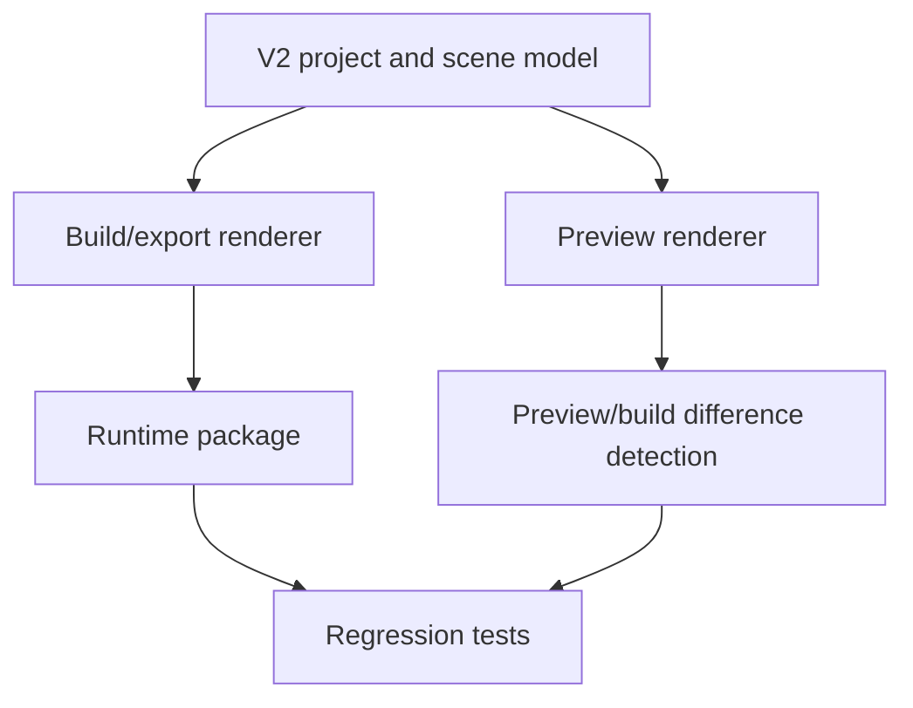

# SCADA Builder V2 - Preview Build Export Contract

Date: 2026-06-16
Status: Active runtime contract
Document version: `V2.1.2.0007`

## Historique des changements

| Date | Version | Commit | Changement |
| --- | --- | --- | --- |
| 2026-06-16 | `V2.1.2.0007` | `PENDING` | Clarification du curseur FT100 runtime par defaut sur boutons et cibles avec events. |
| 2026-06-16 | `V2.1.2.0006` | `PENDING` | Clarification de la parite export des events runtime portes par des groupes Element+. |
| 2026-06-16 | `V2.1.2.0005` | `PENDING` | Ajout des metadonnees preview/export du hover automatique des boutons Element+. |
| 2026-06-16 | `V2.1.1.0039` | `PENDING` | Creation du contrat actif preview/build/export separe des notes historiques. |

## 1. Contract

Preview, build, and export must consume the same V2 project and scene model.

Editor-only artifacts are never runtime geometry:

1. Selection overlays.
2. Handles.
3. Drag rectangles.
4. Diagnostics.
5. Layout tools.
6. Test panels.
7. Studio workzone state.

Element+ button hover behavior is FT100Web runtime metadata, not an editor overlay and not SCADA Builder V2 preview styling. Preview must preserve `ScadaButtonBehavior` without applying hover locally. FT100 export must preserve `ScadaButtonBehavior` in the manifest and may generate page-scoped CSS `:hover` rules from enabled hover metadata.

Element+ group runtime events are model behavior, not editor overlay geometry. FT100 export must preserve a group event by emitting a transparent runtime wrapper for hit-testing and `data-scada-events`, while groups without runtime events may remain flattened.

Runtime click affordance is export-owned styling. FT100 export must generate page-scoped `cursor: pointer` CSS for Element+ buttons and elements carrying `data-scada-events`, including descendants and active click state.

## 2. Flow

## 3. Related Decisions

1. `DEC-0004` - Shared Preview Build Export Model.
2. `DEC-0007` - Page-Scoped Runtime Namespace.
3. `DEC-0012` - Element+ Button Default Hover Behavior.
4. `DEC-0013` - Runtime Group Event Wrapper Export.
5. `DEC-0014` - Runtime Pointer Cursor For Clickable Targets.

## 4. Related Tests

1. `tests/ScadaBuilderV2.Tests/PreviewDocumentTests.cs`
2. `tests/ScadaBuilderV2.Tests/Ft100SceneExporterTests.cs`
3. `tests/ScadaBuilderV2.Tests/WebViewContextMenuScriptTests.cs`
