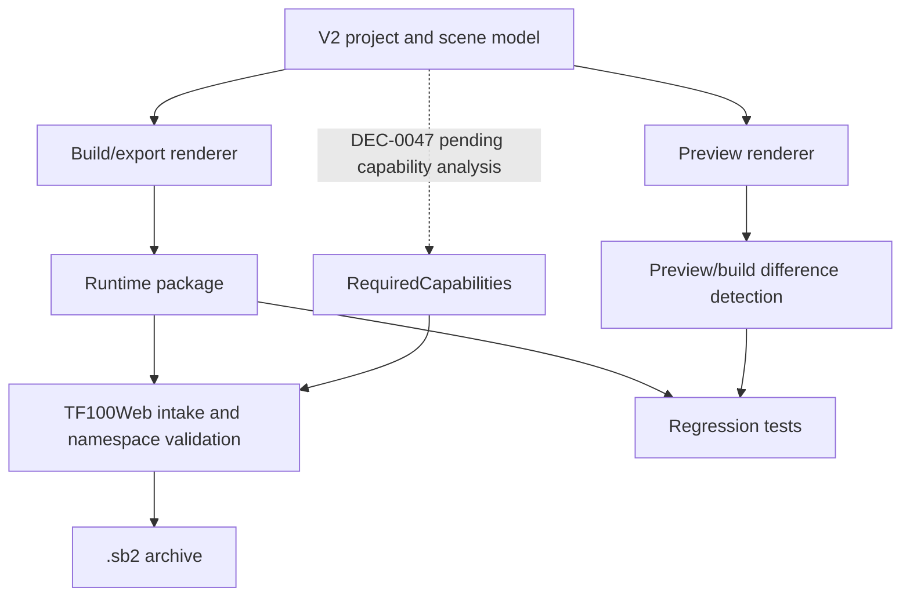

# SCADA Builder V2 - Preview Build Export Contract

Date: 2026-07-14
Status: Active runtime contract
Document version: `V2.1.4.0046`

## Historique des changements

| Date | Version | Commit | Changement |
| --- | --- | --- | --- |
| 2026-07-16 | `V2.1.4.0046` | `PENDING` | `DEC-0047` approuvee : la parite inclura un registre de capacites derive, manifest 2.3 et package de conformance partage avec TF100Web. |
| 2026-07-15 | `V2.1.4.0039` | `PENDING` | Preview/build/export partagent les inputs numeriques cellule; le manifest global 2.2 publie `TableCellBindings` sans alterer le DOM Tableau. |
| 2026-07-15 | `V2.1.4.0027` | `88e865a` | Les tableaux exportent des rangées HTML valides, des `<th>/<td>` avec `rowspan`/`colspan` et des segments conservant style, couleur et épaisseur; le scénario 16 x 10 vérifie preview et `.sb2`. |
| 2026-07-15 | `V2.1.4.0026` | `0874416` | Parite Tableau avancee : headers semantiques, wrap/line-height et segments de bordure; exclusion explicite du lock et des gouttieres editor-only. |
| 2026-07-14 | `V2.1.2.0039` | `PENDING` | Ajout des pages natives et de la projection `PageKey` vers `PageCode` sans changement du contrat `.sb2`. |
| 2026-06-19 | `V2.1.2.0038` | `6f76dc8` | Alignement metadata preview/export pour wrappers de boutons Element+. |
| 2026-06-19 | `V2.1.2.0037` | `2a540d6` | Ajout du contrat des evenements runtime pour boutons standards. |
| 2026-06-19 | `V2.1.2.0036` | `8cc4d33` | Ajout du contrat runtime disabled reel pour boutons Element+. |
| 2026-06-19 | `V2.1.2.0035` | `588d712` | Ajout du contrat runtime local d'etat Toggle pour boutons Element+. |
| 2026-06-19 | `V2.1.2.0034` | `61eef34` | Ajout du contrat export CSS appui/actif pour les boutons Element+. |
| 2026-06-17 | `V2.1.2.0019` | `bd6515e` | Ajout de l'export archive `.sb2` FT100 avec validation de compatibilite avant packaging. |
| 2026-06-16 | `V2.1.2.0007` | `PENDING` | Clarification du curseur FT100 runtime par defaut sur boutons et cibles avec events. |
| 2026-06-16 | `V2.1.2.0006` | `PENDING` | Clarification de la parite export des events runtime portes par des groupes Element+. |
| 2026-06-16 | `V2.1.2.0005` | `PENDING` | Ajout des metadonnees preview/export du hover automatique des boutons Element+. |
| 2026-06-16 | `V2.1.1.0039` | `PENDING` | Creation du contrat actif preview/build/export separe des notes historiques. |

## 1. Contract

Preview, build, and export must consume the same V2 project and scene model.

Editor-only artifacts are never runtime geometry:

1. Selection overlays.
2. Handles.
3. Drag rectangles.
4. Diagnostics.
5. Layout tools.
6. Test panels.
7. Studio workzone state.
8. Element position-lock indicators and `IsLocked` metadata.
9. Table cell-selection headers, gutters, handles, modes, and auto-fit diagnostics.

Le renderer commun emet les rangees d'en-tete Tableau en `<th>`, les autres ancres en `<td>`, resout les segments de bordure depuis le modele et conserve l'`<input type="number">` natif des cellules numeriques. Preview, build et export lisent le meme `ScadaTableCell` et produisent les memes contraintes, format, valeur initiale et etat readonly.

Le manifest `.sb2` actif est globalement en version `2.2`. Un objet Tableau peut exposer `TableCellBindings` pour ses seules cellules ancres `InputNumeric` liees; la cible non scopee est derivee de l'id Tableau et de la coordonnee. TF100Web applique ensuite le scope de page au `<td>` correspondant et reutilise l'input enfant. Le verrouillage et toutes les gouttieres, selections et poignees d'authoring demeurent exclus du runtime.

La cible approuvee `DEC-0047`, non implementee, est le manifest 2.3. Preview/build/export derivent alors le meme ensemble `RequiredCapabilities` du modele; le package publie aussi le SHA-256 du runtime partage. Aucun export operateur 2.3 ne commence avant le deploiement de l'intake TF100Web compatible.

Element+ button hover behavior is FT100Web runtime metadata, not an editor overlay and not SCADA Builder V2 preview styling. Preview must preserve `ScadaButtonBehavior` without applying hover locally. FT100 export must preserve `ScadaButtonBehavior` in the manifest and may generate page-scoped CSS `:hover` rules from enabled hover metadata.

Element+ button pressed/active behavior is also FT100Web runtime metadata. Preview must preserve `ScadaButtonBehavior.Pressed` without simulating press state locally. FT100 export must preserve the metadata in the manifest and may generate page-scoped CSS `:active` plus active toggle-state rules from enabled pressed metadata.

Element+ Toggle button state is export-owned runtime behavior. Preview must preserve `ButtonKind.Toggle` without simulating on/off state locally. FT100 export must place `data-scada-button-kind="Toggle"` and `data-scada-toggle-state="off"` on the Element+ wrapper, then toggle that wrapper state on click and emit `scada-builder-toggle-state-changed`.

Element+ disabled button behavior is export-owned runtime behavior. Preview must preserve `ScadaButtonBehavior.IsDisabled` without executing runtime actions locally. FT100 export must place disabled metadata on the Element+ wrapper, emit a native disabled `<button>`, suppress hover/pressed/toggle runtime, and block object-owned event execution for disabled button wrappers.

Element+ standard button activation is exposed as host-consumable runtime events. FT100 export must emit `scada-builder-button-activated` for enabled button wrappers and a kind-specific event for `Command`, `Navigation`, `AlarmAcknowledge`, `EmergencyStop`, and `Toggle`, while authored object actions remain the model-owned behavior path.

Preview and FT100 export must agree on wrapper-level button metadata. SCADA Builder V2 preview may keep generated buttons non-interactive for editing, but button wrappers must carry `data-scada-button-kind`, behavior metadata, disabled metadata, and Toggle initial state consistently with the FT100 wrapper contract.

Element+ group runtime events are model behavior, not editor overlay geometry. FT100 export must preserve a group event by emitting a transparent runtime wrapper for hit-testing and `data-scada-events`, while groups without runtime events may remain flattened.

Runtime click affordance is export-owned styling. FT100 export must generate page-scoped `cursor: pointer` CSS for Element+ buttons and elements carrying `data-scada-events`, including descendants and active click state.

FT100 `.sb2` export is a packaging layer over the same V2 project export model. It must first generate the normalized `scada-builder-v2-ft100-package` folder in a staging directory, validate TF100Web intake compatibility and page namespace rules, then create a ZIP archive with `.sb2` extension. The `.sb2` archive must not change scene geometry, runtime markup, CSS scoping, or page composition semantics compared with the validated folder package.

Native pages are rendered from `ScadaScene` without imported HTML. Imported pages continue to use their provenance-backed projection. Before preview/export, `PageRuntimeIdentityResolver` projects internal keys to human `PageCode` values; package folders, manifest page ids, DOM roots and navigation targets therefore preserve the existing `.sb2` contract.

## 2. Flow

## 3. Related Decisions

1. `DEC-0004` - Shared Preview Build Export Model.
2. `DEC-0007` - Page-Scoped Runtime Namespace.
3. `DEC-0012` - Element+ Button Default Hover Behavior.
4. `DEC-0013` - Runtime Group Event Wrapper Export.
5. `DEC-0014` - Runtime Pointer Cursor For Clickable Targets.

## 4. Related Tests

1. `tests/ScadaBuilderV2.Tests/PreviewDocumentTests.cs`
2. `tests/ScadaBuilderV2.Tests/Ft100SceneExporterTests.cs`
3. `tests/ScadaBuilderV2.Tests/WebViewContextMenuScriptTests.cs`
