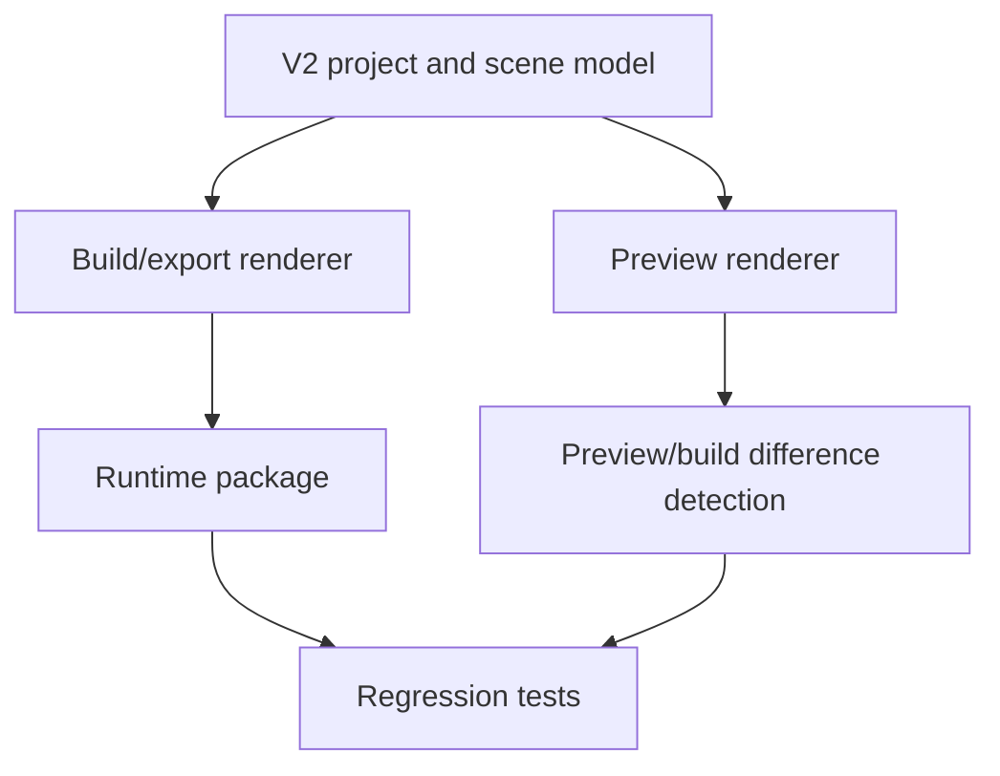

# SCADA Builder V2 - Preview Build Export Contract

Date: 2026-06-16
Status: Active runtime contract
Document version: `V2.1.1.0039`

## Historique des changements

| Date | Version | Commit | Changement |
| --- | --- | --- | --- |
| 2026-06-16 | `V2.1.1.0039` | `PENDING` | Creation du contrat actif preview/build/export separe des notes historiques. |

## 1. Contract

Preview, build, and export must consume the same V2 project and scene model.

Editor-only artifacts are never runtime geometry:

1. Selection overlays.
2. Handles.
3. Drag rectangles.
4. Diagnostics.
5. Layout tools.
6. Test panels.
7. Studio workzone state.

## 2. Flow

## 3. Related Decisions

1. `DEC-0004` - Shared Preview Build Export Model.
2. `DEC-0007` - Page-Scoped Runtime Namespace.

## 4. Related Tests

1. `tests/ScadaBuilderV2.Tests/PreviewDocumentTests.cs`
2. `tests/ScadaBuilderV2.Tests/Ft100SceneExporterTests.cs`
