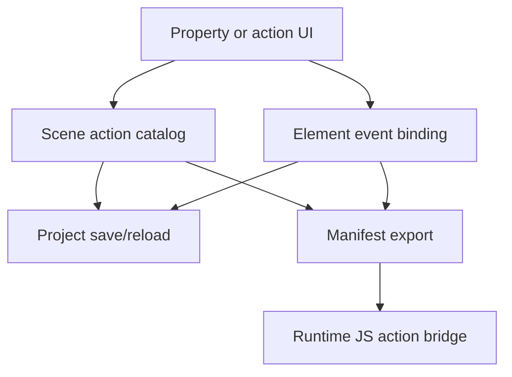

# SCADA Builder V2 - Actions Events Contract

Date: 2026-06-16
Status: Active editor/runtime actions contract
Document version: `V2.1.1.0039`

## Historique des changements

| Date | Version | Commit | Changement |
| --- | --- | --- | --- |
| 2026-06-16 | `V2.1.1.0039` | `PENDING` | Creation du contrat actions/events separe des commandes et du statut d'implementation. |

## 1. Contract

Object events and runtime actions are model-owned behavior. UI controls may author them, but exported runtime behavior must come from scene actions and element event bindings.

## 2. Active Implemented Baseline

1. Object-owned click navigation action exists in the scene model and FT100 manifest output.
2. Page type, dimensions, background, actions, and event bindings persist through project save/reload.

## 3. Roadmap Boundary

The following are roadmap items until implemented and covered by tests:

1. `On click -> open popup`.
2. `mouse hover -> show element/group border`.
3. Tag conditions: true, false, degraded.
4. Global scripts generating lifecycle events.
5. Visual effects such as blink, glow, pulse, alarm highlight, degraded treatment.

## 4. Event Flow

## 5. Related Tests

1. `tests/ScadaBuilderV2.Tests/ModernProjectStoreTests.cs`
2. `tests/ScadaBuilderV2.Tests/Ft100SceneExporterTests.cs`
