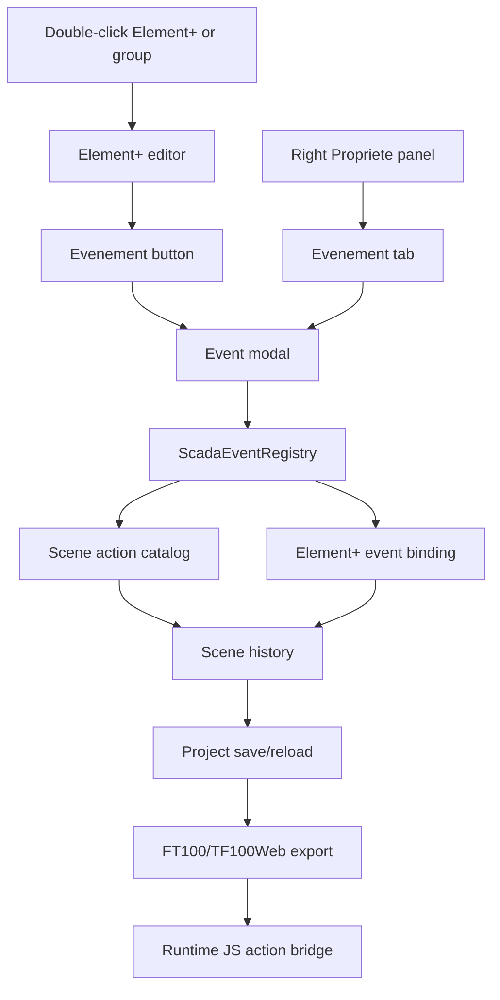
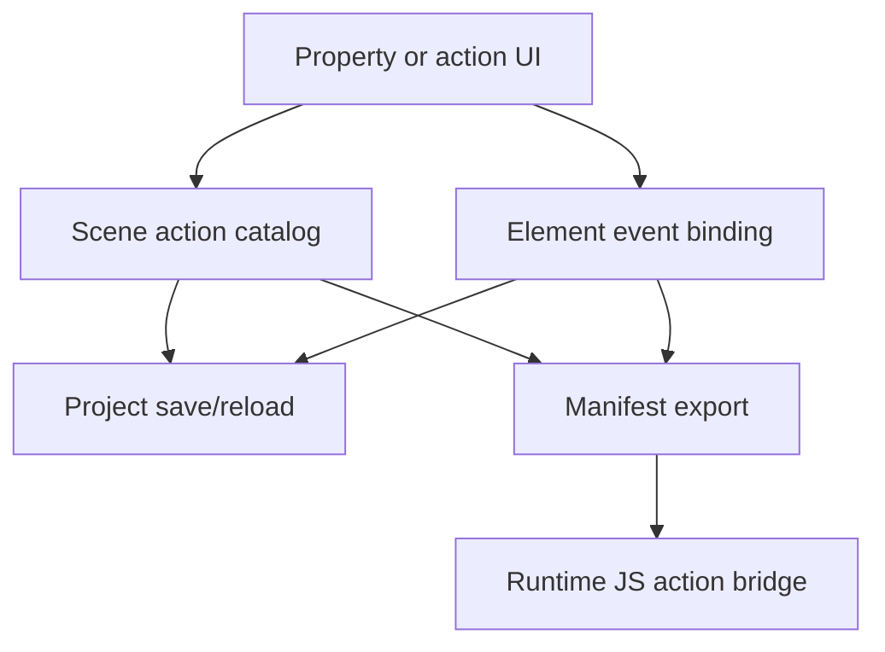

# SCADA Builder V2 - Actions Events Contract

Date: 2026-06-16
Status: Active editor/runtime actions contract
Document version: `V2.1.2.0007`

## Historique des changements

| Date | Version | Commit | Changement |
| --- | --- | --- | --- |
| 2026-06-16 | `V2.1.2.0007` | `PENDING` | Ajout du curseur runtime par defaut pour les cibles `Clic` exportees. |
| 2026-06-16 | `V2.1.2.0006` | `PENDING` | Clarification de l'export FT100 des events `Clic -> Changer de page` portes par des groupes Element+. |
| 2026-06-16 | `V2.1.2.0004` | `PENDING` | Ajout du registre contractuel Element+ events/actions et de la premiere modale Clic -> Changer de page. |
| 2026-06-16 | `V2.1.1.0039` | `PENDING` | Creation du contrat actions/events separe des commandes et du statut d'implementation. |

## 1. Contract

Object events and runtime actions are model-owned behavior. UI controls may author them, but exported runtime behavior must come from scene actions and element event bindings.

## 2. Active Implemented Baseline

1. Object-owned click navigation action exists in the scene model and FT100 manifest output.
2. Page type, dimensions, background, actions, and event bindings persist through project save/reload.
3. The Element+ property/editor surface exposes an `Evenement` entry that opens a modal authoring flow.
4. The first event authoring slice creates `Clic -> Changer de page` by adding a scene action and an Element+ event binding.
5. One Element+ may hold several event bindings, including several `Clic` bindings.
6. `Clic -> Changer de page` bindings authored on Element+ groups are exported as transparent FT100 runtime wrappers so TF100Web can hit-test the group and execute the page navigation action.
7. FT100 export gives `Clic` targets a default pointer cursor in hover and active click states when they are buttons or carry exported `data-scada-events`.

## 3. Event Registry

Event trigger contracts are centralized in `ScadaEventRegistry`:

| Editor key | French label | Runtime trigger | Multiple bindings | Conditional contract |
| --- | --- | --- | --- | --- |
| `OnClick` | `Clic` | `click` | Yes | Planned |
| `OnRelease` | `Relachement` | `pointerup` | Yes | Planned |
| `OnHover` | `Survol` | `mouseenter` | Yes | Planned |
| `OnHoverEnter` | `Entree survol` | `mouseenter` | Yes | Planned |
| `OnHoverExit` | `Sortie survol` | `mouseleave` | Yes | Planned |

Runtime function contracts are centralized in `ScadaEventRegistry`:

| Function | French label | Persisted action kind | Required arguments | Status |
| --- | --- | --- | --- | --- |
| `ChangePage` | `Changer de page` | `Navigate` | `TargetPageId` | Implemented |
| `Show` | `Afficher objet` | `Show` | `TargetElementId` | Registered, not authorable |
| `Hide` | `Masquer objet` | `Hide` | `TargetElementId` | Registered, not authorable |
| `ToggleVisibility` | `Basculer visibilite` | `ToggleVisibility` | `TargetElementId` | Registered, not authorable |
| `WriteTag` | `Ecrire tag` | `WriteTag` | `TagId`, `Value` | Registered, not authorable |

## 4. Authoring Flow

## 5. Conditional Events Plan

Conditional execution is part of the contract but not authorable in the first implemented slice.

Planned condition fields:

1. Tag id or expression id.
2. Operator, such as equals, not equals, greater than, lower than, true, false, degraded.
3. Comparison value.
4. Execution mode: run when true, run when false, or run when degraded.
5. Optional stop-on-first-match policy for ordered event chains.

The condition schema must be persisted, exported, and tested before the modal enables condition editing.

## 6. Roadmap Boundary

The following are roadmap items until implemented and covered by tests:

1. `On click -> open popup`.
2. `mouse hover -> show element/group border`.
3. Tag conditions: true, false, degraded.
4. Global scripts generating lifecycle events.
5. Visual effects such as blink, glow, pulse, alarm highlight, degraded treatment.

## 7. Event Flow

## 8. Related Tests

1. `tests/ScadaBuilderV2.Tests/ModernProjectStoreTests.cs`
2. `tests/ScadaBuilderV2.Tests/Ft100SceneExporterTests.cs`
3. `tests/ScadaBuilderV2.Tests/OfficialSceneDomainTests.cs`
4. `tests/ScadaBuilderV2.Tests/WebViewContextMenuScriptTests.cs`
