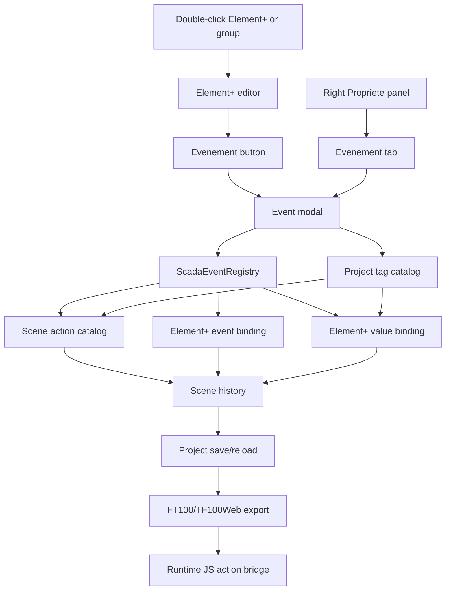
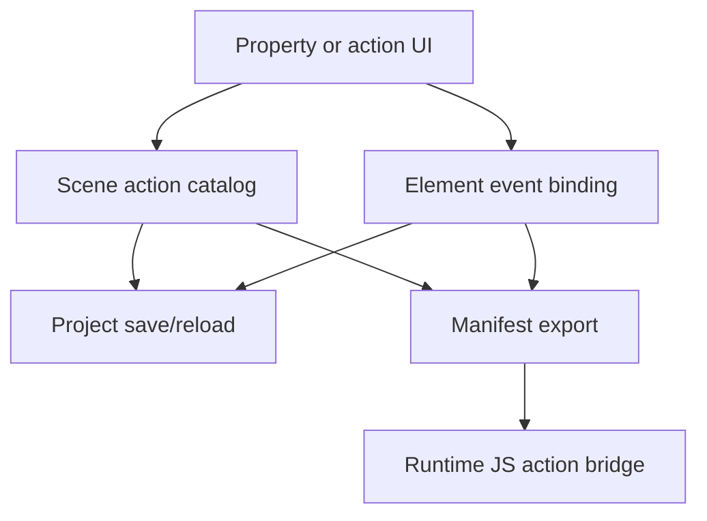

# SCADA Builder V2 - Actions Events Contract

Date: 2026-07-16
Status: Active editor/runtime actions contract
Document version: `V2.1.4.0053`

> **DEPRECATED (2026-07-07):** `SetClass`/`RemoveClass`/`ToggleClass`/`WriteTag` (legacy)
> action kinds and the border/visual-effect authoring described in §3, §8, §9 have been
> removed from the domain model. Element+ display-state and command authoring is now
> specified in `docs/superpowers/specs/2026-07-07-element-plus-state-command-events-design.md`
> and `docs/03_runtime_contracts/STATE_COMMAND_RUNTIME_CONTRACT_V1.md`. `Navigate`,
> `Show`/`Hide`/`ToggleVisibility`, `MountFragment`/`ClosePopup`/`TogglePopup`, and
> `ReadValue`/`WriteValue` remain valid until fully absorbed by the new Etat/Commande tabs.

## Historique des changements

| Date | Version | Commit | Changement |
| --- | --- | --- | --- |
| 2026-07-16 | `V2.1.4.0053` | `PENDING` | `DEC-0047` : les 9 actions objet utilisent ActionDispatcher, conditions partagees, ordre/propagation et page scope. |
| 2026-07-16 | `V2.1.4.0043` | `8489dbd` | `DEC-0044` applique le modele Etat/Commande qui remplace les anciennes actions visuelles : 56 boutons Toggle, filtres PLC et texte dynamique via cible semantique partagee. |
| 2026-06-17 | `V2.1.2.0022` | `PENDING` | Clarification que `Lire valeur` et `Ecrire valeur` sont des events de binding runtime sans trigger utilisateur. |
| 2026-06-17 | `V2.1.2.0017` | `PENDING` | Implementation des effets visuels runtime standards. |
| 2026-06-17 | `V2.1.2.0017` | `PENDING` | Ajout du bridge lifecycle runtime global exporte. |
| 2026-06-17 | `V2.1.2.0017` | `PENDING` | Implementation des groupes de conditions runtime `All/Any` et politique de tag manquant. |
| 2026-06-17 | `V2.1.2.0017` | `PENDING` | Implementation des options runtime avancees pour popup Fragment. |
| 2026-06-17 | `V2.1.2.0016` | `PENDING` | Implementation des actions runtime `Afficher bordure`, `Masquer bordure` et `Basculer bordure`. |
| 2026-06-17 | `V2.1.2.0015` | `PENDING` | Implementation de `Fermer popup` et `Basculer popup` vers fragments compiles. |
| 2026-06-17 | `V2.1.2.0014` | `PENDING` | Implementation de `Ouvrir popup` vers fragments compiles. |
| 2026-06-17 | `V2.1.2.0012` | `PENDING` | Clarification de l'application runtime des valeurs recues par `Lire valeur`. |
| 2026-06-17 | `V2.1.2.0010` | `PENDING` | Implementation des actions objet `Afficher`, `Masquer`, `Basculer visibilite` avec condition tag deterministe. |
| 2026-06-17 | `V2.1.2.0009` | `PENDING` | Remplacement de l'action authorable `WriteTag` par les bindings Element+ `Lire valeur` et `Ecrire valeur`. |
| 2026-06-17 | `V2.1.2.0008` | `PENDING` | Implementation de l'import tags TF100Web et de l'authoring Element+ `WriteTag`. |
| 2026-06-16 | `V2.1.2.0007` | `PENDING` | Ajout du curseur runtime par defaut pour les cibles `Clic` exportees. |
| 2026-06-16 | `V2.1.2.0006` | `PENDING` | Clarification de l'export FT100 des events `Clic -> Changer de page` portes par des groupes Element+. |
| 2026-06-16 | `V2.1.2.0004` | `PENDING` | Ajout du registre contractuel Element+ events/actions et de la premiere modale Clic -> Changer de page. |
| 2026-06-16 | `V2.1.1.0039` | `PENDING` | Creation du contrat actions/events separe des commandes et du statut d'implementation. |

## 1. Contract

Object events, binding events, and runtime actions are model-owned behavior. UI controls may author them, but exported runtime behavior must come from scene actions, Element+ event bindings, or Element+ value binding events.

SCADA Builder V2 treats every runtime function as an event family. Triggered events use browser triggers such as `click`; binding events such as `Lire valeur` and `Ecrire valeur` synchronize runtime tag values and do not require a user-trigger selector.

## 2. Active Implemented Baseline

Le baseline ci-dessous decrit le contrat historique encore valide pour ses familles non absorbees. Pour l'authoring courant d'etat et de commande, `ScadaElementStateConfig` et `ScadaElementCommandConfig` sont proprietaires selon `STATE_COMMAND_RUNTIME_CONTRACT_V1.md`.

1. Object-owned click navigation action exists in the scene model and FT100 manifest output.
2. Page type, dimensions, background, actions, and event bindings persist through project save/reload.
3. The Element+ property/editor surface exposes an `Evenement` entry that opens a modal authoring flow.
4. The first event authoring slice creates `Clic -> Changer de page` by adding a scene action and an Element+ event binding.
5. One Element+ may hold several event bindings, including several `Clic` bindings.
6. Object-action bindings authored on Element+ groups are exported as transparent FT100 runtime wrappers so the shared runtime can hit-test the group and execute the ordered action bindings.
7. FT100 export gives action targets a default pointer cursor in hover and active click states when they are buttons or carry `data-scada-action-bindings`. `data-scada-events` remains decommissioned.
8. The project can import a TF100Web `tf100web-scada-tags-v1` tag catalog. The Element+ event modal exposes enabled tags for value binding authoring.
9. `Lire valeur` and `Ecrire valeur` are binding events. They persist tag ids as Element+ data bindings instead of triggered scene actions. `Ecrire valeur` writes the operator-entered runtime value and never stores a literal design-time value.
10. The nine current object-action kinds may use one deterministic tag condition and/or one compound condition group; conditions are evaluated by the shared runtime before execution.
11. Exported runtime applies values pushed by TF100Web to every Element+ using the matching `Lire valeur` tag binding.
12. `Ouvrir popup`, `Fermer popup`, and `Basculer popup` are authorable against compiled `Fragment` pages, persist optional advanced runtime options and normalize to canonical host intents.
13. Legacy border/class actions are deprecated and removed from the active domain. Model-backed `StateConfig` owns visual effects.
15. Model-backed display states are evaluated continuously by the shared runtime and may combine color-filter effects with `TextContent`; generated text and button labels expose the same `[data-scada-text]` target.
16. Model-backed commands execute through the shared `CommandDispatcher`. Toggle reads `ReadTagId` (or `WriteTagId`) from the shared TF100Web snapshot and writes through the existing bridge; appearance follows the confirmed subsequent snapshot.

## 3. Event Registry

Event trigger contracts are centralized in `ScadaEventRegistry`:

| Editor key | French label | Runtime trigger | Multiple bindings | Conditional contract |
| --- | --- | --- | --- | --- |
| `OnClick` | `Clic` | `click` | Yes | Implemented |
| `OnRelease` | `Relachement` | `pointerup` | Yes | Implemented |
| `OnHover` | `Survol` | `mouseenter` | Yes | Implemented |
| `OnHoverEnter` | `Entree survol` | `mouseenter` | Yes | Implemented |
| `OnHoverExit` | `Sortie survol` | `mouseleave` | Yes | Implemented |

Runtime function contracts are centralized in `ScadaEventRegistry`:

| Function | French label | Persisted action kind | Required arguments | Status |
| --- | --- | --- | --- | --- |
| `ChangePage` | `Changer de page` | `Navigate` | `TargetPageId` | Implemented |
| `OpenPopup` | `Ouvrir popup` | `MountFragment` | `TargetPageId` fragment | Implemented |
| `ClosePopup` | `Fermer popup` | `ClosePopup` | `TargetPageId` fragment | Implemented |
| `TogglePopup` | `Basculer popup` | `TogglePopup` | `TargetPageId` fragment | Implemented |
| `Show` | `Afficher objet` | `Show` | `TargetElementId`, optional `Condition` | Implemented |
| `Hide` | `Masquer objet` | `Hide` | `TargetElementId`, optional `Condition` | Implemented |
| `ToggleVisibility` | `Basculer visibilite` | `ToggleVisibility` | `TargetElementId`, optional `Condition` | Implemented |
| `ShowBorder` / `HideBorder` / `ToggleBorder` | Bordure legacy | Removed kinds | N/A | Deprecated, not authorable |
| `Start*Effect` / `Stop*Effect` / `Toggle*Effect` | Effets legacy | Removed kinds | N/A | Deprecated; use `StateConfig` |
| `ReadValue` | `Lire valeur` | `ReadValue` binding event | `TagId` | Implemented |
| `WriteValue` | `Ecrire valeur` | `WriteValue` binding event | `TagId` | Implemented |
| `WriteTag` | `Ecrire tag` | `WriteTag` | `TagId`, `Value` | Legacy compatibility, not authorable |

## 4. Authoring Flow

## 5. Conditional Events Plan

Conditional execution is implemented once for all current object-action kinds in `ActionDispatcher`.

Implemented condition fields:

1. Imported tag id.
2. Operator: `Vrai`, `Faux`, `=`, `<>`, `>`, `>=`, `<`, `<=`.
3. Comparison value for non-boolean operators.

Boolean `Vrai/Faux` operators are valid only for boolean tags. Missing target objects, missing condition tags, boolean operators on non-boolean tags, and missing comparison values are build/export errors.

Compound condition groups are implemented with:

1. `Mode`: `All` requires all conditions to be true; `Any` requires at least one true condition.
2. `MissingTagPolicy`: `BlockAction` prevents the action when a required runtime value is unavailable; `AllowAction` allows the action as an explicit fail-open degraded policy.
3. The same deterministic condition operators as single conditions.

## 6. Tag Authoring Boundary

The current implemented tag slice covers:

1. Importing the TF100Web tag export into the V2 project model.
2. Selecting any enabled tag in the Element+ event modal with labels formatted as `Nom du tag | datatype | Nom de l'appareil`.
3. Creating `Lire valeur` binding events with no user trigger.
4. Creating `Ecrire valeur` binding events with no user trigger and no design-time value field; the runtime operator input supplies the value.
5. Validating `Ecrire valeur` during build/export so read-only Element+ objects, non-input Element+ objects, read-only tags, and missing tags are rejected.
6. Exporting tags and per-element value binding metadata in the FT100/TF100Web package.
7. Applying pushed runtime values to read-bound Element+ objects through the TF100Web page bridge.

The current slice does not yet implement expression authoring, local tag creation, or project protocol import. Local tag creation requires a future protocol import revision.

## 7. Popup Authoring Boundary

The current implemented popup slice covers:

1. Selecting `Ouvrir popup`, `Fermer popup`, or `Basculer popup` in the Element+ event dialog.
2. Selecting only pages marked `Fragment` and included in build.
3. Persisting the actions as `ScadaActionKind.MountFragment`, `ClosePopup`, or `TogglePopup` with `TargetPageId`.
4. Persisting optional `ScadaPopupOptions`: `Position`, `SizePreset`, `AllowMultiple`, `ResetOnOpen`, and `HostRegionId`.
5. Validating missing, non-fragment, excluded popup targets, and missing host-region Element+ targets before build/export.
6. Exporting canonical popup intents with model-backed position, size, multi-instance, reset and host-region options transported unchanged.
7. Opening, closing, toggling, focus and fragment lifecycle are host services supplied by the single TF100Web adapter.

The current slice does not yet implement a visual placement editor or a separate named host-region registry. Host-region popups target an existing Element+ id.

## 8. Visual Runtime Action Boundary

`SetClass`, `RemoveClass`, and `ToggleClass` are historical contracts removed from the active domain. They must not be reintroduced through `ActionDispatcher`. Current visual behavior is model-backed by `ScadaElementStateConfig`, evaluated by `StateEngine`, and applied reversibly by `EffectApplier`.

## 9. Roadmap Boundary

The following are roadmap items until implemented and covered by tests:

1. Expression/formula condition authoring.
2. Controlled custom script loading and script authoring.
3. Custom visual effect styling and local preview of runtime visual effects.

## 9.1 Canonical Runtime Adapter

1. The page root owns a camelCase `data-scada-action-registry`; each source object owns ordered `data-scada-action-bindings` with trigger, action id, `StopPropagation`, and `PreventDefault`.
2. `ScadaRuntime.initPage` binds the five trigger contracts idempotently; `disposePage` removes those listeners before page replacement.
3. `Navigate`, `MountFragment`, `ClosePopup`, and `TogglePopup` reuse the same versioned host-intent transport as `CommandDispatcher`. `Show`, `Hide`, `ToggleVisibility`, `ReadValue`, and `WriteValue` stay portable.
4. Element targets are resolved exclusively by exact `data-scada-element-id` inside the initialized page root. A duplicate id in another composed root cannot be selected.
5. Read/write actions use `TagBridge`; condition comparisons use `ExpressionEvaluator`. A missing definition, target, single-condition tag, input value, unknown trigger/operator, disabled source, or unsupported kind fails closed.
6. Bindings execute in persisted order. `PreventDefault` and `StopPropagation` apply to their browser event without silently reordering or suppressing later bindings on the same source.
7. Strict manifest 2.3 export still rejects any action, condition, popup option, or policy marked `Blocked` in the capability registry. Local shared-runtime implementation alone does not promote a capability without TF100Web fixture evidence.

## 10. Event Flow

## 11. Related Tests

1. `tests/ScadaBuilderV2.Tests/ModernProjectStoreTests.cs`
2. `tests/ScadaBuilderV2.Tests/Ft100SceneExporterTests.cs`
3. `tests/ScadaBuilderV2.Tests/OfficialSceneDomainTests.cs`
4. `tests/ScadaBuilderV2.Tests/WebViewContextMenuScriptTests.cs`
