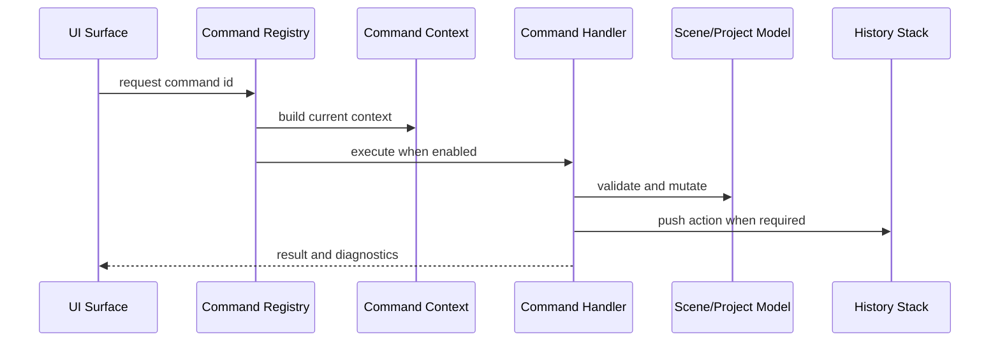

# SCADA Builder V2 - Commands Contract

Date: 2026-07-14
Status: Active editor command contract
Document version: `V2.1.4.0016`

## Historique des changements

| Date | Version | Commit | Changement |
| --- | --- | --- | --- |
| 2026-07-14 | `V2.1.4.0016` | `10cfa72` | Ajout des commandes typees Tableau, du presse-papiers rectangulaire et du catalogue Inserer hierarchique pilote par descripteurs. |
| 2026-07-14 | `V2.1.4.0012` | `PENDING` | Commandes asynchrones `page.*`, coordinateur partagé, diagnostics et mutations de propriétés désormais implémentés. |
| 2026-07-14 | `V2.1.4.0011` | `4def659` | Ajout de la cible approuvée des commandes asynchrones `page.*` partagées par toutes les surfaces. |
| 2026-06-19 | `V2.1.3.0000` | `b195fe0` | Ajout des commandes `insert.shape.circle`, `insert.shape.triangle`, `insert.shape.star` et du placement deux points ligne/fleche. |
| 2026-06-19 | `V2.1.2.0042` | `0825cfe` | Activation des commandes de ruban `object.group` et `object.ungroup`. |
| 2026-06-19 | `V2.1.2.0041` | `88a3e8b` | Le catalogue de commandes du ruban devient un contrat applicatif testable. |
| 2026-06-19 | `V2.1.2.0040` | `335adfb` | Ajout du contrat de metadonnees de commandes pour le ruban superieur. |
| 2026-06-16 | `V2.1.2.0003` | `PENDING` | Clarification du groupement Element+: ordre de rendu preserve et deplacement solidaire des enfants de groupe. |
| 2026-06-16 | `V2.1.2.0002` | `PENDING` | Decommission du groupement legacy direct et verrouillage du groupement scene Element+ only. |
| 2026-06-16 | `V2.1.2.0001` | `PENDING` | Ajout du contrat des raccourcis clavier WebView: Backspace est non destructif et les champs editables interceptent leurs touches. |
| 2026-06-16 | `V2.1.1.0039` | `PENDING` | Creation du contrat commandes separe du contrat etat/actions/menus. |

## 1. Contract

Commands are explicit application operations. A command id is the stable bridge between UI surfaces, context menus, command registry, tests, and behavior.

## 2. Rules

1. UI surfaces request commands; they do not own behavior.
2. Command enablement depends on command context, not duplicated UI conditions.
3. Commands that mutate project, scene, selection, geometry, properties, or export state must route through application/domain services and history where applicable.
4. Context-menu commands must delete, convert, move, group, or inspect the selected runtime target type after selection resolution.
5. Command ids must remain stable once referenced by tests or documentation.
6. WebView keyboard shortcuts must not run scene commands while focus is inside an editable control, property editor, or inline text editor.
7. `Delete` may delete the selected Element+ only when focus is not editable; `Backspace` must not delete Element+ objects and must be consumed when an Element+ selection is active to avoid accidental WebView navigation.
8. Scene grouping is Element+ only: `object.group` groups two or more selected Element+ scene objects, while selected legacy/source nodes must be converted to Element+ before grouping.
9. Legacy/source grouping attempts must warn the user to convert first and must not create legacy-only frame groups.
10. Element+ grouping preserves child render order from the original scene sibling order, not from click or selection order.
11. In normal scene movement, dragging or moving a child of an Element+ group targets the containing group so grouped objects remain solidary.
12. Ribbon command surfaces must be rendered from command metadata instead of per-button duplicated XAML. The metadata includes stable command id, visible label, tooltip or disabled reason, semantic icon key, group, order, and executable state.
13. Disabled future ribbon commands must remain registered with a disabled reason when they are shown, so the surface communicates intent without pretending the command is executable.
14. The default top-ribbon command catalog is owned by the Application layer, so WPF adapts shared command metadata instead of owning the canonical list of visible commands.
15. When `object.group` or `object.ungroup` is executable from the top ribbon, it must route to the same Element+ scene workflow as the context menu and preserve history coverage.
16. Les mutations Tableau passent par `TableEditCoordinator` et les operations Domain; le WebView, le panneau droit, les dialogues et le menu contextuel ne reimplementent pas les invariants.
17. Le menu Tableau expose copier/coller, insertion/suppression de pistes, effacement, format, dimensions et fusion/defusion; chaque mutation validee produit une entree undo/redo.
18. Le ruban Inserer selectionne d'abord une famille stable, puis un outil. `InsertToolCatalog` est la source canonique; les ids historiques restent stables et les outils planifies restent disabled avec une raison.
16. Standard shape insert commands include `insert.shape.rectangle`, `insert.shape.ellipse`, `insert.shape.circle`, `insert.shape.triangle`, `insert.shape.star`, `insert.shape.line`, and `insert.shape.arrow`.
17. `insert.shape.line` and `insert.shape.arrow` must route through two-point placement and persist model-backed start/end geometry rather than creating generic default line geometry.

## 3. Dispatch Flow

## 4. Implemented Page Commands

The `DEC-0038` implementation target replaces synchronous editor execution with `ExecuteAsync(ApplicationContext, CancellationToken)`, while runtime `ScadaCommandBinding` remains unchanged. Commands are non-reentrant, cancellable, authorization-ready through an initial allow-all policy, and return structured outcomes plus diagnostics.

Stable page command ids are `page.new`, `page.rename`, `page.change-code`, `page.duplicate`, `page.delete`, `page.open`, `page.properties`, `page.set-build-inclusion`, `page.set-home`, `page.set-type`, `page.set-composition`, `page.set-canvas`, `page.set-background`, and `page.validate`. The WPF shell does not own their business rules.

`CommandRegistry`, `PageCommandCoordinator` and typed `PageCommandRequest` records are the shared authority for ribbon, project tree, context menu and properties panel. A cancelled command does not display the blocking error dialog; blocked/failed results retain structured diagnostics.

## 5. Related Tests

1. `tests/ScadaBuilderV2.Tests/WebViewContextMenuScriptTests.cs`
2. `tests/ScadaBuilderV2.Tests/EditorHistoryServiceTests.cs`
3. `tests/ScadaBuilderV2.Tests/ScadaSceneGroupTests.cs`
4. `tests/ScadaBuilderV2.Tests/RibbonCommandCatalogTests.cs`
5. `tests/ScadaBuilderV2.Tests/PageApplicationCommandTests.cs`
6. `tests/ScadaBuilderV2.Tests/PageLifecycleIntegrationTests.cs`
