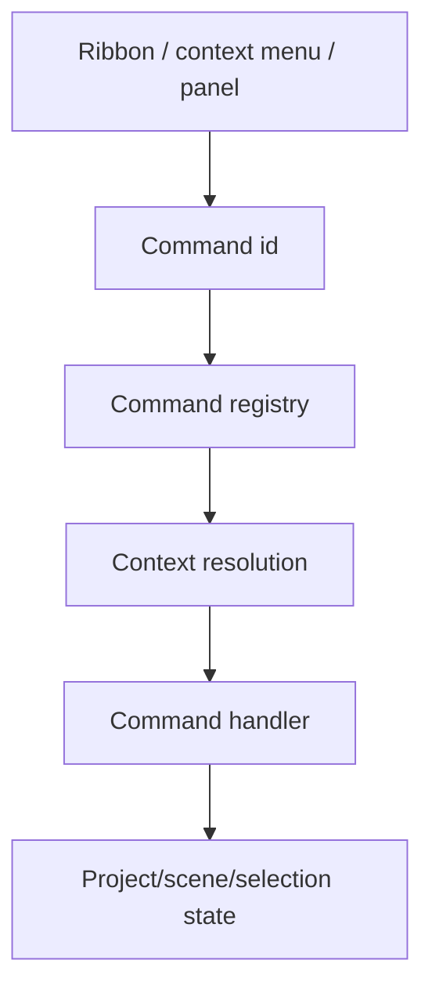

# SCADA Builder V2 - Menus And Surfaces Contract

Date: 2026-07-14
Status: Active editor menu and surface contract
Document version: `V2.1.4.0016`

## Historique des changements

| Date | Version | Commit | Changement |
| --- | --- | --- | --- |
| 2026-07-14 | `V2.1.4.0016` | `10cfa72` | Ruban Inserer hierarchique a huit familles et menu contextuel Tableau type tableur implementes depuis des catalogues dedies. |
| 2026-07-14 | `V2.1.4.0015` | `PENDING` | Correction du clic droit Pages pour remonter correctement depuis un contenu WPF `Run` sans appeler `VisualTreeHelper` sur un objet non visuel. |
| 2026-07-14 | `V2.1.4.0014` | `PENDING` | Ajustement de l'icone Nouvelle page a 16x16 avec marge interne explicite pour eviter son rognage. |
| 2026-07-14 | `V2.1.4.0013` | `PENDING` | Finition du panneau Pages : libelle Recherche, filtres initiaux Default/Tous et icone semantique partagee pour Nouvelle page. |
| 2026-07-14 | `V2.1.4.0012` | `PENDING` | Onglet Pages, actions rapides, menu contextuel, recherche/filtres et surfaces Diagnostics désormais implémentés. |
| 2026-07-14 | `V2.1.4.0011` | `4def659` | Ajout de la cible approuvée du ruban `Pages`, des actions rapides et du menu contextuel commun. |
| 2026-06-19 | `V2.1.3.0001` | `620e914` | Ajustement de la galerie Formes a des icones 32x32 sans libelles visibles. |
| 2026-06-19 | `V2.1.3.0000` | `b195fe0` | Ajout du contrat de galerie Formes 4 colonnes, icones 64x64, et etat actif d'insertion. |
| 2026-06-19 | `V2.1.2.0044` | `c50cbcf` | Extraction de la palette laterale d'outils vers la surface de commandes dynamique. |
| 2026-06-19 | `V2.1.2.0043` | `fde1b31` | Retrait du fallback XAML statique du ruban superieur. |
| 2026-06-19 | `V2.1.2.0042` | `0825cfe` | Les commandes `Grouper` et `Degrouper` du ruban Selection sont maintenant executees. |
| 2026-06-19 | `V2.1.2.0041` | `88a3e8b` | Le ruban WPF adapte le catalogue applicatif de commandes au lieu de posseder la liste canonique. |
| 2026-06-19 | `V2.1.2.0040` | `335adfb` | Le ruban superieur est maintenant rendu depuis un registre de commandes actif. |
| 2026-06-19 | `V2.1.2.0039` | `e5f8a82` | Ajout du contrat de ruban superieur groupe et icone pour les surfaces de commande. |
| 2026-06-17 | `V2.1.2.0013` | `PENDING` | Ajout du contrat de surface pour le panneau `Catalogue Tags` filtre. |
| 2026-06-16 | `V2.1.2.0003` | `PENDING` | Ajout de la hierarchie parent/enfant dans l'onglet Element pour les groupes Element+. |
| 2026-06-16 | `V2.1.2.0002` | `PENDING` | Ajout du contrat menu pour `object.group` et avertissement de conversion avant groupement legacy. |
| 2026-06-16 | `V2.1.2.0000` | `PENDING` | Ajout du contrat du choix contextuel Propriete et des commandes desactivees avec raison visible au survol. |
| 2026-06-16 | `V2.1.1.0039` | `PENDING` | Creation du contrat menus/surfaces separe des commandes et de l'UI generale. |

## 1. Contract

Menus and surfaces expose commands. They do not own business behavior.

Surfaces include:

1. Ribbon.
2. Context menus.
3. Left tool panel.
4. Right property panel.
5. Status bar diagnostics.
6. WebView bridge menus.
7. Studio Element+ ribbon and structure surfaces.
8. Project tag catalog panel.

## 2. Menu Flow

## 3. Rules

1. A menu item must map to a command id or documented UI-only diagnostic action.
2. Context menus must preserve current selection before invoking selection-sensitive commands.
3. Menu labels may change for UX, but command ids remain stable.
4. Hidden or disabled menu behavior must match command enablement.
5. Disabled context-menu entries remain visible when they explain a blocked workflow; the disabled reason must be exposed as a hover warning or equivalent accessible hint.
6. The `Propriete` context-menu entry opens Element+ properties for converted objects and remains disabled for non-converted source objects with a conversion warning.
7. The Element+ context menu exposes `Grouper` only for multi-selection of modern scene objects.
8. The source/legacy context menu must not expose a destructive legacy frame-group workflow; when group intent is visible for source nodes, it must direct the user to convert to Element+ first.
9. The Element tab must preserve Element+ group hierarchy by displaying group children as child rows rather than independent flat siblings.
10. The `Catalogue Tags` panel is a read-oriented project catalog surface. It lists imported tags with id, name, datatype, device, address, access, and state.
11. The `Catalogue Tags` panel must expose filters for text search, device, datatype, access, and state. These filters affect the displayed list only and must not mutate `ScadaProject.TagCatalog`.
12. The `Catalogue Tags` panel must show a filtered summary so users can distinguish the visible filtered subset from the full imported catalog.
13. The top ribbon must expose an active tab state and group commands by user task family rather than by implementation detail.
14. A visible ribbon command must have a stable label, tooltip, command route or documented disabled reason, and semantic icon key.
15. Disabled future commands may remain visible only when they communicate roadmap intent or preserve a familiar command location; they must not look executable.
16. Long command families must use scrolling, wrapping, galleries, or grouped overflow so buttons are not clipped at the application minimum width.
17. Insert-ribbon commands must use normalized vector icon keys. Temporary text glyphs are not valid command-surface icons.
18. The top ribbon renderer consumes the active command registry for the selected tab. Static XAML button duplication is not allowed in the main shell ribbon.
19. The top ribbon command list is defined in `ScadaBuilderV2.Application.Commands.RibbonCommandCatalog`; the WPF shell is responsible only for resource lookup, visual templates, and dispatch adaptation.
20. The `Selection` ribbon may execute `Grouper` and `Degrouper` for Element+ objects. Legacy/source selections still use the existing conversion warning rather than a direct legacy grouping workflow.
21. The left tool panel palette consumes semantic command metadata from `RibbonCommandCatalog.CreateToolPalette()` and must not duplicate `Icon.Tool.*` resources directly in static XAML buttons.
22. The Insert ribbon `Formes` group must render as a shape gallery with at most four icons per row, 32x32 semantic shape icons, no visible shape-name labels inside the gallery buttons, and tooltip labels for discoverability.
23. Active insertion commands must show selected state until the placement completes or is cancelled. Starting another placement replaces the active command state.
24. `insert.shape.line` and `insert.shape.arrow` use a two-point placement surface: first click captures start, second click commits the Element+ object, and Escape cancels placement.
25. The Element+ context menu exposes `object.open-in-element-studio` ("Ouvrir dans Studio Element+") for a single selected converted object only when it was instantiated from a library `.sep` (tracked via `ScadaElementData.TagBinding`); otherwise it is visible but disabled with the reason "Cet objet n'a pas ete instancie depuis la bibliotheque Element+".

## 4. Implemented Pages Surfaces

The approved `DEC-0038` target adds a top-ribbon tab named `Pages`, quick actions in `Projet > Pages`, and a page context menu. All three surfaces use the same `page.*` command ids, enablement, disabled reasons, results, confirmations, history, and diagnostics.

The project panel is sourced from modern `ScadaProject.Scenes`, exposes a labelled search field plus type/build filters, and never displays `PageKey`. The initial filters are `Default` for page type and `Tous` for build inclusion. The quick-create button reuses the same semantic `Icon.Page.New` resource as the ribbon. Right-click selects without opening and safely handles inline WPF content such as `Run`; double-click, Enter or `page.open` performs explicit activation. F2, Ctrl+D and Delete are scoped to the Pages list. The bottom Diagnostics panel and modern blocking dialog consume one structured issue collection and navigate internally by key while showing only the human page code.

## 5. Related Tests

`tests/ScadaBuilderV2.Tests/WebViewContextMenuScriptTests.cs`

`tests/ScadaBuilderV2.Tests/StudioElementPlusContractTests.cs`

`tests/ScadaBuilderV2.Tests/PageManagementSurfaceContractTests.cs`

`tests/ScadaBuilderV2.Tests/DiagnosticsSurfaceContractTests.cs`
