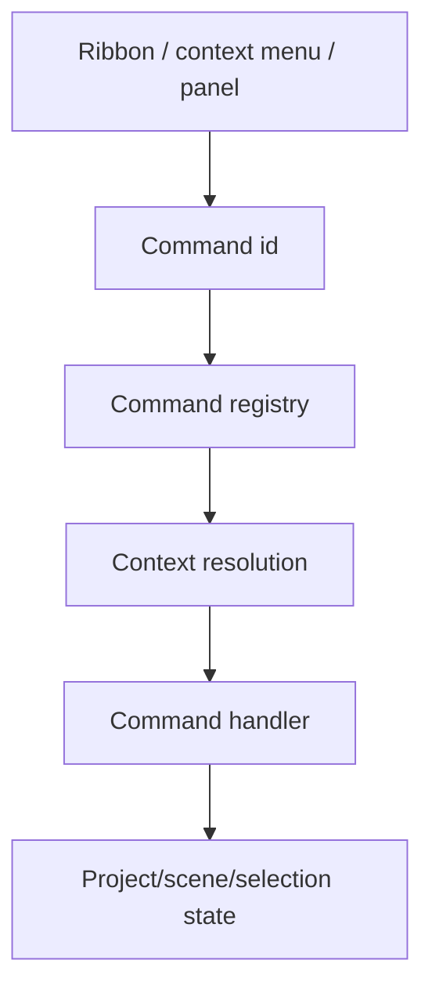

# SCADA Builder V2 - Menus And Surfaces Contract

Date: 2026-06-16
Status: Active editor menu and surface contract
Document version: `V2.1.2.0002`

## Historique des changements

| Date | Version | Commit | Changement |
| --- | --- | --- | --- |
| 2026-06-16 | `V2.1.2.0002` | `PENDING` | Ajout du contrat menu pour `object.group` et avertissement de conversion avant groupement legacy. |
| 2026-06-16 | `V2.1.2.0000` | `PENDING` | Ajout du contrat du choix contextuel Propriete et des commandes desactivees avec raison visible au survol. |
| 2026-06-16 | `V2.1.1.0039` | `PENDING` | Creation du contrat menus/surfaces separe des commandes et de l'UI generale. |

## 1. Contract

Menus and surfaces expose commands. They do not own business behavior.

Surfaces include:

1. Ribbon.
2. Context menus.
3. Left tool panel.
4. Right property panel.
5. Status bar diagnostics.
6. WebView bridge menus.
7. Studio Element+ ribbon and structure surfaces.

## 2. Menu Flow

## 3. Rules

1. A menu item must map to a command id or documented UI-only diagnostic action.
2. Context menus must preserve current selection before invoking selection-sensitive commands.
3. Menu labels may change for UX, but command ids remain stable.
4. Hidden or disabled menu behavior must match command enablement.
5. Disabled context-menu entries remain visible when they explain a blocked workflow; the disabled reason must be exposed as a hover warning or equivalent accessible hint.
6. The `Propriete` context-menu entry opens Element+ properties for converted objects and remains disabled for non-converted source objects with a conversion warning.
7. The Element+ context menu exposes `Grouper` only for multi-selection of modern scene objects.
8. The source/legacy context menu must not expose a destructive legacy frame-group workflow; when group intent is visible for source nodes, it must direct the user to convert to Element+ first.

## 4. Related Tests

`tests/ScadaBuilderV2.Tests/WebViewContextMenuScriptTests.cs`
