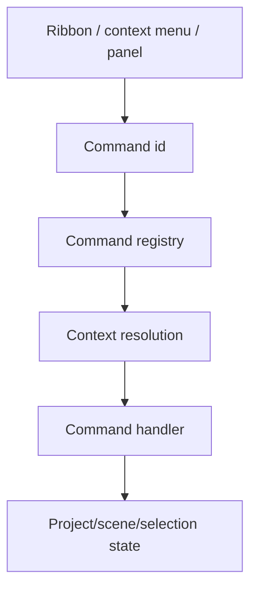

# SCADA Builder V2 - Menus And Surfaces Contract

Date: 2026-06-17
Status: Active editor menu and surface contract
Document version: `V2.1.2.0041`

## Historique des changements

| Date | Version | Commit | Changement |
| --- | --- | --- | --- |
| 2026-06-19 | `V2.1.2.0041` | `88a3e8b` | Le ruban WPF adapte le catalogue applicatif de commandes au lieu de posseder la liste canonique. |
| 2026-06-19 | `V2.1.2.0040` | `335adfb` | Le ruban superieur est maintenant rendu depuis un registre de commandes actif. |
| 2026-06-19 | `V2.1.2.0039` | `e5f8a82` | Ajout du contrat de ruban superieur groupe et icone pour les surfaces de commande. |
| 2026-06-17 | `V2.1.2.0013` | `PENDING` | Ajout du contrat de surface pour le panneau `Catalogue Tags` filtre. |
| 2026-06-16 | `V2.1.2.0003` | `PENDING` | Ajout de la hierarchie parent/enfant dans l'onglet Element pour les groupes Element+. |
| 2026-06-16 | `V2.1.2.0002` | `PENDING` | Ajout du contrat menu pour `object.group` et avertissement de conversion avant groupement legacy. |
| 2026-06-16 | `V2.1.2.0000` | `PENDING` | Ajout du contrat du choix contextuel Propriete et des commandes desactivees avec raison visible au survol. |
| 2026-06-16 | `V2.1.1.0039` | `PENDING` | Creation du contrat menus/surfaces separe des commandes et de l'UI generale. |

## 1. Contract

Menus and surfaces expose commands. They do not own business behavior.

Surfaces include:

1. Ribbon.
2. Context menus.
3. Left tool panel.
4. Right property panel.
5. Status bar diagnostics.
6. WebView bridge menus.
7. Studio Element+ ribbon and structure surfaces.
8. Project tag catalog panel.

## 2. Menu Flow

## 3. Rules

1. A menu item must map to a command id or documented UI-only diagnostic action.
2. Context menus must preserve current selection before invoking selection-sensitive commands.
3. Menu labels may change for UX, but command ids remain stable.
4. Hidden or disabled menu behavior must match command enablement.
5. Disabled context-menu entries remain visible when they explain a blocked workflow; the disabled reason must be exposed as a hover warning or equivalent accessible hint.
6. The `Propriete` context-menu entry opens Element+ properties for converted objects and remains disabled for non-converted source objects with a conversion warning.
7. The Element+ context menu exposes `Grouper` only for multi-selection of modern scene objects.
8. The source/legacy context menu must not expose a destructive legacy frame-group workflow; when group intent is visible for source nodes, it must direct the user to convert to Element+ first.
9. The Element tab must preserve Element+ group hierarchy by displaying group children as child rows rather than independent flat siblings.
10. The `Catalogue Tags` panel is a read-oriented project catalog surface. It lists imported tags with id, name, datatype, device, address, access, and state.
11. The `Catalogue Tags` panel must expose filters for text search, device, datatype, access, and state. These filters affect the displayed list only and must not mutate `ScadaProject.TagCatalog`.
12. The `Catalogue Tags` panel must show a filtered summary so users can distinguish the visible filtered subset from the full imported catalog.
13. The top ribbon must expose an active tab state and group commands by user task family rather than by implementation detail.
14. A visible ribbon command must have a stable label, tooltip, command route or documented disabled reason, and semantic icon key.
15. Disabled future commands may remain visible only when they communicate roadmap intent or preserve a familiar command location; they must not look executable.
16. Long command families must use scrolling, wrapping, galleries, or grouped overflow so buttons are not clipped at the application minimum width.
17. Insert-ribbon commands must use normalized vector icon keys. Temporary text glyphs are not valid command-surface icons.
18. The top ribbon renderer consumes the active command registry for the selected tab. Static XAML button duplication is a migration fallback only and must not be the source of truth for new ribbon commands.
19. The top ribbon command list is defined in `ScadaBuilderV2.Application.Commands.RibbonCommandCatalog`; the WPF shell is responsible only for resource lookup, visual templates, and dispatch adaptation.

## 4. Related Tests

`tests/ScadaBuilderV2.Tests/WebViewContextMenuScriptTests.cs`

`tests/ScadaBuilderV2.Tests/StudioElementPlusContractTests.cs`
