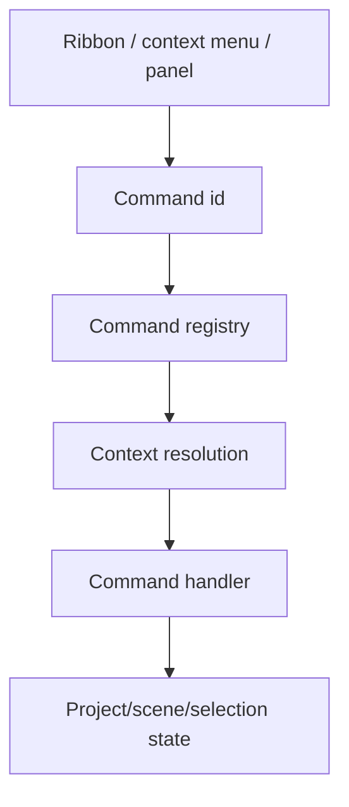

# SCADA Builder V2 - Menus And Surfaces Contract

Date: 2026-07-16
Status: Active editor menu and surface contract
Document version: `V2.1.5.0034`

## Historique des changements

| Date | Version | Commit | Changement |
| --- | --- | --- | --- |
| 2026-08-24 | `V2.1.5.0034` | `4202a70` | Dialogue de collage refuse : liste objet/propriete/reference/motif et deux issues seulement, `Annuler` ou `Coller sans liaisons`. |
| 2026-08-23 | `V2.1.5.0030` | `6c55fdb` | Banc d'essai Fenetre rapide : valeurs et titre temporaires, ouverture d'une instance d'apercu editor-only et fermeture explicite. |
| 2026-08-23 | `V2.1.5.0029` | `012135d` | Onglet conditionnel `Liaisons` du dialogue Proprietes : grille typee nom/famille/type/source/valeur/statut, selecteurs contextuels et banniere `Outdated`. |
| 2026-08-23 | `V2.1.5.0028` | `2fd6c72` | Panneau `Interface locale` : substitution du `Catalogue Tags` dans le contexte Fenêtre rapide, tableau unique groupé public/privé, filtres par famille, statut de liaison et compteurs d'usages. |
| 2026-08-23 | `V2.1.5.0027` | `ec6e6f7` | Ajout de la surface Fenêtres rapides : groupe projet distinct, projection canvas editor-only non exportable, lecture seule gardée et bandeau de contexte actif. |
| 2026-07-29 | `V2.1.5.0000` | `8fe1077` | Accueil projet, dialogue Nouveau, sélecteur `project.json`, récents et commandes de fermeture livrés. |
| 2026-07-16 | `V2.1.4.0042` | `9fd2a30` | `page.properties` ouvre et active maintenant la page selectionnee avant d'afficher le panneau Page afin de charger le bon snapshot de proprietes. |
| 2026-07-16 | `V2.1.4.0041` | `090d388` | Le groupe Input numerique est reduit a `Configurer <A1>` et partage une cible Tableau/cellule fraiche avec le panneau, le dialogue et le double-clic. |
| 2026-07-15 | `V2.1.4.0039` | `ce99ff9` | Le ruban contextuel Tableau expose le groupe Input numerique et route ses editions liees vers le controleur/dialogue dedies. |
| 2026-07-15 | `V2.1.4.0031` | `e127190` | Overflow du niveau 2 remplace par des chevrons sans barre native; hauteur reservee augmentee pour interdire le rognage vertical. |
| 2026-07-15 | `V2.1.4.0030` | `5d762bb` | Gestes Tableau rendus prioritaires en mode Cellules, reperes A/1 masquables, fusion contextuelle et coche de menu alignee a droite. |
| 2026-07-15 | `V2.1.4.0029` | `bbca8fa` | Niveau 2 du ruban densifie en commandes horizontales compactes sur deux rangees; galerie Formes et groupes visuels reduits. |
| 2026-07-15 | `V2.1.4.0028` | `c873744` | Entrée Tableau sans modale protégée; commande Verrou du ruban devenue toggle d'état et menu contextuel Element+ étendu à Verrouiller/Déverrouiller. |
| 2026-07-15 | `V2.1.4.0027` | `88e865a` | Ruban/panneau/menu Tableau complétés par distribution proportionnelle, marquage d'en-tête, reset de portée, dimensions exactes et état de format contextuel. |
| 2026-07-15 | `V2.1.4.0026` | `0874416` | Sous-surface Tableau contextuelle implementee dans le niveau 2 Inserer, creation configuree sans dialogue et modes Objet/Cellules exclusifs. |
| 2026-07-14 | `V2.1.4.0017` | `a94016a` | Niveau 1 du ruban Inserer compacte avec style independant afin de reserver la hauteur necessaire aux outils du niveau 2. |
| 2026-07-14 | `V2.1.4.0016` | `10cfa72` | Ruban Inserer hierarchique a huit familles et menu contextuel Tableau type tableur implementes depuis des catalogues dedies. |
| 2026-07-14 | `V2.1.4.0015` | `34dfc82` | Correction du clic droit Pages pour remonter correctement depuis un contenu WPF `Run` sans appeler `VisualTreeHelper` sur un objet non visuel. |
| 2026-07-14 | `V2.1.4.0014` | `fdcd11e` | Ajustement de l'icone Nouvelle page a 16x16 avec marge interne explicite pour eviter son rognage. |
| 2026-07-14 | `V2.1.4.0013` | `cc670c1` | Finition du panneau Pages : libelle Recherche, filtres initiaux Default/Tous et icone semantique partagee pour Nouvelle page. |
| 2026-07-14 | `V2.1.4.0012` | `50b2ad9` | Onglet Pages, actions rapides, menu contextuel, recherche/filtres et surfaces Diagnostics désormais implémentés. |
| 2026-07-14 | `V2.1.4.0011` | `4def659` | Ajout de la cible approuvée du ruban `Pages`, des actions rapides et du menu contextuel commun. |
| 2026-06-19 | `V2.1.3.0001` | `620e914` | Ajustement de la galerie Formes a des icones 32x32 sans libelles visibles. |
| 2026-06-19 | `V2.1.3.0000` | `b195fe0` | Ajout du contrat de galerie Formes 4 colonnes, icones 64x64, et etat actif d'insertion. |
| 2026-06-19 | `V2.1.2.0044` | `c50cbcf` | Extraction de la palette laterale d'outils vers la surface de commandes dynamique. |
| 2026-06-19 | `V2.1.2.0043` | `fde1b31` | Retrait du fallback XAML statique du ruban superieur. |
| 2026-06-19 | `V2.1.2.0042` | `0825cfe` | Les commandes `Grouper` et `Degrouper` du ruban Selection sont maintenant executees. |
| 2026-06-19 | `V2.1.2.0041` | `88a3e8b` | Le ruban WPF adapte le catalogue applicatif de commandes au lieu de posseder la liste canonique. |
| 2026-06-19 | `V2.1.2.0040` | `335adfb` | Le ruban superieur est maintenant rendu depuis un registre de commandes actif. |
| 2026-06-19 | `V2.1.2.0039` | `e5f8a82` | Ajout du contrat de ruban superieur groupe et icone pour les surfaces de commande. |
| 2026-06-17 | `V2.1.2.0013` | `4b01460` | Ajout du contrat de surface pour le panneau `Catalogue Tags` filtre. |
| 2026-06-16 | `V2.1.2.0003` | `940af93` | Ajout de la hierarchie parent/enfant dans l'onglet Element pour les groupes Element+. |
| 2026-06-16 | `V2.1.2.0002` | `2c5a0b4` | Ajout du contrat menu pour `object.group` et avertissement de conversion avant groupement legacy. |
| 2026-06-16 | `V2.1.2.0000` | `2c5a0b4` | Ajout du contrat du choix contextuel Propriete et des commandes desactivees avec raison visible au survol. |
| 2026-06-16 | `V2.1.1.0039` | `2c5a0b4` | Creation du contrat menus/surfaces separe des commandes et de l'UI generale. |

## Surface Fenêtres rapides

L’arborescence du projet possède un groupe `Fenêtres rapides` distinct, séparé des pages et de la bibliothèque Element+. Chaque entrée affiche son nom, son code, sa version d’interface, son nombre d’appelants et, le cas échéant, le nombre d’invocations `Outdated` à réparer.

Ouvrir une définition projette son `VisualContent` sur le canvas partagé au moyen d’une scène et d’une référence strictement editor-only : exclue du build, sans fichier durable, avec un code préfixé `qw-` qui ne peut entrer en collision avec une page. Cette projection n’est jamais ajoutée à `Project.Scenes`, donc aucun artefact d’éditeur ne peut atteindre un export.

Dans cette tranche, la projection est en lecture seule : tant qu’une Fenêtre rapide est affichée, le handler de messages du canvas est fermé, afin qu’aucune interaction ne puisse muter la dernière page active pendant que son contenu n’est pas celui affiché. L’édition du contenu appartient aux tranches d’authoring suivantes.

Un bandeau de contexte affiche en permanence le badge `Page` ou `Fenêtre rapide` et le titre de la surface active.

## Panneau Interface locale

Tant qu'une Fenêtre rapide est la surface active, le panneau `Catalogue Tags` du projet est masqué et remplacé par `Interface locale`. Le contenu d'une Fenêtre rapide ne référence jamais un tag physique du projet : les sélecteurs d'état, de commande, de liaison et d'expression consomment le catalogue de contexte, projeté depuis les membres de l'Interface locale de la définition ouverte. Cette projection est editor-only, reconstruite à chaque activation, jamais persistée ni exportée. Revenir sur une page restaure le catalogue de tags projet.

`Interface locale` est un tableau unique groupé en `Interface publique` et `Données privées`, filtrable par famille et par texte. Chaque ligne expose nom, famille, type, accès, requis, statut de liaison et compteur d'utilisations. Les propriétés courantes — nom, famille, type, accès, requis — sont modifiables directement dans le tableau; la famille impose l'accès et interdit `Requis` sur un membre privé. Les propriétés avancées — valeur par défaut et description — passent par le dialogue commun de membre, qui sert aussi la création.

Un port optionnel non lié est affiché en gris avec le statut `Non lié`; un port requis non lié est affiché en rouge. Chaque membre affiche son nombre d'utilisations et permet d'y naviguer; la page appelante est alors sélectionnée sans qu'aucune mutation ne soit produite. Supprimer un membre encore référencé exige une confirmation explicite qui liste les liaisons concernées; les invocations affectées deviennent `Outdated` et restent à réparer.

## Onglet Liaisons

L'onglet `Liaisons` du dialogue Proprietes Element+ n'apparait que lorsque la commande selectionnee est une commande `OpenQuickWindow` resolue vers une definition; toute autre commande le masque et vide sa grille.

La grille expose, pour chaque port public de la definition : nom, famille, type, source, valeur ou reference et statut. Chaque ligne choisit d'abord son type de source parmi `Tag`, `Litteral`, `Expression` ou `Port parent`, puis presente le selecteur contextuel correspondant; changer de source efface la valeur typee precedente. `Port parent` n'est propose que lorsque l'appelant vit dans le contenu d'une Fenetre rapide.

Un port optionnel non lie apparait en gris avec le statut `Non lie`, un port requis non lie apparait en rouge. Une invocation `Outdated` affiche une banniere rouge, marque en rouge ses ports a reparer et ses ports retires, et laisse build et export bloques jusqu'a reparation.

L'editeur n'ecrit jamais dans le workspace : il valide les liaisons contre le domaine et emet une demande d'enregistrement que le shell applique comme une transition unique annulable.

## Banc d'essai Fenetre rapide

Le banc d'essai est une surface editor-only. Il liste les ports publics de la definition active et permet de fournir, par port, un tag temporaire et une valeur temporaire, plus un titre d'instance temporaire. Ces donnees ne sont jamais persistees dans le modele, jamais validees comme liaisons durables et jamais exportees.

`Ouvrir l'apercu` materialise une instance sous la racine d'apercu de l'editeur et l'affiche dans le banc; `Fermer l'apercu` la retire. Chaque demande recoit une generation strictement monotone et son propre identifiant d'instance temporaire, de sorte qu'une hydratation obsolete soit rejetee de facon deterministe.

L'apercu presente le chrome minimal contractuel : backdrop partage, cadre `role="dialog"`, barre de titre et bouton `X`. `Escape` et `CloseQuickWindow(Self)` ferment la meme instance; un clic sur le backdrop ne ferme jamais.

## Frontiere presse-papier page / fenetre rapide

Le contenu d'une fenetre rapide ne reference jamais un tag physique du projet et une page ne reference jamais un membre d'Interface locale. Tout collage, duplication ou instanciation d'un composant de bibliotheque franchissant cette frontiere est analyse avant insertion.

Le refus est le comportement par defaut. Le dialogue de collage refuse liste chaque reference fautive avec son objet, sa propriete, la reference et le motif, et n'offre que deux issues : `Annuler` ou `Coller sans liaisons`. Aucun collage partiel silencieux n'est propose.

`Coller sans liaisons` retire chaque reference fautive et laisse la propriete `Non lie`. Rien n'est reecrit, remappe ni promu automatiquement en membre d'Interface locale, et le collage reste une transition unique annulable dans le contexte cible.

Sont egalement refuses : un port appartenant a une autre definition, une reference qui ne resout nulle part dans une fenetre rapide, une invocation dont la definition cible a disparu et une invocation deja possedee par un autre appelant, une invocation ne pouvant jamais etre partagee entre deux appelants.

## 1. Contract

Menus and surfaces expose commands. They do not own business behavior.

Surfaces include:

1. Ribbon.
2. Context menus.
3. Left tool panel.
4. Right property panel.
5. Status bar diagnostics.
6. WebView bridge menus.
7. Studio Element+ ribbon and structure surfaces.
8. Project tag catalog panel.

## 2. Menu Flow

```mermaid
flowchart TD
  Surface[Ribbon / context menu / panel] --> CommandId[Command id]
  CommandId --> Registry[Command registry]
  Registry --> Context[Context resolution]
  Context --> Handler[Command handler]
  Handler --> State[Project/scene/selection state]
```

## 3. Rules

1. A menu item must map to a command id or documented UI-only diagnostic action.
2. Context menus must preserve current selection before invoking selection-sensitive commands.
3. Menu labels may change for UX, but command ids remain stable.
4. Hidden or disabled menu behavior must match command enablement.
5. Disabled context-menu entries remain visible when they explain a blocked workflow; the disabled reason must be exposed as a hover warning or equivalent accessible hint.
6. The `Propriete` context-menu entry opens Element+ properties for converted objects and remains disabled for non-converted source objects with a conversion warning.
7. The Element+ context menu exposes `Grouper` only for multi-selection of modern scene objects.
8. The source/legacy context menu must not expose a destructive legacy frame-group workflow; when group intent is visible for source nodes, it must direct the user to convert to Element+ first.
9. The Element tab must preserve Element+ group hierarchy by displaying group children as child rows rather than independent flat siblings.
10. The `Catalogue Tags` panel is a read-oriented project catalog surface. It lists imported tags with id, name, datatype, device, address, access, and state.
11. The `Catalogue Tags` panel must expose filters for text search, device, datatype, access, and state. These filters affect the displayed list only and must not mutate `ScadaProject.TagCatalog`.
12. The `Catalogue Tags` panel must show a filtered summary so users can distinguish the visible filtered subset from the full imported catalog.
13. The top ribbon must expose an active tab state and group commands by user task family rather than by implementation detail.
14. A visible ribbon command must have a stable label, tooltip, command route or documented disabled reason, and semantic icon key.
15. Disabled future commands may remain visible only when they communicate roadmap intent or preserve a familiar command location; they must not look executable.
16. Long command families must use scrolling, wrapping, galleries, or grouped overflow so buttons are not clipped at the application minimum width.
17. Insert-ribbon commands must use normalized vector icon keys. Temporary text glyphs are not valid command-surface icons.
18. The top ribbon renderer consumes the active command registry for the selected tab. Static XAML button duplication is not allowed in the main shell ribbon.
19. The top ribbon command list is defined in `ScadaBuilderV2.Application.Commands.RibbonCommandCatalog`; the WPF shell is responsible only for resource lookup, visual templates, and dispatch adaptation.
20. The `Selection` ribbon may execute `Grouper` and `Degrouper` for Element+ objects. Legacy/source selections still use the existing conversion warning rather than a direct legacy grouping workflow.
21. The left tool panel palette consumes semantic command metadata from `RibbonCommandCatalog.CreateToolPalette()` and must not duplicate `Icon.Tool.*` resources directly in static XAML buttons.
22. The Insert ribbon `Formes` group must render as a shape gallery with at most four icons per row, 26x26 semantic shape icons, no visible shape-name labels inside the gallery buttons, and tooltip labels for discoverability.
23. Active insertion commands must show selected state until the placement completes or is cancelled. Starting another placement replaces the active command state.
24. `insert.shape.line` and `insert.shape.arrow` use a two-point placement surface: first click captures start, second click commits the Element+ object, and Escape cancels placement.
25. The Element+ context menu exposes `object.open-in-element-studio` ("Ouvrir dans Studio Element+") for a single selected converted object only when it was instantiated from a library `.sep` (tracked via `ScadaElementData.TagBinding`); otherwise it is visible but disabled with the reason "Cet objet n'a pas ete instancie depuis la bibliotheque Element+".
26. The first-level Insert family selector must use a compact style independent from second-level command buttons so the active tool groups remain fully visible inside the normalized ribbon height.
27. `Inserer > Donnees > Tableau` conserve le niveau 1 compact et remplace le niveau 2 par les groupes Creation, Mode, Selection, Contenu, Structure, Format, Dimensions et En-tetes; Retour Donnees restaure les outils generiques.
28. La configuration 1..64 du prochain Tableau est visible dans le ruban. Aucun dialogue modal n'est ouvert avant le clic canvas.
29. `object.lock` affiche `Verrouiller` lorsque toute cible n'est pas verrouillée et `Déverrouiller` uniquement lorsque toute la fermeture de sélection est verrouillée; le ruban Sélection et le menu contextuel partagent cet état.
30. L'indicateur supérieur immédiatement à gauche de `SCADA Builder V2` distingue aucune sélection, déverrouillé, verrouillé et mixte, tout en conservant le même point de commande.
31. Les groupes de commandes du niveau 2 utilisent deux rangees compactes, des boutons horizontaux de 28 px et des icones de 16 px; les libelles trop longs sont tronques visuellement mais restent disponibles en entier dans leur info-bulle.
32. En mode Tableau Cellules, les cellules, inputs, poignees de pistes, double-clic et menu contextuel possedent les gestes avant le drag Element+; `Masquer A/1` retire les reperes d'edition sans masquer les poignees de largeur/hauteur.
33. Le groupe contextuel `Input numerique` est actif seulement pour une cellule ancre `InputNumeric` appartenant au Tableau courant. Il expose uniquement `table.numeric.properties`, libelle `Configurer <A1>`; Lire et Ecrire restent des sections de son dialogue unique et ne sont plus des commandes visibles. Le ruban, le panneau et le dialogue partagent le meme id Tableau/adresse A1, et le double-clic ouvre la cellule emettrice validee sans ajouter de logique de mutation dans `MainWindow`.
33. La coche d'une commande contextuelle active est placee apres son libelle afin de conserver l'alignement gauche commun des commandes.
34. Le niveau 2 n'affiche aucune barre de defilement native. Lorsque sa largeur depasse la surface disponible, deux chevrons paginent horizontalement les groupes; la hauteur reservee doit conserver les deux rangees entierement visibles.

## 4. Implemented Pages Surfaces

The approved `DEC-0038` target adds a top-ribbon tab named `Pages`, quick actions in `Projet > Pages`, and a page context menu. All three surfaces use the same `page.*` command ids, enablement, disabled reasons, results, confirmations, history, and diagnostics.

The project panel is sourced from modern `ScadaProject.Scenes`, exposes a labelled search field plus type/build filters, and never displays `PageKey`. The initial filters are `Default` for page type and `Tous` for build inclusion. The quick-create button reuses the same semantic `Icon.Page.New` resource as the ribbon. Right-click alone selects without opening and safely handles inline WPF content such as `Run`; double-click, Enter or `page.open` performs explicit activation. Invoking `page.properties` also opens and activates the selected page before the Page panel is shown, so its reference and scene snapshot are coherent and all edits target the displayed page. F2, Ctrl+D and Delete are scoped to the Pages list. The bottom Diagnostics panel and modern blocking dialog consume one structured issue collection and navigate internally by key while showing only the human page code.

## 5. Related Tests

`tests/ScadaBuilderV2.Tests/WebViewContextMenuScriptTests.cs`

`tests/ScadaBuilderV2.Tests/StudioElementPlusContractTests.cs`

`tests/ScadaBuilderV2.Tests/PageManagementSurfaceContractTests.cs`

`tests/ScadaBuilderV2.Tests/DiagnosticsSurfaceContractTests.cs`
