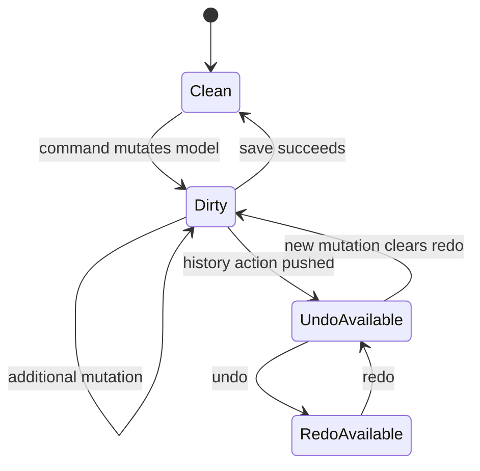

# SCADA Builder V2 - State Management Contract

Date: 2026-07-14
Status: Active editor state contract
Document version: `V2.1.4.0026`

## Historique des changements

| Date | Version | Commit | Changement |
| --- | --- | --- | --- |
| 2026-07-15 | `V2.1.4.0026` | `0874416` | Ajout de `IsLocked` persistant, de l'agregation de multiselection, du guard de translation et de la session d'authoring Tableau hors modele de scene. |
| 2026-07-14 | `V2.1.4.0012` | `PENDING` | Historique projet, restauration des onglets et snapshot atomique projet/scènes désormais implémentés. |
| 2026-07-14 | `V2.1.4.0011` | `4def659` | Ajout de la cible approuvée pour dirty state, historique et persistance au niveau workspace projet. |
| 2026-06-16 | `V2.1.1.0039` | `PENDING` | Creation du contrat etat separe des commandes, actions et menus. |

## 1. Contract

State ownership must be explicit. Durable behavior belongs to project/scene/application state, not WebView DOM state or visual UI flags.

## 2. State Owners

1. Project state: project identity, scene list, home page, build inclusion, dirty state.
2. Scene state: canvas, elements, page metadata, actions, removed source ids.
3. Selection state: selected source ids and selected scene object ids.
4. Panel state: visible context and layout preferences.
5. History state: undo/redo stacks per active scene context.
6. Element lock state: `ScadaElement.IsLocked`; les toggles UI projettent l'agregation de la fermeture selection/groupe sans posseder un etat durable distinct.
7. Table authoring session: surface, mode, configuration de creation, plage et portee; elle ne transporte aucun `ScadaElement` et ne remplace jamais la definition persistante du Tableau.

## 3. State Diagram

## 4. Implemented Project Workspace State

`DEC-0038` moves the polymorphic undo/redo stack to the project workspace. Scene actions keep scene scope; page lifecycle actions use project scope and survive tab closure or deletion. Undo/redo mutates the in-memory workspace and marks it dirty; only Save persists a coherent project/scenes snapshot.

`PageWorkspaceSnapshot` includes the project, scenes, active/selected page, open tabs, dirty state, and pending file deletions. `ProjectWorkspaceSnapshotAction` restores this state even after an onglet closes or a page is removed. `ModernProjectStore.SaveWorkspaceSnapshotAsync` stages and commits project/scenes as one recoverable transaction; `SaveSceneAsync` no longer upserts the authoritative page inventory.

## 5. Related Decisions

1. `DEC-0006` - Polymorphic Selection And Durable Source Delete.
2. `DEC-0038` - Modern Page Identity And Lifecycle Commands.

## 6. Related Tests

1. `tests/ScadaBuilderV2.Tests/EditorHistoryServiceTests.cs`
2. `tests/ScadaBuilderV2.Tests/ModernProjectStoreTests.cs`
3. `tests/ScadaBuilderV2.Tests/ProjectWorkspaceHistoryTests.cs`
4. `tests/ScadaBuilderV2.Tests/ModernProjectAtomicSnapshotTests.cs`
