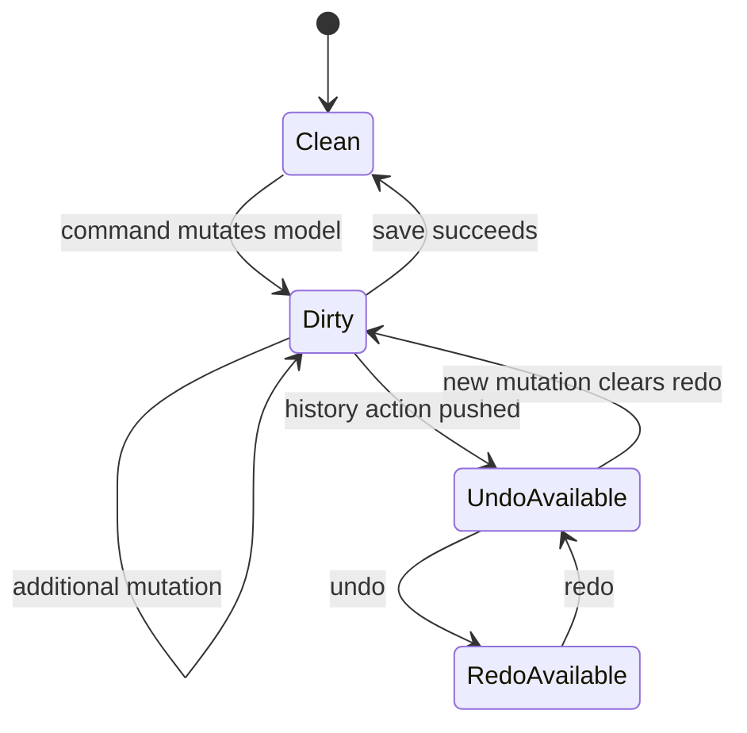

# SCADA Builder V2 - State Management Contract

Date: 2026-06-16
Status: Active editor state contract
Document version: `V2.1.1.0039`

## Historique des changements

| Date | Version | Commit | Changement |
| --- | --- | --- | --- |
| 2026-06-16 | `V2.1.1.0039` | `PENDING` | Creation du contrat etat separe des commandes, actions et menus. |

## 1. Contract

State ownership must be explicit. Durable behavior belongs to project/scene/application state, not WebView DOM state or visual UI flags.

## 2. State Owners

1. Project state: project identity, scene list, home page, build inclusion, dirty state.
2. Scene state: canvas, elements, page metadata, actions, removed source ids.
3. Selection state: selected source ids and selected scene object ids.
4. Panel state: visible context and layout preferences.
5. History state: undo/redo stacks per active scene context.

## 3. State Diagram

## 4. Related Decisions

1. `DEC-0006` - Polymorphic Selection And Durable Source Delete.

## 5. Related Tests

1. `tests/ScadaBuilderV2.Tests/EditorHistoryServiceTests.cs`
2. `tests/ScadaBuilderV2.Tests/ModernProjectStoreTests.cs`
