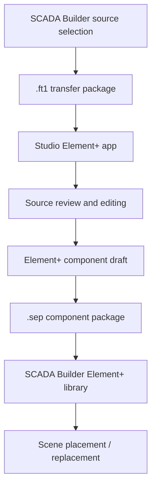

# SCADA Builder V2 - Studio Element+ Architecture

Date: 2026-06-16
Status: Active Studio Element+ architecture contract
Document version: `V2.1.1.0039`

## Historique des changements

| Date | Version | Commit | Changement |
| --- | --- | --- | --- |
| 2026-06-16 | `V2.1.1.0039` | `PENDING` | Creation du contrat d'architecture Studio Element+. |

## 1. Contract

Studio Element+ is a separate application for authoring reusable Element+ components from selected source material.

Opening Studio Element+ is not the same as converting legacy source in-place. SCADA Builder V2 must preserve the source view until the user explicitly replaces source material with a published component.

## 2. Flow

## 3. Rules

1. `.ft1` is transfer input.
2. `.sep` is editable component source.
3. Studio owns component authoring state.
4. SCADA Builder owns scene placement and FT100 context.
5. Workzone, zoom, pan, selection overlays, handles, and diagnostics are not component geometry.

## 4. Selection Reference

Selection decisions are governed by `docs/05_studio_element_plus/STUDIO_ELEMENT_PLUS_SELECTION_CONTRACT_V2.md`.

Studio Element+ selection work must preserve the canonical modifier contract: `Shift + clic` adds to the current selection and `Alt + clic` removes from the current selection.
