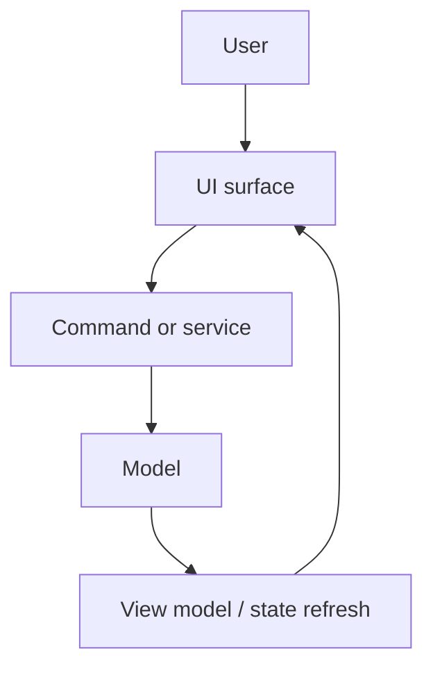

# SCADA Builder V2 - UI Architecture

Date: 2026-07-05
Status: Active UI architecture contract
Document version: `V2.1.4.0016`

## Historique des changements

| Date | Version | Commit | Changement |
| --- | --- | --- | --- |
| 2026-07-14 | `V2.1.4.0016` | `10cfa72` | Ajout du ruban Inserer famille/outils et des surfaces Tableau dediees (panneau, dialogues, WebView, menu type tableur). |
| 2026-07-05 | `V2.1.4.0000` | `PENDING` | Description du modele de docking AvalonDock pour les panneaux lateraux. |
| 2026-06-16 | `V2.1.1.0039` | `PENDING` | Creation du contrat d'architecture UI. |

## 1. Contract

The UI collects user intent, displays state, and routes actions through commands or application services. It must not own project behavior.

Le ruban Inserer rend un premier niveau de huit familles et un second niveau d'outils issu du catalogue Application. La famille active reste stable pendant la session. L'editeur Tableau utilise `TableEditorController`, `TableWebViewScript` et des dialogues dedies; les regles de grille ne sont pas codees dans le shell.

## 2. Shell Surfaces

1. Top ribbon.
2. Left tool/project panel (AvalonDock anchorable panes: `Outil`, `Projet`, `Catalogue Tags`; draggable, floatable, closable/reopenable, layout persisted per user).
3. Central workspace and WebView2 preview.
4. Right property/context panel (AvalonDock anchorable panes: `Page`, `Element`, `Propriete`, `Librairie`; same docking behavior as the left panel).
5. Bottom status and diagnostics.
6. Context menus.

## 3. Flow

