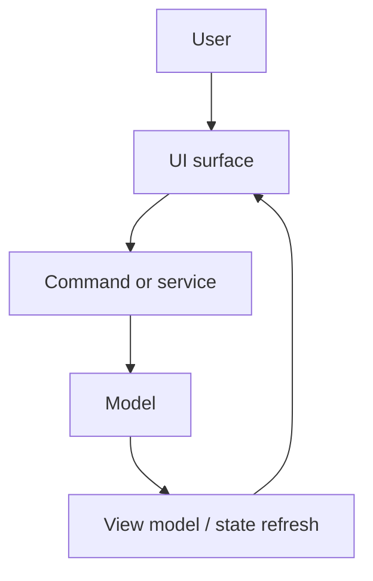

# SCADA Builder V2 - UI Architecture

Date: 2026-07-05
Status: Active UI architecture contract
Document version: `V2.1.6.0027`

## Historique des changements

| Date | Version | Commit | Changement |
| --- | --- | --- | --- |
| 2026-09-24 | `V2.1.6.0027` | `PENDING` | Tour 1 de revue du voile de chargement. **Correction d'une affirmation fausse de la ligne `V2.1.6.0026` ci-dessous, amendée en conséquence :** le `finally` ne suffisait pas à sortir le voile avant la boîte d'erreur, puisque `catch` s'exécute *avant* `finally` — la boîte modale s'affichait donc devant l'anneau encore en rotation. Chaque `catch` baisse désormais le voile lui-même, de façon idempotente, le `finally` restant la garantie. Le gel couvre maintenant aussi le clavier (`PreviewKeyDown` sur la fenêtre, `CanExecute` sur Annuler/Rétablir) : un bouton d'accueil ayant le focus se redéclenchait sur Entrée et `Ctrl+Z` atteignait l'éditeur, soit deux actions à la fois. Les quatre dialogues posés à l'intérieur d'un geste suspendent le voile, et non plus deux : s'ajoutent la création de projet et les modifications non enregistrées. Aucun message d'échec n'est plus affiché sous le voile. `Suspend()` ne fuit plus si le rendu lève, les compteurs sont verrouillés et le rendu est renvoyé sur le dispatcher. |
| 2026-09-24 | `V2.1.6.0026` | `PENDING` | Ajout du voile de chargement des gestes projet : une surface de shell qui couvre toute la fenêtre, affiche un anneau animé en XAML pur, le libellé du geste et le nom du projet quand il est connu, et intercepte les clics. L'occupation est comptée (`BusyOverlayController`), jamais booléenne, et le voile se retire le temps des questions posées à l'intérieur d'un geste. |
| 2026-07-29 | `V2.1.5.0000` | `8fe1077` | Le shell démarre vide et projette une session préparée par Application; WPF conserve seulement dialogues et rendu. |
| 2026-07-15 | `V2.1.4.0027` | `88e865a` | Ajout des view models Tableau dédiés, diagnostics de bridge, inspecteur d'état, color pickers, distribution/en-têtes et auto-fit proportionnel mesuré en lot. |
| 2026-07-15 | `V2.1.4.0026` | `0874416` | Ajout de `TableAuthoringSession`, du ruban Tableau contextuel, du bridge type, des headers editor-only et du view model de verrouillage partage. |
| 2026-07-14 | `V2.1.4.0016` | `10cfa72` | Ajout du ruban Inserer famille/outils et des surfaces Tableau dediees (panneau, dialogues, WebView, menu type tableur). |
| 2026-07-05 | `V2.1.4.0000` | `a535cf2` | Description du modele de docking AvalonDock pour les panneaux lateraux. |
| 2026-06-16 | `V2.1.1.0039` | `2c5a0b4` | Creation du contrat d'architecture UI. |

## 1. Contract

The UI collects user intent, displays state, and routes actions through commands or application services. It must not own project behavior.

Sans session active, le document Canvas affiche l’accueil Nouveau/Ouvrir/Rouvrir et la liste des récents. Le dialogue de création propose Documents comme parent initial, affiche le chemin final et collecte la première page et le canevas.

Tout geste projet passe par une frontière unique qui lève un voile au-dessus de la fenêtre entière : l’opérateur voit ce qui tourne et ne peut pas déclencher une seconde action pendant ce temps. Le voile est levé dans le `try` de la frontière et le `finally` garantit qu’il redescend, donc un geste qui échoue ne laisse jamais la fenêtre voilée et inerte.

Le `finally` ne suffit pas à lui seul : `catch` s’exécute *avant* lui, et une boîte d’erreur modale levée depuis un `catch` resterait affichée devant un anneau encore en rotation jusqu’à ce que l’opérateur la ferme. Chaque `catch` baisse donc le voile avant de présenter quoi que ce soit; la descente est idempotente, de sorte que les deux chemins ne peuvent pas dépiler deux fois le même geste. Aucun message d’échec n’est jamais affiché sous le voile : ceux qui proviennent de l’intérieur d’un geste encore en cours le suspendent au lieu de le baisser.

L’occupation et la suspension sont deux compteurs, jamais des booléens : un geste peut en imbriquer un autre, et une question posée au milieu d’un geste — sélecteur de fichiers, création de projet, modifications non enregistrées, consentement de conversion — retire le voile puis le rend.

Le gel couvre le pointeur *et* le clavier. Le voile intercepte le pointeur parce qu’il est testé au survol, mais le clavier ne passe pas par le test de survol : un bouton d’accueil ayant déjà le focus se redéclenche sur Entrée ou Espace, et `Ctrl+Z` / `Ctrl+Y` atteignent l’éditeur par les `InputBindings` de la fenêtre. La fenêtre marque donc tout `PreviewKeyDown` comme traité tant que le voile est levé, et les deux commandes d’historique refusent de s’exécuter pendant ce temps. Aucune commande n’est grisée pour autant; le voile reste le seul mécanisme de gel visible.

Le ruban Inserer rend un premier niveau de huit familles et un second niveau d'outils issu du catalogue Application. La famille active reste stable pendant la session. L'editeur Tableau utilise `TableEditorController`, `TableWebViewScript` et des dialogues dedies; les regles de grille ne sont pas codees dans le shell.

Le mode Objet laisse les gestes au wrapper Element+; le mode Cellules donne la priorité à la grille, aux headers et aux séparateurs. Le script utilise délégation d'événements et `DocumentFragment` pour borner le coût d'un tableau 64 x 64. L'auto-fit mesure valeur/placeholder, arrondit au demi-pixel et distribue le déficit des cellules fusionnées proportionnellement aux pistes couvertes. Les messages Tableau sont validés par `TableWebViewMessageAdapter` avant coordination; un message invalide est diagnostiqué sans mutation.

## 2. Shell Surfaces

1. Top ribbon.
2. Left tool/project panel (AvalonDock anchorable panes: `Outil`, `Projet`, `Catalogue Tags`; draggable, floatable, closable/reopenable, layout persisted per user).
3. Central workspace and WebView2 preview.
4. Right property/context panel (AvalonDock anchorable panes: `Page`, `Element`, `Propriete`, `Librairie`; same docking behavior as the left panel).
5. Bottom status and diagnostics.
6. Context menus.
7. Project busy veil (`ProjectBusyOverlay`), above every other surface, hit-testable, collapsed unless a project gesture is running.

## 3. Flow

```mermaid
flowchart TD
  User[User] --> Surface[UI surface]
  Surface --> Command[Command or service]
  Command --> Model[Model]
  Model --> ViewModel[View model / state refresh]
  ViewModel --> Surface
```
