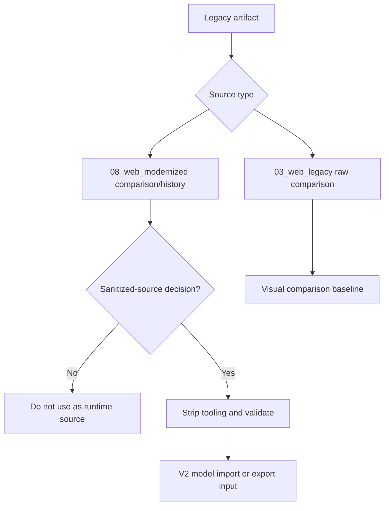

# SCADA Builder V2 - Legacy Source Policy

Date: 2026-06-16
Status: Active legacy source policy
Document version: `V2.1.1.0039`

## Historique des changements

| Date | Version | Commit | Changement |
| --- | --- | --- | --- |
| 2026-06-16 | `V2.1.1.0039` | `PENDING` | Creation de la politique active des sources legacy et sanitized-source. |

## 1. Contract

Legacy artifacts are evidence and migration inputs, not the final V2 source of truth.

## 2. Source Priority

1. `03_web_legacy/html_pages/*` is preferred for raw visual comparison.
2. `08_web_modernized/*` is comparison/history material by default.
3. `08_web_modernized/*` must not be used as runtime source without an explicit sanitized-source decision.
4. Helper scripts, layout tools, test panels, diagnostics, and repaired/manual positions must be stripped or rejected before runtime/export use.
5. `win00009` is known-good for current comparison.
6. `win00008` is a known divergence/regression candidate.

## 3. Decision

This policy is governed by `DEC-0005`.

## 4. Validation Flow

