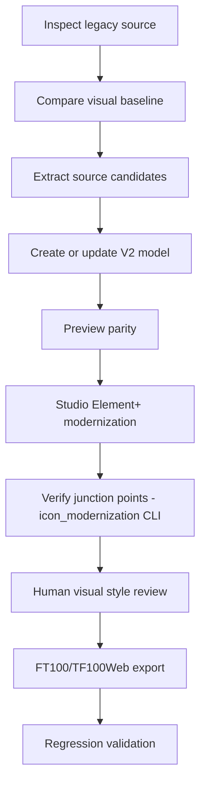

# SCADA Builder V2 - Modernization Workflow

Date: 2026-07-05
Status: Active modernization workflow
Document version: `V2.1.3.0005`

## Historique des changements

| Date | Version | Commit | Changement |
| --- | --- | --- | --- |
| 2026-07-05 | `V2.1.3.0005` | `PENDING` | Ajout de la regle de decomposition par besoin d'evenement (section 5): tout morceau destine a recevoir un etat/evenement runtime independant doit etre son propre composant `.sep`, jamais une `Part` embarquee, puisque `ScadaElement.Events` est attache a l'objet de scene entier. Condenseur.sep reduit a Panel+HeaderRect; Triangle.sep et VentilateurPale.sep extraits comme composants autonomes. |
| 2026-07-05 | `V2.1.3.0004` | `PENDING` | Ajout de l'etape obligatoire de sauvegarde `.sep.bak` avant toute modification en place d'un composant existant (retex apres modernisation de `Ventilateur.sep`). |
| 2026-07-05 | `V2.1.3.0003` | `PENDING` | Remplacement du stub par le workflow actif de modernisation visuelle interactive (DEC-0033), en reponse a l'echec du pipeline autonome `sep-ai-modernizer`. |
| 2026-06-16 | `V2.1.1.0039` | `PENDING` | Creation du nouveau document proprietaire du workflow de modernisation legacy. |

## 1. Workflow

## 2. Studio Element+ Modernization (Icon Artwork)

Producing modern artwork for a `.sep` component is an **interactive,
session-by-session** process, not an autonomous pipeline. `sep-ai-modernizer`
(a separate autonomous AI pipeline repository) was built and fully
implemented but produced icons that were geometrically unreliable (see
DEC-0033) and stylistically inconsistent with an industrial SCADA interface.
It is not part of this workflow.

Steps:

1. Create or identify the `.sep` in the SCADA Builder V2 / Element Studio
   editor, as already supported by the existing Legacy -> Element+
   conversion. This step is unchanged and already fixes the component's
   `Bounds`.
1a. Before editing an existing `.sep` in place, copy it to `<name>.sep.bak`
   in the same `library/elements/` folder. The `.bak` extension is not a
   valid component the editor loads, so it never appears in the library
   picker - it exists solely so the pre-modernization file can be restored
   by a plain file copy if the modernization attempt needs to be discarded,
   without relying on git history. Never skip this step, even for a "quick"
   edit.
2. In an interactive Claude Code session, provide the `.sep` and its legacy
   source geometry. The candidate artwork must:
   - follow `docs/07_legacy_migration/SCADA_2026_ICON_STYLE_GUIDE_V2.md`,
   - be authored as native inline SVG primitives (`<path>`, `<line>`,
     `<rect>`, `<polyline>`, `<polygon>`, `<circle>`, `<ellipse>`) - never a
     raster or SVG image re-encoded and embedded inside an `<image>` tag,
   - preserve the original's junction points (see section 3).
3. Verify junction points with `tools/icon_modernization` (see
   `tools/icon_modernization/README.md`) before requesting human review.
4. A human visually reviews the candidate against the style guide and
   against already-approved icons, then approves or requests changes.
5. The approved `.sep` replaces the previous one in the project's element
   library (`projects/<project-id>/library/elements/*.sep`), reusable by
   every scene referencing that component.

## 3. Junction Point Contract

A junction point is a location where an icon's outline touches its own
bounding-box edge (for example, where a pipe segment's drawn line reaches
the edge of its SVG viewport to visually connect with a neighboring valve or
tank rendered as a separate `.sep`). Preserving the component's `Bounds`
alone is not sufficient: `win00008_updated.html`'s piping icons kept correct
`left/top/width/height` placement after AI regeneration but no longer
touched their bounding-box edges at the same relative position, breaking the
visual connection to neighboring pieces.

`tools/icon_modernization` computes junction points automatically from
vector geometry (not visual inspection) and enforces a **2 pixel** tolerance
between the legacy original and the modernized candidate, on the same edge.
See `tools/icon_modernization/README.md` for the supported SVG subset and
CLI usage.

## 4. Migration Note

Detailed historical content is archived in
`docs/09_archive/deprecated/LEGACY_MODERNIZATION_WORKFLOW_V2.md`.

## 5. Decomposition By Event Need

`ScadaElement.Events` (runtime event bindings) are attached to a scene
object as a whole, not to an individual `Part` embedded inside one `.sep`'s
`Visual`/`Parts`. A sub-shape bundled as a `Part` of a larger component can
never receive its own independent runtime state - only the whole component
instance can.

Before finishing a modernization pass, identify every sub-piece that will
need independent runtime state or events (matching the legacy behavior,
e.g. `win00008_updated.html`'s `Condenser` class already treats its module
and its two fans as 3 separate DOM elements with independently swappable
state). Each such piece must be its own `.sep` component, placed as its own
`ScadaElement` instance in the scene - never left as an embedded `Part`.

Example: `Condenseur.sep` was first modernized as one 5-part component
(panel, triangle, header, 2 fans). Once it was clear the triangle and the
two fans each need independent state, they were split into their own
components - `Triangle.sep` and `VentilateurPale.sep` (the latter placed
twice, once per fan) - leaving `Condenseur.sep` as just the static frame
(panel + header bevel). Getting this decomposition right the first time
avoids re-splitting an already-approved component later; when in doubt,
split rather than embed.
