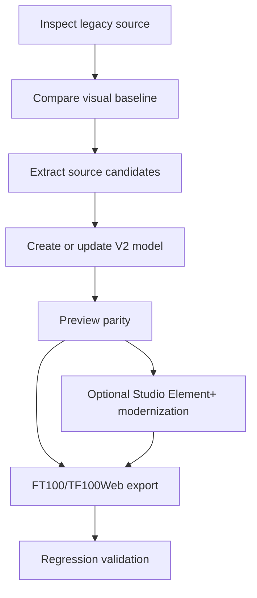

# SCADA Builder V2 - Modernization Workflow

Date: 2026-06-16
Status: Active modernization workflow pointer
Document version: `V2.1.1.0039`

## Historique des changements

| Date | Version | Commit | Changement |
| --- | --- | --- | --- |
| 2026-06-16 | `V2.1.1.0039` | `PENDING` | Creation du nouveau document proprietaire du workflow de modernisation legacy. |

## 1. Workflow

## 2. Migration Note

Detailed historical content is archived in `docs/09_archive/deprecated/LEGACY_MODERNIZATION_WORKFLOW_V2.md`.
