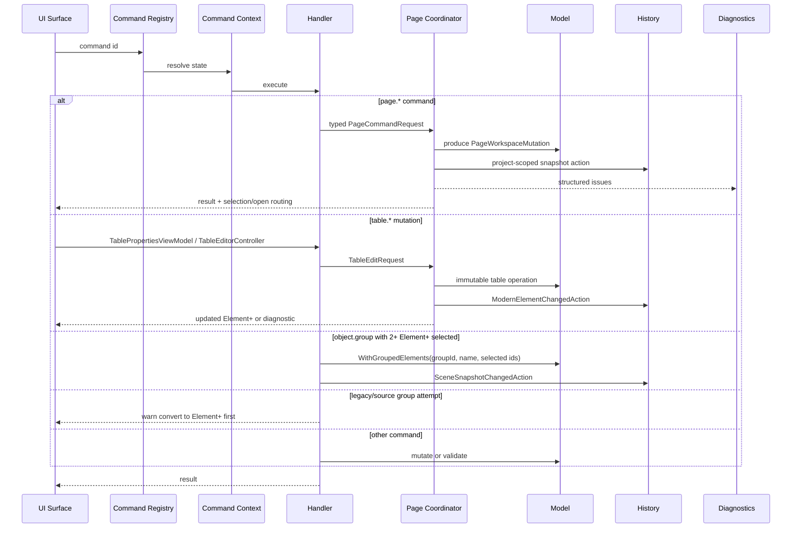

# SCADA Builder V2 - Command Flow Diagram

Date: 2026-07-14
Status: Generated baseline with implemented page and Table command flows
Document version: `V2.1.4.0027`

## Historique des changements

| Date | Version | Commit | Changement |
| --- | --- | --- | --- |
| 2026-07-15 | `V2.1.4.0027` | `88e865a` | Ajout du flux Tableau par view model, requête typée, coordinateur, Domain et historique. |
| 2026-07-14 | `V2.1.2.0003` | `PENDING` | Ajout du flux asynchrone partagé des commandes de page et des diagnostics. |
| 2026-06-16 | `V2.1.2.0002` | `PENDING` | Ajout du flux de groupement Element+ only et avertissement legacy. |
| 2026-06-16 | `V2.1.1.0039` | `PENDING` | Creation du diagramme de flow commandes. |

