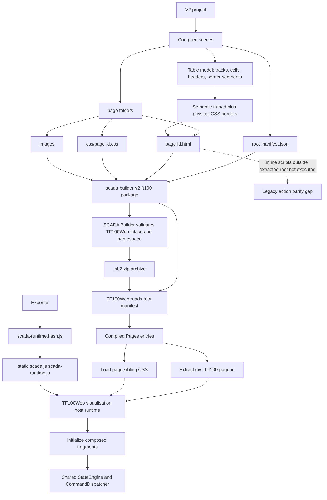

# SCADA Builder V2 - Export Flow Diagram

Date: 2026-07-16
Status: Generated baseline
Document version: `V2.1.4.0043`

## Historique des changements

| Date | Version | Commit | Changement |
| --- | --- | --- | --- |
| 2026-07-16 | `V2.1.4.0043` | `8489dbd` | Ajout du deploiement du runtime package partage et de l'initialisation Etat/Commande sur les fragments TF100Web. |
| 2026-07-15 | `V2.1.4.0027` | `88e865a` | Ajout du chemin Tableau model-backed vers HTML sémantique partagé preview/`.sb2`. |
| 2026-06-17 | `V2.1.2.0019` | `bd6515e` | Ajout de l'archive `.sb2` apres validation de staging. |
| 2026-06-17 | `V2.1.2.0018` | `ad364a6` | Ajout du chemin d'intake fragment TF100Web audite. |
| 2026-06-16 | `V2.1.1.0039` | `PENDING` | Creation du diagramme de flow export. |

