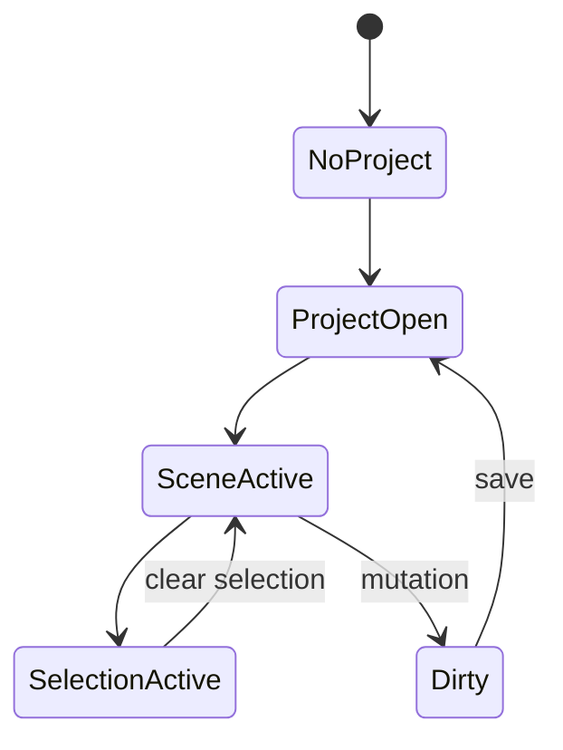

# SCADA Builder V2 - State Flow Diagram

Date: 2026-06-16
Status: Generated baseline
Document version: `V2.1.1.0039`

## Historique des changements

| Date | Version | Commit | Changement |
| --- | --- | --- | --- |
| 2026-06-16 | `V2.1.1.0039` | `PENDING` | Creation du diagramme de flow etat. |

