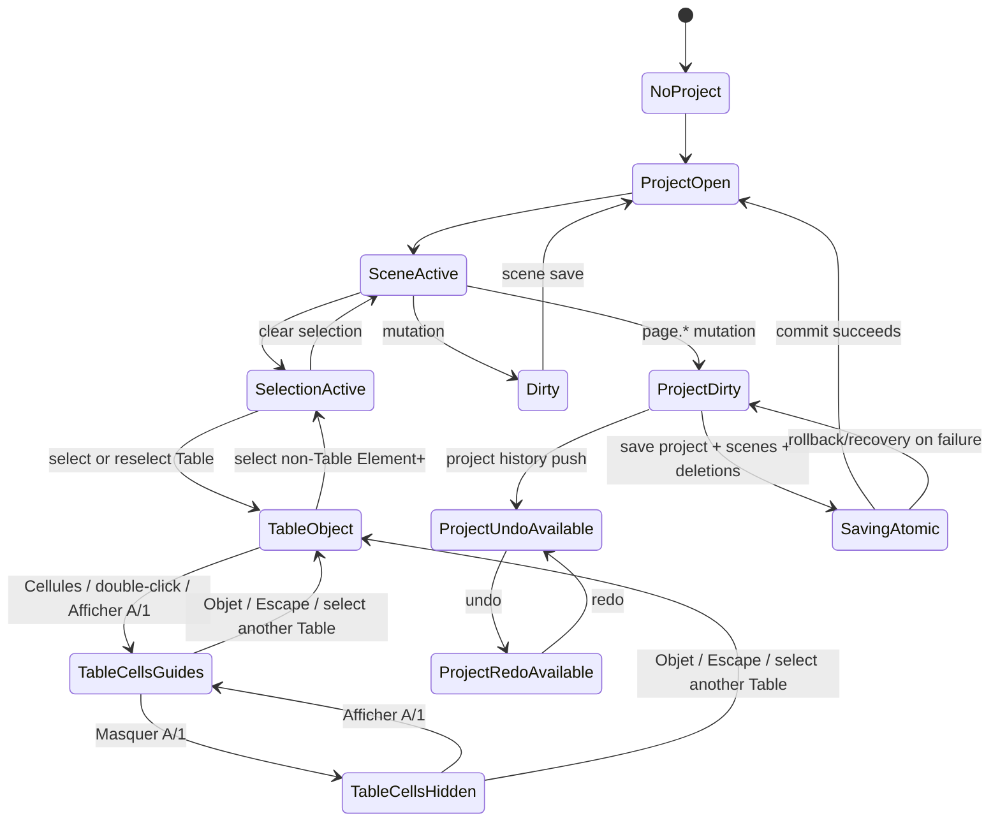
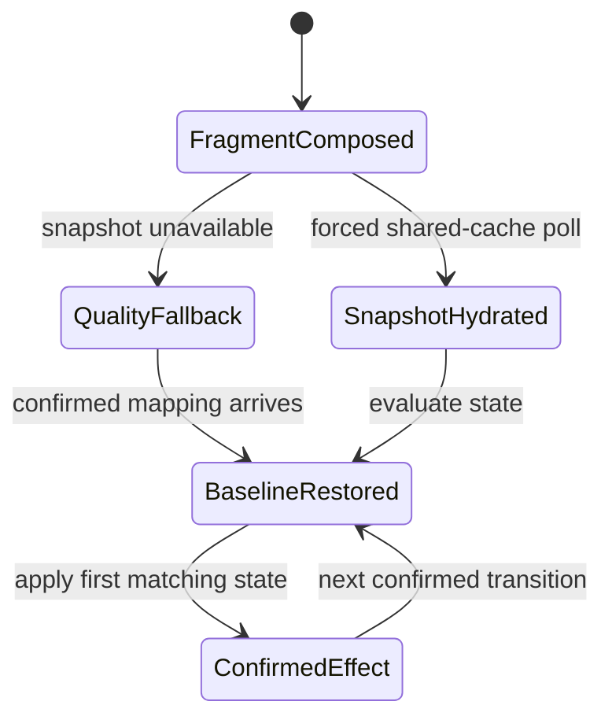

# SCADA Builder V2 - State Flow Diagram

Date: 2026-07-16
Status: Generated baseline with project workspace, Table editor and runtime effect state
Document version: `V2.1.4.0044`

## Historique des changements

| Date | Version | Commit | Changement |
| --- | --- | --- | --- |
| 2026-07-16 | `V2.1.4.0044` | `de37a35`, TF100Web `9d5d400` | Ajout du flow runtime snapshot, fallback reversible et effet confirme sous contenu semantique. |
| 2026-07-15 | `V2.1.4.0034` | `b75f1d7` | Ajout des transitions atomiques Objet/Cellules et de la visibilite effective des reperes A/1. |
| 2026-07-14 | `V2.1.1.0040` | `PENDING` | Ajout du dirty state, undo/redo projet, suppressions en attente et sauvegarde atomique des pages. |
| 2026-06-16 | `V2.1.1.0039` | `PENDING` | Creation du diagramme de flow etat. |

Le verrou de position est orthogonal a ces etats : il bloque les transitions de geometrie qui changeraient X/Y avant preview, sans forcer Objet/Cellules ni masquer les outils internes du Tableau.

La restauration ne touche que les proprietes gerees par l'effet precedent. Le filtre couleur est une couche non interactive sous le texte et les controles; les lectures et ecritures numeriques Element+ et Tableau consomment le meme snapshot et le meme bridge.
