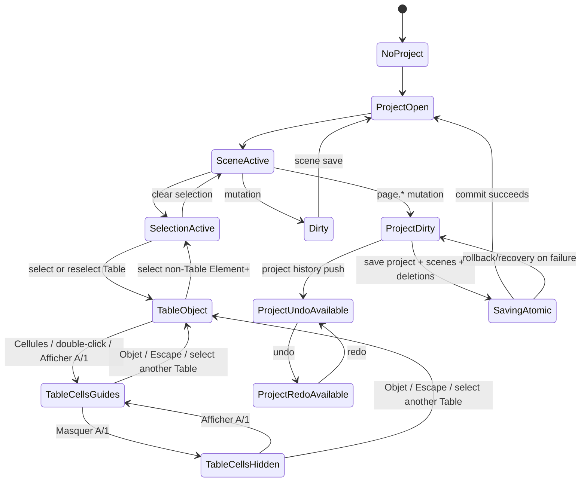

# SCADA Builder V2 - State Flow Diagram

Date: 2026-07-15
Status: Generated baseline with project workspace and Table editor state
Document version: `V2.1.4.0034`

## Historique des changements

| Date | Version | Commit | Changement |
| --- | --- | --- | --- |
| 2026-07-15 | `V2.1.4.0034` | `b75f1d7` | Ajout des transitions atomiques Objet/Cellules et de la visibilite effective des reperes A/1. |
| 2026-07-14 | `V2.1.1.0040` | `PENDING` | Ajout du dirty state, undo/redo projet, suppressions en attente et sauvegarde atomique des pages. |
| 2026-06-16 | `V2.1.1.0039` | `PENDING` | Creation du diagramme de flow etat. |

Le verrou de position est orthogonal a ces etats : il bloque les transitions de geometrie qui changeraient X/Y avant preview, sans forcer Objet/Cellules ni masquer les outils internes du Tableau.
