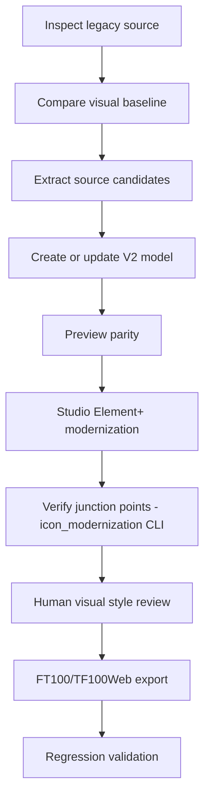

# SCADA 2026 Icon Modernization - Implementation Plan

> **For agentic workers:** REQUIRED SUB-SKILL: Use superpowers:subagent-driven-development (recommended) or superpowers:executing-plans to implement this plan task-by-task. Steps use checkbox (`- [ ]`) syntax for tracking.

**Goal:** Build the geometry-verification tool and documentation that let an interactive Claude Code session modernize legacy Element+ (`.sep`) icon artwork without breaking each icon's bounding box or its junction points with neighboring pieces (the regression already observed in `win00008_updated.html` piping).

**Architecture:** A standalone, dependency-free Python package (`tools/icon_modernization/`) parses a restricted subset of SVG primitives (line, rect, polyline, polygon, and path with M/L/H/V/C/Q/Z only) shared by both the legacy source icon and any modernized candidate, computes each shape's bounding box, extracts "junction points" (where the shape's outline touches its own bounding-box edge, expressed as a fraction along that edge), and compares original vs. candidate within a pixel tolerance. A CLI wraps this for direct invocation during an interactive modernization session. Two SCADA Builder V2 documentation owners are updated to make this the recorded, active workflow: `docs/07_legacy_migration/MODERNIZATION_WORKFLOW_V2.md` (the loop) and a new `docs/07_legacy_migration/SCADA_2026_ICON_STYLE_GUIDE_V2.md` (the visual language). A new decision entry records why the autonomous `sep-ai-modernizer` pipeline was rejected in favor of this interactive loop.

**Tech Stack:** Python 3.13 standard library only (`xml.etree.ElementTree`, `argparse`, `unittest`, `dataclasses`, `re`) - no third-party dependencies, no virtualenv required. Interpreter: `C:\Python313\python.exe` (confirmed present on this machine).

## Global Constraints

- Junction-point tolerance is **2 pixels** at the SVG's own rendered `width`/`height` (per `docs/superpowers/specs/2026-07-04-scada-2026-visual-modernization-design.md` section 4).
- Supported SVG primitives for geometry extraction: `<line>`, `<rect>`, `<polyline>`, `<polygon>`, `<path>` with only `M/L/H/V/C/Q/Z` commands (upper and lower case), and `<g transform="translate(tx[,ty])">` for nesting. Anything else (arcs, `S`/`T` shorthand curves, `scale`/`rotate`/`matrix` transforms) must raise a typed error rather than silently produce wrong geometry.
- No third-party Python packages. Every module must run with a stock `python.exe` interpreter (verified against `C:\Python313\python.exe`).
- Every touched Markdown document under `SCADA_BUILDER_V2/docs/` must get a new changelog row (Date/Version/Commit/Changement) per `docs/00_governance/VERSIONING_AND_CHANGELOG_POLICY_V2.md`, with `PENDING` as the commit placeholder.
- `docs/07_legacy_migration/MODERNIZATION_WORKFLOW_V2.md` is the owner document for this workflow; do not create competing content elsewhere per `docs/AGENTS.md` ownership rule.

---

### Task 1: Geometry primitives - `Point`, `BBox`, `compute_bbox`

**Files:**
- Create: `tools/icon_modernization/icon_modernization/__init__.py`
- Create: `tools/icon_modernization/icon_modernization/geometry.py`
- Test: `tools/icon_modernization/tests/__init__.py`
- Test: `tools/icon_modernization/tests/test_geometry.py`

**Interfaces:**
- Produces: `Point(x: float, y: float)`, `BBox(min_x, min_y, max_x, max_y)` with `.width`/`.height` properties, `compute_bbox(vertices: list[Point]) -> BBox` (raises `ValueError` on empty input). Consumed by Tasks 2, 3, 4, 5.

- [ ] **Step 1: Create the package directories and empty `__init__.py` files**

```bash
mkdir -p "F:/Groupe AMR/SCADA_AMR_GROUP/SCADA_BUILDER_V2/tools/icon_modernization/icon_modernization"
mkdir -p "F:/Groupe AMR/SCADA_AMR_GROUP/SCADA_BUILDER_V2/tools/icon_modernization/tests"
```

`tools/icon_modernization/icon_modernization/__init__.py` and `tools/icon_modernization/tests/__init__.py` are both empty files.

- [ ] **Step 2: Write the failing test**

`tools/icon_modernization/tests/test_geometry.py`:

```python
import unittest

from icon_modernization.geometry import Point, compute_bbox


class TestComputeBBox(unittest.TestCase):
    def test_single_point(self):
        bbox = compute_bbox([Point(3, 4)])
        self.assertEqual((bbox.min_x, bbox.min_y, bbox.max_x, bbox.max_y), (3, 4, 3, 4))

    def test_multiple_points(self):
        bbox = compute_bbox([Point(0, 0), Point(10, 5), Point(-2, 8)])
        self.assertEqual((bbox.min_x, bbox.min_y, bbox.max_x, bbox.max_y), (-2, 0, 10, 8))

    def test_width_and_height(self):
        bbox = compute_bbox([Point(0, 0), Point(10, 4)])
        self.assertEqual(bbox.width, 10)
        self.assertEqual(bbox.height, 4)

    def test_empty_raises(self):
        with self.assertRaises(ValueError):
            compute_bbox([])


if __name__ == "__main__":
    unittest.main()
```

- [ ] **Step 3: Run the test to verify it fails**

Run:

```bash
cd "F:/Groupe AMR/SCADA_AMR_GROUP/SCADA_BUILDER_V2/tools/icon_modernization"
"C:/Python313/python.exe" -m unittest discover -s tests -t . -v
```

Expected: `ModuleNotFoundError: No module named 'icon_modernization.geometry'` (or `'icon_modernization'` if `geometry.py` doesn't exist yet).

- [ ] **Step 4: Write the minimal implementation**

`tools/icon_modernization/icon_modernization/geometry.py`:

```python
from __future__ import annotations

from dataclasses import dataclass


@dataclass(frozen=True)
class Point:
    x: float
    y: float


@dataclass(frozen=True)
class BBox:
    min_x: float
    min_y: float
    max_x: float
    max_y: float

    @property
    def width(self) -> float:
        return self.max_x - self.min_x

    @property
    def height(self) -> float:
        return self.max_y - self.min_y


def compute_bbox(vertices: list[Point]) -> BBox:
    if not vertices:
        raise ValueError("compute_bbox requires at least one vertex")
    xs = [v.x for v in vertices]
    ys = [v.y for v in vertices]
    return BBox(min_x=min(xs), min_y=min(ys), max_x=max(xs), max_y=max(ys))
```

- [ ] **Step 5: Run the test to verify it passes**

Run:

```bash
cd "F:/Groupe AMR/SCADA_AMR_GROUP/SCADA_BUILDER_V2/tools/icon_modernization"
"C:/Python313/python.exe" -m unittest discover -s tests -t . -v
```

Expected: `OK` with 4 tests run.

- [ ] **Step 6: Commit**

```bash
cd "F:/Groupe AMR/SCADA_AMR_GROUP/SCADA_BUILDER_V2"
git add tools/icon_modernization/icon_modernization/__init__.py tools/icon_modernization/icon_modernization/geometry.py tools/icon_modernization/tests/__init__.py tools/icon_modernization/tests/test_geometry.py
git commit -m "feat: add Point/BBox geometry primitives for icon modernization tool"
```

---

### Task 2: Junction point extraction - `JunctionPoint`, `junction_points`

**Files:**
- Modify: `tools/icon_modernization/icon_modernization/geometry.py`
- Test: `tools/icon_modernization/tests/test_geometry.py`

**Interfaces:**
- Consumes: `Point`, `BBox` from Task 1.
- Produces: `JunctionPoint(edge: str, fraction: float)` where `edge` is one of `"top"`, `"right"`, `"bottom"`, `"left"`; `junction_points(vertices: list[Point], bbox: BBox, epsilon: float = 0.5) -> list[JunctionPoint]` (raises `ValueError` on a degenerate zero-width or zero-height bbox). Consumed by Task 5.

- [ ] **Step 1: Write the failing tests**

Append to `tools/icon_modernization/tests/test_geometry.py` (add the import and the new test class):

```python
from icon_modernization.geometry import BBox, JunctionPoint, Point, compute_bbox, junction_points


class TestJunctionPoints(unittest.TestCase):
    def test_point_on_left_edge(self):
        bbox = BBox(min_x=0, min_y=0, max_x=10, max_y=20)
        points = junction_points([Point(0, 5)], bbox)
        self.assertEqual(points, [JunctionPoint(edge="left", fraction=0.25)])

    def test_point_on_right_edge(self):
        bbox = BBox(min_x=0, min_y=0, max_x=10, max_y=20)
        points = junction_points([Point(10, 15)], bbox)
        self.assertEqual(points, [JunctionPoint(edge="right", fraction=0.75)])

    def test_point_on_top_and_bottom_edges(self):
        bbox = BBox(min_x=0, min_y=0, max_x=10, max_y=20)
        top = junction_points([Point(2, 0)], bbox)
        bottom = junction_points([Point(8, 20)], bbox)
        self.assertEqual(top, [JunctionPoint(edge="top", fraction=0.2)])
        self.assertEqual(bottom, [JunctionPoint(edge="bottom", fraction=0.8)])

    def test_corner_point_matches_two_edges(self):
        bbox = BBox(min_x=0, min_y=0, max_x=10, max_y=20)
        points = junction_points([Point(0, 0)], bbox)
        self.assertEqual(
            sorted(points, key=lambda p: p.edge),
            sorted([JunctionPoint(edge="left", fraction=0.0), JunctionPoint(edge="top", fraction=0.0)], key=lambda p: p.edge),
        )

    def test_interior_point_produces_no_junction(self):
        bbox = BBox(min_x=0, min_y=0, max_x=10, max_y=20)
        points = junction_points([Point(5, 10)], bbox)
        self.assertEqual(points, [])

    def test_epsilon_tolerance(self):
        bbox = BBox(min_x=0, min_y=0, max_x=10, max_y=20)
        points = junction_points([Point(0.3, 5)], bbox, epsilon=0.5)
        self.assertEqual(points, [JunctionPoint(edge="left", fraction=0.25)])

    def test_degenerate_bbox_raises(self):
        bbox = compute_bbox([Point(3, 3), Point(3, 9)])
        with self.assertRaises(ValueError):
            junction_points([Point(3, 5)], bbox)
```

- [ ] **Step 2: Run the tests to verify they fail**

Run:

```bash
cd "F:/Groupe AMR/SCADA_AMR_GROUP/SCADA_BUILDER_V2/tools/icon_modernization"
"C:/Python313/python.exe" -m unittest discover -s tests -t . -v
```

Expected: `ImportError: cannot import name 'JunctionPoint' from 'icon_modernization.geometry'`.

- [ ] **Step 3: Write the minimal implementation**

Append to `tools/icon_modernization/icon_modernization/geometry.py`:

```python
@dataclass(frozen=True)
class JunctionPoint:
    edge: str
    fraction: float


def junction_points(vertices: list[Point], bbox: BBox, epsilon: float = 0.5) -> list[JunctionPoint]:
    if bbox.width <= 0 or bbox.height <= 0:
        raise ValueError("junction_points requires a non-degenerate bbox")

    points: list[JunctionPoint] = []
    for v in vertices:
        if abs(v.x - bbox.min_x) <= epsilon:
            points.append(JunctionPoint(edge="left", fraction=(v.y - bbox.min_y) / bbox.height))
        if abs(v.x - bbox.max_x) <= epsilon:
            points.append(JunctionPoint(edge="right", fraction=(v.y - bbox.min_y) / bbox.height))
        if abs(v.y - bbox.min_y) <= epsilon:
            points.append(JunctionPoint(edge="top", fraction=(v.x - bbox.min_x) / bbox.width))
        if abs(v.y - bbox.max_y) <= epsilon:
            points.append(JunctionPoint(edge="bottom", fraction=(v.x - bbox.min_x) / bbox.width))
    return points
```

- [ ] **Step 4: Run the tests to verify they pass**

Run:

```bash
cd "F:/Groupe AMR/SCADA_AMR_GROUP/SCADA_BUILDER_V2/tools/icon_modernization"
"C:/Python313/python.exe" -m unittest discover -s tests -t . -v
```

Expected: `OK` with 11 tests run.

- [ ] **Step 5: Commit**

```bash
cd "F:/Groupe AMR/SCADA_AMR_GROUP/SCADA_BUILDER_V2"
git add tools/icon_modernization/icon_modernization/geometry.py tools/icon_modernization/tests/test_geometry.py
git commit -m "feat: add junction point extraction to geometry module"
```

---

### Task 3: SVG basic shape parsing - `extract_vertices` (line, rect, polyline, polygon, groups)

**Files:**
- Create: `tools/icon_modernization/icon_modernization/svg_parse.py`
- Test: `tools/icon_modernization/tests/test_svg_parse.py`

**Interfaces:**
- Consumes: `Point` from Task 1.
- Produces: `extract_vertices(svg_markup: str) -> list[Point]`, `UnsupportedTransformError(ValueError)`. Extended in Task 4 with `<path>` support. Consumed by Task 5.

- [ ] **Step 1: Write the failing tests**

`tools/icon_modernization/tests/test_svg_parse.py`:

```python
import unittest

from icon_modernization.geometry import Point
from icon_modernization.svg_parse import UnsupportedTransformError, extract_vertices


class TestExtractVerticesBasicShapes(unittest.TestCase):
    def test_line(self):
        svg = '<svg xmlns="http://www.w3.org/2000/svg"><line x1="0" y1="0" x2="10" y2="20"/></svg>'
        self.assertEqual(extract_vertices(svg), [Point(0, 0), Point(10, 20)])

    def test_rect(self):
        svg = '<svg xmlns="http://www.w3.org/2000/svg"><rect x="1" y="2" width="10" height="5"/></svg>'
        self.assertEqual(
            extract_vertices(svg),
            [Point(1, 2), Point(11, 2), Point(1, 7), Point(11, 7)],
        )

    def test_polyline(self):
        svg = '<svg xmlns="http://www.w3.org/2000/svg"><polyline points="0,0 5,5 10,0"/></svg>'
        self.assertEqual(extract_vertices(svg), [Point(0, 0), Point(5, 5), Point(10, 0)])

    def test_polygon_comma_and_space_separators(self):
        svg = '<svg xmlns="http://www.w3.org/2000/svg"><polygon points="0,0 5 5 10,0"/></svg>'
        self.assertEqual(extract_vertices(svg), [Point(0, 0), Point(5, 5), Point(10, 0)])

    def test_nested_group_translate_offset_applied(self):
        svg = (
            '<svg xmlns="http://www.w3.org/2000/svg">'
            '<g transform="translate(10,20)"><line x1="0" y1="0" x2="1" y2="1"/></g>'
            "</svg>"
        )
        self.assertEqual(extract_vertices(svg), [Point(10, 20), Point(11, 21)])

    def test_nested_group_translate_single_argument(self):
        svg = (
            '<svg xmlns="http://www.w3.org/2000/svg">'
            '<g transform="translate(5)"><line x1="0" y1="0" x2="0" y2="0"/></g>'
            "</svg>"
        )
        self.assertEqual(extract_vertices(svg), [Point(5, 0), Point(5, 0)])

    def test_unsupported_transform_raises(self):
        svg = (
            '<svg xmlns="http://www.w3.org/2000/svg">'
            '<g transform="scale(2)"><line x1="0" y1="0" x2="1" y2="1"/></g>'
            "</svg>"
        )
        with self.assertRaises(UnsupportedTransformError):
            extract_vertices(svg)

    def test_multiple_shapes_combined(self):
        svg = (
            '<svg xmlns="http://www.w3.org/2000/svg">'
            '<line x1="0" y1="0" x2="1" y2="1"/>'
            '<rect x="0" y="0" width="2" height="2"/>'
            "</svg>"
        )
        vertices = extract_vertices(svg)
        self.assertEqual(len(vertices), 6)


if __name__ == "__main__":
    unittest.main()
```

- [ ] **Step 2: Run the tests to verify they fail**

Run:

```bash
cd "F:/Groupe AMR/SCADA_AMR_GROUP/SCADA_BUILDER_V2/tools/icon_modernization"
"C:/Python313/python.exe" -m unittest discover -s tests -t . -v
```

Expected: `ModuleNotFoundError: No module named 'icon_modernization.svg_parse'`.

- [ ] **Step 3: Write the minimal implementation**

`tools/icon_modernization/icon_modernization/svg_parse.py`:

```python
from __future__ import annotations

import xml.etree.ElementTree as ET

from icon_modernization.geometry import Point


class UnsupportedTransformError(ValueError):
    pass


class UnsupportedPathCommandError(ValueError):
    pass


def _strip_ns(tag: str) -> str:
    return tag.split("}", 1)[-1] if "}" in tag else tag


def _parse_points_attr(points_attr: str) -> list[Point]:
    tokens = points_attr.replace(",", " ").split()
    return [Point(float(tokens[i]), float(tokens[i + 1])) for i in range(0, len(tokens) - 1, 2)]


def _parse_translate(transform: str) -> tuple[float, float]:
    transform = transform.strip()
    if not transform.startswith("translate(") or not transform.endswith(")"):
        raise UnsupportedTransformError(f"Unsupported transform: {transform!r}")
    inner = transform[len("translate("):-1]
    parts = [p for p in inner.replace(",", " ").split() if p]
    if len(parts) == 1:
        return float(parts[0]), 0.0
    if len(parts) == 2:
        return float(parts[0]), float(parts[1])
    raise UnsupportedTransformError(f"Unsupported transform: {transform!r}")


def extract_vertices(svg_markup: str) -> list[Point]:
    root = ET.fromstring(svg_markup)
    return _extract_from_element(root, offset_x=0.0, offset_y=0.0)


def _extract_from_element(element: ET.Element, offset_x: float, offset_y: float) -> list[Point]:
    tag = _strip_ns(element.tag)
    dx, dy = offset_x, offset_y
    transform = element.get("transform")
    if transform:
        tx, ty = _parse_translate(transform)
        dx, dy = offset_x + tx, offset_y + ty

    vertices: list[Point] = []

    if tag == "line":
        x1, y1 = float(element.get("x1", "0")), float(element.get("y1", "0"))
        x2, y2 = float(element.get("x2", "0")), float(element.get("y2", "0"))
        vertices += [Point(x1 + dx, y1 + dy), Point(x2 + dx, y2 + dy)]
    elif tag in ("polyline", "polygon"):
        for p in _parse_points_attr(element.get("points", "")):
            vertices.append(Point(p.x + dx, p.y + dy))
    elif tag == "rect":
        x, y = float(element.get("x", "0")), float(element.get("y", "0"))
        w, h = float(element.get("width", "0")), float(element.get("height", "0"))
        for cx, cy in ((x, y), (x + w, y), (x, y + h), (x + w, y + h)):
            vertices.append(Point(cx + dx, cy + dy))

    for child in element:
        vertices += _extract_from_element(child, dx, dy)

    return vertices
```

- [ ] **Step 4: Run the tests to verify they pass**

Run:

```bash
cd "F:/Groupe AMR/SCADA_AMR_GROUP/SCADA_BUILDER_V2/tools/icon_modernization"
"C:/Python313/python.exe" -m unittest discover -s tests -t . -v
```

Expected: `OK` with 19 tests run.

- [ ] **Step 5: Commit**

```bash
cd "F:/Groupe AMR/SCADA_AMR_GROUP/SCADA_BUILDER_V2"
git add tools/icon_modernization/icon_modernization/svg_parse.py tools/icon_modernization/tests/test_svg_parse.py
git commit -m "feat: parse line/rect/polyline/polygon/group SVG vertices"
```

---

### Task 4: SVG path parsing - `<path>` with M/L/H/V/C/Q/Z

**Files:**
- Modify: `tools/icon_modernization/icon_modernization/svg_parse.py`
- Test: `tools/icon_modernization/tests/test_svg_parse.py`

**Interfaces:**
- Consumes: `Point` from Task 1; `UnsupportedPathCommandError` already declared in Task 3's file.
- Produces: `extract_vertices` now also handles `<path d="...">`. Consumed by Task 5.

- [ ] **Step 1: Write the failing tests**

Append to `tools/icon_modernization/tests/test_svg_parse.py` (add `UnsupportedPathCommandError` to the import):

```python
from icon_modernization.svg_parse import UnsupportedPathCommandError, UnsupportedTransformError, extract_vertices


class TestExtractVerticesPath(unittest.TestCase):
    def test_moveto_lineto_absolute(self):
        svg = '<svg xmlns="http://www.w3.org/2000/svg"><path d="M0,0 L10,0 L10,10"/></svg>'
        self.assertEqual(extract_vertices(svg), [Point(0, 0), Point(10, 0), Point(10, 10)])

    def test_moveto_lineto_relative(self):
        svg = '<svg xmlns="http://www.w3.org/2000/svg"><path d="m0,0 l10,0 l0,10"/></svg>'
        self.assertEqual(extract_vertices(svg), [Point(0, 0), Point(10, 0), Point(10, 10)])

    def test_implicit_repeated_lineto(self):
        svg = '<svg xmlns="http://www.w3.org/2000/svg"><path d="M0,0 L10,0 20,0 30,0"/></svg>'
        self.assertEqual(
            extract_vertices(svg),
            [Point(0, 0), Point(10, 0), Point(20, 0), Point(30, 0)],
        )

    def test_horizontal_and_vertical_lineto(self):
        svg = '<svg xmlns="http://www.w3.org/2000/svg"><path d="M0,0 H10 V10 h-5 v-5"/></svg>'
        self.assertEqual(
            extract_vertices(svg),
            [Point(0, 0), Point(10, 0), Point(10, 10), Point(5, 10), Point(5, 5)],
        )

    def test_cubic_curve_keeps_only_endpoint(self):
        svg = '<svg xmlns="http://www.w3.org/2000/svg"><path d="M0,0 C1,9 9,9 10,0"/></svg>'
        self.assertEqual(extract_vertices(svg), [Point(0, 0), Point(10, 0)])

    def test_quadratic_curve_keeps_only_endpoint(self):
        svg = '<svg xmlns="http://www.w3.org/2000/svg"><path d="M0,0 Q5,9 10,0"/></svg>'
        self.assertEqual(extract_vertices(svg), [Point(0, 0), Point(10, 0)])

    def test_close_path_is_a_no_op_for_vertices(self):
        svg = '<svg xmlns="http://www.w3.org/2000/svg"><path d="M0,0 L10,0 L10,10 Z"/></svg>'
        self.assertEqual(extract_vertices(svg), [Point(0, 0), Point(10, 0), Point(10, 10)])

    def test_path_inside_translated_group(self):
        svg = (
            '<svg xmlns="http://www.w3.org/2000/svg">'
            '<g transform="translate(100,200)"><path d="M0,0 L1,1"/></g>'
            "</svg>"
        )
        self.assertEqual(extract_vertices(svg), [Point(100, 200), Point(101, 201)])

    def test_unsupported_arc_command_raises(self):
        svg = '<svg xmlns="http://www.w3.org/2000/svg"><path d="M0,0 A5,5 0 0 1 10,10"/></svg>'
        with self.assertRaises(UnsupportedPathCommandError):
            extract_vertices(svg)


if __name__ == "__main__":
    unittest.main()
```

- [ ] **Step 2: Run the tests to verify they fail**

Run:

```bash
cd "F:/Groupe AMR/SCADA_AMR_GROUP/SCADA_BUILDER_V2/tools/icon_modernization"
"C:/Python313/python.exe" -m unittest discover -s tests -t . -v
```

Expected: `test_moveto_lineto_absolute` and the rest of `TestExtractVerticesPath` FAIL (path data currently produces no vertices, since `<path>` is not yet handled).

- [ ] **Step 3: Write the minimal implementation**

Add to the top of `tools/icon_modernization/icon_modernization/svg_parse.py` (after the existing imports):

```python
import re

_PATH_TOKEN_RE = re.compile(r"([MLHVCQZmlhvcqz])|(-?\d*\.?\d+(?:[eE][-+]?\d+)?)")


def _tokenize_path(d: str) -> list[str]:
    tokens = []
    for cmd, num in _PATH_TOKEN_RE.findall(d):
        if cmd:
            tokens.append(cmd)
        elif num:
            tokens.append(num)
    return tokens


def _parse_path_vertices(d: str) -> list[Point]:
    tokens = _tokenize_path(d)
    vertices: list[Point] = []
    i = 0
    cur_x = cur_y = 0.0
    cmd = None

    def read_floats(n: int) -> list[float]:
        nonlocal i
        vals = [float(tokens[i + k]) for k in range(n)]
        i += n
        return vals

    while i < len(tokens):
        token = tokens[i]
        if token.isalpha():
            cmd = token
            i += 1
            continue
        if cmd is None:
            raise UnsupportedPathCommandError(f"Path data must start with a command: {d!r}")

        if cmd in ("M", "L"):
            cur_x, cur_y = read_floats(2)
            vertices.append(Point(cur_x, cur_y))
        elif cmd in ("m", "l"):
            dx, dy = read_floats(2)
            cur_x, cur_y = cur_x + dx, cur_y + dy
            vertices.append(Point(cur_x, cur_y))
        elif cmd == "H":
            (cur_x,) = read_floats(1)
            vertices.append(Point(cur_x, cur_y))
        elif cmd == "h":
            (dx,) = read_floats(1)
            cur_x = cur_x + dx
            vertices.append(Point(cur_x, cur_y))
        elif cmd == "V":
            (cur_y,) = read_floats(1)
            vertices.append(Point(cur_x, cur_y))
        elif cmd == "v":
            (dy,) = read_floats(1)
            cur_y = cur_y + dy
            vertices.append(Point(cur_x, cur_y))
        elif cmd == "C":
            _, _, _, _, cur_x, cur_y = read_floats(6)
            vertices.append(Point(cur_x, cur_y))
        elif cmd == "c":
            _, _, _, _, dx, dy = read_floats(6)
            cur_x, cur_y = cur_x + dx, cur_y + dy
            vertices.append(Point(cur_x, cur_y))
        elif cmd == "Q":
            _, _, cur_x, cur_y = read_floats(4)
            vertices.append(Point(cur_x, cur_y))
        elif cmd == "q":
            _, _, dx, dy = read_floats(4)
            cur_x, cur_y = cur_x + dx, cur_y + dy
            vertices.append(Point(cur_x, cur_y))
        elif cmd in ("Z", "z"):
            pass
        else:
            raise UnsupportedPathCommandError(f"Unsupported path command {cmd!r} in {d!r}")

    return vertices
```

Then add an `elif tag == "path":` branch inside `_extract_from_element`, right after the existing `elif tag == "rect":` block (before the `for child in element:` loop):

```python
    elif tag == "path":
        for p in _parse_path_vertices(element.get("d", "")):
            vertices.append(Point(p.x + dx, p.y + dy))
```

- [ ] **Step 4: Run the tests to verify they pass**

Run:

```bash
cd "F:/Groupe AMR/SCADA_AMR_GROUP/SCADA_BUILDER_V2/tools/icon_modernization"
"C:/Python313/python.exe" -m unittest discover -s tests -t . -v
```

Expected: `OK` with 28 tests run.

- [ ] **Step 5: Commit**

```bash
cd "F:/Groupe AMR/SCADA_AMR_GROUP/SCADA_BUILDER_V2"
git add tools/icon_modernization/icon_modernization/svg_parse.py tools/icon_modernization/tests/test_svg_parse.py
git commit -m "feat: parse SVG path M/L/H/V/C/Q/Z commands for vertex extraction"
```

---

### Task 5: Junction point comparison - `junction_points_for_svg`, `compare_junction_points`

**Files:**
- Create: `tools/icon_modernization/icon_modernization/junctions.py`
- Test: `tools/icon_modernization/tests/test_junctions.py`

**Interfaces:**
- Consumes: `BBox`, `junction_points`, `JunctionPoint` from `geometry.py` (Tasks 1-2); `extract_vertices` from `svg_parse.py` (Tasks 3-4). Note: this task does **not** use `compute_bbox` - the junction-point bbox must be the SVG's own declared `width`/`height` (the icon's canvas/viewport), not the tight bounding box of the shape's vertices. A single horizontal line spanning the full width of its canvas has a vertex-derived bbox with zero height, which `junction_points` correctly rejects as degenerate - but that same line legitimately touches the canvas's left/right edges at 50% height, which only the canvas-derived bbox can express.
- Produces: `junction_points_for_svg(svg_markup: str, epsilon: float = 0.5) -> list[JunctionPoint]`, `ComparisonResult(matched: list[JunctionPoint], missing: list[JunctionPoint], extra: list[JunctionPoint])` with `.ok` property, `compare_junction_points(original: list[JunctionPoint], candidate: list[JunctionPoint], tolerance_fraction: float) -> ComparisonResult`. Consumed by Task 6.

- [ ] **Step 1: Write the failing tests**

`tools/icon_modernization/tests/test_junctions.py`:

```python
import unittest

from icon_modernization.geometry import JunctionPoint
from icon_modernization.junctions import compare_junction_points, junction_points_for_svg


class TestJunctionPointsForSvg(unittest.TestCase):
    def test_horizontal_pipe_touches_left_and_right_edges(self):
        svg = '<svg xmlns="http://www.w3.org/2000/svg" width="100" height="10"><line x1="0" y1="5" x2="100" y2="5"/></svg>'
        points = junction_points_for_svg(svg)
        self.assertIn(JunctionPoint(edge="left", fraction=0.5), points)
        self.assertIn(JunctionPoint(edge="right", fraction=0.5), points)


class TestCompareJunctionPoints(unittest.TestCase):
    def test_exact_match_is_ok(self):
        original = [JunctionPoint(edge="left", fraction=0.5)]
        candidate = [JunctionPoint(edge="left", fraction=0.5)]
        result = compare_junction_points(original, candidate, tolerance_fraction=0.02)
        self.assertTrue(result.ok)
        self.assertEqual(result.matched, original)

    def test_within_tolerance_is_ok(self):
        original = [JunctionPoint(edge="left", fraction=0.50)]
        candidate = [JunctionPoint(edge="left", fraction=0.51)]
        result = compare_junction_points(original, candidate, tolerance_fraction=0.02)
        self.assertTrue(result.ok)

    def test_beyond_tolerance_reports_missing_and_extra(self):
        original = [JunctionPoint(edge="left", fraction=0.10)]
        candidate = [JunctionPoint(edge="left", fraction=0.90)]
        result = compare_junction_points(original, candidate, tolerance_fraction=0.02)
        self.assertFalse(result.ok)
        self.assertEqual(result.missing, original)
        self.assertEqual(result.extra, candidate)

    def test_different_edge_does_not_match(self):
        original = [JunctionPoint(edge="left", fraction=0.5)]
        candidate = [JunctionPoint(edge="right", fraction=0.5)]
        result = compare_junction_points(original, candidate, tolerance_fraction=0.02)
        self.assertFalse(result.ok)
        self.assertEqual(result.missing, original)
        self.assertEqual(result.extra, candidate)

    def test_nearest_candidate_is_matched_on_same_edge(self):
        original = [JunctionPoint(edge="top", fraction=0.30)]
        candidate = [JunctionPoint(edge="top", fraction=0.32), JunctionPoint(edge="top", fraction=0.90)]
        result = compare_junction_points(original, candidate, tolerance_fraction=0.05)
        self.assertTrue(JunctionPoint(edge="top", fraction=0.30) in result.matched)
        self.assertEqual(result.extra, [JunctionPoint(edge="top", fraction=0.90)])


if __name__ == "__main__":
    unittest.main()
```

- [ ] **Step 2: Run the tests to verify they fail**

Run:

```bash
cd "F:/Groupe AMR/SCADA_AMR_GROUP/SCADA_BUILDER_V2/tools/icon_modernization"
"C:/Python313/python.exe" -m unittest discover -s tests -t . -v
```

Expected: `ModuleNotFoundError: No module named 'icon_modernization.junctions'`.

- [ ] **Step 3: Write the minimal implementation**

`tools/icon_modernization/icon_modernization/junctions.py`:

```python
from __future__ import annotations

import xml.etree.ElementTree as ET
from dataclasses import dataclass

from icon_modernization.geometry import BBox, JunctionPoint, junction_points
from icon_modernization.svg_parse import extract_vertices


def _read_svg_bbox(svg_markup: str) -> BBox:
    root = ET.fromstring(svg_markup)
    width = float(root.get("width"))
    height = float(root.get("height"))
    return BBox(min_x=0.0, min_y=0.0, max_x=width, max_y=height)


def junction_points_for_svg(svg_markup: str, epsilon: float = 0.5) -> list[JunctionPoint]:
    vertices = extract_vertices(svg_markup)
    bbox = _read_svg_bbox(svg_markup)
    return junction_points(vertices, bbox, epsilon=epsilon)


@dataclass(frozen=True)
class ComparisonResult:
    matched: list[JunctionPoint]
    missing: list[JunctionPoint]
    extra: list[JunctionPoint]

    @property
    def ok(self) -> bool:
        return not self.missing and not self.extra


def compare_junction_points(
    original: list[JunctionPoint],
    candidate: list[JunctionPoint],
    tolerance_fraction: float,
) -> ComparisonResult:
    remaining_candidates = list(candidate)
    matched: list[JunctionPoint] = []
    missing: list[JunctionPoint] = []

    for point in original:
        best_index = None
        best_distance = None
        for index, cand in enumerate(remaining_candidates):
            if cand.edge != point.edge:
                continue
            distance = abs(cand.fraction - point.fraction)
            if distance <= tolerance_fraction and (best_distance is None or distance < best_distance):
                best_distance = distance
                best_index = index
        if best_index is None:
            missing.append(point)
        else:
            matched.append(point)
            remaining_candidates.pop(best_index)

    return ComparisonResult(matched=matched, missing=missing, extra=remaining_candidates)
```

- [ ] **Step 4: Run the tests to verify they pass**

Run:

```bash
cd "F:/Groupe AMR/SCADA_AMR_GROUP/SCADA_BUILDER_V2/tools/icon_modernization"
"C:/Python313/python.exe" -m unittest discover -s tests -t . -v
```

Expected: `OK` with 35 tests run (29 pre-existing + 6 new: 1 in `TestJunctionPointsForSvg` + 5 in `TestCompareJunctionPoints`).

- [ ] **Step 5: Commit**

```bash
cd "F:/Groupe AMR/SCADA_AMR_GROUP/SCADA_BUILDER_V2"
git add tools/icon_modernization/icon_modernization/junctions.py tools/icon_modernization/tests/test_junctions.py
git commit -m "feat: compare junction points between original and candidate SVGs"
```

---

### Task 6: CLI - `check-junctions`

**Files:**
- Create: `tools/icon_modernization/icon_modernization/cli.py`
- Test: `tools/icon_modernization/tests/test_cli.py`

**Interfaces:**
- Consumes: `compare_junction_points`, `junction_points_for_svg` from Task 5.
- Produces: `run_check_junctions(original_path: str, candidate_path: str, tolerance_px: float) -> int` (0 = ok, 1 = mismatch), `main(argv: list[str] | None = None) -> int`. This is the entry point an interactive Claude Code session invokes.

- [ ] **Step 1: Write the failing tests**

`tools/icon_modernization/tests/test_cli.py`:

```python
import contextlib
import io
import os
import tempfile
import unittest

from icon_modernization.cli import run_check_junctions

_MATCHING_ORIGINAL = (
    '<svg xmlns="http://www.w3.org/2000/svg" width="100" height="10">'
    '<line x1="0" y1="5" x2="100" y2="5"/></svg>'
)
_MATCHING_CANDIDATE = (
    '<svg xmlns="http://www.w3.org/2000/svg" width="100" height="10">'
    '<line x1="0" y1="4" x2="100" y2="4"/></svg>'
)
_MISMATCHED_CANDIDATE = (
    '<svg xmlns="http://www.w3.org/2000/svg" width="100" height="10">'
    '<line x1="0" y1="9" x2="100" y2="9"/></svg>'
)


def _write_temp_svg(directory: str, name: str, markup: str) -> str:
    path = os.path.join(directory, name)
    with open(path, "w", encoding="utf-8") as f:
        f.write(markup)
    return path


class TestRunCheckJunctions(unittest.TestCase):
    def test_matching_geometry_within_tolerance_returns_zero(self):
        with tempfile.TemporaryDirectory() as tmp:
            original = _write_temp_svg(tmp, "original.svg", _MATCHING_ORIGINAL)
            candidate = _write_temp_svg(tmp, "candidate.svg", _MATCHING_CANDIDATE)
            buffer = io.StringIO()
            with contextlib.redirect_stdout(buffer):
                exit_code = run_check_junctions(original, candidate, tolerance_px=2.0)
            self.assertEqual(exit_code, 0)
            self.assertIn("OK", buffer.getvalue())

    def test_mismatched_geometry_beyond_tolerance_returns_one(self):
        with tempfile.TemporaryDirectory() as tmp:
            original = _write_temp_svg(tmp, "original.svg", _MATCHING_ORIGINAL)
            candidate = _write_temp_svg(tmp, "candidate.svg", _MISMATCHED_CANDIDATE)
            buffer = io.StringIO()
            with contextlib.redirect_stdout(buffer):
                exit_code = run_check_junctions(original, candidate, tolerance_px=2.0)
            self.assertEqual(exit_code, 1)
            self.assertIn("FAIL", buffer.getvalue())
            self.assertIn("MISSING", buffer.getvalue())


if __name__ == "__main__":
    unittest.main()
```

- [ ] **Step 2: Run the tests to verify they fail**

Run:

```bash
cd "F:/Groupe AMR/SCADA_AMR_GROUP/SCADA_BUILDER_V2/tools/icon_modernization"
"C:/Python313/python.exe" -m unittest discover -s tests -t . -v
```

Expected: `ModuleNotFoundError: No module named 'icon_modernization.cli'`.

- [ ] **Step 3: Write the minimal implementation**

`tools/icon_modernization/icon_modernization/cli.py`:

```python
from __future__ import annotations

import argparse
import sys
import xml.etree.ElementTree as ET

from icon_modernization.junctions import compare_junction_points, junction_points_for_svg


def _read_svg_dimensions(svg_markup: str) -> tuple[float, float]:
    root = ET.fromstring(svg_markup)
    return float(root.get("width")), float(root.get("height"))


def run_check_junctions(original_path: str, candidate_path: str, tolerance_px: float) -> int:
    with open(original_path, "r", encoding="utf-8") as f:
        original_svg = f.read()
    with open(candidate_path, "r", encoding="utf-8") as f:
        candidate_svg = f.read()

    original_points = junction_points_for_svg(original_svg)
    candidate_points = junction_points_for_svg(candidate_svg)

    width, height = _read_svg_dimensions(candidate_svg)
    tolerance_fraction = tolerance_px / min(width, height)

    result = compare_junction_points(original_points, candidate_points, tolerance_fraction)

    print(f"Matched: {len(result.matched)}")
    for point in result.missing:
        print(f"MISSING junction on {point.edge} edge at {point.fraction:.3f}")
    for point in result.extra:
        print(f"EXTRA junction on {point.edge} edge at {point.fraction:.3f}")

    if result.ok:
        print("OK: junction points preserved within tolerance")
        return 0
    print("FAIL: junction points diverge beyond tolerance")
    return 1


def main(argv: list[str] | None = None) -> int:
    parser = argparse.ArgumentParser(prog="icon_modernization")
    subparsers = parser.add_subparsers(dest="command", required=True)

    check = subparsers.add_parser("check-junctions", help="Compare junction points between two SVG files")
    check.add_argument("original", help="Path to the original (legacy) SVG file")
    check.add_argument("candidate", help="Path to the modernized candidate SVG file")
    check.add_argument("--tolerance-px", type=float, default=2.0)

    args = parser.parse_args(argv)

    if args.command == "check-junctions":
        return run_check_junctions(args.original, args.candidate, args.tolerance_px)

    parser.error(f"Unknown command: {args.command}")
    return 2


if __name__ == "__main__":
    sys.exit(main())
```

- [ ] **Step 4: Run the tests to verify they pass**

Run:

```bash
cd "F:/Groupe AMR/SCADA_AMR_GROUP/SCADA_BUILDER_V2/tools/icon_modernization"
"C:/Python313/python.exe" -m unittest discover -s tests -t . -v
```

Expected: `OK` with 37 tests run (35 pre-existing + 2 new in `TestRunCheckJunctions`).

- [ ] **Step 5: Manually verify the CLI end-to-end**

```bash
cd "F:/Groupe AMR/SCADA_AMR_GROUP/SCADA_BUILDER_V2/tools/icon_modernization"
echo '<svg xmlns="http://www.w3.org/2000/svg" width="100" height="10"><line x1="0" y1="5" x2="100" y2="5"/></svg>' > /tmp_original.svg
echo '<svg xmlns="http://www.w3.org/2000/svg" width="100" height="10"><line x1="0" y1="4" x2="100" y2="4"/></svg>' > /tmp_candidate.svg
"C:/Python313/python.exe" -m icon_modernization.cli check-junctions /tmp_original.svg /tmp_candidate.svg
```

Expected: exit code `0` and `OK: junction points preserved within tolerance` printed. Run `echo $?` (or check `$LASTEXITCODE` in PowerShell) to confirm the exit code.

- [ ] **Step 6: Commit**

```bash
cd "F:/Groupe AMR/SCADA_AMR_GROUP/SCADA_BUILDER_V2"
git add tools/icon_modernization/icon_modernization/cli.py tools/icon_modernization/tests/test_cli.py
git commit -m "feat: add check-junctions CLI entry point"
```

---

### Task 7: Tool usage README

**Files:**
- Create: `tools/icon_modernization/README.md`

**Interfaces:**
- Consumes: nothing (documentation only).
- Produces: the operating manual referenced by `docs/07_legacy_migration/MODERNIZATION_WORKFLOW_V2.md` in Task 8.

- [ ] **Step 1: Write the README**

`tools/icon_modernization/README.md`:

```markdown
# icon_modernization

Geometry-verification tool for the SCADA 2026 icon modernization workflow
(`docs/07_legacy_migration/MODERNIZATION_WORKFLOW_V2.md`).

It does not generate icon artwork. It verifies that a modernized candidate
SVG preserves the **junction points** of the original legacy icon - the
positions where the icon's outline touches its own bounding-box edge. This
catches the class of regression seen in `win00008_updated.html`, where
AI-regenerated piping kept the correct bounding box but no longer touched
its neighbors at the same relative position.

## Requirements

Python 3.13 standard library only. No virtualenv, no `pip install`. Verified
against `C:\Python313\python.exe`.

## Supported SVG subset

`<line>`, `<rect>`, `<polyline>`, `<polygon>`, `<path>` using only
`M/L/H/V/C/Q/Z` (upper or lower case), and `<g transform="translate(tx[,ty])">`
for grouping. Anything else (arcs, `S`/`T` curve shorthand, `scale`/`rotate`/
`matrix` transforms) raises `UnsupportedPathCommandError` or
`UnsupportedTransformError` rather than silently producing wrong geometry.
This mirrors the SCADA 2026 style guide's "flat fills, straight/curved
strokes, no arcs" rule - if an icon needs an unsupported primitive, redraw it
within the supported subset rather than widening the parser.

## Usage during an interactive modernization session

1. Extract (or locate) the legacy source icon as a standalone SVG file with
   `width`/`height` matching its `Bounds` in the `.sep`.
2. Draft the modernized candidate SVG, matching the SCADA 2026 style guide
   (`docs/07_legacy_migration/SCADA_2026_ICON_STYLE_GUIDE_V2.md`).
3. Run:

   ```bash
   "C:/Python313/python.exe" -m icon_modernization.cli check-junctions original.svg candidate.svg
   ```

4. Exit code `0` means every junction point on the original is matched by a
   candidate junction point on the same edge within 2 pixels (converted to a
   fraction of the candidate's own width/height). Exit code `1` lists
   `MISSING` (present in the original, absent in the candidate - the
   regression that broke win00008's piping) and `EXTRA` (present in the
   candidate, absent in the original - usually a sign the candidate drifted
   in scale or added spurious detail touching the frame) junction points.
5. Fix the candidate's geometry (not the tolerance) and re-run until exit
   code `0`, then proceed to the human visual-style review before accepting
   the `.sep`.

## Tests

```bash
cd tools/icon_modernization
"C:/Python313/python.exe" -m unittest discover -s tests -t . -v
```
```

- [ ] **Step 2: Commit**

```bash
cd "F:/Groupe AMR/SCADA_AMR_GROUP/SCADA_BUILDER_V2"
git add tools/icon_modernization/README.md
git commit -m "docs: add icon_modernization tool usage README"
```

---

### Task 8: Record the workflow and style guide in SCADA Builder V2 documentation

**Files:**
- Modify: `docs/07_legacy_migration/MODERNIZATION_WORKFLOW_V2.md`
- Create: `docs/07_legacy_migration/SCADA_2026_ICON_STYLE_GUIDE_V2.md`
- Modify: `docs/00_governance/DECISION_REGISTER_V2.md`
- Modify: `docs/README.md`
- Modify: `VERSION`

**Interfaces:**
- Consumes: nothing (documentation only, references Task 7's README and the tool built in Tasks 1-6).
- Produces: the recorded, owned documentation for this workflow going forward - no other document should describe this workflow.

- [ ] **Step 1: Replace the stub content in `docs/07_legacy_migration/MODERNIZATION_WORKFLOW_V2.md`**

Replace the entire file content with:

```markdown
# SCADA Builder V2 - Modernization Workflow

Date: 2026-07-05
Status: Active modernization workflow
Document version: `V2.1.3.0003`

## Historique des changements

| Date | Version | Commit | Changement |
| --- | --- | --- | --- |
| 2026-07-05 | `V2.1.3.0003` | `PENDING` | Remplacement du stub par le workflow actif de modernisation visuelle interactive (DEC-0032), en reponse a l'echec du pipeline autonome `sep-ai-modernizer`. |
| 2026-06-16 | `V2.1.1.0039` | `PENDING` | Creation du nouveau document proprietaire du workflow de modernisation legacy. |

## 1. Workflow



## 2. Studio Element+ Modernization (Icon Artwork)

Producing modern artwork for a `.sep` component is an **interactive,
session-by-session** process, not an autonomous pipeline. `sep-ai-modernizer`
(a separate autonomous AI pipeline repository) was built and fully
implemented but produced icons that were geometrically unreliable (see
DEC-0032) and stylistically inconsistent with an industrial SCADA interface.
It is not part of this workflow.

Steps:

1. Create or identify the `.sep` in the SCADA Builder V2 / Element Studio
   editor, as already supported by the existing Legacy -> Element+
   conversion. This step is unchanged and already fixes the component's
   `Bounds`.
2. In an interactive Claude Code session, provide the `.sep` and its legacy
   source geometry. The candidate artwork must:
   - follow `docs/07_legacy_migration/SCADA_2026_ICON_STYLE_GUIDE_V2.md`,
   - be authored as native inline SVG primitives (`<path>`, `<line>`,
     `<rect>`, `<polyline>`, `<polygon>`, `<circle>`, `<ellipse>`) - never a
     raster or SVG image re-encoded and embedded inside an `<image>` tag,
   - preserve the original's junction points (see section 3).
3. Verify junction points with `tools/icon_modernization` (see
   `tools/icon_modernization/README.md`) before requesting human review.
4. A human visually reviews the candidate against the style guide and
   against already-approved icons, then approves or requests changes.
5. The approved `.sep` replaces the previous one in the project's element
   library (`projects/<project-id>/library/elements/*.sep`), reusable by
   every scene referencing that component.

## 3. Junction Point Contract

A junction point is a location where an icon's outline touches its own
bounding-box edge (for example, where a pipe segment's drawn line reaches
the edge of its SVG viewport to visually connect with a neighboring valve or
tank rendered as a separate `.sep`). Preserving the component's `Bounds`
alone is not sufficient: `win00008_updated.html`'s piping icons kept correct
`left/top/width/height` placement after AI regeneration but no longer
touched their bounding-box edges at the same relative position, breaking the
visual connection to neighboring pieces.

`tools/icon_modernization` computes junction points automatically from
vector geometry (not visual inspection) and enforces a **2 pixel** tolerance
between the legacy original and the modernized candidate, on the same edge.
See `tools/icon_modernization/README.md` for the supported SVG subset and
CLI usage.

## 4. Migration Note

Detailed historical content is archived in
`docs/09_archive/deprecated/LEGACY_MODERNIZATION_WORKFLOW_V2.md`.
```

- [ ] **Step 2: Create `docs/07_legacy_migration/SCADA_2026_ICON_STYLE_GUIDE_V2.md`**

```markdown
# SCADA Builder V2 - SCADA 2026 Icon Style Guide

Date: 2026-07-05
Status: Active style guide
Document version: `V2.1.3.0003`

## Historique des changements

| Date | Version | Commit | Changement |
| --- | --- | --- | --- |
| 2026-07-05 | `V2.1.3.0003` | `PENDING` | Creation du guide de style visuel pour la modernisation des icones Element+ (DEC-0032). |

## 1. Purpose

This guide constrains every Element+ icon artwork produced under
`docs/07_legacy_migration/MODERNIZATION_WORKFLOW_V2.md`, whether drafted by
Claude or by hand. It exists because an unconstrained AI redraw
(`Ventilateur2.sep`) produced a generic pastel "flat icon" look inconsistent
with an industrial SCADA interface, and inconsistent from one icon to the
next.

## 2. State Colors

Reuse the state semantics already active in the legacy `Condenser` runtime
pattern (`08_web_modernized/html_pages/win00008_updated.html`) rather than
inventing a new state vocabulary: `IsActive`, `IsFaulty`, `IsWarning`,
`IsCritAlarm`, `IsOffline`, `IsUnknown`. Per
`docs/06_ui_ux/ICON_STRATEGY_V2.md` guardrail 4, state must not rely on
color alone - pair every state color with a distinct shape/glyph change
(for example, a fault triangle badge, not just a red fill).

## 3. Drawing Rules

1. Flat fills only. No gradients, no drop shadows, no bevels - the pastel
   gradient look in `Ventilateur2.sep` is explicitly rejected.
2. Constant stroke width across an icon (no tapered or variable-width
   strokes).
3. Native inline SVG primitives only (`<path>`, `<line>`, `<rect>`,
   `<polyline>`, `<polygon>`, `<circle>`, `<ellipse>`). Never a raster image
   or an SVG re-encoded and embedded inside an `<image>` tag - this blocks
   any future CSS/state-driven recoloring.
4. Stay within the primitive subset `tools/icon_modernization` can verify:
   `M/L/H/V/C/Q/Z` path commands, no arcs, no `S`/`T` curve shorthand. If an
   icon seems to need an arc, approximate it with `C`/`Q` curves instead.
5. Every icon's outline must reach the edge of its own `viewBox` at the
   exact points needed to visually connect to neighboring icons (pipe ends,
   valve stems). These are the icon's junction points and are verified by
   `tools/icon_modernization` per
   `docs/07_legacy_migration/MODERNIZATION_WORKFLOW_V2.md` section 3.

## 4. Reference Icons

Icons listed here are the imposed visual reference for every new icon of
the same family. An icon is added to this list only after a human approves
it during the interactive modernization loop - this table starts empty and
grows one entry per approved session; it is not pre-populated with
unreviewed guesses.

| Family | `.sep` path | Approved on |
| --- | --- | --- |
| _(none yet - the fan/`Ventilateur.sep` family is the next candidate)_ | | |
```

- [ ] **Step 3: Add DEC-0032 to `docs/00_governance/DECISION_REGISTER_V2.md`**

Append to the end of the "Active Decisions" section (after the last existing `### DEC-00xx` entry):

```markdown
### DEC-0032 - Interactive Icon Modernization Loop Replaces Autonomous AI Pipeline

Status: Active
Created: 2026-07-05 00:00 America/Toronto
Created in commit: `PENDING`
Deprecated: N/A
Deprecated in commit: N/A
Superseded by: N/A
Owner document: `docs/07_legacy_migration/MODERNIZATION_WORKFLOW_V2.md`

Context:

The `sep-ai-modernizer` autonomous pipeline (separate repository, Django
worker + GPU-hosted model, fully implemented) was evaluated against real
`.sep` components. Two failures: `Ventilateur2.sep` (AI-regenerated) reads
as a generic consumer "flat icon" (pastel gradients) rather than an
industrial SCADA symbol, and independently, the modernized piping icons
integrated into `win00008_updated.html` kept correct bounding boxes but no
longer touched those boxes' edges at the same relative positions as the
legacy originals, breaking the visual connection between neighboring pieces
(pipe to valve, pipe to tank).

Decision:

Icon artwork modernization is an interactive, human-in-the-loop process
(Claude Code session per `.sep`), not an autonomous service. Every
candidate icon must be authored as native inline SVG primitives (never a
raster or SVG-as-image), follow
`docs/07_legacy_migration/SCADA_2026_ICON_STYLE_GUIDE_V2.md`, and pass the
`tools/icon_modernization` junction-point check (2 pixel tolerance) before
human visual review. `sep-ai-modernizer` is not part of the active
workflow.

Consequences:

New `.sep` icons are produced and reviewed one at a time inside Claude Code
sessions rather than through a queued service; the icon and style-guide
reference table in
`docs/07_legacy_migration/SCADA_2026_ICON_STYLE_GUIDE_V2.md` section 4
grows only as icons are actually approved. Reviving a service-based
approach later requires the style guide and junction-point contract to
already be validated manually across multiple icons.

Regression coverage:

`tools/icon_modernization/tests` (junction point extraction and comparison),
manual visual review recorded in
`docs/07_legacy_migration/SCADA_2026_ICON_STYLE_GUIDE_V2.md` section 4.
```

- [ ] **Step 4: Update `docs/README.md`**

Add a changelog row (insert as the new first row of the `Historique des
changements` table, right after the header separator row, keeping every
existing row unchanged below it):

```markdown
| 2026-07-05 | `V2.1.3.0003` | `PENDING` | Ajout du guide de style d'icones SCADA 2026 et du workflow interactif de modernisation Element+ (DEC-0032), en remplacement du pipeline autonome sep-ai-modernizer. |
```

Bump the header `Document version:` from `V2.1.3.0002` to `V2.1.3.0003`.

In section "3. Active Documentation Tree", under "Legacy migration", add a
new numbered entry after the existing `MODERNIZATION_WORKFLOW_V2.md` line:

```markdown
4. `07_legacy_migration/SCADA_2026_ICON_STYLE_GUIDE_V2.md` - icon visual style guide and junction-point contract for Element+ modernization.
```

- [ ] **Step 5: Bump the repository `VERSION` file**

Replace its content with:

```text
V2.1.3.0003
```

- [ ] **Step 6: Run documentation validation**

```powershell
powershell -ExecutionPolicy Bypass -File tools/docs/verify-docs.ps1
```

Expected: the script passes (no ownership or changelog violations). If it
reports a violation, fix the specific document it names before proceeding -
do not skip or silence the check.

- [ ] **Step 7: Commit**

```bash
cd "F:/Groupe AMR/SCADA_AMR_GROUP/SCADA_BUILDER_V2"
git add docs/07_legacy_migration/MODERNIZATION_WORKFLOW_V2.md docs/07_legacy_migration/SCADA_2026_ICON_STYLE_GUIDE_V2.md docs/00_governance/DECISION_REGISTER_V2.md docs/README.md VERSION
git commit -m "docs: record interactive icon modernization workflow and style guide (DEC-0032)"
```

---

## Self-Review Notes

- **Spec coverage:** Style guide (spec section 2) -> Task 8 step 2. Junction-point geometric contract (spec section 3) -> Tasks 1, 2, 5, 6. Interactive Claude Code loop (spec section 4) -> Task 8 step 1. Non-regression checklist (spec section 5, including "native vector, never encapsulated image") -> encoded directly into the style guide (Task 8 step 2, rule 3) and the workflow doc (Task 8 step 1, section 2). "Suite" (event system, out of scope) -> explicitly called out as future work in the spec and not scheduled here.
- **Type consistency check:** `JunctionPoint`, `BBox`, `Point`, `compute_bbox`, `junction_points`, `extract_vertices`, `junction_points_for_svg`, `compare_junction_points`, `ComparisonResult`, `run_check_junctions` are each defined exactly once (Tasks 1, 2, 3, 5, 6 respectively) and referenced with identical names and signatures in every later task's Interfaces block and code.
- **No placeholders:** every code step contains complete, runnable code; the style guide's reference-icon table is intentionally empty with an explicit note explaining why (no icon has been through human review yet), not a "TBD".
