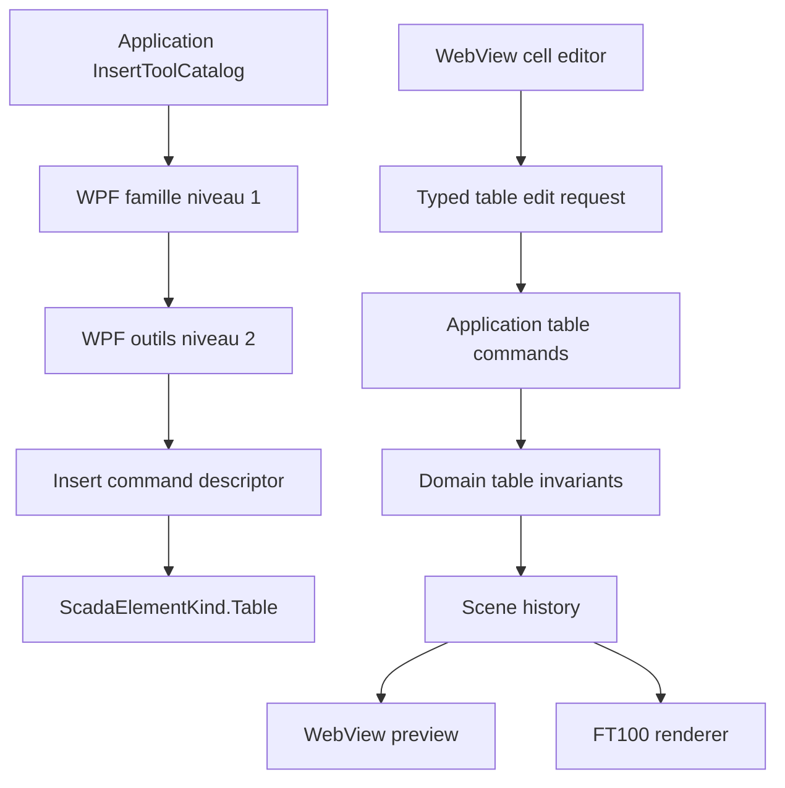

# Tableau moderne et ruban Inserer hierarchique - Specification de conception

Date: 2026-07-14
Status: Draft design - validation utilisateur requise avant planification
Document version: `V2.1.4.0013`

## Historique des changements

| Date | Version | Commit | Changement |
| --- | --- | --- | --- |
| 2026-07-14 | `V2.1.4.0013` | `PENDING` | Validation des cellules texte et inputs natifs sans `ValueBindings` cellule par cellule, avec export direct dans le HTML `.sb2` actuel. |
| 2026-07-14 | `V2.1.4.0012` | `PENDING` | Premiere specification du nouvel Element+ Tableau, de son edition type tableur, du ruban Inserer a deux niveaux et du refactor hors `MainWindow`. |

## 1. Probleme

### 1.1 Tableau de reference `win00012`

La scene `projects/AMR_REF_SCADA_V2/scenes/win00012.scene.json` contient 593 objets, dont 592 projections legacy. Le tableau visible est reconstruit a partir de 348 textes, 197 rectangles et 45 lignes. Le reproduire avec les outils actuels exige donc des centaines d'objets independants, sans relation structurelle entre cellules, rangees ou colonnes.

Les lignes et rectangles actuels ne permettent pas de :

1. redimensionner une colonne ou une rangee comme une unite;
2. fusionner ou defusionner des cellules;
3. appliquer un style coherent a une rangee ou une colonne;
4. conserver automatiquement une grille lors du redimensionnement;
5. modifier rapidement le contenu d'une serie de cellules;
6. sauvegarder le tableau comme un seul objet logique.

### 1.2 Ruban Inserer

`RibbonCommandCatalog.CreateDefault()` expose toutes les commandes d'insertion dans une liste unique de groupes. Cette structure grossit horizontalement a chaque nouvel outil. Le rendu WPF sait grouper les commandes, mais ne possede pas de niveau semantique superieur permettant de choisir d'abord une famille, puis les outils de cette famille.

Le dispatch est aussi fortement couple a `MainWindow.xaml.cs` :

1. un grand `switch` connait les ids de chaque outil;
2. des handlers historiques `OnInsert*Click` subsistent;
3. l'etat de placement est conserve dans la fenetre;
4. le nommage et la creation sont partiellement extraits dans `MainWindow.ElementFactory.cs`, mais restent membres de `MainWindow`.

### 1.3 Ecart avec les editeurs HMI modernes

La documentation officielle FactoryTalk View 16 organise les objets en familles : dessin, boutons, champs numeriques et texte, indicateurs, jauges, listes, alarmes et objets avances. Elle documente aussi un toolbox recherchable. Ces references confirment que le ruban Inserer doit devenir une porte d'entree hierarchique et extensible plutot qu'une rangee toujours plus longue :

1. <https://www.rockwellautomation.com/en-mde/docs/factorytalk-view/16-00-00/me-help-ditamap/graphic-objects-drawing-elements.html>
2. <https://www.rockwellautomation.com/en-no/docs/factorytalk-view/16-00-00/se-help-ditamap/factorytalk-view-site-edition-help/create-and-animate-graphic-displays/draw-simple-objects.html>
3. <https://www.rockwellautomation.com/en-us/docs/factorytalk-view/16-00-00/se-help-ditamap/factorytalk-view-site-edition-help/factorytalk-view-studio.html>

Cette comparaison sert a organiser les familles et le backlog. Elle ne signifie pas que les commandes futures deviennent artificiellement executables.

## 2. Objectifs

1. Creer un Element+ `Table` unique, persistable, redimensionnable et exportable.
2. Permettre la creation initiale avec un nombre configurable de rangees et de colonnes.
3. Permettre le redimensionnement externe du tableau et l'ajustement interne des largeurs de colonnes et hauteurs de rangees.
4. Permettre la selection rectangulaire de cellules, la fusion et la defusion.
5. Permettre l'edition de texte, l'insertion d'inputs natifs et l'application de couleurs au tableau, aux rangees, aux colonnes et aux cellules.
6. Garantir undo/redo, sauvegarde/recharge et parite preview/export.
7. Remplacer le ruban Inserer plat par un niveau 1 de familles et un niveau 2 d'outils.
8. Sortir le catalogue, le dispatch et les regles de mutation de `MainWindow`.
9. Elargir le catalogue visible vers les familles attendues d'un editeur SCADA moderne, en distinguant strictement outils disponibles et outils planifies.

## 3. Principes non negociables

1. Le tableau est un objet du modele V2, pas un assemblage WPF-only, un fragment HTML opaque ou du CSS avance.
2. Toute mutation utilisateur participe a l'historique de scene.
3. Preview et export consomment la meme definition de tableau.
4. Les selections de cellules, poignees de pistes et aides de dimension sont editor-only.
5. Aucun overlay ou handle n'est exporte dans `.sb2` ou `.sep`.
6. Les ids DOM de tableau et de cellules restent page-scopes.
7. L'UI collecte l'intention; Domain et Application portent les regles.
8. La selection interne d'une cellule ne modifie pas le contrat global Studio Element+ : Shift ajoute, Alt retire, rectangle replace/ajoute/retire.

## 4. Modele de domaine propose

### 4.1 Element+ Tableau

Ajouter `ScadaElementKind.Table` et une propriete optionnelle `ScadaElement.Table`.

```csharp
public sealed record ScadaTableDefinition(
    IReadOnlyList<ScadaTableColumn> Columns,
    IReadOnlyList<ScadaTableRow> Rows,
    IReadOnlyList<ScadaTableCell> Cells,
    ScadaTableStyle Style);

public sealed record ScadaTableColumn(
    double Width,
    ScadaTableBandStyle? Style = null);

public sealed record ScadaTableRow(
    double Height,
    ScadaTableBandStyle? Style = null,
    bool IsHeader = false);

public sealed record ScadaTableCell(
    int Row,
    int Column,
    int RowSpan = 1,
    int ColumnSpan = 1,
    ScadaTableCellContent? Content = null,
    ScadaTableCellStyle? Style = null);

public enum ScadaTableCellContentKind
{
    Text,
    InputText,
    InputNumeric
}

public sealed record ScadaTableCellContent(
    ScadaTableCellContentKind Kind,
    string Text = "",
    string Placeholder = "",
    double? NumericValue = null,
    double? Minimum = null,
    double? Maximum = null,
    double? Step = null,
    bool IsReadOnly = false);
```

Le code ci-dessus fixe la forme du contrat; les noms exacts pourront etre ajustes pendant la revue sans changer les invariants.

### 4.2 Invariants

1. Une colonne mesure au minimum 24 px.
2. Une rangee mesure au minimum 20 px.
3. Une cellule d'ancrage est identifiee par `(Row, Column)`.
4. `RowSpan` et `ColumnSpan` valent au minimum 1.
5. Une cellule fusionnee ne peut pas depasser les limites du tableau.
6. Deux cellules d'ancrage ne peuvent pas couvrir la meme coordonnee logique.
7. Une fusion exige une plage rectangulaire continue.
8. Les operations retournent une nouvelle definition; elles ne mutent pas les collections d'entree.
9. Les anciens projets sans propriete `Table` restent lisibles sans migration destructive.
10. Le contenu d'une cellule appartient au tableau; un input de cellule n'est pas un second `ScadaElement` positionne par-dessus la grille.
11. Aucun `ReadTagId`, `WriteTagId` ou `ValueBindings` cellule par cellule n'est cree dans cette tranche.

### 4.3 Creation initiale proposee

1. Dialogue avant placement avec nombre de rangees et colonnes.
2. Limites proposees : 1 a 64 rangees et 1 a 64 colonnes.
3. Preset propose : 6 rangees par 8 colonnes.
4. Taille initiale derivee de 96 px par colonne et 32 px par rangee.
5. Option `Premiere rangee comme en-tete` activee par defaut.

## 5. Edition type tableur proposee

### 5.1 Entree dans le mode cellule

1. Un clic normal selectionne le tableau comme Element+.
2. Un double-clic entre dans le mode d'edition interne.
3. Escape quitte le mode interne et revient a la selection du tableau.
4. La selection interne est un etat d'editeur temporaire et non persistant.

### 5.2 Selection de cellules

1. Clic : selection d'une cellule.
2. Shift+clic : extension d'une plage rectangulaire depuis l'ancre.
3. Glissement : selection d'une plage rectangulaire.
4. Ctrl+clic : ajout/retrait facultatif de cellules discontinues, uniquement pour appliquer un style; fusion interdite si la selection n'est pas rectangulaire.
5. Les modificateurs internes ne s'appliquent que lorsque le mode cellule est actif.

### 5.3 Contenu texte et inputs

1. Chaque cellule utilise un contenu `Text`, `InputText` ou `InputNumeric`.
2. `Text` reste le contenu par defaut.
3. Le ruban contextuel permet de transformer les cellules selectionnees en texte, entree texte ou entree numerique.
4. Un input remplit l'espace utile de la cellule et suit automatiquement son redimensionnement.
5. Un input texte conserve un texte initial et un placeholder.
6. Un input numerique peut conserver une valeur initiale, un minimum, un maximum et un pas.
7. Ces inputs sont des controles HTML natifs sans `ValueBindings`; leur valeur runtime reste locale a la page et n'est pas synchronisee avec un tag.
8. Double-clic ou F2 edite le texte ou la valeur initiale de la cellule.
9. Enter valide et descend d'une cellule.
10. Tab valide et avance.
11. Shift+Tab recule.
12. Escape annule l'edition courante sans annuler la selection.
13. Une cellule fusionnee edite uniquement le contenu de sa cellule d'ancrage.

### 5.4 Dimensions

1. Les poignees Element+ externes redimensionnent le tableau complet.
2. Le redimensionnement externe met a l'echelle les largeurs et hauteurs de pistes proportionnellement.
3. Les separateurs internes sont glissables.
4. Par defaut, glisser un separateur modifie deux pistes adjacentes et conserve la taille externe.
5. Alt+glissement modifie seulement la piste precedente et adapte la taille externe du tableau.
6. Les commandes `Distribuer uniformement` normalisent les pistes selectionnees.
7. Le feedback live est temporaire; une seule action d'historique est creee a la fin du geste.

### 5.5 Fusion et defusion

1. `Fusionner` exige une selection rectangulaire continue.
2. Une plage qui intersecte partiellement une fusion existante est refusee avec diagnostic.
3. Le contenu de la cellule superieure gauche est conserve, incluant son type texte ou input.
4. Les autres contenus sont conserves dans l'action d'historique pour permettre un undo exact.
5. `Defusionner` recree des cellules unitaires.
6. Apres recharge d'un projet, une defusion conserve le texte d'ancrage et cree des cellules vides pour les autres positions; les contenus couverts ne sont pas persistes en double.

## 6. Styles et couleurs

### 6.1 Portee

Le style peut etre applique a :

1. tout le tableau;
2. une ou plusieurs rangees;
3. une ou plusieurs colonnes;
4. une plage de cellules;
5. une cellule precise.

### 6.2 Proprietes proposees

1. fond;
2. premier plan;
3. couleur, largeur et style de grille;
4. alignement horizontal et vertical;
5. padding;
6. typographie de base;
7. style d'en-tete;
8. alternance de rangees optionnelle;
9. separateur specifique de rangee ou de colonne.

Le color picker existant est reutilise.

### 6.3 Precedence proposee

```text
Cellule > Rangee > Colonne > Tableau
```

La rangee est prioritaire sur la colonne afin que les bandes horizontales et les en-tetes restent previsibles. Une cellule peut toujours surcharger les deux.

## 7. Rendu preview et export

### 7.1 HTML semantique

Preview et export rendent la meme definition en :

1. `<table>`;
2. `<colgroup>` pour les largeurs;
3. `<tr>` pour les hauteurs;
4. `<th>` pour les rangees d'en-tete;
5. `<td>` pour les cellules normales;
6. `<input type="text">` ou `<input type="number">` pour les cellules input;
7. `rowspan` et `colspan` pour les fusions.

Le tableau utilise `table-layout: fixed`, des dimensions explicites et du CSS page-scope.

Les inputs sont exportes directement dans le fragment HTML de page. Le contrat `.sb2` actuel n'est pas modifie : aucune collection `ValueBindings` cellule par cellule n'est ajoutee et aucun nouveau script de page n'est requis. TF100Web recoit donc le tableau et ses inputs comme du HTML/CSS standard sous la racine page-scopee. Une valeur saisie au runtime n'est pas persistee apres rechargement de la page.

### 7.2 Namespace

Exemple :

```text
ft100-win00012__table_001
ft100-win00012__table_001__r2-c5
```

Aucun id global de type `cell1`, `row1` ou `table1` n'est permis.

### 7.3 Artefacts editor-only

Les elements suivants ne sont jamais exportes :

1. contour de cellule selectionnee;
2. rectangle de plage;
3. separateurs glissables;
4. labels de largeur/hauteur;
5. poignees de fusion;
6. caret ou champ d'edition temporaire;
7. commandes contextuelles.

## 8. Ruban Inserer a deux niveaux

### 8.1 Structure proposee

Quand l'onglet `Inserer` est actif :

1. niveau 1 : familles;
2. niveau 2 : groupes et outils de la famille selectionnee.

Le catalogue Application expose des `RibbonFamilyDefinition` stables. Le WPF ne deduit pas les familles a partir des libelles.

### 8.2 Familles initiales

| Famille | Outils actuels ou proposes |
| --- | --- |
| Texte et valeurs | Texte, entree texte, entree numerique, affichage numerique planifie, date/heure planifiee |
| Formes | Rectangle, ellipse, cercle, triangle, etoile, ligne, fleche, rectangle arrondi planifie, arc/polyligne/polygone planifies |
| Process | Voyant, barres, reservoir, tuyaux, vanne, pompe, moteur, ventilateur, convoyeur, jauge |
| Electrique | Interrupteur, disjoncteur, transformateur, balise alarme |
| Commandes | Bouton, bascule, navigation, acquittement, arret d'urgence, curseur/checkbox/radio planifies |
| Donnees | Tableau, liste planifiee, recette planifiee, messages planifies |
| Graphiques | Tendance, graphique, histogramme, alarmes - planifies |
| Media | Image, panneau, navigateur Web - planifies |

### 8.3 Regles de catalogue

1. Tous les ids executables actuels restent stables.
2. `insert.table` est le nouvel id executable propose.
3. Les outils planifies restent disabled avec raison explicite.
4. Chaque famille et commande visible possede une icone semantique vectorielle.
5. La derniere famille selectionnee est conservee pendant la session.
6. Selectionner un tableau peut exposer un ruban contextuel `Tableau`, distinct du ruban Inserer.
7. Le ruban contextuel propose `Cellules`, `Rangees et colonnes`, `Taille` et `Style`.

## 9. Refactor de responsabilites

### 9.1 Domain

Possede :

1. modeles de tableau;
2. invariants;
3. operations pures de fusion, defusion, insertion, suppression et dimensions.

### 9.2 Application

Possede :

1. catalogue hierarchique du ruban;
2. descripteurs generiques d'insertion;
3. commandes d'edition du tableau;
4. validation de contexte;
5. resultats et diagnostics;
6. integration a l'historique.

### 9.3 Rendering

Possede :

1. HTML/CSS exporte;
2. namespace DOM;
3. projection manifest;
4. parite avec le modele V2.

### 9.4 App

Possede uniquement :

1. rendu des deux niveaux de ruban;
2. dialogue de creation;
3. ruban contextuel;
4. adaptation des messages WebView;
5. color picker et feedback visuel.

### 9.5 Extraction de `MainWindow`

Le chantier doit :

1. remplacer les cases `insert.*` du grand `switch` par un `InsertToolDescriptor` generique;
2. supprimer les handlers `OnInsert*Click` non references;
3. extraire les view models de ruban de `MainWindow.NestedTypes.cs`;
4. extraire la coordination du ruban de `MainWindow.xaml.cs`;
5. isoler le bridge tableau dans un fichier ou controle dedie sans regles metier;
6. conserver dans `MainWindow` seulement l'adaptation au workspace actif.

## 10. Flux d'architecture cible



## 11. Persistance, migration et compatibilite

1. Aucun ancien objet n'est converti automatiquement en tableau.
2. `win00012` reste une preuve de besoin et une reference visuelle.
3. Une conversion assistee de ses 592 objets legacy est hors scope de cette tranche.
4. Les projets anciens deserialisent `Table = null` et conservent leur rendu.
5. Le nouveau HTML ne modifie pas le contrat de racine `.sb2`, les ids de page, les chemins ou la composition header/body/footer.
6. La sauvegarde/recharge doit conserver pistes, cellules, spans, contenus texte/input, valeurs initiales et styles.
7. Le manifest peut inclure la definition structurelle a des fins de diagnostic, sans creer un second modele runtime.

## 12. Tests et validation

### 12.1 Domaine

1. creation et normalisation 1x1, preset et limites;
2. rejet des dimensions invalides;
3. rejet des spans chevauchants;
4. fusion/defusion;
5. ajout/suppression de rangees et colonnes;
6. remappage des cellules et fusions;
7. precedence des styles.

### 12.2 Commandes et historique

1. undo/redo de creation;
2. undo/redo de piste;
3. undo/redo de fusion;
4. undo/redo de texte;
5. undo/redo de couleur;
6. mutation invalide sans effet sur scene ou historique.

### 12.3 Persistance

1. round-trip complet du modele;
2. lecture d'un projet ancien;
3. sauvegarde atomique de la scene contenant un tableau.

### 12.4 Preview et export

1. dimensions identiques;
2. textes et couleurs identiques;
3. `rowspan`/`colspan` valides;
4. inputs texte et numeriques exportes sans `ValueBindings`;
5. ids page-scopes;
6. absence d'artefacts editeur;
7. archive `.sb2` valide.

### 12.5 UI et architecture

1. niveau 1/famille puis niveau 2/outils;
2. famille active stable;
3. `insert.table` resolu generiquement;
4. absence des ids individuels `insert.shape.*`, `insert.hmi.*` et `insert.button.*` dans le dispatch `MainWindow`;
5. ruban contextuel visible uniquement pour un tableau;
6. raccourcis cellule sans regression de selection globale.

## 13. Hors scope initial

1. formules et calculs de type Excel;
2. tri, filtre et remplissage automatique;
3. import/export CSV ou Excel;
4. binding de tag par cellule;
5. persistance des valeurs saisies au runtime apres rechargement de page;
6. validation metier ou soumission runtime des inputs sans contrat de commande explicite;
7. conversion automatique de `win00012`;
8. tableaux virtualises de plusieurs milliers de lignes;
9. execution des outils planifies affiches dans les nouvelles familles;
10. changement de l'intake TF100Web des scripts de page.

## 14. Criteres d'acceptation proposes

1. Creer un tableau 16 colonnes par 10 rangees en une operation.
2. Redimensionner le tableau complet.
3. Ajuster une colonne et une rangee par glissement.
4. Fusionner une plage rectangulaire, modifier son texte, puis la defusionner.
5. Transformer des cellules en inputs texte et numeriques sans configurer de `ValueBindings`.
6. Appliquer des couleurs distinctes a un en-tete, une rangee, une colonne et une cellule.
7. Annuler et retablir chacune de ces operations.
8. Sauvegarder, fermer, recharger et retrouver la structure intacte.
9. Obtenir le meme tableau et les memes inputs en preview et dans `.sb2`, sans poignees ni selection editeur.
10. Naviguer dans le ruban Inserer par famille, puis par outil, sans defilement horizontal excessif.

## 15. Decision validee et points a valider avant le plan d'implementation

Decision validee : les cellules peuvent contenir des inputs texte ou numeriques natifs. Aucun `ValueBindings` cellule par cellule n'est requis dans cette tranche; les inputs sont exportes directement dans le HTML `.sb2` actuel.

Points restant a valider :

1. Confirmer le mode d'edition directement dans le canvas plutot qu'un dialogue modal principal.
2. Confirmer la politique de redimensionnement externe proportionnel.
3. Confirmer la precedence `Cellule > Rangee > Colonne > Tableau`.
4. Confirmer que les outils modernes non implementes peuvent etre visibles mais clairement desactives.
5. Confirmer les limites 64 x 64 et le preset 6 x 8.

La decision `DEC-0039` et le plan d'implementation ne doivent etre crees qu'apres validation de ces points.
