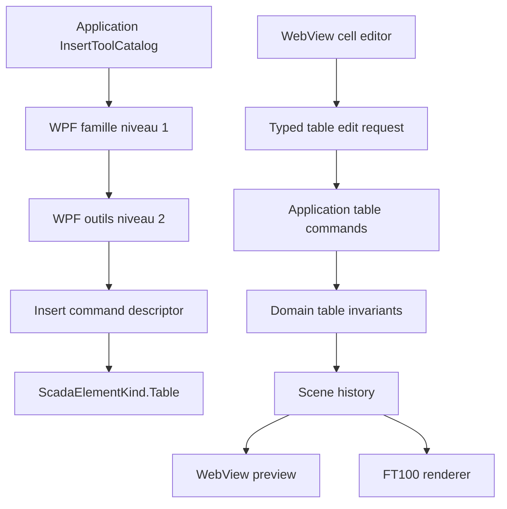

# Tableau moderne et ruban Inserer hierarchique - Specification de conception

Date: 2026-07-14
Status: Approved design - ready for implementation
Document version: `V2.1.4.0015`

## Historique des changements

| Date | Version | Commit | Changement |
| --- | --- | --- | --- |
| 2026-07-14 | `V2.1.4.0015` | `95a57ac` | Approbation utilisateur de la precedence de style propriete par propriete; specification entierement validee, rattachee a `DEC-0039` et prete pour execution du plan. |
| 2026-07-14 | `V2.1.4.0014` | `a95addd` | Precision du modele nullable et de ses valeurs effectives, des surfaces de proprietes Tableau, du menu contextuel type tableur, du presse-papiers, des dimensions de pistes et de la limite validee contre `win00012`; la precedence de style reste a confirmer. |
| 2026-07-14 | `V2.1.4.0013` | `766f8e2` | Validation des cellules texte et inputs natifs sans `ValueBindings` cellule par cellule, avec export direct dans le HTML `.sb2` actuel. |
| 2026-07-14 | `V2.1.4.0012` | `da244d9` | Premiere specification du nouvel Element+ Tableau, de son edition type tableur, du ruban Inserer a deux niveaux et du refactor hors `MainWindow`. |

## 1. Probleme

### 1.1 Tableau de reference `win00012`

La scene `projects/AMR_REF_SCADA_V2/scenes/win00012.scene.json` contient 593 objets : 592 projections legacy et un `InputNumeric`. Les 592 projections legacy comprennent 348 textes, 197 rectangles, 45 lignes et 2 boutons. Le tableau visible est donc reconstruit a partir de centaines d'objets independants, sans relation structurelle entre cellules, rangees ou colonnes.

Cette distribution exacte est conservee ici comme preuve du probleme et comme base de dimensionnement. Elle ne devient pas un contrat de conversion automatique de `win00012`.

Les lignes et rectangles actuels ne permettent pas de :

1. redimensionner une colonne ou une rangee comme une unite;
2. fusionner ou defusionner des cellules;
3. appliquer un style coherent a une rangee ou une colonne;
4. conserver automatiquement une grille lors du redimensionnement;
5. modifier rapidement le contenu d'une serie de cellules;
6. sauvegarder le tableau comme un seul objet logique.

### 1.2 Ruban Inserer

`RibbonCommandCatalog.CreateDefault()` expose toutes les commandes d'insertion dans une liste unique de groupes. Cette structure grossit horizontalement a chaque nouvel outil. Le rendu WPF sait grouper les commandes, mais ne possede pas de niveau semantique superieur permettant de choisir d'abord une famille, puis les outils de cette famille.

Le dispatch est aussi fortement couple a `MainWindow.xaml.cs` :

1. un grand `switch` connait les ids de chaque outil;
2. des handlers historiques `OnInsert*Click` subsistent;
3. l'etat de placement est conserve dans la fenetre;
4. le nommage et la creation sont partiellement extraits dans `MainWindow.ElementFactory.cs`, mais restent membres de `MainWindow`.

### 1.3 Ecart avec les editeurs HMI modernes

La documentation officielle FactoryTalk View 16 organise les objets en familles : dessin, boutons, champs numeriques et texte, indicateurs, jauges, listes, alarmes et objets avances. Elle documente aussi un toolbox recherchable. Ces references confirment que le ruban Inserer doit devenir une porte d'entree hierarchique et extensible plutot qu'une rangee toujours plus longue :

1. <https://www.rockwellautomation.com/en-mde/docs/factorytalk-view/16-00-00/me-help-ditamap/graphic-objects-drawing-elements.html>
2. <https://www.rockwellautomation.com/en-no/docs/factorytalk-view/16-00-00/se-help-ditamap/factorytalk-view-site-edition-help/create-and-animate-graphic-displays/draw-simple-objects.html>
3. <https://www.rockwellautomation.com/en-us/docs/factorytalk-view/16-00-00/se-help-ditamap/factorytalk-view-site-edition-help/factorytalk-view-studio.html>

Cette comparaison sert a organiser les familles et le backlog. Elle ne signifie pas que les commandes futures deviennent artificiellement executables.

## 2. Objectifs

1. Creer un Element+ `Table` unique, persistable, redimensionnable et exportable.
2. Permettre la creation initiale avec un nombre configurable de rangees et de colonnes.
3. Permettre le redimensionnement externe du tableau et l'ajustement interne des largeurs de colonnes et hauteurs de rangees.
4. Permettre la selection rectangulaire de cellules, la fusion et la defusion.
5. Permettre l'edition de texte, l'insertion d'inputs natifs et l'application de couleurs au tableau, aux rangees, aux colonnes et aux cellules.
6. Garantir undo/redo, sauvegarde/recharge et parite preview/export.
7. Remplacer le ruban Inserer plat par un niveau 1 de familles et un niveau 2 d'outils.
8. Sortir le catalogue, le dispatch et les regles de mutation de `MainWindow`.
9. Elargir le catalogue visible vers les familles attendues d'un editeur SCADA moderne, en distinguant strictement outils disponibles et outils planifies.
10. Offrir les proprietes Tableau dans le panneau droit et dans un dialogue dedie, sans dupliquer les regles ni les mutations.
11. Offrir un menu contextuel de cellule, rangee et colonne couvrant copier, coller, insertion, suppression, effacement, format et dimensions.

## 3. Principes non negociables

1. Le tableau est un objet du modele V2, pas un assemblage WPF-only, un fragment HTML opaque ou du CSS avance.
2. Toute mutation utilisateur participe a l'historique de scene.
3. Preview et export consomment la meme definition de tableau.
4. Les selections de cellules, poignees de pistes et aides de dimension sont editor-only.
5. Aucun overlay ou handle n'est exporte dans `.sb2` ou `.sep`.
6. Les ids DOM de tableau et de cellules restent page-scopes.
7. L'UI collecte l'intention; Domain et Application portent les regles.
8. La selection interne d'une cellule ne modifie pas le contrat global Studio Element+ : Shift ajoute, Alt retire, rectangle replace/ajoute/retire.

## 4. Modele de domaine propose

### 4.1 Element+ Tableau

Ajouter `ScadaElementKind.Table` et une propriete optionnelle `ScadaElement.Table`.

```csharp
public sealed record ScadaTableDefinition(
    IReadOnlyList<ScadaTableColumn>? Columns,
    IReadOnlyList<ScadaTableRow>? Rows,
    IReadOnlyList<ScadaTableCell>? Cells,
    ScadaTableStyle? Style = null)
{
    [JsonIgnore]
    public IReadOnlyList<ScadaTableColumn> EffectiveColumns =>
        Columns ?? Array.Empty<ScadaTableColumn>();

    [JsonIgnore]
    public IReadOnlyList<ScadaTableRow> EffectiveRows =>
        Rows ?? Array.Empty<ScadaTableRow>();

    [JsonIgnore]
    public IReadOnlyList<ScadaTableCell> EffectiveCells =>
        Cells ?? Array.Empty<ScadaTableCell>();

    [JsonIgnore]
    public ScadaTableStyle EffectiveStyle =>
        Style ?? ScadaTableStyle.Default;

    public static ScadaTableDefinition CreateDefault(
        int rows = 6,
        int columns = 8);
}

public sealed record ScadaTableColumn(
    double Width,
    ScadaTableFormat? Style = null);

public sealed record ScadaTableRow(
    double Height,
    ScadaTableFormat? Style = null,
    bool IsHeader = false);

public sealed record ScadaTableCell(
    int Row,
    int Column,
    int RowSpan = 1,
    int ColumnSpan = 1,
    ScadaTableCellContent? Content = null,
    ScadaTableFormat? Style = null);

public sealed record ScadaTableStyle(
    ScadaTableFormat? Base = null,
    ScadaTableFormat? Header = null,
    ScadaTableFormat? AlternatingRows = null)
{
    public static ScadaTableStyle Default { get; } = new(...);
}

public sealed record ScadaTableFormat(
    string? Background = null,
    string? Foreground = null,
    string? GridColor = null,
    double? GridWidth = null,
    string? GridStyle = null,
    string? HorizontalAlignment = null,
    string? VerticalAlignment = null,
    double? Padding = null,
    string? FontFamily = null,
    double? FontSize = null,
    string? FontWeight = null,
    string? FontStyle = null);

public enum ScadaTableCellContentKind
{
    Text,
    InputText,
    InputNumeric
}

public sealed record ScadaTableCellContent(
    ScadaTableCellContentKind Kind,
    string Text = "",
    string Placeholder = "",
    double? NumericValue = null,
    double? Minimum = null,
    double? Maximum = null,
    double? Step = null,
    bool IsReadOnly = false);
```

`ScadaTableFormat` est partage par les rangees, colonnes et cellules afin que chaque propriete puisse etre heritee ou surchargee independamment. Une valeur `null` signifie `Heriter`; elle ne signifie pas couleur transparente, largeur zero ou alignement vide.

Le code ci-dessus fixe la forme du contrat. Les enums de grille et d'alignement remplaceront les chaines illustratives pendant l'implementation sans changer les invariants.

### 4.2 Invariants

1. Une colonne mesure au minimum 24 px.
2. Une rangee mesure au minimum 20 px.
3. Une cellule d'ancrage est identifiee par `(Row, Column)`.
4. `RowSpan` et `ColumnSpan` valent au minimum 1.
5. Une cellule fusionnee ne peut pas depasser les limites du tableau.
6. Deux cellules d'ancrage ne peuvent pas couvrir la meme coordonnee logique.
7. Une fusion exige une plage rectangulaire continue.
8. Les operations retournent une nouvelle definition; elles ne mutent pas les collections d'entree.
9. Les anciens projets sans propriete `Table` restent lisibles sans migration destructive.
10. Le contenu d'une cellule appartient au tableau; un input de cellule n'est pas un second `ScadaElement` positionne par-dessus la grille.
11. Aucun `ReadTagId`, `WriteTagId` ou `ValueBindings` cellule par cellule n'est cree dans cette tranche.
12. Les collections et styles absents utilisent uniquement les proprietes effectives `[JsonIgnore]`; la deserialisation d'un ancien document ne reecrit pas silencieusement son JSON.
13. Toute definition creee par `CreateDefault` contient au moins une rangee et une colonne et respecte les limites de capacite.

### 4.3 Creation initiale proposee

1. Dialogue avant placement avec nombre de rangees et colonnes.
2. Limites validees pour la tranche initiale : 1 a 64 rangees et 1 a 64 colonnes.
3. Preset propose : 6 rangees par 8 colonnes.
4. Taille initiale derivee de 96 px par colonne et 32 px par rangee.
5. Option `Premiere rangee comme en-tete` activee par defaut.

L'analyse geometrique de `win00012` montre 16 positions de colonnes recurrentes dans sa grille la plus large et aucune zone n'approchant 64 rangees. Une capacite de 64 x 64, soit 4096 cellules logiques avant fusion, couvre donc largement cette reference. Le test de capacite doit inclure une grille representative de `win00012` et une grille maximale 64 x 64.

## 5. Edition type tableur proposee

### 5.1 Surfaces de proprietes

1. Le panneau droit existant `Propriete` est la surface rapide et vivante. Quand un tableau est selectionne, il affiche le contexte courant : `Tableau`, `Rangee n`, `Colonne n`, `Cellule r,c` ou `Plage r1,c1:r2,c2`.
2. Le panneau droit permet les changements courants de contenu, dimensions, alignement, couleurs, typographie, grille et heritage. Les champs mixtes d'une selection multiple sont affiches comme `Mixte` et ne sont changes que si l'utilisateur saisit une nouvelle valeur.
3. L'action existante `Propriete` ouvre un nouveau `TablePropertiesDialog` dedie. Le dialogue generique `ElementPropertiesDialog` ne doit pas absorber toute la complexite du tableau.
4. `TablePropertiesDialog` couvre les proprietes generales de l'Element+, la structure du tableau, les rangees et colonnes, les cellules, les inputs et les styles.
5. Le panneau droit et le dialogue reutilisent les memes view models, validateurs, controles d'edition et commandes Application. Ils ne maintiennent pas deux copies du modele.
6. Les changements du panneau droit sont appliques par commandes et historique lors de la validation du champ. Le dialogue regroupe ses changements valides dans une seule action d'historique lors de `Enregistrer`; `Annuler` ne modifie pas la scene.
7. Un `CellFormatDialog` dedie est reutilise par le menu contextuel pour formater la selection courante sans ouvrir tout le dialogue Tableau.

### 5.2 Entree dans le mode cellule

1. Un clic normal selectionne le tableau comme Element+.
2. Un double-clic entre dans le mode d'edition interne.
3. Escape quitte le mode interne et revient a la selection du tableau.
4. La selection interne est un etat d'editeur temporaire et non persistant.

### 5.3 Selection de cellules

1. Clic : selection d'une cellule.
2. Shift+clic : extension d'une plage rectangulaire depuis l'ancre.
3. Glissement : selection d'une plage rectangulaire.
4. Ctrl+clic : ajout/retrait facultatif de cellules discontinues, uniquement pour appliquer un style; fusion interdite si la selection n'est pas rectangulaire.
5. Les modificateurs internes ne s'appliquent que lorsque le mode cellule est actif.
6. En mode cellule, un bandeau de colonnes et une gouttiere de rangees editor-only permettent de selectionner une piste complete, d'ouvrir son menu et d'attraper son separateur.

### 5.4 Contenu texte et inputs

1. Chaque cellule utilise un contenu `Text`, `InputText` ou `InputNumeric`.
2. `Text` reste le contenu par defaut.
3. Le ruban contextuel permet de transformer les cellules selectionnees en texte, entree texte ou entree numerique.
4. Un input remplit l'espace utile de la cellule et suit automatiquement son redimensionnement.
5. Un input texte conserve un texte initial et un placeholder.
6. Un input numerique peut conserver une valeur initiale, un minimum, un maximum et un pas.
7. Ces inputs sont des controles HTML natifs sans `ValueBindings`; leur valeur runtime reste locale a la page et n'est pas synchronisee avec un tag.
8. Double-clic ou F2 edite le texte ou la valeur initiale de la cellule.
9. Enter valide et descend d'une cellule.
10. Tab valide et avance.
11. Shift+Tab recule.
12. Escape annule l'edition courante sans annuler la selection.
13. Une cellule fusionnee edite uniquement le contenu de sa cellule d'ancrage.

### 5.5 Dimensions

1. Les poignees Element+ externes redimensionnent le tableau complet.
2. Le redimensionnement externe met a l'echelle les largeurs et hauteurs de pistes proportionnellement.
3. Les separateurs internes sont glissables.
4. Par defaut, glisser un separateur modifie deux pistes adjacentes et conserve la taille externe.
5. Alt+glissement modifie seulement la piste precedente et adapte la taille externe du tableau.
6. Les commandes `Distribuer uniformement` normalisent les pistes selectionnees.
7. Le feedback live est temporaire; une seule action d'historique est creee a la fin du geste.
8. Chaque colonne et chaque rangee est redimensionnable manuellement depuis son separateur editor-only.
9. Le menu `Largeur de colonne...` ouvre un petit dialogue numerique parametrable; il applique la valeur aux colonnes selectionnees.
10. Le menu demande comme `Hauteur de cellule` est expose sous le libelle structurel `Hauteur de ligne...`, car une cellule seule ne peut pas avoir une hauteur differente des autres cellules de sa rangee sans briser la grille. Il ouvre le meme petit dialogue numerique parametrable et applique la valeur aux rangees selectionnees.
11. Pour une cellule simple, `Hauteur de ligne...` cible sa rangee et `Largeur de colonne...` cible sa colonne. Pour une plage, les commandes ciblent toutes les pistes couvertes.

### 5.6 Fusion et defusion

1. `Fusionner` exige une selection rectangulaire continue.
2. Une plage qui intersecte partiellement une fusion existante est refusee avec diagnostic.
3. Le contenu de la cellule superieure gauche est conserve, incluant son type texte ou input.
4. Les autres contenus sont conserves dans l'action d'historique pour permettre un undo exact.
5. `Defusionner` recree des cellules unitaires.
6. Apres recharge d'un projet, une defusion conserve le texte d'ancrage et cree des cellules vides pour les autres positions; les contenus couverts ne sont pas persistes en double.

### 5.7 Menu contextuel et presse-papiers

Le clic droit conserve la selection courante et adapte les commandes a la cible : cellule/plage, en-tete de rangee ou en-tete de colonne.

Commandes cellule ou plage :

1. `Copier`;
2. `Coller`;
3. `Inserer une ligne au-dessus` et `Inserer une ligne en dessous`;
4. `Inserer une colonne a gauche` et `Inserer une colonne a droite`;
5. `Supprimer la ou les lignes`;
6. `Supprimer la ou les colonnes`;
7. `Effacer le contenu`;
8. `Format de cellule...`;
9. `Hauteur de ligne...`;
10. `Largeur de colonne...`;
11. `Fusionner les cellules` ou `Defusionner les cellules`, selon le contexte.

Sur un en-tete de rangee, seules les commandes de rangee, contenu et format applicables sont affichees. Sur un en-tete de colonne, seules les commandes de colonne, contenu et format applicables sont affichees.

Regles du presse-papiers initial :

1. `Copier` exige une plage rectangulaire. Une fusion doit etre entierement incluse; une intersection partielle est refusee.
2. Le presse-papiers interne conserve le type de contenu, la valeur initiale, le placeholder, le format explicite de cellule et les fusions entierement incluses. Il ne copie pas les largeurs de colonnes, hauteurs de rangees ni styles de pistes.
3. Une representation texte tabulee est aussi placee dans le presse-papiers systeme pour permettre un collage vers ou depuis un tableur classique.
4. `Coller` a partir du format interne restaure contenu, format et fusions; un texte externe separe par tabulations et sauts de ligne cree du contenu `Text`.
5. Le collage commence a la cellule active. Il ne cree jamais implicitement de rangees ou colonnes; tout depassement est refuse avec diagnostic.
6. Un collage ne peut pas couper une fusion existante. La cible doit accepter le rectangle complet.
7. `Effacer le contenu` remet les cellules a un contenu `Text` vide tout en conservant formats, pistes et fusions.
8. Inserer une piste cree des cellules vides et reprend la dimension de la piste adjacente. Une insertion dans une fusion etend son span; une suppression remappe ou reduit les spans sans produire de chevauchement.
9. La derniere rangee ou la derniere colonne ne peut pas etre supprimee.
10. Toutes ces commandes sont atomiques et annulables/retablissables.

## 6. Styles et couleurs

### 6.1 Portee

Le style peut etre applique a :

1. tout le tableau;
2. une ou plusieurs rangees;
3. une ou plusieurs colonnes;
4. une plage de cellules;
5. une cellule precise.

### 6.2 Proprietes proposees

1. fond;
2. premier plan;
3. couleur, largeur et style de grille;
4. alignement horizontal et vertical;
5. padding;
6. typographie de base;
7. style d'en-tete;
8. alternance de rangees optionnelle;
9. separateur specifique de rangee ou de colonne.

Le color picker existant est reutilise.

### 6.3 Precedence validee

```text
Cellule > Rangee explicite > Bande de rangee > Colonne > Tableau > Defaut systeme
```

La precedence est evaluee propriete par propriete et non style complet par style complet. Pour chaque propriete `p` d'une cellule `(r, c)`, la valeur effective est la premiere valeur non `null` dans :

```text
Cellule[r,c].Style[p]
?? Rangee[r].Style[p]
?? BandeRangee(r).Style[p]
?? Colonne[c].Style[p]
?? Tableau.Style.Base[p]
?? ScadaTableStyle.Default.Base[p]
```

`BandeRangee(r)` represente le style d'en-tete ou l'alternance de rangee, si applicable. Une valeur explicite de rangee passe devant cette bande automatique. Le bouton `Heriter` efface uniquement la surcharge de la portee courante pour la propriete concernee.

Exemple : le tableau definit un fond blanc et un texte noir; la colonne 2 definit un texte bleu; les rangees alternees definissent un fond gris; la rangee 3 definit un fond orange; la cellule R3C2 definit le gras. R3C2 obtient alors un fond orange, un texte bleu et une typographie grasse. La couleur bleue de colonne n'est pas perdue parce que la rangee n'a surcharge que le fond.

Cette decision garde les en-tetes et bandes horizontales previsibles tout en permettant a une colonne de fournir les proprietes que la rangee ne definit pas.

## 7. Rendu preview et export

### 7.1 HTML semantique

Preview et export rendent la meme definition en :

1. `<table>`;
2. `<colgroup>` pour les largeurs;
3. `<tr>` pour les hauteurs;
4. `<th>` pour les rangees d'en-tete;
5. `<td>` pour les cellules normales;
6. `<input type="text">` ou `<input type="number">` pour les cellules input;
7. `rowspan` et `colspan` pour les fusions.

Le tableau utilise `table-layout: fixed`, des dimensions explicites et du CSS page-scope.

Les inputs sont exportes directement dans le fragment HTML de page. Le contrat `.sb2` actuel n'est pas modifie : aucune collection `ValueBindings` cellule par cellule n'est ajoutee et aucun nouveau script de page n'est requis. TF100Web recoit donc le tableau et ses inputs comme du HTML/CSS standard sous la racine page-scopee. Une valeur saisie au runtime n'est pas persistee apres rechargement de la page.

### 7.2 Namespace

Exemple :

```text
ft100-win00012__table_001
ft100-win00012__table_001__r2-c5
```

Aucun id global de type `cell1`, `row1` ou `table1` n'est permis.

### 7.3 Artefacts editor-only

Les elements suivants ne sont jamais exportes :

1. contour de cellule selectionnee;
2. rectangle de plage;
3. separateurs glissables;
4. labels de largeur/hauteur;
5. poignees de fusion;
6. caret ou champ d'edition temporaire;
7. commandes contextuelles.
8. bandeau de colonnes et gouttiere de rangees;
9. separateurs et indicateurs de pistes.

## 8. Ruban Inserer a deux niveaux

### 8.1 Structure proposee

Quand l'onglet `Inserer` est actif :

1. niveau 1 : familles;
2. niveau 2 : groupes et outils de la famille selectionnee.

Le catalogue Application expose des `RibbonFamilyDefinition` stables. Le WPF ne deduit pas les familles a partir des libelles.

### 8.2 Familles initiales

| Famille | Outils actuels ou proposes |
| --- | --- |
| Texte et valeurs | Texte, entree texte, entree numerique, affichage numerique planifie, date/heure planifiee |
| Formes | Rectangle, ellipse, cercle, triangle, etoile, ligne, fleche, rectangle arrondi planifie, arc/polyligne/polygone planifies |
| Process | Voyant, barres, reservoir, tuyaux, vanne, pompe, moteur, ventilateur, convoyeur, jauge |
| Electrique | Interrupteur, disjoncteur, transformateur, balise alarme |
| Commandes | Bouton, bascule, navigation, acquittement, arret d'urgence, curseur/checkbox/radio planifies |
| Donnees | Tableau, liste planifiee, recette planifiee, messages planifies |
| Graphiques | Tendance, graphique, histogramme, alarmes - planifies |
| Media | Image, panneau, navigateur Web - planifies |

### 8.3 Regles de catalogue

1. Tous les ids executables actuels restent stables.
2. `insert.table` est le nouvel id executable propose.
3. Les outils planifies restent disabled avec raison explicite.
4. Chaque famille et commande visible possede une icone semantique vectorielle.
5. La derniere famille selectionnee est conservee pendant la session.
6. Selectionner un tableau peut exposer un ruban contextuel `Tableau`, distinct du ruban Inserer.
7. Le ruban contextuel propose `Cellules`, `Rangees et colonnes`, `Taille` et `Style`.

## 9. Refactor de responsabilites

### 9.1 Domain

Possede :

1. modeles de tableau;
2. invariants;
3. operations pures de fusion, defusion, insertion, suppression et dimensions.

### 9.2 Application

Possede :

1. catalogue hierarchique du ruban;
2. descripteurs generiques d'insertion;
3. commandes d'edition du tableau;
4. validation de contexte;
5. resultats et diagnostics;
6. integration a l'historique.

### 9.3 Rendering

Possede :

1. HTML/CSS exporte;
2. namespace DOM;
3. projection manifest;
4. parite avec le modele V2.

### 9.4 App

Possede uniquement :

1. rendu des deux niveaux de ruban;
2. dialogue de creation;
3. ruban contextuel;
4. adaptation des messages WebView;
5. color picker et feedback visuel;
6. `TablePropertiesDialog`, `CellFormatDialog` et le petit dialogue parametrable de dimension;
7. controles WPF et view models dedies au panneau droit Tableau.

### 9.5 Extraction de `MainWindow`

Le chantier doit :

1. remplacer les cases `insert.*` du grand `switch` par un `InsertToolDescriptor` generique;
2. supprimer les handlers `OnInsert*Click` non references;
3. extraire les view models de ruban de `MainWindow.NestedTypes.cs`;
4. extraire la coordination du ruban de `MainWindow.xaml.cs`;
5. isoler le bridge tableau dans un fichier ou controle dedie sans regles metier;
6. conserver dans `MainWindow` seulement l'adaptation au workspace actif;
7. interdire l'ajout dans `MainWindow.xaml.cs` de calculs de grille, fusion, remappage, presse-papiers, validation, precedence de style ou construction de menu Tableau;
8. limiter les ajouts `MainWindow` a l'activation de la surface, au branchement de haut niveau du contexte actif et a la delegation vers les classes dediees;
9. placer la coordination UI Tableau dans des classes ou controles dedies et testables, par exemple `TableEditorCoordinator`, `TablePropertiesViewModel`, `TableContextMenuProvider` et `TableWebViewBridgeAdapter`; les noms finaux peuvent changer, mais pas cette separation.

## 10. Flux d'architecture cible



## 11. Persistance, migration et compatibilite

1. Aucun ancien objet n'est converti automatiquement en tableau.
2. `win00012` reste une preuve de besoin et une reference visuelle.
3. Une conversion assistee de ses 592 objets legacy est hors scope de cette tranche.
4. Les projets anciens deserialisent `Table = null` et conservent leur rendu.
5. Le nouveau HTML ne modifie pas le contrat de racine `.sb2`, les ids de page, les chemins ou la composition header/body/footer.
6. La sauvegarde/recharge doit conserver pistes, cellules, spans, contenus texte/input, valeurs initiales et styles.
7. Le manifest peut inclure la definition structurelle a des fins de diagnostic, sans creer un second modele runtime.

## 12. Tests et validation

### 12.1 Domaine

1. creation et normalisation 1x1, preset et limites;
2. rejet des dimensions invalides;
3. rejet des spans chevauchants;
4. fusion/defusion;
5. ajout/suppression de rangees et colonnes;
6. remappage des cellules et fusions;
7. precedence des styles.
8. insertion/suppression de pistes avec fusions;
9. copie/collage rectangulaire et refus des intersections partielles;
10. effacement de contenu sans perte de format.

### 12.2 Commandes et historique

1. undo/redo de creation;
2. undo/redo de piste;
3. undo/redo de fusion;
4. undo/redo de texte;
5. undo/redo de couleur;
6. mutation invalide sans effet sur scene ou historique.
7. undo/redo d'insertion et suppression de rangee/colonne;
8. undo/redo de collage et d'effacement.

### 12.3 Persistance

1. round-trip complet du modele;
2. lecture d'un projet ancien;
3. sauvegarde atomique de la scene contenant un tableau.

### 12.4 Preview et export

1. dimensions identiques;
2. textes et couleurs identiques;
3. `rowspan`/`colspan` valides;
4. inputs texte et numeriques exportes sans `ValueBindings`;
5. ids page-scopes;
6. absence d'artefacts editeur;
7. archive `.sb2` valide.

### 12.5 UI et architecture

1. niveau 1/famille puis niveau 2/outils;
2. famille active stable;
3. `insert.table` resolu generiquement;
4. absence des ids individuels `insert.shape.*`, `insert.hmi.*` et `insert.button.*` dans le dispatch `MainWindow`;
5. ruban contextuel visible uniquement pour un tableau;
6. raccourcis cellule sans regression de selection globale.
7. panneau droit contextualise pour tableau, rangee, colonne, cellule et plage;
8. dialogue Tableau dedie et `CellFormatDialog` utilisant les memes commandes et validateurs;
9. menu contextuel adapte a une cellule, une rangee ou une colonne;
10. hauteur de ligne et largeur de colonne modifiables par glissement et dialogue numerique;
11. test d'architecture interdisant les regles metier Tableau dans `MainWindow`;
12. creation, sauvegarde et rendu d'une grille maximale 64 x 64 dans les limites de performance acceptees.

## 13. Hors scope initial

1. formules et calculs de type Excel;
2. tri, filtre et remplissage automatique;
3. import/export CSV ou Excel;
4. binding de tag par cellule;
5. persistance des valeurs saisies au runtime apres rechargement de page;
6. validation metier ou soumission runtime des inputs sans contrat de commande explicite;
7. conversion automatique de `win00012`;
8. tableaux virtualises de plusieurs milliers de lignes;
9. execution des outils planifies affiches dans les nouvelles familles;
10. changement de l'intake TF100Web des scripts de page.
11. copie des dimensions de pistes ou des styles de rangee/colonne par le presse-papiers.
12. ajout implicite de pistes lors d'un collage hors limites.

## 14. Criteres d'acceptation proposes

1. Creer un tableau 16 colonnes par 10 rangees en une operation et verifier qu'une structure equivalente a `win00012` demeure sous la limite 64 x 64.
2. Redimensionner le tableau complet.
3. Ajuster une colonne et une rangee par glissement.
4. Fusionner une plage rectangulaire, modifier son texte, puis la defusionner.
5. Transformer des cellules en inputs texte et numeriques sans configurer de `ValueBindings`.
6. Appliquer des couleurs distinctes a un en-tete, une rangee, une colonne et une cellule.
7. Annuler et retablir chacune de ces operations.
8. Sauvegarder, fermer, recharger et retrouver la structure intacte.
9. Obtenir le meme tableau et les memes inputs en preview et dans `.sb2`, sans poignees ni selection editeur.
10. Naviguer dans le ruban Inserer par famille, puis par outil, sans defilement horizontal excessif.
11. Modifier les proprietes depuis le panneau droit et depuis le dialogue Tableau sans divergence de resultat.
12. Copier/coller une plage, inserer et supprimer une rangee ou une colonne, effacer le contenu sans perdre le format, puis annuler chaque operation.
13. Ajuster manuellement les separateurs et saisir une hauteur de ligne ou une largeur de colonne precise depuis le menu contextuel.
14. Verifier que `MainWindow` ne contient que le branchement de haut niveau des surfaces Tableau.

## 15. Decisions validees pour `DEC-0039`

Decisions validees :

1. Les cellules peuvent contenir des inputs texte ou numeriques natifs. Aucun `ValueBindings` cellule par cellule n'est requis dans cette tranche; les inputs sont exportes directement dans le HTML `.sb2` actuel.
2. L'edition principale se fait directement dans le canvas. Le panneau droit `Propriete` est contextualise et un nouveau `TablePropertiesDialog` porte l'edition detaillee.
3. Le redimensionnement externe est proportionnel; les pistes restent aussi redimensionnables manuellement.
4. Les outils modernes non implementes restent visibles, clairement desactives et accompagnes d'une raison.
5. La limite initiale est 64 rangees x 64 colonnes, avec preset 6 x 8; elle couvre la grille de reference `win00012`.
6. Le menu contextuel Tableau couvre copier/coller, insertion/suppression de pistes, effacement de contenu, format de cellule, hauteur de ligne, largeur de colonne et fusion/defusion.
7. Les regles metier et la coordination detaillee du Tableau sont interdites dans `MainWindow`; seuls les branchements de haut niveau y sont permis.
8. La precedence est `Cellule > Rangee explicite > Bande de rangee > Colonne > Tableau > Defaut systeme`, evaluee propriete par propriete avec `null = Heriter`.

Aucune decision produit ne reste ouverte. `DEC-0039` enregistre cette architecture et le plan `docs/superpowers/plans/2026-07-14-modern-table-and-insert-ribbon.md` en organise l'execution.
