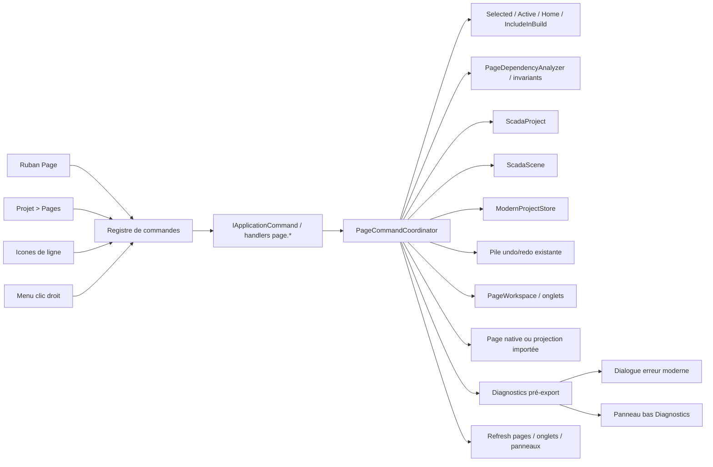

# Spécification — Commandes de gestion des pages

Date: 2026-07-14
Status: Implemented — automated validation complete; manual isolated-copy UI verification pending
Document version: `V2.1.4.0010`
Portée: SCADA Builder V2 — gestion des pages dans le ruban et le panneau Projet
Dépendances: `docs/04_editor/COMMANDS_CONTRACT_V2.md`, `docs/04_editor/MENUS_AND_SURFACES_CONTRACT_V2.md`, `docs/04_editor/STATE_MANAGEMENT_CONTRACT_V2.md`, `docs/02_architecture/DATA_MODEL_OVERVIEW_V2.md`

## Historique des changements

| Date | Version | Commit | Changement |
| --- | --- | --- | --- |
| 2026-07-14 | `V2.1.4.0010` | `PENDING` | Tranche implémentée : identité, commandes, historique, persistance, pages natives, surfaces et diagnostics; migration réelle toujours soumise à autorisation. |
| 2026-07-14 | `V2.1.4.0009` | `c5d6f0e` | Décisions finales confirmées : onglet `Pages`, nouvelle page exclue du build par défaut et duplication d’une page importée conservant automatiquement sa projection Wonderware. |
| 2026-07-14 | `V2.1.4.0008` | `c5d6f0e` | Décisions confirmées : `PageKey` GUID immuable, `PageCode` visible et modifiable, diagnostics modernes, sauvegarde atomique compatible, commandes éditeur asynchrones, historique au niveau projet et provenance d’import Wonderware générique. |
| 2026-07-14 | `V2.1.4.0007` | `c5d6f0e` | Revue de complétude fondée sur le code : séparation des états de page, prise en charge des pages sans source legacy, provenance de source, dépendances modernes, historique projet, identité exportable et cycle de vie des onglets. |
| 2026-07-14 | `V2.1.4.0006` | `c5d6f0e` | Précision de l’audit : undo/redo et navigation existants; ajout des besoins d’extraction hors de `MainWindow`, de modèles réutilisables et de diagnostics de compilation. |
| 2026-07-14 | `V2.1.4.0005` | `c5d6f0e` | Audit de l’architecture actuelle et spécification initiale des commandes communes de gestion des pages. |

---

## 1. Problème

La gestion des pages est actuellement partielle et dispersée :

1. Le ruban principal ne possède pas de surface de commandes dédiée aux pages.
2. L’utilisateur ne peut pas créer, renommer, dupliquer ou supprimer une page depuis l’application.
3. Le panneau `Projet > Pages` affiche seulement une liste textuelle.
4. Aucun bouton d’action rapide n’est présent sur les lignes de page.
5. Le clic droit sur une page ne produit aucun menu.
6. Les opérations de page ne possèdent pas encore de service applicatif commun ni de contrat de validation partagé entre les surfaces UI.

Ces lacunes empêchent notamment de créer proprement une page de travail comme `win00012_1` depuis SCADA Builder V2. Dans cette spec, `win00012_1` est seulement un exemple de `PageCode` proposé lors d’une duplication; le suffixe ne crée aucune hiérarchie ni relation parent/enfant.

## 2. Audit architectural — état vérifié

### 2.1 Modèle de page et persistance

Le modèle de projet possède déjà les concepts nécessaires :

- `ScadaProject.Scenes` contient les références de pages dans le modèle persistant et dans `project.json`;
- `ScadaProject.Pages` est un alias métier/UI marqué `JsonIgnore`; il ne constitue pas un second champ JSON;
- `ScadaSceneReference` porte l’identifiant, le titre, le chemin, le type, les dimensions, le fond, la compilation et la composition header/footer;
- `ScadaScene` porte le contenu durable de la page;
- `ModernProjectStore` sait charger et sauvegarder un projet et une scène;
- `ScadaProjectBuildValidator` valide les références de page, la page d’accueil, les compositions et les cibles d’actions.

Fichiers audités :

- `src/ScadaBuilderV2.Domain/Projects/ProjectModels.cs`;
- `src/ScadaBuilderV2.Infrastructure/ModernProjects/ModernProjectStore.cs`;
- `src/ScadaBuilderV2.Infrastructure/ReferenceProjects/ReferenceScadaProjectReader.cs`.

### 2.2 Limite actuelle entre source Wonderware importée et projet moderne

`MainWindow.LoadReferenceProjectAsync` charge le manifeste legacy dans `_referenceProject`, puis alimente `PagesListBox.ItemsSource` avec `_referenceProject.Pages`.

Le projet moderne est chargé dans `_modernProject`, mais les pages ajoutées uniquement au projet moderne ne sont pas injectées dans la liste affichée du panneau Projet. `ModernProjectStore.MergeSceneReferences` sait fusionner les références, mais l’UI ne consomme pas encore cette liste comme source d’affichage principale.

La future gestion des pages doit donc afficher les références du projet moderne, avec les pages Wonderware importées comme inventaire initial et les pages créées par l’utilisateur comme pages Scada+ de premier ordre.

### 2.3 Surface ruban et dispatch

Le ruban est déjà piloté par métadonnées applicatives :

- `RibbonCommandCatalog.CreateDefault()` définit les onglets, groupes, libellés, icônes, tooltips et états activé/désactivé;
- `MainWindow.InitializeRibbonCommandRegistry()` charge le catalogue;
- `MainWindow.ExecuteRibbonCommand(string commandId)` contient actuellement un `switch` WPF pour le dispatch;
- les commandes sont rendues depuis `ActiveRibbonGroups` et non depuis une liste de boutons XAML dupliquée.

Le catalogue ne contient toutefois aucun groupe ni identifiant `page.*`. Le dispatch actuel est également concentré dans `MainWindow`, alors que `IApplicationCommand`, `CommandRegistry` et `ApplicationContext` existent déjà dans la couche Application sans être encore utilisés comme architecture complète pour les commandes de pages.

### 2.4 Panneau Projet

Le panneau Projet est actuellement un `ListBox` WPF avec `DisplayMemberPath="Title"` :

```text
MainWindow.xaml
  ProjectAnchorable
    PagesListBox
```

Il ne fournit pas :

- de modèle de ligne enrichi;
- de boutons d’action;
- de menu contextuel;
- de sélection explicite au clic droit;
- d’état d’activation, de compilation ou de type de page visible dans chaque ligne.

### 2.5 Historique et états distincts d’une page

L’application possède déjà une pile polymorphe undo/redo. Les opérations de page devront donc s’intégrer à ce mécanisme existant plutôt que créer un second historique. Elles mutent à la fois :

- `ScadaProject.Scenes`;
- un ou plusieurs fichiers `scenes/*.scene.json`;
- potentiellement `HomePageId`;
- potentiellement les cibles d’actions et les références header/footer;
- l’état des onglets ouverts et de la page active dans l’éditeur.

La navigation runtime via `Command Event` existe déjà. L’audit du code montre toutefois que `Compiler cette page` correspond à `IncludeInBuild`; cette case indique l’inclusion dans le package et ne représente pas la page active de l’éditeur.

Le contrat doit distinguer explicitement quatre états :

1. page sélectionnée dans le panneau Projet;
2. page active dans l’onglet d’édition;
3. page d’accueil runtime (`HomePageId`);
4. page incluse dans la compilation (`IncludeInBuild`).

Un clic droit peut sélectionner une ligne sans ouvrir la page. L’ouverture explicite ou le clic principal active l’onglet. Les commandes ne doivent jamais déduire l’un de ces états à partir d’un autre.

Les opérations restent des mutations de projet transactionnelles et ne doivent pas être implémentées comme une simple modification locale du `ListBox`.

### 2.6 Limite de `MainWindow`

`MainWindow` porte déjà une quantité importante de responsabilités WPF, de dispatch et de synchronisation WebView. Toute nouvelle logique métier de page ajoutée dans cette classe augmenterait la dette existante et rendrait les commandes difficiles à tester et à réutiliser.

La gestion des pages doit donc être extraite vers des classes Application dédiées. `MainWindow` ne doit conserver que l’adaptation des événements UI, l’injection du contexte et le rafraîchissement des vues.

### 2.7 Recherche, organisation et réutilisation

La liste des pages est actuellement une liste textuelle sans outils de recherche ou d’organisation suffisants. La tranche initiale doit mettre en place les briques qui permettront ultérieurement :

- recherche et filtrage par titre, identifiant et type;
- tri et organisation persistables sans dépendre de l’ordre legacy;
- distinction entre pages normales, header, footer, accueil et modèles;
- création d’une page à partir d’un modèle réutilisable;
- extension future vers dossiers, favoris et modèles de projet.

Les dossiers et la réorganisation avancée peuvent rester hors de la première livraison, mais le modèle de vue et les contrats ne doivent pas enfermer l’interface dans un simple `ListBox` de chaînes.

### 2.8 Tests existants et couverture manquante

La suite possède déjà :

- `RibbonCommandCatalogTests` pour les identifiants et métadonnées du ruban;
- `ReferenceScadaProjectReaderTests` pour la lecture de l’inventaire legacy;
- `ModernProjectStoreTests` pour la persistance de projet et de scènes;
- `EditorHistoryServiceTests` pour l’historique de scènes;
- des tests de contrat de menus et de code-behind dans `WebViewContextMenuScriptTests`.

Il n’existe pas encore de couverture dédiée à :

- la création d’une référence de page;
- le renommage d’un titre de page;
- la duplication d’une scène;
- la suppression sécurisée d’une page;
- la liste de pages issue du projet moderne;
- le menu contextuel du panneau Projet;
- les actions rapides d’une ligne de page;
- la cohérence entre ruban, icônes de ligne et menu contextuel.
- l’intégration des commandes de page à la pile polymorphe undo/redo;
- la recherche, le filtrage et l’organisation de la liste moderne;
- les diagnostics de cohérence avant compilation/export `.sb2`.

### 2.9 Références de code vérifiées

Les constats précédents sont appuyés par les éléments de code suivants :

| Sujet | Référence actuelle | Constat / implication |
| --- | --- | --- |
| Modèle de projet | `src/ScadaBuilderV2.Domain/Projects/ProjectModels.cs` — `ScadaSceneReference`, `ScadaProject.Pages`, `ScadaProject.HomePageId`, `ScadaProject.EffectiveHomePageId` | Le modèle possède déjà les métadonnées nécessaires à une gestion moderne des pages. |
| Compilation d’une page | `src/ScadaBuilderV2.Domain/Projects/ProjectModels.cs` — `ScadaSceneReference.IncludeInBuild`; `src/ScadaBuilderV2.Domain/Scenes/ScadaSceneModels.cs` — `WithIncludeInBuild` | La page compilée est déjà une propriété du modèle; la gestion de page doit la manipuler via le modèle. |
| Accueil / compilation | `src/ScadaBuilderV2.App/MainWindow.xaml.cs` — `SetHomePageId`, `OnIncludeInBuildClick`, `RefreshSceneProperties`; `MainWindow.xaml` — `IncludeInBuildCheckBox` et `HomePageCheckBox` | Les règles de page d’accueil et de compilation existent déjà et devront être déplacées progressivement vers le service page. Ces propriétés ne définissent pas l’onglet actif. |
| Validation de projet | `src/ScadaBuilderV2.Domain/Projects/ProjectModels.cs` — `ScadaProjectBuildValidator.Validate`, `AuditOrphanedEventBindings`; `src/ScadaBuilderV2.Rendering/Ft100SceneExporter.cs` — `ExportAsync` | La validation existe déjà et est appelée par l’export; la gestion des pages doit l’alimenter et exposer ses diagnostics. |
| Persistance moderne | `src/ScadaBuilderV2.Infrastructure/ModernProjects/ModernProjectStore.cs` — `EnsureReferenceModernProjectAsync`, `LoadOrCreateSceneAsync`, `SaveSceneAsync`, `SaveProjectAsync`, `UpsertSceneReferenceAsync`, `MergeSceneReferences` | Le store sait sauvegarder mais ne fournit pas encore le cycle de vie complet des pages ni une transaction de projet. |
| Limite de la liste actuelle | `src/ScadaBuilderV2.App/MainWindow.xaml.cs` — `LoadReferenceProjectAsync`; `src/ScadaBuilderV2.App/MainWindow.xaml` — `PagesListBox` | `PagesListBox.ItemsSource` est assigné à `_referenceProject.Pages`; le projet moderne n’est pas encore la source d’affichage principale. |
| Ruban | `src/ScadaBuilderV2.Application/Commands/RibbonCommandCatalog.cs` — `CreateDefault`; `src/ScadaBuilderV2.App/MainWindow.xaml.cs` — `InitializeRibbonCommandRegistry`, `SetActiveRibbon`, `ExecuteRibbonCommand` | Les onglets actuels sont `File`, `Edit`, `Screen`, `Selection`, `Tools`, `Insert`; aucun groupe page n’est déclaré et le dispatch reste dans `MainWindow`. |
| Registre générique | `src/ScadaBuilderV2.Application/Commands/IApplicationCommand.cs`, `CommandRegistry.cs`, `ApplicationContext.cs`, `ToggleSelectionLockCommand.cs` | Les briques génériques existent, mais le registre est encore utilisé partiellement; il faut l’étendre aux commandes page. |
| Undo/redo | `src/ScadaBuilderV2.Application/History/EditorHistoryService.cs` — `IEditorHistoryAction`, `Push`, `UndoAsync`, `RedoAsync`; `SceneSnapshotChangedAction.cs` | Une pile polymorphe existe déjà, mais son contexte est orienté scène; les mutations de projet nécessiteront une action compatible ou une extension du contrat. |
| Historique dans le shell | `src/ScadaBuilderV2.App/MainWindow.xaml.cs` — appels à `History.Push(new SceneSnapshotChangedAction(...))`; classe interne `SceneWorkspaceTab` | `MainWindow` pousse directement les actions de scène à plusieurs endroits, ce qui confirme la nécessité d’extraire la gestion page et ses actions. |
| Navigation | `src/ScadaBuilderV2.App/MainWindow.xaml.cs` — `OnPageSelectionChanged`, `OpenSceneTabAsync`, `LoadSceneForProjectExportAsync` | La sélection et l’ouverture de page existent déjà; la tranche doit les réutiliser et publier un rafraîchissement après mutation. |
| Menu contextuel existant | `src/ScadaBuilderV2.App/MainWindow.xaml.cs` — `ShowContextMenuForRequestAsync`, `BuildContextMenuCommands`; `MainWindow.WebViewScript.cs` — `openContextMenu`, `renderContextMenuCommands` | Le menu contextuel concerne les objets du canvas WebView, pas les pages du panneau Projet. |
| Tests de ruban | `tests/ScadaBuilderV2.Tests/RibbonCommandCatalogTests.cs` — `DefaultCatalogDefinesExpectedTopRibbonTabs` | Le test verrouille actuellement l’absence de l’onglet page; il devra être mis à jour. |
| Tests d’historique | `tests/ScadaBuilderV2.Tests/EditorHistoryServiceTests.cs` | Le mécanisme undo/redo est déjà couvert; il faut ajouter les mutations de projet/page sans dupliquer le service. |
| Tests de persistance et validation | `tests/ScadaBuilderV2.Tests/ModernProjectStoreTests.cs`, `OfficialSceneDomainTests.cs`, `Ft100SceneExporterTests.cs` | La base de test existe pour le store, le Domain et l’export; les cas de cycle de vie des pages restent à ajouter. |
| Tests de menus | `tests/ScadaBuilderV2.Tests/WebViewContextMenuScriptTests.cs`, `HtmlPreviewControlContextMenuTests.cs` | La couverture vise le menu des éléments/canvas; aucune couverture ne valide le clic droit d’une page dans `PagesListBox`. |

Ces références devront être conservées dans le plan d’implémentation et les tests de régression afin que l’extraction hors de `MainWindow` reste mesurable.

### 2.10 Lacunes critiques découvertes pendant la revue

La revue de complétude a identifié les éléments suivants, à traiter dans la première tranche parce qu’ils conditionnent directement la création et la duplication de pages :

1. **Une page moderne sans entrée legacy ne peut pas être ouverte actuellement.** `OpenSceneTabAsync` reçoit un `ReferenceScadaPage`, `SceneWorkspaceTab` conserve ce type Infrastructure et `LoadActiveTabPreviewAsync` exige `_activeReferencePage`.
2. **Une page moderne sans source HTML legacy ne peut pas être exportée.** `BuildFt100ProjectExportInputsAsync` refuse toute page absente de `_referenceProject.Pages`; `Ft100ProjectPageExportInput.SourceHtmlPath` est obligatoire et `Ft100SceneExporter.ExportAsync` exige un fichier existant.
3. **La provenance de page n’est pas représentée durablement.** `ScadaSceneReference.RelativePath` désigne le fichier de scène, pas la projection HTML legacy. Une duplication de `win00012` ne peut donc pas indiquer qu’elle réutilise provisoirement la source de `win00012`.
4. **Le validateur ne couvre pas toutes les dépendances de page.** `ValidateSceneActions` valide les fragments popup, mais pas `ScadaActionKind.Navigate`. `ValidateSceneCommandBindings` vérifie surtout les tags et ne valide pas les `ScadaCommandBinding.TargetPageId` de la configuration moderne.
5. **Un titre moderne peut être remplacé en mémoire au prochain chargement.** `ModernProjectStore.MergeSceneReferences` reconstruit une référence existante à partir de l’inventaire legacy et ne préserve pas explicitement son `Title`; le projet moderne doit devenir propriétaire des métadonnées après l’import initial.
6. **La pile polymorphe est actuellement liée à une scène.** `IEditorHistoryAction.SceneId`, `EditorHistoryContext.ReplaceActiveScene` et le contrôle de `ActiveSceneId` ne permettent pas encore de restaurer `ScadaProject.Scenes`, les onglets et un fichier supprimé. Il faut généraliser le contexte existant, sans créer une deuxième pile concurrente.
7. **L’identité de page n’est pas protégée pour tous les usages.** L’identifiant devient un nom de fichier, un segment de chemin ZIP/URL, une clé de manifeste et une partie du namespace DOM. Une unicité `StringComparer.Ordinal` ne protège pas contre les collisions de casse sur Windows ni les caractères invalides.
8. **Le dirty state est uniquement orienté scène/onglet.** Renommer, créer ou supprimer une page modifie le projet même si aucune géométrie de scène ne change. Un dirty state projet et une confirmation de fermeture sont nécessaires.
9. **La duplication peut produire des identifiants d’actions en collision.** `CreateActionId` inclut la cible de page et le manifeste global regroupe les `ActionDefinitions` par `action.Id`. Toute cible auto-référente réécrite doit régénérer son action id et mettre à jour les `ScadaObjectEventBinding.ActionId` associés.
10. **La sauvegarde réordonne actuellement les pages.** `UpsertSceneReferenceAsync` applique `OrderBy(Id)`. Ce comportement empêcherait une organisation persistante définie par l’utilisateur et doit être retiré avant d’exposer l’organisation comme contrat.
11. **L’export n’affiche qu’une erreur de prévalidation.** Les handlers d’export filtrent les erreurs puis affichent `errors[0]` dans la barre d’état. Un diagnostic exploitable doit présenter toutes les erreurs et permettre d’identifier la page, l’élément ou la commande concernée.
12. **Les mutations de propriétés page restent dans `MainWindow`.** `OnIncludeInBuildClick`, `SetHomePageId`, la composition header/footer et la synchronisation des références devront utiliser le même service applicatif que les nouvelles commandes, même si toutes ces opérations ne deviennent pas des boutons du ruban.
13. **Les métadonnées sont dupliquées entre référence et scène.** Titre, type, canevas, fond, compilation et composition existent dans `ScadaSceneReference` et `ScadaScene`; `SaveSceneAsync` reconstruit ensuite la référence depuis la scène. Sans propriétaire explicite, un renommage ou un undo peut être écrasé par une sauvegarde ultérieure.

## 3. Objectif

Fournir une gestion complète des pages depuis trois surfaces cohérentes :

1. un onglet `Pages` dans le ruban principal;
2. des actions rapides dans chaque ligne du sous-menu `Projet > Pages`;
3. un menu contextuel sur clic droit d’une page.

Les trois surfaces doivent appeler les mêmes commandes stables et partager les mêmes règles d’activation, de validation, de confirmation, d’undo/redo et de diagnostic. La navigation runtime existante est conservée. La sélection du panneau, l’onglet actif, la page d’accueil et l’inclusion dans le build restent quatre états indépendants.

La première tranche doit également rendre une page Scada+ native réellement autonome : elle doit pouvoir être créée, ouverte, prévisualisée, sauvegardée et exportée sans exiger une entrée dans l’inventaire Wonderware importé.

L’utilisateur manipule uniquement `PageCode` et `Title`. L’application utilise `PageKey` pour toutes les relations durables, de sorte qu’une correction du code humain ne casse ni navigation, ni composition, ni historique. L’adaptateur d’export préserve intégralement le contrat `.sb2` fondé sur les codes humains.

## 4. Décisions proposées

| # | Décision |
|---|---|
| D1 | Les quatre opérations utilisent les identifiants stables `page.new`, `page.rename`, `page.duplicate` et `page.delete`. |
| D2 | Le ruban expose un onglet `Pages` avec un groupe `Gestion` contenant les quatre commandes. |
| D3 | Le panneau Projet affiche les pages du projet moderne (`ScadaProject.Scenes`) et non uniquement l’inventaire legacy. |
| D4 | Chaque ligne affiche au minimum le titre, l’identifiant, le type, l’état de compilation et des boutons/icônes pour renommer, dupliquer et supprimer; un bouton `+` au niveau de la section crée une nouvelle page. |
| D5 | Le clic droit sélectionne d’abord la page sous le pointeur, puis ouvre un `ContextMenu` contenant les mêmes commandes `page.*`. |
| D6 | Une page possède trois identités distinctes : `PageKey`, GUID logique interne immuable et jamais affiché; `PageCode`, identifiant humain technique visible, unique et modifiable; `Title`, nom descriptif visible et modifiable. `page.rename` modifie `Title`; `page.change-code` modifie `PageCode`. |
| D7 | `page.duplicate` crée un nouveau `PageKey` et un `PageCode` unique, copie la scène et ses métadonnées, puis ajoute une nouvelle référence au projet. Si la source possède une projection Wonderware importée, le duplicata conserve automatiquement cette projection et sa provenance. Les actions externes qui ciblaient la source restent liées à son `PageKey`; les auto-références internes au duplicata sont réécrites vers le nouveau `PageKey`. |
| D8 | `page.delete` refuse la suppression de la page d’accueil, d’un header ou d’un footer encore référencé, ainsi que toute page ciblée par une action ou commande. Les dépendances doivent être résolues manuellement avant suppression. Aucun nettoyage, remplacement ou retrait de lien n’est effectué silencieusement. |
| D9 | Une nouvelle page est créée comme page `Default`, avec `IncludeInBuild = false`, le canevas du projet, un titre initial dérivé du `PageCode` et la composition header/footer de la page active lorsqu’elle est `Default`. Si aucune page n’est active ou si elle est `Header`, `Footer` ou `Fragment`, la nouvelle page ne reçoit aucune composition. L’utilisateur peut activer explicitement sa compilation dans le dialogue ou dans les propriétés. |
| D10 | Les mutations de page sont centralisées dans un service/coordinateur applicatif unique. Les surfaces WPF ne contiennent ni règles métier ni logique de persistance. |
| D11 | Une interface publique stable définit les commandes de page; une éventuelle `PageCommandBase` reste un détail interne optionnel. L’historique polymorphe est porté par le workspace projet afin qu’une action survive à la fermeture ou à la suppression d’un onglet. Les actions conservent une portée `Project` ou `Scene`. |
| D12 | Tout ce qui touche aux pages est extrait de `MainWindow` vers des services, commandes, modèles de vue et adaptateurs dédiés. `MainWindow` ne fait que connecter les surfaces et relayer les événements. |
| D13 | Chaque commande retourne un résultat explicite (`Changed`, message utilisateur, diagnostics et page concernée) afin que le ruban, le panneau et le menu contextuel présentent le même retour. |
| D14 | Les commandes modifient l’état d’édition, poussent une action d’historique et marquent le projet dirty. La commande Enregistrer persiste projet, scènes et suppressions de façon atomique. En cas d’échec, les fichiers durables et la liste UI restent dans l’état précédent. |
| D15 | Une commande de page ne modifie pas directement le DOM WebView; elle modifie le modèle projet/scène, puis publie un changement permettant au shell de rafraîchir les pages et l’onglet actif existants. |
| D16 | La recherche et l’organisation consomment les références modernes et reposent sur un modèle de vue extensible, avec tri/filtre séparés de l’inventaire importé. |
| D17 | La création à partir d’un modèle est préparée par un contrat de modèle de page, même si la bibliothèque de modèles complète est livrée dans une tranche ultérieure. |
| D18 | La validation de cohérence et les diagnostics sont exécutés avant et pendant l’export `.sb2`; un export incohérent est bloqué ou produit un résultat explicitement diagnostiqué selon le contrat d’export existant. |
| D19 | Les droits d’accès sont hors de cette tranche, mais les commandes doivent exposer un point d’extension pour une future politique d’autorisation sans déplacer les règles métier dans WPF. |
| D20 | Le contexte de commande distingue `SelectedPageId`, `ActiveEditorPageId`, `HomePageId` et `IncludeInBuild`. Le clic droit sélectionne sans ouvrir; `page.open` active explicitement l’onglet. |
| D21 | `SceneWorkspaceTab` et le panneau Projet consomment une abstraction de page moderne fondée sur `ScadaSceneReference`. Une référence Wonderware/importée devient une provenance optionnelle, pas l’identité de l’onglet. |
| D22 | `ScadaSceneReference` reçoit une origine/provenance rétrocompatible : page Scada+ native ou page importée, avec système source et identifiant source optionnels. Le projet actuel utilise `Wonderware` comme système d’import; le terme legacy ne devient pas un type de page central. |
| D23 | Preview et export acceptent une page Scada+ native sans source HTML importée. Rendering possède le contrat du document natif et conserve la parité du modèle avec l’export `.sb2`; Infrastructure résout seulement les projections importées optionnelles. |
| D24 | Une politique `PageCodePolicy` valide et propose les codes visibles. Le format initial est `^[a-z][a-z0-9_-]{0,63}$`; les identifiants portables réservés sont interdits et les collisions sont détectées sans tenir compte de la casse. Les contrôles réels de chemin et de confinement restent dans Infrastructure. |
| D25 | Le dirty state inclut le projet. La fermeture de l’application, la fermeture d’un onglet supprimé et le changement de projet ne doivent jamais perdre silencieusement une mutation de page. |
| D26 | Un `PageDependencyAnalyzer` inspecte toutes les scènes, compilées ou non, parcourt récursivement les Element+ et retourne des dépendances structurées : accueil, header/footer, références internes de page et onglets ouverts. Une provenance Wonderware désigne une source externe et n’est pas assimilée automatiquement à une dépendance vers la page Scada+ portant le même code. |
| D27 | La duplication réécrit les auto-références dans les deux modèles d’actions, régénère les identifiants d’actions concernés et met à jour les bindings d’événement qui les référencent. Les références vers d’autres pages restent inchangées. |
| D28 | Après l’import initial, les métadonnées modernes ont préséance. `MergeSceneReferences` ajoute les pages importées manquantes sans écraser code, titre, type, ordre, compilation, composition ou provenance d’une référence moderne existante. |
| D29 | L’ordre de `ScadaProject.Scenes` est stable. Une nouvelle page est ajoutée après la page sélectionnée ou à la fin; une sauvegarde de scène ne réordonne pas l’inventaire. Le tri et le filtrage visuels ne modifient pas cet ordre durable. |
| D30 | `IApplicationCommand` devient un contrat éditeur asynchrone canonique avec `ExecuteAsync(ApplicationContext, CancellationToken)`. Les commandes sont non réentrantes. Ce contrat reste distinct de `ScadaCommandBinding`, qui représente les commandes runtime exportées dans `.sb2` et ne change pas. |
| D31 | La suppression utilise une préanalyse. Une page ouverte ou dirty est capturée avant fermeture. Le fichier n’est retiré qu’au succès de la sauvegarde atomique; un undo après sauvegarde restaure la page en mémoire, marque le projet dirty et recrée le fichier à la sauvegarde suivante. |
| D32 | Les opérations page existantes sont extraites avec les nouvelles : `page.open`, `page.properties`, `page.change-code`, `page.set-build-inclusion`, `page.set-home`, `page.set-type`, `page.set-composition` et `page.validate`. Elles utilisent le même service même lorsqu’elles ne sont pas visibles dans le ruban. |
| D33 | Les erreurs de cohérence bloquent l’export `.sb2`; les avertissements sont non bloquants. La surface de diagnostic affiche la collection complète avec page, élément/commande, code et correction possible, plutôt que seulement la première erreur. |
| D34 | `ScadaProject.Scenes` est l’autorité pour l’inventaire et les métadonnées de page. Les champs dupliqués dans `ScadaScene` restent synchronisés pour compatibilité et rendu, mais `SaveSceneAsync` ne doit pas écraser une référence moderne plus récente sans contrôle de version/contexte. |
| D35 | Les erreurs bloquantes ouvrent une boîte de dialogue moderne et publient simultanément leurs diagnostics structurés dans un panneau inférieur `Diagnostics`, avec onglets `Erreurs`, `Avertissements` et `Informations`. |
| D36 | `PageKey` est la cible durable des références internes de page. L’export résout `PageKey` vers `PageCode` et continue d’émettre le contrat `.sb2` actuel : ids de manifeste, dossiers, racines DOM et `TargetPageId` humains. Aucun GUID n’est exposé dans `.sb2`. |
| D37 | La persistance de référence est une sauvegarde atomique de snapshot projet/workspace. Une nouvelle API est ajoutée avant migration des appels existants; `SaveSceneAsync` reste temporairement une façade compatible, puis perd son upsert implicite lorsque tous les workflows ont migré. |
| D38 | Le panneau de diagnostics est réutilisable par les commandes de page, la validation, la compilation, l’export `.sb2` et les futurs importateurs, notamment Wonderware vers Scada Element+. |

### 4.1 Matrice des commandes et surfaces

| Commande | Ruban Page | Panneau / icône | Menu contextuel | Propriétés |
| --- | --- | --- | --- | --- |
| `page.open` | Non | Double-clic/Entrée | Oui | Non |
| `page.new` | Oui | Bouton `+` | Oui, au niveau de la section | Non |
| `page.rename` | Oui | Oui | Oui | Non |
| `page.change-code` | Non | Code visible | Oui | Champ `Code page` |
| `page.duplicate` | Oui | Oui | Oui | Non |
| `page.delete` | Oui | Oui | Oui | Non |
| `page.properties` | Oui | Non | Oui | Ouvre/active le panneau |
| `page.set-build-inclusion` | Non | État visible | Oui | Case existante |
| `page.set-home` | Non | Badge visible | Oui | Case existante |
| `page.set-type` | Non | Type visible | Non | Contrôle existant |
| `page.set-composition` | Non | Résumé visible | Non | Contrôles existants |
| `page.validate` | Oui | Badge diagnostic | Oui | Non |

La présence d’une commande sur plusieurs surfaces ne crée jamais plusieurs handlers. Les surfaces construisent la même requête avec un `PageId` explicite et consultent la même règle `CanExecute`.

## 5. Architecture cible



### 5.1 Couche Application

La couche Application doit posséder le contrat des commandes de page et leur coordination. Le coordinateur reçoit un contexte de projet, de page active dans l’éditeur et de page sélectionnée; il ne dépend pas de WPF. Il réutilise le service d’historique polymorphe existant, généralisé à une portée projet, et publie des changements consommables par les vues.

Le contrat retenu est :

- `IApplicationCommand` comme interface publique canonique des commandes éditeur, avec `CanExecute` synchrone et `ExecuteAsync(ApplicationContext, CancellationToken)`;
- une éventuelle `PageCommandBase` interne seulement si elle élimine une duplication réelle de `CanExecute`, contexte ou résultat;
- quatre commandes concrètes minces (`NewPageCommand`, `RenamePageCommand`, `DuplicatePageCommand`, `DeletePageCommand`);
- un `PageCommandCoordinator` ou service applicatif pour les mutations, les dépendances et la préparation de la persistance;
- un `PageDependencyAnalyzer` sans dépendance WPF;
- un contexte de workspace permettant de synchroniser la sélection, les onglets et le dirty state projet.

Cette séparation évite de mettre toute la logique dans une grande classe abstraite et permet de tester les règles sans démarrer WPF.

Comme `IApplicationCommand.Execute` est actuellement synchrone alors que l’ouverture, la duplication et la persistance chargent des fichiers, il est remplacé par :

```csharp
Task<CommandResult> ExecuteAsync(
    ApplicationContext context,
    CancellationToken cancellationToken);
```

Les commandes purement synchrones retournent un `Task` complété. Le registre et l’adaptateur WPF attendent la commande, propagent l’annulation et exposent l’état occupé. Aucune commande ne bloque le thread WPF avec `.Wait()` ou `.Result`.

Ce contrat appartient exclusivement à l’éditeur. `ScadaCommandBinding`, ses ids, son JSON et sa sérialisation FT100/TF100Web ne sont pas modifiés par cette décision. Les tests d’export doivent démontrer que l’introduction des commandes éditeur asynchrones ne modifie pas le manifeste ni le HTML `.sb2`.

Le contexte expose également une politique d’autorisation applicative, initialement `AllowAll`. `CanExecute` combine état, dépendances, opération en cours et autorisation. Cette brique permet d’ajouter ultérieurement les droits sans modifier chaque bouton ni déplacer la politique dans `MainWindow`.

Le résultat de commande doit étendre le `CommandResult` actuel ou introduire un résultat spécialisé contenant au minimum : statut (`Succeeded`, `Cancelled`, `Blocked`, `Failed`), ids affectés, page à sélectionner/ouvrir, dirty state produit et diagnostics structurés. Une annulation utilisateur n’est pas une erreur et ne doit pas modifier l’historique.

### 5.2 Couche Domain

Le Domain doit porter les invariants purs :

- `PageKey` GUID non vide, immuable et unique;
- `PageCode` non vide, conforme à `PageCodePolicy` et unique sans distinction de casse;
- titre non vide;
- page supprimable ou protégée;
- page d’accueil valide;
- composition header/footer valide;
- proposition d’un nouveau `PageCode` déterministe;
- références internes cohérentes par `PageKey`;
- provenance valide : native ou importée avec système source résoluble.

Les règles de fichiers, d’onglets et de dialogues de confirmation restent hors du Domain.

Le modèle minimal comprend :

```text
ScadaSceneReference
  PageKey: Guid                 # interne, immuable, jamais affiché
  PageCode: string              # visible, modifiable, exporté comme Id
  Title: string                 # nom descriptif visible
  RelativePath: string          # chemin durable de la scène
  Origin: Native | Imported
  ImportProvenance?:
    SourceSystem                # ex. Wonderware
    SourceProjectId?
    SourcePageId?
    SourcePath?
```

`PageCodePolicy` porte la grammaire portable et l’unicité métier. Infrastructure complète cette validation avec les règles réelles de chemins, de confinement du projet et de collisions du système de fichiers.

Le chemin `RelativePath` ne doit pas être dérivé obligatoirement de `PageCode`. Les nouvelles pages peuvent utiliser `scenes/<PageKey:N>.scene.json`, ce qui permet de modifier le code humain sans déplacer le fichier. Les scènes existantes conservent leur chemin actuel pendant la migration.

Les références persistantes de composition, d’accueil, d’actions et de commandes reçoivent leur équivalent `HomePageKey`, `HeaderPageKey`, `FooterPageKey` et `TargetPageKey`. Les anciens champs `HomePageId`, `HeaderPageId`, `FooterPageId` et `TargetPageId` restent lisibles pendant la migration, mais ne sont plus la source canonique de l’éditeur. L’export construit un DTO runtime séparé qui résout les clés vers `PageCode` et conserve exactement les noms de champs attendus dans `.sb2`.

### 5.3 Couche Infrastructure

`ModernProjectStore` doit introduire une opération de snapshot atomique, par exemple `SaveWorkspaceSnapshotAsync`, couvrant :

- création de scène;
- copie de scène;
- renommage de titre sans déplacement de fichier;
- suppression de scène et de sa référence;
- sauvegarde du projet et des scènes comme un lot cohérent;
- restauration en cas d’erreur.

Les écritures utilisent un fichier temporaire puis un remplacement atomique. Le fichier de scène ne doit être supprimé qu’après validation des dépendances et après que le nouveau projet puisse être sérialisé sans erreur. Une suppression en attente doit conserver un snapshot suffisant pour undo/redo et récupération après échec de sauvegarde.

La transition ne modifie pas brutalement tous les appels existants :

1. ajouter et tester la nouvelle sauvegarde de snapshot;
2. conserver temporairement `SaveSceneAsync` comme façade compatible;
3. migrer les workflows de page et de propriétés vers le snapshot;
4. retirer l’appel implicite à `UpsertSceneReferenceAsync` lorsque tous les appelants fournissent un projet cohérent.

`MergeSceneReferences` devient une opération d’import idempotente : elle complète l’inventaire moderne avec les pages importées absentes, sans réinitialiser les métadonnées déjà sauvegardées et sans réordonner les pages.

La sauvegarde reçoit le snapshot projet et les scènes cohérentes produits par le service page. L’upsert automatique actuel ne doit plus décider seul du code, du titre, du type, de la compilation ou de la composition; ces métadonnées sont autoritaires dans `ScadaProject.Scenes` puis projetées dans `ScadaScene` pour preview/export et compatibilité JSON. Le même mécanisme temporaire+remplacement atomique s’applique aux migrations de `PageKey` et de provenance.

### 5.4 Couche App/WPF

Un adaptateur ou contrôleur de pages dédié adapte les commandes vers les surfaces. `MainWindow` ne doit plus devenir le propriétaire des opérations :

- `RibbonCommandCatalog` décrit les commandes;
- le panneau Projet utilise un modèle de ligne de page;
- les icônes de ligne et le `ContextMenu` utilisent les mêmes `CommandId`;
- le code-behind route les événements et rafraîchit l’affichage, sans dupliquer les mutations;
- la vue consomme un `PagesPanelViewModel` ou équivalent, incluant sélection, recherche, filtre et actions disponibles;
- `SceneWorkspaceTab` ne dépend plus de `ReferenceScadaPage` et conserve l’identité moderne plus une provenance optionnelle;
- une façade `PageWorkspaceEntry` permet une migration progressive des usages de `ReferencePage` sans casser les workflows existants;
- les commandes asynchrones exposent un état occupé commun afin d’empêcher double clic et exécution concurrente;
- un `DiagnosticsPanelViewModel` alimente le panneau inférieur et la boîte de dialogue bloquante depuis la même collection structurée.

### 5.5 Modèles de pages

Le contrat doit séparer une page créée vide d’une page créée à partir d’un modèle. Un modèle doit pouvoir fournir une scène initiale, des métadonnées et une composition standard sans imposer de dépendance à WPF. La bibliothèque complète de modèles, sa prévisualisation et son édition sont une tranche ultérieure, mais la commande `NewPage` doit accepter un modèle optionnel dès maintenant.

### 5.6 Diagnostic de compilation/export

Le service de validation de projet doit être appelé avant l’export `.sb2` et couvrir au minimum les identifiants, fichiers, références de pages, pages compilées, compositions header/footer et cibles des deux systèmes d’actions. Il doit notamment ajouter la validation manquante de `ScadaActionKind.Navigate` et de `ScadaCommandBinding.TargetPageId`. `Navigate` cible une page `Default` compilée; `OpenPopup`, `TogglePopup` et `ClosePopup` ciblent un `Fragment` compilé. La validation des cibles de page s’exécute même lorsqu’aucun catalogue de tags n’est chargé.

Les diagnostics doivent identifier la page, l’élément ou la commande, la propriété fautive, la cible, la sévérité et une correction possible. Ils doivent être réutilisables par l’interface de gestion des pages. Toutes les erreurs sont présentées; une erreur bloque l’export, alors qu’un avertissement reste non bloquant.

Le contrat actuel `ScadaBuildValidationIssue` ne porte que `PageId`. Il doit être enrichi par une localisation structurée rétrocompatible, par exemple `ElementId`, `CommandId`, `PropertyPath` et `TargetId`, afin d’éviter de parser le texte du message pour naviguer vers la cause.

`page.validate` exécute `ScadaProjectBuildValidator` sur le snapshot cohérent du workspace, complété par `PageDependencyAnalyzer` et `PageCodePolicy`. La commande ne compile pas et ne modifie pas le projet. Elle remplace le contenu du panneau Diagnostics, ouvre automatiquement l’onglet `Erreurs` lorsqu’une erreur existe et permet de naviguer vers la page ou l’objet concerné.

### 5.7 Workspace moderne et provenance d’import

Le workspace ouvre une page à partir de `ScadaSceneReference` et de `ScadaScene`. Une provenance d’import optionnelle fournit la projection HTML source lorsqu’elle existe. Sans projection importée, preview et export utilisent le document natif généré par Rendering.

La duplication d’une page importée conserve automatiquement la même projection Wonderware/importée et sa provenance. Ce comportement garantit le même rendu pendant la reconstruction, même si le duplicata reçoit un nouveau `PageCode`. La projection est référencée explicitement dans le modèle; elle ne doit jamais dépendre d’une correspondance implicite entre ce nouveau code et `_referenceProject.Pages`.

La duplication d’une page Scada+ native reste native. La conversion ultérieure d’un duplicata importé en page native constitue une opération explicite distincte, permise seulement lorsque tout le contenu requis est matérialisé en Element+. Elle est hors de la première tranche. Ultimement, l’importateur Wonderware produit des pages Scada+ et des Element+ tout en conservant `ImportProvenance` comme trace; la projection importée peut ensuite être retirée sans effacer cette provenance.

### 5.8 Historique et dirty state projet

Le service d’historique est porté par le workspace projet. Son contrat de contexte accepte une portée scène ou projet et survit à la fermeture d’un onglet. Une action de cycle de vie de page capture au minimum :

- le projet avant/après;
- la scène créée, supprimée ou dupliquée;
- la sélection et l’onglet actif avant/après;
- les onglets affectés et leur état dirty;
- les suppressions de fichiers en attente.

Undo/redo restaure le modèle et le workspace, puis marque le projet dirty. La persistance n’est finalisée que par le workflow Enregistrer, avec le même contrat atomique que la sauvegarde normale.

Le cycle de suppression est explicite :

```text
Existante
  -> page.delete
SuppressionEnAttente + projet dirty
  -> undo avant sauvegarde
Existante en mémoire

SuppressionEnAttente
  -> Enregistrer
Supprimée durablement + fichier absent
  -> undo
Restaurée en mémoire + projet dirty
  -> Enregistrer
Existante durablement + fichier recréé
```

Le snapshot de l’action projet reste disponible après une sauvegarde tant que la session d’historique n’est pas réinitialisée par fermeture/changement de projet. Redo applique le cycle inverse avec les mêmes garanties.

L’analyse de dépendances et la compilation utilisent un snapshot cohérent du workspace : la version en mémoire d’un onglet ouvert/dirty a préséance sur son fichier sauvegardé, tandis que les scènes fermées sont chargées depuis le store. Une suppression ne doit jamais ignorer une référence présente dans une scène non ouverte.

### 5.9 Migration des projets existants

L’ajout de `PageKey`, `PageCode` et de provenance doit rester compatible avec les `project.json` actuels :

1. `PageKey` absent : générer un GUID déterministe à partir de l’identité du projet et de l’ancien `Id`, puis le persister au prochain enregistrement atomique;
2. `PageCode` absent : reprendre l’ancien `Id` sans modifier le contrat exporté;
3. cible interne encore portée par `TargetPageId` : résoudre le code vers `PageKey`; une cible introuvable devient un diagnostic et n’est jamais remappée arbitrairement;
4. provenance absente et code trouvé dans l’inventaire Wonderware actuel : `Origin=Imported`, `SourceSystem=Wonderware`, `SourcePageId=ancien Id`;
5. provenance absente et code absent de l’inventaire importé : `Origin=Native`;
6. champs modernes présents : valeurs modernes autoritaires;
7. rechargements suivants : aucune métadonnée moderne ne doit être remplacée par l’inventaire importé.

La migration est idempotente et utilise la même sauvegarde temporaire+remplacement atomique. Un crash avant validation conserve l’ancien `project.json`; le chargement suivant peut recommencer sans générer un autre `PageKey`.

### 5.10 Contrat de rendu d’une page Scada+ native

Rendering possède un générateur de document natif commun au preview et à l’export. Le document contient au minimum :

1. une racine de page `ft100-<PageCode>` avec type, dimensions et fond issus du modèle;
2. une couche source vide, afin de conserver la structure commune avec les projections importées;
3. une couche Element+ rendue depuis `ScadaScene`;
4. du CSS strictement namespacé par `PageCode`;
5. les métadonnées d’état, de commande, de binding et de composition nécessaires au contrat existant;
6. aucun artefact d’éditeur dans la géométrie durable.

Le preview ajoute uniquement le bridge d’édition nécessaire à WebView. L’export ajoute uniquement les ressources runtime déjà prévues par le contrat FT100/TF100Web. Ces différences d’hôte ne doivent pas modifier le modèle, les bounds, les ids exportés ou la composition.

`win00009` reste la baseline des projections importées Wonderware. Une page native `Blank` possède une baseline dédiée vérifiant racine, couches, dimensions, fond, Element+, CSS namespacé et parité `.sb2`.

### 5.11 Performance de l’analyse des dépendances

`PageDependencyAnalyzer` s’exécute à la demande pour suppression et validation. Il charge les scènes fermées de façon asynchrone, utilise les versions dirty en mémoire, accepte un `CancellationToken` et affiche une progression si l’opération devient perceptible. Aucun cache n’est imposé dans la première tranche; un index incrémental ne sera ajouté qu’après mesure, afin d’éviter des résultats périmés après undo/redo.

## 6. Contrat utilisateur

### 6.1 Nouvelle page

La commande ouvre une boîte de dialogue minimale :

- identifiant proposé;
- `PageCode` proposé et modifiable;
- titre descriptif;
- type de page;
- compilation activée ou non, désactivée par défaut (`IncludeInBuild = false`);
- composition header/footer lorsque pertinente;
- modèle initial (`Blank` dans la première tranche);
- origine native ou provenance d’import lorsque la création provient d’une page existante.

`PageKey` est généré par l’application et n’est jamais affiché dans ce dialogue. La validation doit refuser un `PageCode` existant/invalide, un titre vide et une combinaison de type/composition invalide.

### 6.2 Renommer

Le dialogue modifie le titre visible de la page. `PageKey`, `PageCode` et le chemin restent inchangés. Le titre est mis à jour dans `ScadaSceneReference`, dans `ScadaScene` et dans les onglets ouverts; le prochain merge importé ne doit pas le remplacer.

### 6.2.1 Modifier le code de page

`page.change-code` modifie le `PageCode` visible après validation. `PageKey`, `RelativePath` et les références internes restent inchangés. Les cibles `.sb2`, dossiers exportés et namespaces DOM sont recalculés depuis le nouveau code au prochain export. Le dialogue présente les impacts exportés et refuse toute collision.

### 6.3 Dupliquer

La commande propose un `PageCode` et un titre, puis génère un nouveau `PageKey`. Elle copie la scène entière, y compris les éléments Element+, les événements, les actions, les bindings, le fond et les métadonnées de page. Une page importée conserve automatiquement sa projection Wonderware et sa provenance; une page native reste native. La commande réécrit les auto-références vers le nouveau `PageKey`, régénère les identifiants d’actions qui changent et évite toute collision globale dans le manifeste. Les ids d’Element+ peuvent rester identiques entre pages grâce au namespace par page; le duplicata ne devient jamais automatiquement la page d’accueil.

### 6.4 Supprimer

La commande affiche les dépendances bloquantes dans une boîte de dialogue moderne et publie la liste complète dans le panneau Diagnostics. L’analyse inclut accueil, compositions, actions importées, commandes modernes et onglets ouverts. Elle ne doit pas supprimer une page référencée; les liens doivent être corrigés manuellement.

### 6.5 États désactivés

Les commandes restent visibles lorsque possible, mais sont désactivées avec une raison accessible lorsque :

- aucune page n’est sélectionnée;
- la page est protégée;
- la page est la page d’accueil;
- la page est un header/footer utilisé;
- la page possède des dépendances bloquantes;
- une commande de page est déjà en cours;
- le projet n’est pas chargé.

### 6.6 Panneau Projet et organisation immédiate

La première tranche inclut une recherche texte par titre/`PageCode` et des filtres simples par type et inclusion dans le build. `PageKey` n’est jamais affiché ni recherché dans l’interface courante. Le filtrage conserve la page sélectionnée lorsqu’elle reste visible et ne change jamais l’ordre durable.

Le menu contextuel minimal contient `Ouvrir`, `Renommer`, `Dupliquer`, `Définir comme accueil`, `Inclure/exclure du build`, `Propriétés` et `Supprimer`. Les actions rapides visibles restent limitées à `Renommer`, `Dupliquer` et `Supprimer`, avec le bouton `+` au niveau de la section.

### 6.7 Clavier, accessibilité et retour utilisateur

Les raccourcis sont `Entrée` pour ouvrir, `F2` pour renommer, `Ctrl+D` pour dupliquer et `Suppr` pour supprimer lorsque le focus est dans le panneau Pages; ils appellent les mêmes ids de commandes. Les boutons icônes possèdent un tooltip, un nom accessible, un ordre de tabulation et une raison lisible lorsqu’ils sont désactivés.

Après création ou duplication, la nouvelle page est sélectionnée et ouverte. Après suppression, la sélection passe à la page voisine sans changer la page d’accueil implicitement.

### 6.8 Dialogue et panneau Diagnostics

Une erreur bloquant une commande ouvre un dialogue moderne contenant :

- un titre orienté action;
- un résumé compréhensible;
- le nombre d’erreurs et d’avertissements;
- les premières causes;
- les actions `Fermer` et `Afficher les erreurs`.

`Afficher les erreurs` active le panneau inférieur `Diagnostics`. Ses onglets `Erreurs`, `Avertissements` et `Informations` affichent code, message, page (`PageCode` et titre), élément/commande et correction possible. Un double-clic utilise `PageKey` pour ouvrir la bonne page, puis sélectionne l’objet ou la propriété lorsque la localisation le permet.

Le panneau conserve le dernier résultat de validation jusqu’à la prochaine exécution ou fermeture du projet. Il ne fait pas partie du modèle exporté et ne doit jamais apparaître dans `.sb2`.

## 7. Hors périmètre

1. Modification, affichage ou export de `PageKey`; le GUID logique demeure immuable et interne.
2. Réorganisation drag-and-drop des pages.
3. Gestion de dossiers ou sous-dossiers de pages.
4. Création de tableaux/grilles et outils créatifs; cette fonctionnalité aura une spécification séparée.
5. Bibliothèque complète, éditeur et prévisualisation de modèles de pages; seuls le contrat et le modèle `Blank` sont inclus.
6. Authentification et permissions opérateur; seuls les points d’extension sont prévus.
7. Nettoyage automatique ou réaffectation silencieuse des dépendances pendant une suppression.
8. Modification du runtime TF100Web au-delà des références de pages déjà exportées.

## 8. Validation et tests prévus

### 8.1 Tests Domain/Application

- création d’une page avec `PageKey` unique et `PageCode` valide;
- refus d’un `PageCode` existant, invalide, réservé ou en collision de casse;
- modification de `Title` et `PageCode` sans changement de `PageKey`;
- duplication complète d’une scène;
- nouveau `PageKey` et réécriture des auto-références lors d’une duplication;
- refus de suppression de la page d’accueil;
- refus de suppression d’un header/footer référencé;
- détection des `ScadaActionDefinition` et `ScadaCommandBinding` qui ciblent une page;
- validation d’une navigation vers une page absente, exclue du build ou du mauvais type;
- régénération des ids d’actions et des bindings associés lors d’une duplication auto-référente;
- résolution `PageKey -> PageCode` pour les diagnostics et l’export;
- `IApplicationCommand.ExecuteAsync` non réentrant, annulable et sans dépendance à `ScadaCommandBinding`;
- `page.validate` sans mutation du projet.

### 8.2 Tests de surface

- présence des commandes `page.new`, `page.rename`, `page.duplicate`, `page.delete` dans le catalogue;
- présence de `page.change-code` et `page.validate` sur leurs surfaces prévues;
- présence de l’onglet `Pages` et du groupe `Gestion`;
- cohérence des `CommandId` entre ruban, icônes de ligne et menu contextuel;
- affichage des pages modernes ajoutées au projet;
- clic droit sélectionnant la ligne correcte;
- clic droit ne changeant pas l’onglet actif avant `Ouvrir`;
- états activé/désactivé et raisons visibles;
- extraction des mutations hors de `MainWindow` vérifiée par tests de service;
- recherche et filtrage sans perdre la sélection ni modifier le modèle;
- mise à jour du titre dans la liste et les onglets;
- absence de `PageKey` dans les surfaces utilisateur;
- raccourcis limités au panneau Pages et sans conflit avec le canvas WebView;
- commande non réentrante pendant une opération asynchrone;
- dialogue d’erreur et panneau Diagnostics alimentés par la même collection;
- double-clic d’un diagnostic ouvrant la page par `PageKey`.

### 8.3 Tests d’intégration, persistance, preview et export

- rollback lorsque la persistance atomique échoue;
- restauration complète du projet et du workspace par undo/redo;
- suppression, sauvegarde, undo, nouvelle sauvegarde et recréation du fichier;
- création à partir du modèle de page `Blank`;
- création d’une page `Default` avec `IncludeInBuild = false`, puis activation explicite de sa compilation;
- migration déterministe et rétrocompatible de `PageKey`, `PageCode` et provenance Wonderware;
- préservation du titre, du code, des métadonnées et de l’ordre moderne pendant `MergeSceneReferences`;
- ouverture et preview d’une page native absente de `_referenceProject.Pages`;
- export `.sb2` d’une page native sans `SourceHtmlPath` importé;
- duplication d’une page importée conservant automatiquement sa projection Wonderware et sa provenance malgré le nouveau `PageCode`;
- export du duplicata importé à partir de cette projection conservée;
- blocage de l’export pour toutes les dépendances de page invalides;
- avertissements non bloquants et collection complète des diagnostics;
- absence de collision d’action dans le manifeste après duplication;
- sauvegarde atomique du projet et suppression de fichier seulement après succès;
- fermeture/réouverture conservant pages, clés, codes, titres, provenance, ordre et composition;
- modification de `PageCode` conservant toutes les références internes;
- manifeste, dossiers, ids DOM et `TargetPageId` `.sb2` utilisant `PageCode` et n’exposant jamais `PageKey`;
- comparaison de non-régression démontrant que le contrat `.sb2` reste inchangé après passage des commandes éditeur à l’asynchrone.

### 8.4 Validation manuelle

1. Créer une page de test.
2. La renommer.
3. La dupliquer.
4. Ouvrir le duplicata depuis le panneau Projet.
5. Utiliser chaque commande depuis le ruban, une icône de ligne et le clic droit.
6. Fermer et rouvrir le projet.
7. Vérifier la persistance et l’absence de fichiers orphelins.
8. Exécuter la validation de cohérence pendant le build/export `.sb2` et vérifier les diagnostics.
9. Créer une page `Blank` native sans source importée, la prévisualiser et l’exporter.
10. Dupliquer une page Wonderware importée, vérifier sa provenance, ses actions et l’absence de collision dans le manifeste.
11. Tester undo/redo pour création, renommage, duplication et suppression avant et après sauvegarde.
12. Modifier un `PageCode`, vérifier que les liens internes restent fonctionnels et que seul le code humain apparaît dans `.sb2`.
13. Provoquer plusieurs erreurs, vérifier le dialogue, le panneau Diagnostics et la navigation par double-clic.

## 9. Décisions produit confirmées

1. Le nouvel onglet du ruban se nomme `Pages`.
2. Une nouvelle page `Default` est exclue du build par défaut (`IncludeInBuild = false`); l’utilisateur active sa compilation explicitement.
3. La duplication d’une page importée conserve automatiquement la projection Wonderware et la provenance de la source.
4. `PageKey` demeure un GUID interne immuable et invisible; `PageCode` demeure l’identifiant humain visible et modifiable utilisé par le contrat d’export `.sb2`.
5. Aucune décision produit bloquante ne reste ouverte avant la préparation du plan d’implémentation.
