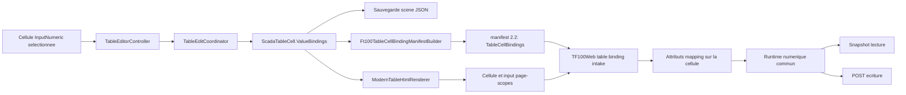

# Input numerique fonctionnel dans une cellule Tableau et TF100Web - Specification

Date: 2026-07-15
Status: Approved
Document version: `V2.1.4.0037`

## Historique des changements

| Date | Version | Commit | Changement |
| --- | --- | --- | --- |
| 2026-07-15 | `V2.1.4.0037` | `PENDING` | Specification approuvee, decision `DEC-0042` enregistree et plan d'implementation cross-repo cree. |
| 2026-07-15 | `V2.1.4.0036` | `PENDING` | Creation puis revue de la specification cross-repo : contraintes min/max natives conservees, reutilisation JS de l'input enfant detaillee et rupture manifest 2.2 rendue explicite. |

## 1. Objet et cycle de vie

Cette specification introduit une nouvelle capacite apres l'implementation des specifications Tableau precedentes. Elle ne modifie pas retrospectivement :

1. `2026-07-14-modern-table-and-insert-ribbon-design.md`;
2. `2026-07-15-table-ui-authoring-and-element-lock-design.md`;
3. `2026-07-15-table-lock-interaction-regression-correction-design.md`.

Ces documents restent approuves et implementes selon leur propre cycle de vie. La presente specification remplace uniquement leur ancien hors-scope concernant les `ValueBindings` cellule par cellule par une nouvelle tranche autonome qui devra recevoir sa propre decision d'architecture apres approbation.

La specification couvre deux depots sur une branche de meme nom :

1. SCADA Builder V2 : `F:\Groupe AMR\SCADA_AMR_GROUP\SCADA_BUILDER_V2`;
2. TF100Web : `F:\Projet\Git\TF100Web`;
3. branche commune : `codex/adding-table-cell-numeric-input`.

## 2. Probleme confirme

SCADA Builder V2 sait deja creer dans une cellule Tableau un contenu `InputNumeric` avec valeur initiale, placeholder, minimum, maximum, pas et lecture seule. Le rendu HTML produit un vrai `<input type="number">`.

Cependant, la cellule reste locale au navigateur :

1. `ScadaTableCellContent` ne porte pas de format d'affichage ni de bindings lecture/ecriture;
2. le validateur de projet inspecte uniquement `ScadaElement.Data.ReadTagId` et `WriteTagId`;
3. le manifest `.sb2` exporte uniquement `Objects[].ValueBindings` au niveau Element+;
4. TF100Web lit uniquement les bindings des objets de premier niveau du manifest;
5. le runtime TF100Web attache actuellement le controle numerique au wrapper Element+ et peut remplacer son contenu;
6. appliquer ce mecanisme tel quel au wrapper du Tableau remplacerait ou endommagerait le tableau au lieu de cibler une cellule;
7. les scripts de page emis par SCADA Builder apres la racine de page ne sont pas executes par l'intake fragment actuel de TF100Web.

Le moteur TF100Web existant fournit toutefois deja les primitives necessaires : resolution de `tf100.mapping.<id>`, polling des valeurs, format numerique, mappings lecture/ecriture distincts, controle `writeable`, POST d'ecriture, etats d'ecriture et protection de la valeur pendant l'edition.

## 3. Objectif utilisateur

Une cellule Tableau de type `InputNumeric` peut etre configuree comme un InputNumeric Element+ standard :

1. valeur initiale;
2. placeholder;
3. minimum;
4. maximum;
5. pas;
6. format d'affichage;
7. lecture seule;
8. binding `Lire valeur` facultatif;
9. binding `Ecrire valeur` facultatif, limite aux tags ecrivable;
10. lecture et ecriture sur deux mappings differents lorsque configure;
11. persistence projet, undo/redo, sauvegarde/recharge, preview, build et export coherents;
12. fonctionnement reel dans le runtime TF100Web apres deploiement du `.sb2`.

La cellule conserve les dimensions, le format, les bordures et la mise en page du Tableau. Le runtime ne transforme pas la cellule en Element+ independant et ne redimensionne pas le Tableau selon la longueur de la valeur.

## 4. Portee de cette tranche

### 4.1 Inclus

1. cellules `InputNumeric` seulement;
2. un binding de lecture et un binding d'ecriture facultatifs par cellule ancre;
3. format numerique identique au contrat InputNumeric standard;
4. authoring par cellule dans le ruban Tableau, le dialogue de proprietes et le panneau Propriete de droite;
5. persistance dans le modele scene;
6. validation contre le catalogue de tags du projet;
7. contrat manifest `.sb2` versionne;
8. intake et runtime host TF100Web;
9. tests unitaires, integration export/intake et validation manuelle sur un mapping reel.

### 4.2 Hors scope

1. `InputText` fonctionnel ou binding texte;
2. formules, expressions ou references entre cellules;
3. binding d'une rangee, colonne ou plage vers une structure de tags;
4. creation automatique de mappings TF100Web;
5. tableaux dynamiques alimentes par une liste ou une requete;
6. tri, filtre, pagination et virtualisation runtime;
7. persistance d'une valeur saisie dans le fichier projet;
8. execution des scripts de page SCADA Builder exclus par l'intake fragment TF100Web;
9. changement du protocole d'ecriture TF100Web ou des permissions operateur;
10. correction independante des regles de conversion numerique du runtime standard : la cellule utilise obligatoirement le meme chemin commun.

## 5. Comportement d'authoring

### 5.1 Selection et disponibilite

1. Le Tableau doit etre selectionne et le mode `Cellules` actif.
2. Les proprietes de binding sont modifiables seulement lorsque la selection correspond a une seule cellule ancre.
3. Une cellule couverte par une fusion redirige vers son ancre.
4. Une plage peut etre convertie en `InputNumeric`, mais aucun binding unique n'est applique automatiquement a toute la plage.
5. Si la cellule selectionnee n'est pas `InputNumeric`, la surface propose `Convertir en input numerique` avant d'afficher les bindings.

### 5.2 Surfaces UI

Le groupe `Input numerique` du ruban Tableau et le panneau Propriete affichent le meme etat contextuel :

1. type de cellule;
2. valeur initiale;
3. placeholder;
4. minimum, maximum et pas;
5. format d'affichage;
6. lecture seule;
7. resume `Lire valeur`;
8. resume `Ecrire valeur`;
9. boutons Ajouter, Modifier et Supprimer pour chaque binding.

Le menu `Proprietes du contenu` ouvre un dialogue dedie `TableNumericInputPropertiesDialog`. Ce dialogue reutilise les memes regles et le meme view model que le panneau de droite. Il ne duplique pas les validations dans le code-behind.

Le picker `Lire valeur` affiche tous les tags actifs. Le picker `Ecrire valeur` affiche uniquement les tags actifs dont `Writeable == true`.

### 5.3 Lecture seule

1. Une cellule en lecture seule peut porter un binding de lecture.
2. Une cellule en lecture seule ne peut pas porter un binding d'ecriture.
3. Activer `Lecture seule` alors qu'un binding d'ecriture existe exige une confirmation explicite de suppression du binding.
4. Annuler la confirmation conserve integralement l'etat precedent.

## 6. Modele persistant SCADA Builder V2

### 6.1 Contenu numerique

`ScadaTableCellContent` recoit le champ additif suivant :

```csharp
string? DisplayFormat = null
```

Les champs numeriques existants restent la source de verite pour la valeur initiale, le placeholder, le minimum, le maximum, le pas et la lecture seule.

### 6.2 Bindings de cellule

Un nouveau record Domain est ajoute :

```csharp
public sealed record ScadaTableCellValueBindings(
    string? ReadTagId = null,
    string? WriteTagId = null);
```

`ScadaTableCell` recoit un champ nullable additif :

```csharp
ScadaTableCellValueBindings? ValueBindings = null
```

Les bindings appartiennent a l'ancre de cellule et non a `ScadaTableDefinition`, a la rangee, a la colonne, au wrapper Tableau ou a un Element+ synthetique.

Cette separation est requise pour que le copier/coller de contenu ne duplique pas involontairement un mapping industriel.

### 6.3 Adresse de cellule

Aucun nouvel identifiant persistant de cellule n'est introduit dans cette tranche. L'identite runtime d'une cible est reconstruite depuis :

```text
TableElementId + Row + Column
```

Le binding suit l'objet `ScadaTableCell` lors des insertions de rangees ou colonnes. L'adresse DOM et le manifest sont regeneres ensemble au prochain preview/build/export. TF100Web ne doit pas conserver une adresse DOM entre deux versions deployees d'un package.

## 7. Regles des operations Tableau

1. Inserer une rangee ou une colonne deplace la cellule ancre et ses bindings avec son contenu.
2. Supprimer une rangee ou une colonne contenant des bindings exige une confirmation indiquant le nombre de bindings supprimes.
3. Fusionner est refuse lorsqu'une cellule liee autre que l'ancre superieure gauche serait absorbee.
4. Fusionner conserve les bindings de l'ancre superieure gauche.
5. Defusionner conserve les bindings sur l'ancre originale; les nouvelles cellules sont sans binding.
6. Convertir une cellule liee vers `Text` ou `InputText` exige une confirmation de suppression des bindings.
7. `Effacer le contenu` d'une cellule liee conserve son type `InputNumeric` et ses bindings, mais retire la valeur initiale.
8. Copier/coller ne copie jamais `ValueBindings`.
9. Coller une valeur dans une cellule liee conserve les bindings et exige une valeur numerique valide ou vide.
10. Couper/deplacer n'est pas introduit par cette tranche; le comportement actuel reste inchange.
11. Undo/redo restaure atomiquement le contenu, les bindings et toute operation structurelle confirmee.

## 8. Validation projet

Pour chaque cellule liee, le validateur de build applique les memes regles qu'a un InputNumeric Element+ standard :

1. la cible est un Tableau contenant une cellule ancre valide;
2. le contenu est `InputNumeric`;
3. le tag de lecture existe dans le catalogue actif;
4. le tag d'ecriture existe et `Writeable == true`;
5. le binding d'ecriture est absent lorsque `IsReadOnly == true`;
6. `Minimum <= Maximum` lorsque les deux sont definis;
7. `Step > 0` lorsqu'il est defini;
8. la valeur initiale respecte minimum et maximum;
9. le format d'affichage est vide ou conforme aux formats InputNumeric supportes;
10. la cible DOM calculee est unique dans la page exportee.

Les diagnostics utilisent le chemin stable suivant :

```text
Elements[<table-id>].Table.Cells[<row>,<column>]
```

Un export ne doit jamais rabattre un binding de cellule invalide sur le wrapper du Tableau.

## 9. Contrat `.sb2` propose

### 9.1 Version de manifest

L'implementation fait passer `ManifestVersion` de `2.1` a `2.2`. TF100Web accepte explicitement `2.1` et `2.2` :

1. `2.1` conserve le comportement actuel;
2. `2.2` ajoute `Objects[].TableCellBindings`;
3. une version majeure ou mineure inconnue produit un diagnostic explicite au deploiement au lieu d'une degradation silencieuse.

Ce changement est intentionnellement **rompant au deploiement** : apres cette implementation, tous les nouveaux exports SCADA Builder annonceront `2.2`, meme sans binding de cellule. Ils ne doivent donc pas etre deployes vers un TF100Web qui n'a pas encore recu le gate 2.1/2.2 et l'intake `TableCellBindings`. L'ordre de livraison obligatoire est TF100Web compatible 2.2, puis SCADA Builder exportant 2.2.

### 9.2 Forme JSON

Chaque objet `Kind == "Table"` peut contenir une collection `TableCellBindings`. Seules les cellules numeriques ayant au moins un binding sont incluses.

```json
{
  "Id": "table_001",
  "Kind": "Table",
  "ValueBindings": {
    "ReadTagId": null,
    "WriteTagId": null
  },
  "TableCellBindings": [
    {
      "Row": 2,
      "Column": 3,
      "TargetId": "table_001__cell-2-3",
      "Kind": "InputNumeric",
      "Data": {
        "Placeholder": "0.0",
        "DisplayFormat": "##.#",
        "IsReadOnly": false,
        "Min": 0,
        "Max": 100,
        "Step": 0.1
      },
      "ValueBindings": {
        "ReadTagId": "tf100.mapping.159",
        "WriteTagId": "tf100.mapping.160"
      }
    }
  ]
}
```

Regles contractuelles :

1. `TargetId` est non page-scope dans le manifest;
2. le DOM exporte utilise `ft100-<page-id>__<TargetId>`;
3. `TargetId` cible le conteneur de cellule, jamais le Tableau complet;
4. `ValueBindings` garde exactement les conventions du binding Element+ standard;
5. le catalogue `Tags` racine reste inchange;
6. les inputs numeriques non lies restent uniquement dans le HTML et n'alourdissent pas `TableCellBindings`;
7. aucune cellule n'est ajoutee comme faux objet dans `Objects[]`.

## 10. Contrat HTML et CSS

Pour une cellule ancre `(2,3)` :

```html
<td id="ft100-win00012__table_001__cell-2-3"
    data-row="2"
    data-column="3"
    data-scada-table-cell-kind="InputNumeric">
  <input id="ft100-win00012__table_001__cell-2-3__input"
         type="number">
</td>
```

Le renderer conserve les attributs HTML `value`, `placeholder`, `min`, `max`, `step` et `readonly` lorsque definis.

TF100Web injecte les attributs runtime de mapping sur le `<td>` cible, conformement au wrapper d'un InputNumeric standard. Il ne les injecte pas sur le wrapper du Tableau.

Le controle numerique runtime reutilise le `<input type="number">` enfant deja produit par SCADA Builder. Il ne fait pas `replaceChildren` sur la cellule. Les classes et etats runtime ne doivent pas modifier la largeur/hauteur des pistes, le padding, les bordures ou la grille du Tableau.

Les reperes A/1, selections, handles, separateurs editor-only et attributs de verrouillage restent exclus de l'export.

## 11. Intake et runtime TF100Web

### 11.1 Intake Python

TF100Web :

1. lit `TableCellBindings` en plus des bindings objet;
2. reutilise le parseur `ValueBindings` actuel pour `ReadTagId` et `WriteTagId`;
3. resout `TargetId` vers l'id page-scope;
4. injecte `data-scada-role="numeric"`, `data-scada-mapping-id`, `data-scada-write-mapping-id`, `data-scada-writeable`, `data-scada-writable`, `data-scada-format` et `data-scada-step`;
5. ignore une entree invalide avec un warning structure, sans l'appliquer au Tableau;
6. conserve la composition header/body/footer et les namespaces de page.

`min` et `max` ne sont pas reinjectes par TF100Web : `ModernTableHtmlRenderer` les a deja places comme attributs natifs sur l'`<input type="number">` enfant, et le navigateur les applique directement. Le runtime doit les conserver lorsqu'il reutilise cet input.

### 11.2 Runtime navigateur

Une cellule numerique liee utilise le meme chemin commun que l'InputNumeric standard :

1. le polling met a jour la valeur tant que le controle n'est pas en edition;
2. focus selectionne la valeur et suspend son remplacement par polling;
3. `Enter` ou blur valide et ecrit;
4. `Escape` restaure la derniere valeur confirmee;
5. un nombre invalide restaure la valeur precedente et affiche l'etat erreur;
6. l'ecriture utilise `data-scada-write-mapping-id` lorsqu'il est present, sinon le mapping de lecture;
7. le POST respecte CSRF, permissions, `writeable` et l'URL d'ecriture existante;
8. succes, attente et erreur utilisent le feedback runtime standard;
9. un controle read-only n'installe aucun handler d'ecriture;
10. la conversion format/datatype est executee par les fonctions communes, jamais par une implementation speciale Tableau.

Le runtime commun est adapte pour reutiliser un input enfant deja rendu. Les InputNumeric standards continuent de creer leur input lorsqu'aucun input enfant n'existe. Les deux formes doivent ensuite partager `commitNumeric`, `applyValue`, le polling et le feedback.

## 12. Flux cross-repo



## 13. Decoupage des classes et methodes

### 13.1 SCADA Builder V2 - Domain

| Classe/fichier | Changement | Methodes/proprietes attendues |
| --- | --- | --- |
| `ScadaTableModels.cs` | Ajouter le modele persistant | `ScadaTableCellValueBindings`, `ScadaTableCell.ValueBindings`, `ScadaTableCellContent.DisplayFormat`, fallbacks nullable |
| `ScadaTableCellBindingOperations.cs` | Nouvelle classe stateless | `SetBinding`, `RemoveBinding`, `GetBinding`, `EnumerateBindings`, `CountBindings`, `ValidateEditableNumericTarget` |
| `ScadaTableContentOperations.cs` | Preserver les bindings selon les regles de section 7 | `SetContent`, `ClearContent`, `ConvertKind` |
| `ScadaTableStructureOperations.cs` | Proteger fusion et operations destructives | `Merge`, `Unmerge`, `InsertRow`, `InsertColumn`, `DeleteRow`, `DeleteColumn` |
| `ProjectModels.cs` | Etendre la validation catalogue | `ValidateSceneValueBindings` delegue aux bindings objet et cellule |

Les classes Domain ne connaissent ni WPF, ni WebView, ni manifest, ni mapping Django.

### 13.2 SCADA Builder V2 - Application

| Classe/fichier | Changement | Methodes/proprietes attendues |
| --- | --- | --- |
| `TableEditCoordinator.cs` | Ajouter les requetes typees | `SetNumericInputProperties`, `SetCellValueBinding`, `RemoveCellValueBinding`; diagnostics de confirmation |
| `TableEditRequest` | Transporter l'intention | `BindingKind`, `TagId`, `ConfirmedBindingRemoval` et proprietes numeriques necessaires |
| `TableCellNumericInputInspector.cs` | Nouvelle classe stateless | `Inspect(element, range, tagCatalog)` retourne l'etat editable, les resumes et les commandes disponibles |
| `TableBindingSafetyPolicy.cs` | Nouvelle politique sans UI | `Evaluate(request, table)` retourne le nombre de bindings touches et la raison de blocage/confirmation |

Toutes les mutations passent par le commit Tableau existant afin de conserver dirty state et historique.

### 13.3 SCADA Builder V2 - App/WPF

| Classe/fichier | Changement | Responsabilite |
| --- | --- | --- |
| `TableEditor/TableNumericInputPropertiesViewModel.cs` | Nouveau view model | Etat partage ruban, panneau et dialogue; validation de saisie; options de tags |
| `TableEditor/TableNumericInputPropertiesDialog.xaml(.cs)` | Nouveau dialogue dedie | Presentation et collecte d'intention uniquement |
| `TableEditor/TableEditorController.cs` | Orchestration | `OpenNumericInputProperties`, `SetCellBinding`, `RemoveCellBinding`, gestion des confirmations |
| `TableEditor/TableRibbonViewModel.cs` | Etat contextuel | Active/desactive le groupe Input numerique selon mode et selection |
| `MainWindow.TableIntegration.cs` | Integration haut niveau seulement | Synchronise selection et view model, delegue les commandes au controller |
| `MainWindow.xaml.cs` | Aucun calcul metier | Au plus, handlers courts deleguant au fichier d'integration |

Les regles de tags, de binding, de conversion et de confirmation ne doivent pas etre ajoutees a `MainWindow`.

### 13.4 SCADA Builder V2 - Rendering

| Classe/fichier | Changement | Methodes attendues |
| --- | --- | --- |
| `ModernTableHtmlRenderer.cs` | Rendu runtime cible | `AppendContent` conserve les attributs numeriques et `DisplayFormat`; ids cellule/input inchanges dans leur forme page-scopee |
| `Ft100TableCellBindingManifestBuilder.cs` | Nouvelle classe stateless | `Build(tableElement, tagCatalog, warnings)` retourne les seules cellules numeriques liees et leurs `TargetId` |
| `Ft100SceneExporter.cs` | Integration haut niveau | Ajoute `TableCellBindings` et `ManifestVersion = 2.2`; aucune boucle de parsing de cellule dans `BuildManifestPage` |
| `Ft100PackageValidator` | Validation package | ids cibles uniques/presents, manifest 2.2 coherent, aucun binding sur wrapper Tableau |

### 13.5 TF100Web - Python

| Classe/fichier | Changement | Methodes attendues |
| --- | --- | --- |
| `frontend/scada_table_bindings.py` | Nouveau module | `iter_table_cell_binding_targets(page)`, `target_dom_id(page_id, binding)`, `validate_table_cell_binding(binding)` |
| `frontend/views.py` | Orchestration seulement | `_manifest_scada_bindings` consomme les cibles retournees par le module et reutilise `_binding_config_from_manifest_object` |
| `frontend/scada_builder_composition.py` | Conservation manifest | Transporte `TableCellBindings` avec les objets composes sans transformation destructive |
| `core/management/commands/deploy_scada_builder.py` | Gate de version | Accepte 2.1/2.2 et refuse explicitement une version inconnue |

### 13.6 TF100Web - JavaScript

`initBindings()` conserve son selecteur actuel `[data-scada-role][data-scada-mapping-id]`. Pour une cellule Tableau, ces attributs sont places sur le `<td>`; `initBindings()` appelle donc `makeNumericControl(td)` exactement comme il appelle aujourd'hui `makeNumericControl(wrapperElementPlus)`.

Les fonctions existantes de `visualisation_import.js` restent le moteur commun. Les changements sont limites a :

1. `resolveNumericInput(node)` : execute d'abord `node.querySelector('input[type="number"]')`; s'il trouve l'input enfant rendu dans une cellule, il le retourne tel quel; sinon il cree l'input standard actuel;
2. `configureNumericInput(node, input)` : applique type, format, pas, permissions et handlers, tout en conservant les attributs natifs `min`, `max`, `step`, `placeholder`, `value` et `readonly` deja presents sur un input enfant;
3. `makeNumericControl(node)` : appelle `resolveNumericInput`; il n'appelle `node.replaceChildren(input)` que lorsqu'il vient de creer un input pour le wrapper Element+ standard, jamais lorsqu'un input enfant existait dans une cellule Tableau;
4. `applyValue(node, raw)` : met a jour l'input resolu ou le display standard;
5. `commitNumeric(node, input)` : reste l'unique chemin d'ecriture.

Aucun changement de selecteur dans `initBindings()` et aucune injection directe des attributs runtime sur l'`<input>` ne sont requis. Le `<td>` reste le noeud de binding et de feedback; son input enfant reste le controle de saisie.

Aucun second moteur de polling ou d'ecriture specifique au Tableau n'est accepte.

## 14. Persistance, migration et compatibilite

1. Les nouveaux champs JSON sont nullable; toutes les scenes Tableau existantes restent chargeables.
2. Une cellule sans `ValueBindings` conserve exactement son comportement actuel.
3. Aucun binding objet existant n'est migre automatiquement vers une cellule.
4. Aucun `InputText` existant n'est converti.
5. Les paquets manifest 2.1 restent pris en charge par TF100Web.
6. SCADA Builder exporte 2.2 apres implementation de cette tranche, meme lorsqu'une page ne contient aucun binding cellule, afin d'eviter deux formes de manifest produites par une meme version de l'application.
7. Un TF100Web non mis a niveau ne constitue pas une cible de deploiement valide pour un manifest 2.2.
8. Preview, build et export consomment le meme `ScadaTableCell.ValueBindings`; aucun override local ou fichier parallele n'est introduit.
9. Les artefacts editor-only restent exclus du `.sb2` et du `.sep`.

## 15. Tests obligatoires

### 15.1 SCADA Builder V2

1. `ScadaTableModelTests` : defaults nullable, serialization JSON et round-trip.
2. `TableCellBindingOperationsTests` : set/remove, cible invalide, read-only, tags distincts.
3. `TableContentOperationsTests` : clear, conversion, copier/coller et conservation des bindings.
4. `ScadaTableOperationsTests` : insert/delete, fusion/defusion et confirmations.
5. `OfficialSceneDomainTests` : validation tags manquants, writeable et chemins diagnostics.
6. `ModernProjectStoreTests` : ancienne scene sans bindings et nouvelle scene liee.
7. `TableEditCoordinatorTests` : requetes typees, erreurs et undo-compatible commit result.
8. `TableUiArchitectureTests` : aucune logique de binding dans `MainWindow`.
9. `Ft100SceneExporterTests` : manifest 2.2 exact, mappings lecture/ecriture differents, cible DOM, format/min/max/pas, absence de faux objet cellule.
10. `PreviewDocumentTests` : meme HTML Tableau et aucun artefact editeur.
11. `Ft100PackageValidatorTests` : cible absente, dupliquee, binding sur mauvais type et manifest incoherent.

### 15.2 TF100Web

1. `frontend/tests_scada_package.py` : extraction de `TableCellBindings`, mapping ids, format et attributs injectes sur la cellule.
2. `frontend/tests_scada_page_composition.py` : conservation header/body/footer et objet Tableau imbrique.
3. tests du deploy command : 2.1 accepte, 2.2 accepte, version inconnue refusee.
4. tests runtime : input existant reutilise, aucun `replaceChildren` sur cellule, polling, focus, Enter, Escape, blur, read-only et mappings distincts.
5. test endpoint d'ecriture : mapping non writeable refuse, mapping writeable accepte.
6. fixture `.sb2` produite par SCADA Builder et consommee depuis un `STATIC_ROOT` temporaire.

### 15.3 Gate cross-repo manuel

1. Creer un Tableau avec au moins trois cellules numeriques : lecture seule, lecture/ecriture meme mapping, lecture/ecriture mappings differents.
2. Sauvegarder, fermer, recharger et verifier les proprietes.
3. Exporter en `.sb2` et inspecter manifest/HTML.
4. Deployer sur TF100Web de la branche commune.
5. Verifier le polling sans ecrasement pendant focus.
6. Ecrire par Enter et blur, annuler par Escape, provoquer une valeur invalide.
7. Confirmer la valeur sur le PLC ou simulateur et le retour snapshot.
8. Verifier que le Tableau ne change ni de taille, ni de bordures, ni de position.
9. Verifier undo/redo et les operations de structure avec bindings.

## 16. Criteres d'acceptation

La tranche est complete seulement si :

1. une cellule `InputNumeric` peut etre liee en lecture et/ou ecriture depuis les surfaces Tableau;
2. le binding persiste et participe a l'historique;
3. le build bloque toutes les references invalides;
4. le `.sb2` 2.2 contient le contrat exact et une cible DOM unique;
5. TF100Web injecte le mapping sur la cellule, jamais sur le Tableau;
6. le runtime reutilise l'input enfant et ne detruit aucun contenu de grille;
7. lecture, ecriture, format, permissions et feedback utilisent le moteur numerique commun;
8. les operations Tableau ne perdent ou ne dupliquent jamais silencieusement un binding;
9. les paquets 2.1 continuent de fonctionner;
10. les suites automatisees des deux depots et le gate manuel cross-repo sont valides;
11. les contrats et statuts documentaires sont synchronises seulement apres preuve d'implementation;
12. aucun support `InputText` n'est presente comme implemente.

## 17. Decisions approuvees

1. Les bindings sont portes par `ScadaTableCell`, pas par le Tableau ni par un faux Element+.
2. Seules les cellules `InputNumeric` sont supportees dans cette tranche.
3. L'adresse runtime est derivee de l'id Tableau et des coordonnees actuelles de l'ancre; aucun id cellule persistant n'est ajoute.
4. Le copier/coller ne duplique jamais les bindings industriels.
5. Les operations destructives exigent confirmation et les fusions pouvant absorber un binding non-ancre sont refusees.
6. Le manifest passe globalement a 2.2 et ajoute `Objects[].TableCellBindings`, y compris pour les exports sans binding cellule.
7. Ce passage global a 2.2 est une rupture de deploiement acceptee : TF100Web compatible 2.2 doit etre livre en premier; le deploy command accepte 2.1/2.2, refuse les versions inconnues et un ancien TF100Web n'est plus une cible valide pour les nouveaux exports.
8. TF100Web reutilise son moteur numerique commun et l'input HTML deja rendu dans la cellule.
9. `MainWindow` et `frontend/views.py` restent des hotes/orchestrateurs; les nouvelles regles vivent dans les classes et modules dedies de la section 13.
10. Le support InputText est reporte a une specification et une tranche ulterieures.

Ces choix sont enregistres dans `DEC-0042`. Le plan d'implementation distinct ne peut pas redefinir ce contrat approuve.
