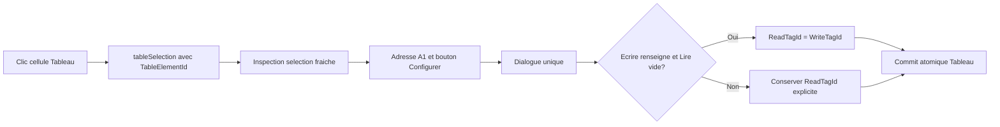

# Correction de l'authoring des cellules Tableau InputNumeric - Specification

Date: 2026-07-16
Status: Implemented
Document version: `V2.1.4.0041`

## Historique des changements

| Date | Version | Commit | Changement |
| --- | --- | --- | --- |
| 2026-07-16 | `V2.1.4.0041` | `6afe427` | Specification implementee : identite A1 partagee, selection fraiche, surface unique, double-clic cible et normalisation Lire/Ecrire. |
| 2026-07-15 | `V2.1.4.0040` | `PENDING` | Specification corrective approuvee pour une commande unique, une identite de cellule visible, une selection fraiche et le fallback Ecrire vers Lire. |

## 1. Objet et cycle de vie

Cette specification corrige uniquement l'authoring WPF/WebView2 des bindings de cellules Tableau `InputNumeric` implemente par `DEC-0042`.

Elle ne remplace pas le contrat persistant ou runtime de `DEC-0042` :

1. `ScadaTableCell.ValueBindings` reste la source de verite;
2. `ReadTagId` et `WriteTagId` restent deux champs explicites;
3. le manifest `.sb2` reste en version 2.2;
4. `Objects[].TableCellBindings` et les identifiants DOM restent inchanges;
5. TF100Web n'est pas modifie par cette correction.

Cette specification possede un cycle de vie distinct afin de ne pas reecrire retrospectivement la specification implementee `2026-07-15-table-cell-numeric-input-tf100web-design.md`.

## 2. Probleme confirme

L'audit du code actuel confirme quatre problemes d'authoring.

### 2.1 Trois commandes visuellement distinctes ouvrent le meme dialogue

Le groupe `Input numerique` expose :

1. `Proprietes`;
2. `Lire`;
3. `Ecrire`.

Les trois ids `table.numeric.properties`, `table.binding.read` et `table.binding.write` convergent vers `TableEditorController.OpenNumericInputProperties`. Ils n'activent pas une section differente et produisent donc trois affordances pour une seule action.

### 2.2 L'identite de cellule n'est pas suffisamment visible

Le panneau Propriete affiche une coordonnee numerique telle que `Cellule 1,10`, mais :

1. le ruban n'affiche pas l'adresse de cellule;
2. le dialogue n'affiche ni l'adresse A1 ni l'id du Tableau;
3. la notation numerique est moins verifiable qu'une adresse tableur telle que `J1`;
4. l'utilisateur ne peut pas confirmer visuellement la cible avant d'enregistrer un binding industriel.

### 2.3 Une selection d'un autre Tableau peut etre reutilisee

`TableEditorController` memorise `ElementId` et `Selection`, mais l'inspection numerique utilise seulement `Selection`. Lorsqu'un autre Tableau devient l'objet courant avant un nouveau clic cellule, les anciennes coordonnees peuvent encore etre inspectees sur le nouveau Tableau.

La commande ne doit pas etre active tant qu'une selection de cellule fraiche n'a pas ete recue pour l'id du Tableau courant.

### 2.4 Un binding d'ecriture n'initialise pas la lecture

Le dialogue permet de choisir un tag `Ecrire valeur` tout en laissant `Lire valeur` vide. Pour un controle operateur, la valeur ecrite doit par defaut etre relue depuis le meme mapping afin d'afficher l'etat confirme par le runtime.

Le comportement actuel exige deux choix manuels et permet une configuration write-only involontaire.

## 3. Objectif utilisateur

Pour une cellule `InputNumeric` selectionnee :

1. le ruban expose une seule commande `Configurer`;
2. la commande et le dialogue affichent une adresse A1 telle que `A1`, `J7` ou `AA12`;
3. le dialogue affiche aussi l'id du Tableau porteur;
4. la commande est disponible seulement pour une selection fraiche appartenant au Tableau courant;
5. le dialogue unique conserve les sections valeur/contraintes, lecture et ecriture sur une seule page;
6. choisir un tag d'ecriture initialise automatiquement la lecture avec le meme tag lorsque la lecture est vide;
7. une lecture explicitement configuree vers un autre tag est preservee;
8. l'enregistrement reste atomique dans l'historique Tableau;
9. un double-clic sur une cellule `InputNumeric` ouvre le meme dialogue pour la bonne cellule.

## 4. Decisions verrouillees

### 4.1 Un seul bouton, sans onglets

Le ruban conserve seulement `table.numeric.properties`, affiche sous le libelle contextuel `Configurer <adresse>`, par exemple `Configurer J7`.

Les commandes visibles `table.binding.read` et `table.binding.write` sont retirees. Le dialogue reste une page unique, car ses trois sections sont courtes et doivent pouvoir etre comparees sans navigation :

1. `Valeur et contraintes`;
2. `Lire valeur`;
3. `Ecrire valeur`.

L'alternative de trois onglets est rejetee : elle ajoute de la navigation sans creer trois workflows distincts.

### 4.2 Adresse A1 editor-only

L'adresse utilisateur est derivee des coordonnees zero-based de la cellule ancre :

```text
Column 0, Row 0  -> A1
Column 9, Row 6  -> J7
Column 26, Row 11 -> AA12
```

Cette adresse est editor-only et n'est pas persistee. Les fusions affichent l'adresse de l'ancre effective. Les identifiants runtime `TableElementId + Row + Column` restent inchanges.

Le contexte visible minimal est :

```text
Tableau: <element-id> | Cellule: J7
```

### 4.3 Selection fraiche obligatoire

Une selection est valide seulement lorsque :

1. `TableEditorController.ElementId` correspond exactement a l'id du Tableau courant;
2. la plage resout une seule cellule ancre;
3. cette cellule est `InputNumeric`.

Lors d'un changement ou d'une deselection de Tableau, le contexte numerique est invalide jusqu'au prochain `tableSelection` recu du WebView. Le ruban et le panneau affichent alors `Cliquez une cellule InputNumeric` et desactivent `Configurer`.

### 4.4 Ecrire initialise Lire lorsque Lire est vide

Au moment de construire les intentions d'enregistrement :

1. si `WriteTagId` est vide, aucune regle automatique n'est appliquee;
2. si `WriteTagId` est renseigne et `ReadTagId` est vide, `ReadTagId` prend explicitement la meme valeur;
3. si `ReadTagId` est deja renseigne, il est conserve, meme s'il differe de `WriteTagId`;
4. le resultat persiste toujours les deux ids explicites dans `ScadaTableCellValueBindings`;
5. aucune inference tardive n'est ajoutee au renderer, au manifest ou a TF100Web.

Le dialogue indique `Lecture automatiquement alignee sur Ecrire` lorsque cette regle vient d'etre appliquee. Retirer la lecture alors qu'une ecriture demeure la retablit au prochain enregistrement; retirer les deux bindings reste possible.

Les scenes write-only existantes ne sont pas migrees silencieusement au chargement. Elles sont normalisees seulement lorsqu'un utilisateur enregistre la configuration de la cellule concernee.

## 5. Architecture et responsabilites

### 5.1 Application

Application possede :

1. la validation `ElementId` + plage;
2. la conversion A1 partagee;
3. la politique d'initialisation `WriteTagId -> ReadTagId`;
4. l'inspection contextuelle projetee vers le ruban, le panneau et le dialogue.

`TableCellNumericInputInspection` doit transporter l'id du Tableau, l'ancre effective et son adresse A1 afin que toutes les surfaces utilisent le meme snapshot.

### 5.2 App/WPF

App possede uniquement :

1. l'affichage du bouton unique;
2. l'affichage de l'adresse et de l'id du Tableau;
3. l'ouverture du dialogue depuis le ruban, le panneau ou le double-clic;
4. le focus initial et le feedback visuel.

`MainWindow` reste une surface de delegation. Il ne calcule ni adresse A1, ni politique de fallback, ni validite de selection.

### 5.3 WebView

Le double-clic sur une cellule `InputNumeric` emet un message type avec :

1. id du Tableau;
2. row;
3. column.

L'adaptateur valide ce message avant que le controleur ouvre le dialogue. Le WebView ne modifie pas le modele et ne construit aucun binding.

### 5.4 Domain, Rendering et TF100Web

Aucun changement n'est requis dans :

1. `ScadaTableModels.cs`;
2. le schema JSON des scenes;
3. `ModernTableHtmlRenderer`;
4. `Ft100TableCellBindingManifestBuilder`;
5. le manifest 2.2;
6. TF100Web.

## 6. Flux cible



## 7. Persistance, historique et compatibilite

1. Aucun nouveau champ persistant n'est introduit.
2. L'adresse A1 n'entre pas dans le JSON, le preview ou l'export.
3. Les ids de commande de ruban retires ne sont pas des donnees projet et ne requierent aucune migration.
4. L'application des proprietes et des deux bindings produit une seule action d'historique.
5. Undo/redo restaure exactement les anciens `ReadTagId` et `WriteTagId`.
6. Une lecture distincte de l'ecriture reste supportee.
7. Les cellules lecture seule conservent l'interdiction d'un binding d'ecriture.

## 8. Tests obligatoires

### 8.1 Selection et identite

1. conversion A1 pour A1, Z1, AA1, J7 et la limite 64 x 64;
2. cellule fusionnee projetee vers l'adresse de son ancre;
3. selection du Tableau A refusee lorsque le Tableau B est courant;
4. changement de Tableau desactive `Configurer` jusqu'au prochain clic cellule;
5. panneau, ruban et dialogue affichent la meme adresse.

### 8.2 Commandes et dialogue

1. le groupe ruban contient un seul bouton `table.numeric.properties`;
2. `table.binding.read` et `table.binding.write` ne sont plus exposes;
3. le dialogue affiche l'id du Tableau et l'adresse A1;
4. le double-clic `InputNumeric` ouvre le dialogue pour la cellule emettrice;
5. un double-clic texte conserve son edition inline actuelle.

### 8.3 Fallback de binding

1. write vide + read vide reste vide;
2. write configure + read vide persiste le meme id dans les deux champs;
3. write configure + read distinct conserve les deux ids;
4. suppression de write conserve une lecture explicite;
5. lecture seule supprime ou refuse toujours write selon la politique existante;
6. undo/redo et sauvegarde/recharge conservent le resultat;
7. le manifest 2.2 exporte les deux ids explicites sans nouvelle inference.

## 9. Validation interactive

Sur `win00012_modern_no_legacy` :

1. selectionner successivement deux Tableaux;
2. verifier que `Configurer` est desactive avant le clic cellule du second Tableau;
3. cliquer `J7` et confirmer `Tableau: <id> | Cellule: J7` dans le ruban, le panneau et le dialogue;
4. configurer seulement `Ecrire valeur`, enregistrer puis rouvrir;
5. verifier que `Lire valeur` contient le meme tag;
6. configurer ensuite un tag de lecture distinct et verifier qu'il est preserve;
7. annuler et retablir les deux modifications;
8. sauvegarder, fermer et recharger la scene;
9. verifier le double-clic sur une cellule `InputNumeric`.

## 10. Hors scope

1. events d'etat ou de commande portes directement par une cellule;
2. support de binding pour `InputText`;
3. modification de TF100Web;
4. changement du manifest 2.2;
5. migration en masse des scenes write-only existantes;
6. identifiant persistant autonome de cellule;
7. ajout d'onglets au dialogue numerique.

## 11. Criteres d'acceptation

La correction est complete seulement si :

1. une seule commande `Configurer <adresse>` remplace les trois commandes actuelles;
2. aucune commande ne peut cibler une selection appartenant a un autre Tableau;
3. l'adresse A1 et l'id Tableau sont visibles avant enregistrement;
4. le double-clic numerique ouvre la bonne configuration;
5. Ecrire initialise Lire uniquement lorsque Lire est vide;
6. une lecture distincte reste preservee;
7. le commit, undo/redo, la persistance et l'export restent coherents;
8. aucun changement de schema, manifest ou TF100Web n'est introduit;
9. les tests automatises et le smoke `win00012_modern_no_legacy` reussissent.

Ces choix sont enregistres dans `DEC-0043`. Le plan d'implementation doit appliquer cette specification sans redefinir le contrat runtime de `DEC-0042`.

## 12. Preuves d'implementation

1. Le commit `6afe427` implemente les responsabilites Application, WPF et WebView2 sans modifier Domain, le schema de scene, le manifest 2.2 ou TF100Web.
2. Le build solution reussit sans erreur; les 35 regressions ciblees de la tranche reussissent.
3. La suite complete observee compte 658 reussites sur 663 et les cinq echecs historiques deja repertories, sans nouvel echec lie a `DEC-0043`.
4. Le smoke isole `win00012_modern_no_legacy` confirme la cible B7 dans ruban/panneau/dialogue, l'alignement immediat de Lire depuis Ecrire, la sauvegarde/reouverture et l'absence de l'adresse A1 dans le JSON persistant.
