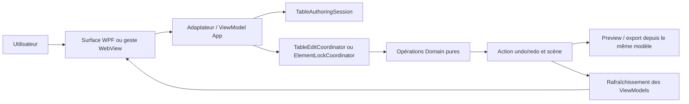

# Outils d'authoring Tableau et verrouillage Element+ - Spécification de conception

Date: 2026-07-15
Status: Approved design - implementation pending
Document version: `V2.1.4.0024`

## Historique des changements

| Date | Version | Commit | Changement |
| --- | --- | --- | --- |
| 2026-07-15 | `V2.1.4.0024` | `PENDING` | Approbation utilisateur de la spécification; activation de `DEC-0040` et autorisation de produire un plan d'implémentation autonome. |
| 2026-07-15 | `V2.1.4.0023` | `18a9e9d` | Revue complète contre le code existant : migrations explicites des catalogues et de l'ancien verrou, contrat JSON, ruban secondaire, états et bindings WPF, bordures par segment, auto-ajustement WebView, messages typés, performance 64 x 64, tests localisés et dépendances documentaires. |
| 2026-07-15 | `V2.1.4.0022` | `3a99b99` | Première architecture détaillée des outils Tableau et du verrouillage persistant de tous les Element+. |
| 2026-07-15 | `V2.1.4.0021` | `f77aedb` | Création de la spécification autonome, sans modifier la spécification Tableau déjà approuvée et implémentée. |

## 1. Statut, portée et dépendances

### 1.1 Cycle de vie autonome

Cette spécification approuvée définit une nouvelle tranche. Elle ne modifie pas rétroactivement la spécification approuvée et implémentée [Tableau moderne et ruban Insérer hiérarchique](./2026-07-14-modern-table-and-insert-ribbon-design.md), son [plan d'implémentation](../plans/2026-07-14-modern-table-and-insert-ribbon.md) ni `DEC-0039`.

Depuis son approbation :

1. `DEC-0040` enregistre les décisions de cette tranche;
2. le plan autonome [Outils d'authoring Tableau et verrouillage Element+](../plans/2026-07-15-table-ui-authoring-and-element-lock.md) en organise l'exécution;
3. le code actuel demeure celui de `DEC-0039` tant que le plan n'est pas exécuté;
4. les comportements cibles restent des écarts d'implémentation et ne doivent pas être déclarés disponibles avant leurs preuves de code et de tests.

### 1.2 Documents propriétaires et décisions liées

| Sujet | Document propriétaire ou décision |
| --- | --- |
| Tableau moderne actuellement implémenté | `docs/superpowers/specs/2026-07-14-modern-table-and-insert-ribbon-design.md`, `DEC-0039` |
| Identifiants, catalogue et dispatch des commandes | `docs/04_editor/COMMANDS_CONTRACT_V2.md` |
| Sélection, scène active, dirty state et historique | `docs/04_editor/STATE_MANAGEMENT_CONTRACT_V2.md`, `docs/04_editor/SELECTION_CONTRACT_V2.md` |
| Rubans, menus et surfaces | `docs/04_editor/MENUS_AND_SURFACES_CONTRACT_V2.md` |
| Panneau droit Propriété | `docs/04_editor/PROPERTIES_PANEL_CONTRACT_V2.md` |
| Frontières WPF et WebView | `docs/06_ui_ux/UI_ARCHITECTURE_V2.md` |
| Groupes et sélection Element+ | `docs/05_studio_element_plus/STUDIO_ELEMENT_PLUS_SELECTION_CONTRACT_V2.md`, `DEC-0008`, `DEC-0010` |
| Parité modèle/preview/export et exclusion des artefacts éditeur | `docs/03_runtime_contracts/PREVIEW_BUILD_EXPORT_CONTRACT_V2.md`, `DEC-0004` |

Le plan doit mettre à jour les documents propriétaires concernés au rythme de l'implémentation. Il ne doit ni réécrire `DEC-0039`, ni présenter cette tranche comme une correction historique de la première spécification.

## 2. Problème et preuves dans le code actuel

Le Tableau de `DEC-0039` existe, mais son flux actuel ne permet pas encore l'authoring complet attendu pour reproduire `win00012` sans bindings cellule par cellule.

### 2.1 Écarts Tableau confirmés

1. `InsertToolCatalog.cs` enregistre `insert.table` avec le libellé `Tableau` et `InsertPlacementMode.DialogThenPoint`.
2. `MainWindow.TableIntegration.cs` appelle `TableEditorController.RequestCreationOptions()` avant le placement; ce dialogue est le comportement actuel à retirer.
3. `TableWebViewScript` émet déjà `tableSelection`, `tableCellEdit` et `tableTrackResize`, mais un clic sur la grille peut encore entrer en concurrence avec le déplacement de l'Element+.
4. `TablePropertiesPanel`, `TablePropertiesDialog` et `CellFormatDialog` n'exposent qu'une partie des propriétés déjà portées par le modèle.
5. Il n'existe pas d'en-têtes de lignes et de colonnes cliquables ni de portée explicite pour le format.
6. `ScadaTableFormat` ne porte pas le retour à la ligne, la hauteur de ligne de texte ni des bordures physiques indépendantes.
7. Les opérations d'uniformisation, distribution, ajustement au contenu et gestion complète des en-têtes ne sont pas offertes.

### 2.2 Écarts de verrouillage confirmés

1. `ScadaElement` ne possède pas de propriété persistante de verrouillage de position.
2. `RibbonCommandCatalog.cs` déclare `object.lock` avec `Disabled(...)` et le texte « Verrouiller l'objet à venir ».
3. `ToggleSelectionLockCommand` utilise l'identifiant `selection.toggle-lock`; il modifie `SelectionState.IsSelectionLocked`, ce qui empêche de changer la sélection plutôt que d'empêcher le déplacement des objets.
4. Les seuls consommateurs confirmés de `selection.toggle-lock` sont son enregistrement dans `MainWindow`, `ApplicationCommandTests` et `SelectionStateTests`. L'état homonyme de Studio Element+ est un autre contrat et n'est pas décommissionné par cette tranche.
5. `MainWindow.xaml.cs` expose `public bool IsSelectionLocked { get; set; }` et `MainWindow.xaml` y lie directement le ToggleButton `Lock`.
6. Les chemins de déplacement pointeur, clavier, géométrie et groupe ne consultent aucun état persistant commun.

### 2.3 Migration obligatoire des écarts actuels

| Surface actuelle | Cible de cette tranche | Fichiers d'implémentation attendus |
| --- | --- | --- |
| `insert.table` + `DialogThenPoint` | `insert.table` ouvre la surface secondaire Tableau; `table.add` arme un placement `Point` sans dialogue | `InsertToolCatalog.cs`, `MainWindow.TableIntegration.cs`, `TableRibbonViewModel.cs` |
| Libellé `Tableau` dans Données | Conservé : il nomme l'entrée vers la famille Tableau, pas l'action de placement | `InsertToolCatalog.cs` |
| Dialogue initial de création | Retiré du flux `insert.table`; ses paramètres deviennent des contrôles du groupe `Création` | `TableEditorController.cs`, `TableDialogs.cs`, XAML de la surface |
| `object.lock` désactivé | Même identifiant rendu exécutable et toggle | `RibbonCommandCatalog.cs`, registre de commandes |
| `selection.toggle-lock` | Supprimé sans alias, car sa sémantique est incorrecte et aucun consommateur produit légitime n'en dépend | `ToggleSelectionLockCommand.cs`, `ApplicationContext.cs`, tests concernés |
| `MainWindow.IsSelectionLocked` | Supprimé; tous les bindings utilisent `ElementLockStateViewModel` | `MainWindow.xaml`, `MainWindow.ElementLockIntegration.cs` |

## 3. Objectifs et critères de produit

La tranche doit permettre :

1. d'ouvrir les outils Tableau avant qu'un tableau soit sélectionné;
2. d'ajouter un tableau sans dialogue modal;
3. de sélectionner réellement une cellule, une plage, une ligne ou une colonne sans déplacer le tableau;
4. d'éditer les types de contenu, formats, bordures, dimensions et en-têtes nécessaires à une grille équivalente à `win00012`, sans `ValueBindings` cellule par cellule;
5. de verrouiller la position de tout Element+ depuis trois surfaces synchronisées;
6. de préserver groupes, multisélection, sauvegarde, undo/redo et export;
7. de garder les règles métier hors de `MainWindow`.

## 4. Ruban Tableau et création sans dialogue

### 4.1 Mécanisme de la surface secondaire

Le ruban Tableau réutilise le shell existant. Il ne crée ni `RibbonTab` WPF, ni fenêtre flottante, ni troisième hauteur de ruban.

1. Le menu supérieur `Insérer` reste actif.
2. La famille de niveau 1 `Données` reste sélectionnée.
3. Cliquer l'outil `Tableau` (`insert.table`) remplace le contenu de niveau 2 dans `RibbonCommandSurface` par les groupes Tableau.
4. `InsertFamilySurface` reste visible en format compact pour permettre de changer de famille; les groupes génériques de `Données` sont remplacés tant que la sous-surface Tableau est active.
5. Un bouton `Retour aux outils Données` quitte la sous-surface sans modifier la sélection ni la scène.
6. Sélectionner un Element+ Tableau alors que `Insérer > Données` est déjà actif ouvre cette même sous-surface. Une sélection Tableau ne vole pas automatiquement un autre menu supérieur actif.
7. L'état de sous-surface appartient à `TableAuthoringSession`, pas à `MainWindow`.

### 4.2 Commandes de création

1. `insert.table` conserve son libellé `Tableau`; il devient une activation de surface et n'arme aucun placement.
2. `InsertPlacementMode` reçoit la valeur `ContextualSurface`; le descripteur `insert.table` migre de `DialogThenPoint` vers `ContextualSurface`.
3. Le premier groupe Tableau, `Création`, contient la commande stable `table.add`, libellée `Ajouter un tableau`.
4. `table.add` utilise le placement `Point`. Le clic suivant dans le canvas crée le tableau, le sélectionne et active le mode `Cellules`.
5. `Escape` annule uniquement le placement armé. Il ne ferme pas la sous-surface Tableau et ne modifie pas la scène.
6. Le seul preset initial est `6 colonnes x 8 rangées`, avec la première rangée marquée comme en-tête. Les contrôles numériques `Colonnes`, `Rangées` et `Première rangée d'en-tête` configurent la prochaine création dans les limites 1 à 64.
7. Aucun dialogue n'est affiché avant le placement. Le dialogue détaillé demeure réservé à l'édition d'un tableau existant.

### 4.3 Groupes et disponibilité

| Groupe de niveau 2 | Commandes | Disponibilité |
| --- | --- | --- |
| Création | `table.add`, colonnes, rangées, première rangée d'en-tête | Toujours disponible |
| Mode | `table.mode.object`, `table.mode.cells` | Objet sélectionné : Objet; Tableau sélectionné : les deux |
| Sélection | tableau, en-têtes, bandes alternées, ligne, colonne, cellule, plage | Tableau sélectionné; les portées calculées passent par le sélecteur de portée |
| Contenu | texte, input texte, input numérique et champs associés | Tableau et portée de cellules valides |
| Structure | fusion, défusion, insérer/supprimer ligne ou colonne | Tableau et sélection compatible |
| Format | police, alignement, couleurs, retour à la ligne, bordures, hériter/réinitialiser | Tableau et portée valide |
| Dimensions | largeur, hauteur, uniformiser, distribuer, ajuster au contenu | Tableau et pistes sélectionnées |
| En-têtes | marquer/démarquer, nombre de rangées d'en-tête | Tableau sélectionné |

Une commande indisponible demeure visible avec une raison explicite. `table.add` ne dépend jamais de la sélection courante.

## 5. Modèle d'interaction Objet et Cellules

### 5.1 Mode Objet

Le mode Objet utilise le contrat Element+ existant : sélection de l'objet, déplacement si autorisé, redimensionnement externe et propriétés générales. Les séparateurs internes et les cellules n'interceptent pas les gestes dans ce mode.

### 5.2 Mode Cellules

Le mode Cellules est activé par `table.mode.cells`, un double-clic sur une cellule ou automatiquement après `table.add`.

1. Le hit-testing cellule est prioritaire sur le drag Element+.
2. Un clic sélectionne une cellule; `Shift + clic` étend la plage rectangulaire.
3. Les en-têtes visibles de lignes et colonnes sélectionnent les pistes complètes; le coin supérieur gauche sélectionne tout le tableau.
4. Un séparateur interne redimensionne la ou les pistes sélectionnées.
5. Un clic droit conserve la sélection et ouvre le menu contextuel Tableau.
6. `Escape` retourne au mode Objet; un clic explicite hors du tableau suit le contrat normal de sélection de scène.
7. Les overlays de cellules, en-têtes et séparateurs sont éditeur seulement et exclus de `.sb2` et `.sep`.

### 5.3 Tableau verrouillé

Un Tableau verrouillé reste sélectionnable. Le mode Cellules, le contenu, le format, la structure, les bordures et les dimensions internes restent modifiables. Seules les mutations qui changent effectivement X ou Y sont refusées.

## 6. Verrouillage global de position Element+

### 6.1 Contrat persistant et JSON exact

`ScadaElement` reçoit le dernier paramètre de constructeur :

```csharp
bool IsLocked = false
```

Contrat de sérialisation :

1. La clé JSON de scène est exactement `"IsLocked"`, conformément au `ModernProjectStore` actuel qui n'applique aucune `PropertyNamingPolicy`.
2. La propriété ne porte pas `[JsonIgnore]` et le `ModernProjectStore` actuel écrit aussi la valeur `false` puisqu'aucune `DefaultIgnoreCondition` ne l'exclut.
3. La lecture reste insensible à la casse selon les options existantes.
4. Une scène historique sans cette clé reçoit la valeur du paramètre optionnel, soit `false`.
5. L'ordre du paramètre, à la fin du record, préserve les appels positionnels existants.
6. `IsLocked` est une métadonnée d'authoring de scène. L'exporteur `.sb2` ne l'émet ni dans le DOM, ni dans le CSS, ni dans les métadonnées runtime.
7. L'écriture `.sep` normalise `IsLocked` à `false` ou utilise son DTO de composant sans transporter le verrou de scène. Le verrou ne devient jamais une géométrie ou une règle runtime du composant.

### 6.2 Sémantique du verrou

Le verrouillage de cette tranche protège la position :

1. toute modification effective de X ou Y est interdite;
2. la sélection, la modification du contenu, du style et des événements reste permise;
3. la largeur, la hauteur et la rotation d'un objet simple restent modifiables si X et Y ne changent pas;
4. une opération de redimensionnement de groupe est refusée si elle changerait X ou Y d'un descendant verrouillé;
5. un refus ne crée ni dirty state ni entrée d'historique.

Le verrouillage du redimensionnement, de la rotation ou du contenu pourra faire l'objet d'une autre décision; il n'est pas implicite ici.

### 6.3 Groupes, descendants et opérations de structure

1. Verrouiller un groupe applique `IsLocked = true` au groupe et à tous ses descendants, récursivement.
2. Déverrouiller un groupe applique `false` à toute cette fermeture.
3. Déplacer un groupe est interdit si le groupe ou un seul descendant est verrouillé. Ce choix est intentionnel : la translation du groupe changerait la position du descendant verrouillé.
4. Si un groupe présente un état mixte, le premier clic sur le toggle verrouille toute sa fermeture; le clic suivant la déverrouille entièrement, conformément à la règle de multisélection demandée.
5. Grouper conserve l'état de chaque enfant. Le nouveau groupe est verrouillé seulement si toutes les cibles regroupées le sont. Un descendant verrouillé d'un groupe mixte suffit néanmoins à bloquer son déplacement.
6. Dégrouper supprime seulement le conteneur; chaque enfant conserve son propre `IsLocked`.
7. Copier, couper/coller et dupliquer conservent `IsLocked` sur l'objet et tous ses descendants. Le collage crée de nouveaux ids sans réinitialiser le verrou.
8. Un import depuis `.sep` crée un nouvel objet de scène déverrouillé, car le verrou de scène n'est pas transporté par le package de bibliothèque.

### 6.4 Agrégation de multisélection

La fermeture de sélection comprend chaque Element+ explicitement sélectionné et les descendants de tout groupe sélectionné; les ids en double sont éliminés.

| État de la fermeture | Toggle ruban / barre | Case Propriété | Clic |
| --- | --- | --- | --- |
| Aucun Element+ | Neutre et désactivé | Désactivée | Aucun effet |
| Tous déverrouillés | Déverrouillé | Décochée | Verrouille tous |
| Mixte | Déverrouillé | Indéterminée | Verrouille tous |
| Tous verrouillés | Verrouillé | Cochée | Déverrouille tous |

Une seule mutation de scène et une seule action undo/redo couvrent la fermeture complète.

### 6.5 Migration des commandes

1. `object.lock` devient l'unique identifiant canonique de verrouillage de scène.
2. `RibbonCommandCatalog` remplace son descripteur `Disabled` par un descripteur exécutable et toggle; son enablement exige au moins un Element+ sélectionné.
3. `ToggleElementLockCommand` est enregistré dans `CommandRegistry` sous `object.lock`.
4. L'enregistrement de `ToggleSelectionLockCommand` dans `MainWindow` est retiré.
5. La classe `ToggleSelectionLockCommand`, `SelectionState.IsSelectionLocked`, `SetSelectionLocked` et les tests de verrouillage de sélection sont supprimés ou réécrits pour le verrou objet.
6. Aucun alias `selection.toggle-lock` n'est conservé. Une recherche de dépendances fait partie du plan; si un consommateur produit inconnu est découvert, l'implémentation s'arrête pour décision au lieu de maintenir silencieusement l'ancienne sémantique.
7. Le verrouillage propre à `ElementStudioEditorState` reste inchangé; il appartient au Studio et ne partage pas l'identifiant décommissionné de la scène principale.

### 6.6 Trois surfaces WPF synchronisées

Les trois surfaces utilisent la même instance `ElementLockStateViewModel` :

1. le bouton `Verrou` du ruban `Sélection`;
2. la case `Verrouillage` de l'onglet droit `Propriété`;
3. le bouton `Lock` supérieur, déplacé immédiatement à gauche du texte `SCADA Builder V2` dans un `StackPanel` docké à droite.

Bindings cibles :

```xml
<ToggleButton IsChecked="{Binding ElementLockState.IsToggleChecked, Mode=OneWay}"
              IsEnabled="{Binding ElementLockState.IsEnabled}"
              Command="{Binding ElementLockState.ToggleCommand}" />

<CheckBox IsThreeState="True"
          IsChecked="{Binding ElementLockState.IsPropertyChecked, Mode=OneWay}"
          IsEnabled="{Binding ElementLockState.IsEnabled}"
          Command="{Binding ElementLockState.ToggleCommand}" />
```

`IsToggleChecked` vaut `true` seulement lorsque toute la fermeture est verrouillée. `IsPropertyChecked` vaut `null` pour l'état mixte. `MainWindow.IsSelectionLocked` est supprimé. Le rafraîchissement est déclenché par le chemin central existant de changement de sélection et par chaque mutation de scène; aucune surface ne calcule l'agrégation.

### 6.7 Défense contre les mouvements

La défense possède deux niveaux :

1. le WebView projette `data-editor-locked="true"` et n'initie pas un drag interdit;
2. l'Application revalide toute mutation contenant un changement de X/Y avant de créer l'action d'historique.

Le garde Application couvre au minimum : drag pointeur, flèches clavier, édition X/Y, `moveSelectionBy`, `updateSceneObjectGeometry`, déplacement normalisé vers le groupe et `resizeSceneGroupWithChildren` lorsque des positions de descendants changent.

## 7. Types et contenu de cellule

### 7.1 Champs exposés

| Type UI | Enum de code | Champs éditables |
| --- | --- | --- |
| Texte | `ScadaTableCellContentKind.Text` | Texte initial |
| Input texte | `ScadaTableCellContentKind.InputText` | Valeur initiale texte, placeholder, lecture seule |
| Input numérique | `ScadaTableCellContentKind.InputNumeric` | Valeur initiale numérique, placeholder, lecture seule, minimum, maximum, pas |

Le vocabulaire français est réservé aux libellés UI. Les noms C# et JSON restent en anglais (`Header`, `IsHeader`, `AlternatingRows`, etc.).

### 7.2 Matrice de conversion

| Source -> cible | Valeur initiale | Placeholder / lecture seule | Min / max / pas |
| --- | --- | --- | --- |
| Texte -> Input texte | `Text` conservé | Valeurs par défaut | Non applicable |
| Texte -> Input numérique | Parse invariant de `Text`; `null` si invalide | Valeurs par défaut | `null` |
| Input texte -> Texte | `Text` conservé | Supprimés | Supprimés |
| Input texte -> Input numérique | Parse invariant de `Text`; `null` si invalide | Conservés | `null` |
| Input numérique -> Texte | `NumericValue` formaté en invariant, vide si `null` | Supprimés | Supprimés |
| Input numérique -> Input texte | `NumericValue` formaté en invariant, vide si `null` | Conservés | Supprimés |

1. Une conversion recrée un `ScadaTableCellContent` sans champs cachés incompatibles.
2. Une valeur texte non numérique ne bloque pas la conversion : elle produit une valeur numérique vide et un diagnostic non bloquant.
3. En portée multiple, la matrice est appliquée indépendamment à chaque cellule. Les valeurs ne sont pas uniformisées sauf si l'utilisateur modifie explicitement le champ.
4. Le contenu reste interne au Tableau; aucun Element+ enfant ni `ValueBindings` cellule par cellule n'est créé.

## 8. Portées et inspecteur de format

### 8.1 Deux familles de portée

Portées issues d'une sélection directe : `Tableau`, `Rangée(s)`, `Colonne(s)`, `Cellule`, `Plage`.

Portées calculées de style : `Rangées d'en-tête` et `Rangées alternées`.

1. Les en-têtes de lignes/colonnes et la grille produisent les portées directes.
2. `Rangées d'en-tête` et `Rangées alternées` sont choisies dans le sélecteur `Appliquer à` du ruban ou du panneau Propriété; elles ne prétendent pas être une sélection physique de cellules.
3. Choisir une portée calculée édite respectivement `ScadaTableStyle.Header` ou `ScadaTableStyle.AlternatingRows`.
4. Le panneau affiche toujours le nom de la portée active et la sélection physique demeure intacte quand une portée calculée est choisie.

### 8.2 Propriétés

Le format complet expose : police, taille, gras, italique, alignements horizontal et vertical, padding, couleurs de texte et de fond, retour à la ligne, hauteur de ligne de texte et bordures.

`ScadaTableFormat` reçoit `bool? TextWrap` et `double? LineHeight`. `null` signifie hériter et conserve la précédence approuvée par `DEC-0039` :

```text
Cellule > Rangée explicite > Bande de rangée > Colonne > Tableau > Défaut système
```

### 8.3 Hériter / Réinitialiser

1. Une propriété héritée affiche sa valeur effective dans le contrôle et un badge `Hérité de <source>`; elle n'affiche pas une fausse valeur locale.
2. Une valeur locale affiche le badge `Personnalisé`.
3. Une multisélection aux valeurs effectives différentes affiche `Mixte`.
4. Modifier le contrôle crée une surcharge locale sur la portée active.
5. `Hériter / Réinitialiser` remet seulement la propriété ciblée à `null`, puis affiche immédiatement la nouvelle valeur effective et sa source.
6. `Réinitialiser la portée` remet toutes les surcharges de la portée à `null` dans une seule action undo/redo.

## 9. Bordures avancées

### 9.1 Modèle par segment physique

Une bordure est stockée par segment unitaire de grille, et non seulement par côté logique d'une cellule :

```csharp
public sealed record ScadaTableBorder(
    ScadaTableGridStyle Style,
    string Color,
    double Width);

public enum ScadaTableBorderOrientation { Horizontal, Vertical }

public sealed record ScadaTableBorderOverride(
    ScadaTableBorderOrientation Orientation,
    int GridLine,
    int Segment,
    ScadaTableBorder? Border);
```

1. Une ligne horizontale utilise `GridLine` de 0 à `Rows.Count` et `Segment` de 0 à `Columns.Count - 1`.
2. Une ligne verticale utilise `GridLine` de 0 à `Columns.Count` et `Segment` de 0 à `Rows.Count - 1`.
3. `ScadaTableDefinition` reçoit `IReadOnlyList<ScadaTableBorderOverride>? BorderOverrides = null`.
4. Une absence d'override utilise `GridColor`, `GridWidth` et `GridStyle` selon la précédence existante.
5. Cette représentation permet des couleurs et épaisseurs différentes le long d'un même côté de cellule fusionnée.

### 9.2 Presets et résolution

Les presets `Aucune`, `Toutes`, `Contour`, `Intérieures`, `Haut`, `Droite`, `Bas` et `Gauche` sont des opérations UI. Ils ne sont jamais sérialisés comme enum de preset : `ScadaTableBorderOperations.ApplyPreset` les développe en overrides de segments.

`ScadaTableBorderResolver` est séparé des valeurs persistantes parce qu'il doit :

1. résoudre l'override d'un segment puis le fallback de format;
2. normaliser une plage vers un ensemble de segments sans doublon;
3. ignorer au rendu les segments internes cachés par une fusion;
4. fournir une valeur effective commune au preview et à l'export.

### 9.3 Fusion et défusion

1. Fusionner ne supprime aucun override de segment.
2. Le contour visible de la plage fusionnée conserve chaque segment extérieur et son style propre.
3. Les segments internes deviennent invisibles tant que la fusion existe, mais restent persistés.
4. Défusionner rend de nouveau visibles les segments internes conservés.
5. Appliquer une bordure à une cellule fusionnée écrit chaque segment unitaire de son contour.

Cette règle élimine le choix arbitraire « l'ancre gagne » et préserve les bordures hétérogènes.

## 10. Dimensions, ajustement au contenu et en-têtes

### 10.1 Dimensions numériques

Le groupe `Dimensions` expose X, Y, largeur et hauteur exactes du Tableau, largeur des colonnes, hauteur des rangées, `Uniformiser`, `Distribuer proportionnellement` et `Ajuster au contenu`.

1. `Uniformiser` conserve la somme des tailles sélectionnées et la répartit également.
2. `Distribuer proportionnellement` applique une taille totale saisie tout en conservant les ratios courants.
3. Les minimums existants restent `24 px` par colonne et `20 px` par rangée.
4. Chaque geste ou commande produit une seule action undo/redo.

### 10.2 Algorithme Ajuster au contenu

La mesure typographique appartient au WebView2, seul moteur qui utilise exactement les polices et CSS du preview.

1. `TableWebViewScript` applique le format effectif, puis mesure en un seul lot `scrollWidth`, `scrollHeight` et les boîtes des textes/inputs.
2. Pour un input vide, la chaîne mesurée est le maximum visuel entre valeur initiale et placeholder; aucune valeur runtime inconnue n'est utilisée.
3. La taille désirée ajoute padding et bordures effectives, puis est arrondie au demi-pixel supérieur.
4. Une cellule non fusionnée contribue au maximum de sa piste.
5. Pour une cellule fusionnée, le déficit entre taille désirée et somme des pistes est distribué proportionnellement entre les pistes couvertes.
6. Le WebView émet seulement des tailles suggérées. `TableEditCoordinator` rejette NaN, infini, index hors limite et tailles sous les minimums avant une mutation atomique.
7. Les tests unitaires injectent des mesures déterministes; ils ne dépendent pas des polices installées sur l'agent de build.

### 10.3 En-têtes

1. Une ou plusieurs rangées consécutives au début du tableau peuvent être marquées `IsHeader = true`.
2. `SetHeaderRowCount(n)` marque les rangées `[0..n-1]` et démarque les suivantes; `n` peut valoir 0.
3. Le menu de rangée offre aussi `Marquer comme en-tête` et `Démarquer` tant que le résultat reste un préfixe consécutif.
4. Les titres de section peuvent être fusionnés normalement dans ces rangées.
5. Preview et export rendent les ancres de ces rangées en `<th>` avec les spans valides.

## 11. Architecture cible et relations entre classes

### 11.1 Domain

| Classe | Statut | Méthodes ou propriétés | Responsabilité et justification |
| --- | --- | --- | --- |
| `ScadaElement` | Étendue | `IsLocked` | Persistance du verrou de position. |
| `ScadaSceneElementLockOperations` | Nouvelle statique | `ExpandSelectionClosure`, `ResolveEffectiveLock`, `ApplyRecursive` | Évite de gonfler le record existant `ScadaScene`; opère purement sur sa hiérarchie. |
| `ScadaTableFormat` | Étendue | `TextWrap`, `LineHeight` | Valeurs héritables de format. |
| `ScadaTableBorder`, `ScadaTableBorderOverride` | Nouvelles valeurs | contrat de la section 9 | Persistance des segments physiques. |
| `ScadaTableContentOperations` | Nouvelle statique | `ConvertKind`, `SetContent`, `ClearContent` | Isole la matrice de conversion. |
| `ScadaTableStructureOperations` | Renommage/extraction | `Merge`, `Unmerge`, `InsertRow`, `InsertColumn`, `DeleteRow`, `DeleteColumn` | Conserve les opérations structurelles actuelles hors d'une classe monolithique. |
| `ScadaTableFormatOperations` | Nouvelle statique | `ApplyFormat`, `ResetProperty`, `ResetScope` | Applique les surcharges par portée. |
| `ScadaTableBorderOperations` | Nouvelle statique | `ApplyPreset`, `ApplySegments`, `Validate` | Écrit et normalise les overrides. |
| `ScadaTableBorderResolver` | Nouveau | `ResolveSegment`, `EnumerateRangeSegments`, `IsHiddenByMerge` | Résout les segments effectifs pour Rendering. |
| `ScadaTableTrackOperations` | Nouvelle statique | `SetSize`, `Equalize`, `Distribute`, `ApplyAutoFit` | Dimensions pures après mesures. |
| `ScadaTableHeaderOperations` | Nouvelle statique | `SetHeaderRowCount`, `SetHeaderRows` | Garantit le préfixe d'en-têtes. |

`ScadaTableOperations` devient une façade de compatibilité temporaire pour les méthodes déjà publiques. Le nouveau code du coordinateur appelle les services ciblés; la façade peut être décommissionnée dans un refactor ultérieur après recherche de consommateurs.

### 11.2 Application

| Classe | Statut | Méthodes structurantes | Responsabilité |
| --- | --- | --- | --- |
| `TableAuthoringSession` | Nouvelle, stateful | `OpenSurface`, `CloseSurface`, `ConfigureCreation`, `BeginPlacement`, `SelectTable`, `EnterObjectMode`, `EnterCellMode`, `SetRange`, `SetScope`, `ClearSelection` | Seul propriétaire de l'état temporaire de surface, mode, portée et plage. |
| `TableEditCoordinator` | Étendue, stateless | `Apply(element, request)` | Valide une requête complète et appelle l'opération Domain appropriée. |
| `TableRibbonStateProvider` | Nouveau, stateless | `Build(sessionSnapshot, selectedElement)` | Produit groupes, toggles, enablement et raisons de désactivation. |
| `TableContextMenuProvider` | Étendu, stateless | `Build(table, range, scope, canPaste)` | Produit les commandes du menu sans WPF. |
| `ElementLockSelectionState` | Nouveau record | `HasSelection`, `AllLocked`, `IsMixed`, `TargetIds` | État agrégé partagé. |
| `ElementLockCoordinator` | Nouveau | `ResolveSelectionState`, `CreateToggleMutation` | Calcule la fermeture et la mutation récursive. |
| `ElementTransformGuard` | Nouveau | `CanApply(scene, beforeAfterBounds)` | Refuse toute mutation qui déplacerait une cible effective verrouillée. |
| `ToggleElementLockCommand` | Nouvelle commande | `CanExecute`, `ExecuteAsync` | Implémente `object.lock`. |
| `ElementLockChangedAction` | Nouvelle action | `UndoAsync`, `RedoAsync` | Restaure exactement tous les états touchés. |

Relation explicite : `TableAuthoringSession` ne contient aucun `ScadaElement` mutable et ne référence pas `TableEditCoordinator`. Le contrôleur App lit un snapshot de session, construit un `TableEditRequest`, puis appelle le coordinateur stateless. Après succès, il commit la mutation et met à jour la session. Le coordinateur ne modifie jamais la sélection, le ruban ou la session.

### 11.3 App/WPF

| Classe | Statut | Méthodes structurantes | Responsabilité |
| --- | --- | --- | --- |
| `TableRibbonViewModel` | Nouveau | `Refresh`, `Open`, `BackToDataTools`, `AddTable`, `Execute` | Bindings de la sous-surface et commandes utilisateur. |
| `TablePropertiesViewModel` | Nouveau | `Load`, `ApplyContent`, `ApplyFormat`, `ResetProperty`, `ApplyBorders`, `ApplyDimensions` | Valeurs locales/effectives, mixtes et héritées du panneau/dialogue. |
| `TableEditorController` | Étendu | `HandleBridgeRequest`, `Execute`, `Commit` | Orchestre session, view models, coordinateur, dialogues et presse-papiers. |
| `TableWebViewMessageAdapter` | Nouveau | `TryParse(json, out request, out error)` | Seul parseur des messages Tableau bruts. |
| `TableWebViewScript` | Étendu | rendu, hit-testing, mesure et émission | Gestes live et overlays editor-only. |
| `ElementLockStateViewModel` | Nouveau | `Refresh`, `ToggleCommand` | `INotifyPropertyChanged` commun aux trois surfaces. |

Les dialogues consomment `TablePropertiesViewModel` ou les mêmes requêtes typées. Ils ne construisent jamais directement un nouveau `ScadaTableDefinition`.

### 11.4 Frontière MainWindow

L'intégration est regroupée dans `MainWindow.TableIntegration.cs` et `MainWindow.ElementLockIntegration.cs`. Les méthodes de haut niveau attendues sont :

1. `ActivateTableAuthoringSurface()`;
2. `ForwardTableWebViewMessage(TableBridgeRequest request)`;
3. `CommitTableMutation(TableEditResult result)`;
4. `RefreshTableAuthoringSurface()`;
5. `ExecuteObjectLockCommandAsync()`;
6. `RefreshElementLockState()`.

Cette liste borne les points de coordination métier, mais n'interdit pas un gestionnaire XAML d'une ligne qui délègue à un `ICommand`, ni l'initialisation de bindings dans le constructeur. `MainWindow` héberge l'instance des view models, le `DataContext`, le WebView et la scène active; il ne calcule ni plage, ni format, ni segment de bordure, ni fermeture de groupe, ni prochain état du verrou.

Le switch WebView général ne conserve que la délégation vers `TableWebViewMessageAdapter`/`TableEditorController`. Les cases Tableau actuelles contenant de la logique sont migrées vers cet adaptateur.

## 12. Contrat exact du bridge WebView

### 12.1 Messages Tableau existants conservés

| `type` | Champs JSON obligatoires | Champs optionnels | DTO cible et validation |
| --- | --- | --- | --- |
| `tableSelection` | `id:string`, `row:int`, `column:int`, `endRow:int`, `endColumn:int` | aucun | `TableSelectionRequest`; id existant, indices dans les limites, plage normalisée |
| `tableCellEdit` | `id:string`, `row:int`, `column:int`, `contentKind:string`, `text:string` | aucun | `TableContentEditRequest`; kind enum valide et cellule ancre existante |
| `tableTrackResize` | `id:string`, `orientation:"row"|"column"`, `trackIndex:int`, `trackSize:number` | aucun | `TableTrackResizeRequest`; nombre fini, index valide, minimum respecté |
| `tableAutoFitMeasured` | `id:string`, `fitColumns:bool`, `fitRows:bool`, `selection:{startRow,startColumn,endRow,endColumn}`, `cells:[{row,column,rowSpan,columnSpan,desiredWidth,desiredHeight}]` | aucun | `TableAutoFitMeasurementRequest`; cellules couvertes, spans, dimensions finies et sélection validés |

Les noms JSON ci-dessus restent en camelCase parce qu'ils constituent le protocole JavaScript existant; ils ne changent pas le contrat PascalCase des fichiers de scène. `tableSelection`, `tableCellEdit` et `tableTrackResize` sont des types existants qui reçoivent enfin un DTO dédié; `tableAutoFitMeasured` est nouveau.

### 12.2 Messages globaux affectés par le verrou

`moveSelectionBy`, `updateSceneObjectGeometry` et `resizeSceneGroupWithChildren` ne sont pas des messages Tableau. Ils restent dans l'adaptateur géométrique global et passent par `ElementTransformGuard` dès qu'ils impliquent une variation X/Y.

Tout message invalide produit un diagnostic sans mutation. Le JSON brut ne traverse pas vers Domain ou Application.

## 13. Flux et ownership



### 13.1 Ajouter un tableau

`insert.table` -> `TableAuthoringSession.OpenSurface` -> sous-surface Tableau -> `table.add` -> `BeginPlacement` -> clic canvas -> `ScadaElement.CreateTable` -> action d'historique -> sélection -> mode Cellules.

### 13.2 Modifier un tableau

Geste ou commande -> DTO typé -> snapshot de `TableAuthoringSession` -> `TableEditRequest` -> `TableEditCoordinator` -> opération Domain ciblée -> action atomique -> refresh de la session et des surfaces.

### 13.3 Verrouiller

Une des trois surfaces -> `object.lock` -> `ElementLockCoordinator` -> fermeture récursive -> `ElementLockChangedAction` -> scène dirty -> `ElementLockStateViewModel.Refresh` -> rendu editor-only.

### 13.4 Déplacer

Intention géométrique -> comparaison bounds avant/après -> `ElementTransformGuard.CanApply` -> refus sans effet ou action géométrique existante.

## 14. Performance et limite 64 x 64

La limite approuvée de 64 rangées x 64 colonnes, soit 4096 cellules logiques, reste obligatoire. La virtualisation de tableaux plus grands demeure hors scope, mais 64 x 64 ne peut pas être ignoré comme risque.

1. Le rendu construit les cellules dans un `DocumentFragment` puis effectue un seul remplacement DOM.
2. Les événements de sélection, édition et contexte utilisent la délégation au conteneur Tableau; aucun nouvel écouteur permanent par cellule n'est ajouté.
3. La sélection et le drag de séparateur mettent à jour un overlay borné sans rerendre les 4096 cellules à chaque mouvement.
4. Le rendu complet est réservé à une mutation de modèle ou de structure validée.
5. `Ajuster au contenu` groupe les lectures de layout avant les écritures afin d'éviter le layout thrashing.
6. Le gate manuel mesure une grille 64 x 64 dans le build Release : rendu initial inférieur ou égal à 500 ms et feedback de sélection/resize au 95e percentile inférieur ou égal à 50 ms sur la machine de référence consignée dans le rapport.
7. Si ces budgets ne sont pas respectés, la tranche ne peut pas être déclarée terminée; une stratégie d'optimisation ou de virtualisation devient un prérequis documenté.

## 15. Persistance, preview et export

1. Les cellules, formats, bordures, dimensions et en-têtes survivent sauvegarde/recharge.
2. `IsLocked` survit sauvegarde/recharge, copie/collage et undo/redo dans une scène.
3. Le preview d'édition peut projeter `data-editor-locked`; cet attribut est supprimé du document runtime exporté.
4. `.sb2` continue d'exporter le Tableau depuis le modèle de scène existant, sans binding cellule par cellule.
5. `.sep` ne transporte ni le verrou de scène, ni les overlays Tableau.
6. Les bordures et nouveaux formats utilisent le même résolveur effectif pour preview et export afin d'éviter la divergence.

## 16. Tests localisés et validation

### 16.1 Fichiers existants à étendre

| Fichier | Couverture ajoutée |
| --- | --- |
| `tests/ScadaBuilderV2.Tests/RibbonCommandCatalogTests.cs` | `object.lock` actif/toggle; `insert.table` ouvre une surface; `table.add` existe et reste actif |
| `tests/ScadaBuilderV2.Tests/ApplicationCommandTests.cs` | retrait de `selection.toggle-lock`; exécution de `object.lock` |
| `tests/ScadaBuilderV2.Tests/SelectionStateTests.cs` | suppression de la sélection verrouillable dans l'application principale |
| `tests/ScadaBuilderV2.Tests/ScadaSceneGroupTests.cs` | fermeture récursive, groupe mixte, group/ungroup, mouvement bloqué |
| `tests/ScadaBuilderV2.Tests/ModernProjectStoreTests.cs` | clé JSON `IsLocked`, ancien JSON absent, round-trip |
| `tests/ScadaBuilderV2.Tests/ScadaTableModelTests.cs` | nouveaux champs nullable et overrides de bordure |
| `tests/ScadaBuilderV2.Tests/ScadaTableOperationsTests.cs` | compatibilité de façade et invariants de structure |
| `tests/ScadaBuilderV2.Tests/TableEditCoordinatorTests.cs` | dispatch des nouvelles requêtes et validation auto-fit |
| `tests/ScadaBuilderV2.Tests/TableUiArchitectureTests.cs` | sous-surface dans le ruban existant, frontière MainWindow, bindings communs |
| `tests/ScadaBuilderV2.Tests/WebViewContextMenuScriptTests.cs` | capture mode Cellules, délégation d'événements et messages exacts |
| `tests/ScadaBuilderV2.Tests/Ft100SceneExporterTests.cs` | bordures/format exportés; aucun attribut de verrou ou overlay |
| `tests/ScadaBuilderV2.Tests/StudioElementPlusContractTests.cs` | `.sep` sans verrou de scène ni artefact Tableau |

### 16.2 Nouveaux fichiers de tests ciblés

| Fichier | Couverture |
| --- | --- |
| `TableAuthoringSessionTests.cs` | transitions surface, placement, modes, portées et sélection |
| `TableContentOperationsTests.cs` | matrice complète des conversions |
| `TableBorderOperationsTests.cs` | presets, segments, fusion/défusion hétérogène et fallback |
| `TableTrackOperationsTests.cs` | uniformiser, distribuer et mesures auto-fit injectées |
| `TableWebViewMessageAdapterTests.cs` | schémas JSON valides/invalides et diagnostics |
| `ElementLockCoordinatorTests.cs` | agrégation, toggle, groupes, copie/coupe/collage et historique |
| `ElementTransformGuardTests.cs` | drag, clavier, X/Y, groupes et resize déplaçant des descendants |

### 16.3 Gate de validation

1. `dotnet test ScadaBuilderV2.sln --no-restore`;
2. `powershell -ExecutionPolicy Bypass -File tools/docs/verify-docs.ps1`;
3. vérification interactive isolée des deux modes Tableau, des trois surfaces Lock, des groupes mixtes et de la grille 64 x 64;
4. vérification d'une page équivalente à `win00012` sans bindings cellule par cellule;
5. inspection de l'archive `.sb2` et d'un `.sep` pour confirmer l'absence d'artefacts éditeur.

## 17. Hors scope

1. formules, tri, filtre, remplissage automatique et références entre cellules;
2. import/export CSV ou Excel;
3. `ValueBindings` cellule par cellule ou persistance runtime des inputs;
4. conversion automatique de `win00012`;
5. tables dépassant 64 x 64 et virtualisation générale de milliers de rangées;
6. verrouillage des objets source/legacy non convertis;
7. permissions utilisateur, collaboration, mot de passe ou verrou distribué;
8. verrouillage de largeur, hauteur, rotation, contenu, style ou événements;
9. modification du contrat runtime TF100Web pour persister les valeurs saisies dans les inputs;
10. refonte générale de tous les rubans hors des points nécessaires à la sous-surface Tableau.

## 18. Décisions approuvées pour `DEC-0040`

1. `insert.table` conserve le libellé `Tableau` et ouvre la sous-surface de niveau 2; `table.add` est le bouton toujours disponible qui arme le placement.
2. Le dialogue initial est retiré; le seul preset initial est 6 x 8 avec première rangée d'en-tête.
3. Les modes Objet et Cellules séparent strictement déplacement et édition interne.
4. Le verrou persistant est `ScadaElement.IsLocked`, clé JSON `IsLocked`, et protège uniquement les changements de X/Y.
5. Verrouiller/déverrouiller un groupe agit récursivement; un descendant verrouillé bloque intentionnellement la translation du groupe.
6. L'état mixte apparaît déverrouillé dans les toggles et indéterminé dans Propriété; un clic verrouille toute la fermeture.
7. `object.lock` remplace sans alias l'ancien `selection.toggle-lock` dans l'application principale.
8. Le bouton supérieur `Lock` est placé immédiatement à gauche de `SCADA Builder V2` et partage le même view model que les autres surfaces.
9. Les bordures sont persistées par segment physique afin de préserver les contours hétérogènes lors des fusions.
10. La mesure d'ajustement au contenu est effectuée dans WebView2 puis validée par l'Application.
11. Le record `ScadaScene` n'est pas gonflé par les règles de verrouillage; elles appartiennent à `ScadaSceneElementLockOperations`.
12. Les nouvelles opérations Tableau sont réparties par responsabilité; `ScadaTableOperations` reste seulement une façade de compatibilité.
13. `MainWindow` reste un hôte et délègue aux classes nommées dans la section 11.

Cette spécification est approuvée. `DEC-0040` enregistre ces choix et le plan `docs/superpowers/plans/2026-07-15-table-ui-authoring-and-element-lock.md` doit les exécuter sans redéfinir l'architecture.
