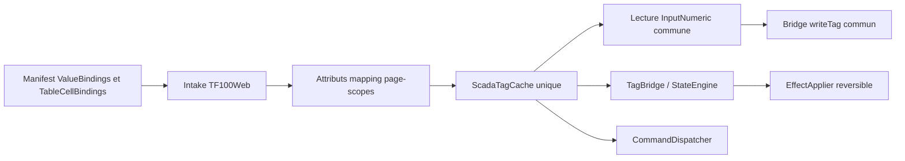

# Runtime partage Etat et bindings Tableau - Specification corrective

Date: 2026-07-16
Status: Implemented
Document version: `V2.1.4.0044`

## Historique des changements

| Date | Version | Commit | Changement |
| --- | --- | --- | --- |
| 2026-07-16 | `V2.1.4.0044` | `de37a35`, TF100Web `9d5d400` | Specification corrective implementee : transitions visuelles reversibles et chemin numerique commun TF100Web. |

## 1. Probleme confirme

Deux regressions distinctes affectent `win00012_modern_no_legacy` apres deploiement du manifest 2.2.

1. Le moteur d'etat applique le `QualityFallback` a 40 % d'opacite avant la premiere valeur utile, puis ne restaure ni opacite ni bordure lorsqu'un etat vert ou rouge devient actif.
2. Le filtre couleur ajoute un overlay apres le contenu et couvre le texte semantique a 70 %.
3. Les 126 `TableCellBindings` sont valides et exportes, mais TF100Web injecte `data-scada-mapping-id` tandis que son cache moderne ne collecte que les attributs `data-scada-read-tag`/`data-scada-write-tag` et les configurations Etat/Commande.
4. Le chemin numerique historique sait consommer les attributs mapping, mais il est lie a `diagramRoot` et ne doit pas devenir une seconde implementation moderne.

## 2. Objectif

1. Toute transition Etat restaure les proprietes controlees par l'effet precedent avant d'appliquer le nouvel effet.
2. Le filtre colore la surface sans recouvrir le texte ou le controle interactif.
3. InputNumeric Element+ et cellule Tableau utilisent le meme cache, la meme application de lecture, le meme bridge d'ecriture et les memes protections d'edition TF100Web.
4. Le manifest reste en version 2.2 et le modele projet ne change pas.

## 3. Decisions verrouillees

1. `EffectApplier` conserve une baseline runtime par element et restaure uniquement les proprietes gerees par l'effet precedent.
2. L'overlay filtre reste dans le runtime partage, sous le contenu semantique, avec isolation de contexte et sans interaction pointeur.
3. `ScadaTagCache` est l'unique collecteur moderne de snapshots TF100Web. Il collecte aussi `data-scada-mapping-id` et `data-scada-write-mapping-id`.
4. L'application de lecture accepte les references source et les mappings resolus, avec priorite au mapping resolu par TF100Web.
5. Un seul gestionnaire moderne de ValueBinding numerique ecrit via `tf100webScadaBuilder.writeTag`; il cible les inputs standards et Tableau sans branche Tableau.
6. La premiere evaluation d'une page suit un snapshot force. Le cache residuel d'une page precedente ne declenche pas le fallback avant hydratation.
7. Aucun Element+ synthetique, polling Tableau, `CommandConfig` de cellule ou duplication de tags n'est ajoute.

## 4. Architecture

SCADA Builder demeure proprietaire du modele, de l'export 2.2 et du runtime d'effet partage. TF100Web demeure proprietaire de la resolution `RegisterMapping`, du snapshot, des permissions et du POST d'ecriture.

## 5. Comportement visuel

Avant le premier effet, le runtime memorise les styles inline de base. A chaque application, il restaure les proprietes controlees precedemment : arriere-plan, bordure, largeur, couleur, opacite, rotation, visibilite, animation et overlay. Le texte dynamique reste cible par `[data-scada-text]`.

L'overlay utilise `z-index: 0`, `pointer-events: none`, `border-radius: inherit` et un contexte `isolation: isolate`. Le contenu semantique direct utilise une couche superieure. Le filtre ne doit pas modifier la geometrie exportee.

## 6. Comportement numerique TF100Web

1. La collecte inclut les mappings lecture/ecriture resolus sur le DOM, les attributs de tags et les dependances Etat/Commande.
2. La lecture met a jour l'input enfant existant si celui-ci n'est pas actif.
3. L'ecriture choisit `data-scada-write-mapping-id`, puis `data-scada-mapping-id`, respecte lecture seule et permissions, et enregistre ses handlers une seule fois.
4. `Enter` valide, `Escape` restaure la derniere valeur de cache, `blur/change` valide une seule fois.
5. Le chemin legacy peut deleguer au service commun mais ne redevient pas le chemin moderne.

## 7. Tests obligatoires

1. Transition fallback vers etat confirme avec restauration opacite/bordure.
2. Overlay sous le texte et reutilise entre vert et rouge.
3. Collecte dedupliquee des mappings de cellules.
4. Lecture d'une cellule sans remplacement du `<td>` ni de l'input.
5. Ecriture sur mapping distinct, protection focus, Enter/Escape et handlers idempotents.
6. Intake 2.2 et export de reference inchanges.

## 8. Hors scope

1. Changement du schema manifest ou passage a 2.3.
2. Creation de mappings TF100Web.
3. Refactor des actions popup/lifecycle hors fragment.
4. Modification manuelle des 56 configurations de boutons ou des 126 bindings de cellules.
