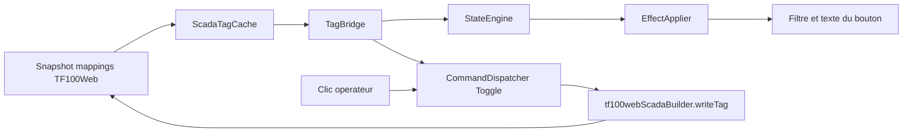

# Boutons de degivrage dynamiques - Specification

Date: 2026-07-16
Status: Implemented
Document version: `V2.1.4.0043`

## Historique des changements

| Date | Version | Commit | Changement |
| --- | --- | --- | --- |
| 2026-07-16 | `V2.1.4.0043` | `PENDING` | Implementation validee dans les deux depots : 56 boutons configures, texte semantique, runtime true/false et collecte des mappings de commande. |
| 2026-07-16 | `V2.1.4.0043` | `PENDING` | Specification approuvee pour relier les 56 boutons de degivrage au pipeline Etat/Commande partage et rendre leur texte dynamique. |

## 1. Objet

Cette correction configure les 56 boutons On/Off de `win00012_modern_no_legacy` et ferme les deux ecarts techniques qui empechent le contrat existant de fonctionner de facon autonome dans TF100Web.

Elle reutilise strictement les composants existants :

1. `ScadaElementStateConfig` et `ScadaEffectBlock` pour l'etat visuel et le texte;
2. `ScadaElementCommandConfig` et `CommandDispatcher` pour le toggle;
3. `ScadaTagCache` et `TagBridge` pour le snapshot PLC;
4. `EffectApplier` pour appliquer filtre et texte;
5. le bridge `writeTag` TF100Web pour l'ecriture.

Aucun poller, dispatcher, modele de bouton ou branche d'ecriture parallele n'est introduit.

## 2. Comportement utilisateur

Chaque bouton `toggle_defrost_p<periode>_e<evaporateur>` conserve son unique commande `WriteTag/Toggle` et recoit deux etats ordonnes sur le meme tag canonique :

1. `Actif`: bit `true`, filtre `#12B729` a `0.70`, texte `ACTIF`;
2. `Arrete`: bit `false`, filtre `#E53935` a `0.70`, texte `ARRÊTÉ`.

Les boutons couvrent quatre periodes pour chacun des evaporateurs E-1 a E-14, soit 56 boutons. La couleur et le texte suivent la valeur relue du PLC; le clic ne produit pas d'etat optimiste local.

## 3. Cible de texte semantique

`ScadaEffectBlock.TextContent` demeure l'unique contrat de texte dynamique. Pour qu'il fonctionne sur un bouton, le HTML exporte et le DOM d'edition rendent le libelle dans un descendant :

```html
<button ...><span data-scada-text>ON/OFF</span></button>
```

`EffectApplier` continue de rechercher `[data-scada-text]`. Aucun champ `ActiveText`, aucun traitement special par type de bouton et aucune duplication de l'evaluateur d'etat ne sont ajoutes.

## 4. Dependances de mappings TF100Web

`ScadaTagCache._collectRequiredMappingIds()` collecte les references des configurations d'etat et de commande rendues :

1. `tagId` / `TagId` des `data-scada-state-config`;
2. `readTagId` / `ReadTagId` et `writeTagId` / `WriteTagId` des `data-scada-command-config`;
3. les attributs de binding lecture/ecriture deja supportes.

Le collecteur normalise et deduplique les ids. Cette extension garantit qu'une commande Toggle peut lire son bit meme si aucun etat visuel n'est configure sur l'element.

## 5. Flux runtime



## 6. Responsabilites

SCADA Builder V2 :

1. persiste et exporte les deux regles d'etat par bouton;
2. exporte une cible de texte semantique dans le bouton;
3. conserve la parite structurelle du DOM WebView;
4. normalise les references d'expression vers les ids `tf100.mapping.*` existants.

TF100Web :

1. collecte les mappings requis depuis les configurations de commande et d'etat;
2. alimente le runtime partage avec les snapshots;
3. conserve le chemin d'ecriture et de confirmation existant.

## 7. Tests obligatoires

1. export d'un bouton avec `<span data-scada-text>` sans modifier son libelle encode;
2. evaluation `true` puis `false` appliquant respectivement filtre vert/rouge, opacite `0.70` et textes `ACTIF`/`ARRÊTÉ`;
3. collecte TF100Web des ids `readTagId` et `writeTagId`, avec deduplication;
4. validation de la scene : 56 boutons, une commande Toggle valide et deux etats utilisant le meme tag par bouton;
5. non-regression des suites exporteur, runtime JavaScript et intake TF100Web.

## 8. Hors scope

1. etat optimiste apres clic;
2. nouveau protocole d'ecriture ou endpoint TF100Web;
3. nouvel evaluateur d'etat cote C#;
4. changement du manifest `.sb2` 2.2;
5. texte dynamique specifique aux boutons;
6. modification des tags ou de la logique automate.

## 9. Criteres d'acceptation

La tranche est complete lorsque les 56 boutons relisent et togglent leur mapping existant, affichent `ACTIF` en vert ou `ARRÊTÉ` en rouge selon le snapshot reel, et que les tests prouvent l'absence d'une deuxieme branche runtime.

Ces choix sont enregistres dans `DEC-0044`.

## 10. Preuves d'implementation

1. TF100Web commit `29ebd35` collecte les dependances `readTagId`/`writeTagId` des commandes dans le `Set` de mappings existant; ses 12 tests de contrat runtime passent et le JavaScript est syntaxiquement valide.
2. SCADA Builder V2 exporte et previsualise le libelle bouton dans `[data-scada-text]`; les tests exporteur et WebView cibles passent.
3. Les 56 boutons et leurs 112 etats se deserialisent par `ModernProjectStore`; chaque etat utilise le mapping booléen, actif et ecrivable de sa commande Toggle.
4. Les 20 tests du runtime JavaScript passent, dont la transition confirmee true/false avec filtre et texte.
5. Le build solution passe. La suite C# complete compte 661 reussites sur 666 et les cinq echecs historiques documentes, sans nouvelle regression liee a `DEC-0044`.
