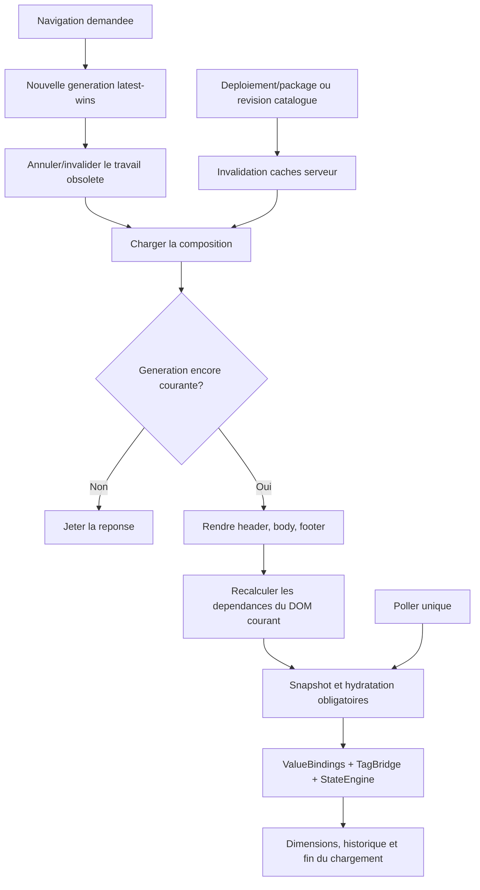

# Cycle de navigation TF100Web et performance des pages - Specification corrective

Date: 2026-07-16
Status: Approved design - pending implementation
Document version: `V2.1.4.0045`

## Historique des changements

| Date | Version | Commit | Changement |
| --- | --- | --- | --- |
| 2026-07-16 | `V2.1.4.0045` | `PENDING` | Specification du cycle latest-navigation-wins, de l'hydratation obligatoire et des gates exhaustifs pour `win00003`, `win00004`, `win00008` et `win00012_modern_no_legacy`. |

## 1. Probleme confirme

TF100Web compose correctement une page lors d'un chargement frais, mais une navigation peut laisser le nouveau DOM sans evaluation d'etat ni lecture visible. Le cas reproduit est `win00008 -> win00012_modern_no_legacy -> win00008` : le corps revient, tandis que les filtres d'etat et certaines valeurs restent absents.

La cause est une course entre navigation et polling dans `visualisation_import.js`. `loadPage()` demande `ScadaTagCache.poll(true)`, mais `poll()` retourne immediatement lorsqu'un poll precedent est encore en vol. Le poll suivant retrouve les memes valeurs en cache, conclut qu'aucune valeur n'a change et n'appelle pas le runtime partage. Le DOM vient pourtant d'etre remplace et doit etre hydrate meme si les valeurs PLC sont identiques.

La latence aggrave la course. Sur l'unite distante auditee, l'endpoint de page a pris environ 6,7 s pour `win00008` et 14,2 s pour `win00012_modern_no_legacy`, contre environ 0,2 s pour un snapshot de 426 mappings. Le serveur relit et recompose les fragments, puis `_inject_scada_element_attrs` rescane le HTML complet pour chaque binding. Une navigation devenue obsolete peut donc continuer a consommer du CPU et revenir apres une navigation plus recente.

## 2. Objectifs

1. La derniere navigation demandee est la seule autorisee a modifier le DOM, l'historique, les dimensions et l'indicateur de chargement.
2. Chaque DOM accepte traverse une barriere d'hydratation obligatoire, meme lorsque les valeurs sont identiques au cache precedent ou qu'un poll etait deja en vol.
3. Une navigation invalide la file de travail devenue obsolete sans detruire inutilement le dernier cache de valeurs PLC.
4. TF100Web conserve un seul cache, un seul poller, un seul `TagBridge` et un seul `CommandDispatcher`.
5. La composition serveur evite les scans multiplicatifs et offre des temps mesurables et bornes sur l'unite principale.
6. Tous les comportements authorés des quatre pages de reference sont couverts par une matrice automatisee et un smoke industriel autorise.

## 3. Inventaire de reference

L'acceptation repose sur le modele projet et le package `.sb2`, pas sur un nombre approximatif d'elements visibles.

| Page | Composition | Comportements authorés a preserver |
| --- | --- | --- |
| `win00003` | Footer autonome | 8 commandes `Navigate`: `win00004`, `win00059`, `win00017`, `win00007`, `win00009`, `win00008`, `win00012_modern_no_legacy`, `win00087`. |
| `win00004` | Header `win00002`, footer `win00003` | 25 elements visuels statiques; aucune commande, aucun etat et aucun binding local. Les 8 navigations du footer compose restent actives. |
| `win00008` | Header `win00002`, footer `win00003` | 8 `StateConfig`, dont 2 lectures variables, et 1 `InputNumeric` lecture/ecriture. Les 8 navigations du footer compose restent actives. |
| `win00012_modern_no_legacy` | Footer `win00003` | 56 boutons Toggle avec `CommandConfig` + `StateConfig` + texte dynamique, 126 cellules `InputNumeric` liees dans le tableau principal et 8 navigations du footer compose. |

Le petit tableau `table_outdoor_temperature` contient actuellement un `InputNumeric` sans `ValueBindings`. Il demeure un controle local non lie tant qu'une exigence de tag distincte n'est pas approuvee; il ne doit pas etre presente comme une lecture/ecriture PLC.

## 4. Decisions verrouillees

### 4.1 Navigation latest-wins

1. Le host TF100Web attribue une generation monotone a chaque navigation de corps.
2. Une nouvelle generation annule, lorsque possible, le `fetch` de page et le snapshot rattaches a la generation precedente avec `AbortController`.
3. L'annulation reseau est une optimisation. Toute reponse verifie aussi sa generation avant de toucher au DOM; une reponse obsolete est toujours jetee.
4. Le DOM courant reste affiche jusqu'a ce que la derniere page demandee soit recue et validee. Une erreur de la generation courante conserve l'ancienne page et affiche un diagnostic operateur.
5. `history.pushState` ou `replaceState` est commis seulement apres acceptation de la generation. Une reponse obsolete ou en erreur ne change pas l'URL.
6. Seule la generation proprietaire peut masquer son indicateur de chargement. Le `finally` d'une ancienne requete ne peut pas masquer une navigation plus recente.
7. Les popups possedent un cycle de requete distinct. Ouvrir ou fermer un popup ne doit pas annuler la navigation du corps, et une navigation du corps invalide les popups rattaches a l'ancienne page.

### 4.2 Hydratation et polling

1. Apres rendu des fragments header/body/footer de la generation acceptee, TF100Web recalcule les dependances a partir du DOM courant.
2. La barriere d'hydratation retourne une promesse. Si un poll est deja en vol, une demande forcee est mise en attente ou rattachee a une nouvelle generation; elle ne retourne jamais comme si l'hydratation avait eu lieu.
3. Le snapshot de la generation courante applique les lectures puis notifie `TagBridge`/`StateEngine`, meme si aucune valeur n'a change depuis la page precedente.
4. Le cache de valeurs peut etre conserve entre pages pour eviter un flash inutile, mais les dependances, promises forcees, controleurs et references DOM de la generation precedente sont invalides.
5. Le poll periodique ne demarre ou ne reprend qu'apres la barriere initiale. Une seule execution de poll peut etre active et les cycles periodiques se coalescent.
6. Les ecritures restent exclusivement dans `tf100webScadaBuilder.writeTag`; la correction n'introduit aucune voie speciale Tableau, Toggle ou page.

### 4.3 Composition serveur

1. La correction mesure separement lecture du package, extraction/composition, resolution des mappings, injection des attributs et serialisation.
2. L'injection des attributs devient indexee ou en passage unique. Il est interdit de rescanner le fragment complet une fois par binding.
3. Les donnees structurelles stables du package deploye peuvent etre mises en cache avec une cle comprenant au minimum la generation/signature de deploiement et la page.
4. Toute donnee derivee du catalogue de mappings doit inclure une revision de catalogue dans sa cle ou etre resolue hors du cache structurel. Aucun id, droit d'ecriture ou datatype obsolete ne doit survivre a une modification du catalogue.
5. `deploy_scada_builder` invalide atomiquement les caches de package. Une invalidation catalogue equivalente est couverte par tests.
6. Compression, ETag ou cache HTTP peuvent etre ajoutes seulement apres profilage et sans permettre a une reponse d'ancien deploiement d'etre acceptee.
7. Des mesures `Server-Timing` ou des journaux structures rendent visibles les couts et la generation de deploiement sans exposer de donnees de tag sensibles.

## 5. Architecture cible

SCADA Builder V2 reste proprietaire du modele, du manifest 2.2 et du runtime partage. TF100Web reste proprietaire du cycle de navigation, de la composition, des mappings, des snapshots, des permissions et des ecritures.

## 6. Matrice d'acceptation obligatoire

### 6.1 `win00003`

1. Les 8 commandes naviguent vers leur cible exacte avec un seul clic.
2. Une serie rapide de clics ne rend que la derniere cible.
3. Retour navigateur, avance navigateur et navigation repetee vers la meme cible gardent URL, DOM et historique coherents.
4. Le footer compose ne double pas les handlers apres plusieurs navigations.

### 6.2 `win00004`

1. Les 25 elements locaux, le header `win00002` et le footer `win00003` sont presents apres chargement frais et retour de navigation.
2. Les assets, dimensions et empilements restent identiques.
3. Les 8 commandes du footer restent fonctionnelles apres chaque aller-retour.
4. Cette page statique ne declenche ni fallback Etat ni binding fantome.

### 6.3 `win00008`

1. Les 8 configurations d'etat sont evaluees au chargement frais et apres `win00008 -> win00012_modern_no_legacy -> win00008`.
2. Les 2 lectures variables et l'input numerique lecture/ecriture sont hydrates par le cache commun.
3. Les filtres, textes, opacites et bordures correspondent aux valeurs confirmees; aucune zone blanche ou fallback residuel ne masque la page.
4. La saisie numerique conserve focus, `Enter`, `Escape`, `blur/change`, droits d'ecriture et readback confirme.
5. Les 8 commandes du footer restent fonctionnelles sans handlers dupliques.

### 6.4 `win00012_modern_no_legacy`

1. Les 56 boutons E-1 a E-14, periodes 1 a 4, lisent leur bit, basculent par la commande commune et affichent `ACTIF` vert ou `ARRETE` rouge selon le readback PLC.
2. Les 56 heures de degivrage et les 70 consignes de cycle, soit 126 cellules liees, lisent et ecrivent leur mapping exact.
3. Les inputs ne sont pas remplaces pendant l'edition; `Enter`, `Escape`, `blur/change`, focus, format, datatype et permissions sont respectes.
4. Un aller-retour avec `win00008`, `win00004` ou le bouton retour navigateur rehydrate tous les etats et toutes les valeurs, meme si les valeurs PLC n'ont pas change.
5. Les 8 commandes du footer restent fonctionnelles.
6. `YL_E12_HDEG4` doit exister dans l'export officiel TF100Web et se resoudre vers un mapping actif avant cloture. Le catalogue officiel audite contient 425 tags et ne contient actuellement ni le mapping 615 ni ce nom; ce gate ne peut pas etre simule ou contourne par un id fabrique.

### 6.5 Sequences croisees

Les tests couvrent au minimum `08 -> 12 -> 08`, `04 -> 12 -> 04`, `08 -> 12 -> 04` en clics rapides, navigation retour/avance, double clic de navigation et interruption reseau. Dans chaque cas, aucune reponse obsolete ne modifie le DOM courant.

Dans cette specification, « 100 % fonctionnel » signifie que chaque `Navigate`, `StateConfig`, `CommandConfig`, `ValueBinding`, `TableCellBinding` et reference de composition authoree sur ces quatre pages passe les tests et le smoke autorise. Cela n'inclut pas des comportements non configures ni une garantie sur la qualite du reseau cellulaire.

## 7. Performance et observabilite

1. Conserver les mesures froides et chaudes par page avant/apres.
2. Sur l'unite principale, viser un traitement serveur chaud p95 inferieur ou egal a 1 s pour les quatre pages et un traitement froid inferieur ou egal a 3 s pour `win00008` et `win00012_modern_no_legacy`, hors latence cellulaire. Tout ecart doit etre documente avec le poste dominant.
3. Une navigation obsolete doit cesser d'utiliser le client et ne jamais bloquer la generation courante. Si le serveur ne peut pas interrompre le travail deja commence, sa reponse est quand meme jetee et l'optimisation serveur reduit son cout.
4. Les diagnostics consignent page, generation de navigation, generation de deploiement, durees de composition/hydratation et motif d'annulation, sans journaliser de valeurs PLC.

## 8. Tests obligatoires

1. Test JavaScript comportemental d'un `poll(true)` demande pendant un poll en vol.
2. Test de deux navigations terminees dans l'ordre inverse; seule la derniere rend et modifie l'historique.
3. Test de proprietaire d'overlay de chargement et de gestion d'erreur courante.
4. Test de rehydratation avec valeurs cachees identiques apres remplacement du DOM.
5. Test d'idempotence des handlers de navigation, valeurs et commandes.
6. Tests Django de composition des quatre pages et d'injection en passage unique.
7. Tests d'invalidation apres deploiement et revision du catalogue.
8. Test d'inventaire package couvrant tous les comportements de la matrice.
9. Smoke navigateur de production en lecture seule; les commandes PLC et ecritures numeriques exigent une fenetre industrielle explicitement autorisee.

## 9. Livraison et rollback

Le correctif runtime est livre dans TF100Web, suivi de `collectstatic` et du redemarrage du service. Aucun changement de schema ou de contrat `.sb2` n'est necessaire pour la course de navigation. Un nouvel export n'est requis que si le catalogue officiel/projet est modifie pour resoudre `YL_E12_HDEG4`.

Le rollback restaure le commit TF100Web precedent, relance `collectstatic` et le service, puis purge les caches de composition. Il ne modifie ni le projet Builder ni les valeurs PLC.

## 10. Hors scope

1. Nouveau dispatcher, poller, runtime Tableau ou runtime bouton.
2. Execution generale des scripts inline exclus des fragments.
3. Refactor des familles popup/visibilite/classes non actives.
4. Modification du PLC sans coordination automate.
5. Garantie de latence du fournisseur cellulaire.
6. Creation implicite de tags ou mappings absents du catalogue officiel.
