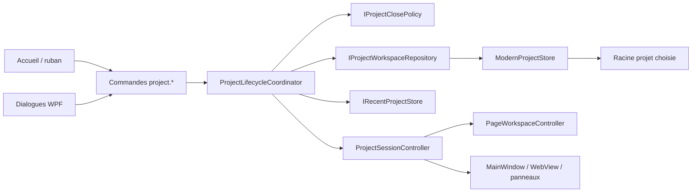

# Spécification — Cycle de vie moderne des projets

Date: 2026-07-29
Status: Implemented — automated validation complete, interactive WPF smoke pending
Document version: `V2.1.5.0000`
Portée: SCADA Builder V2 — création, ouverture, fermeture et projets récents
Dépendances: `docs/02_architecture/APPLICATION_FLOW_V2.md`, `docs/03_runtime_contracts/PROJECT_MODEL_CONTRACT_V2.md`, `docs/04_editor/COMMANDS_CONTRACT_V2.md`, `docs/04_editor/STATE_MANAGEMENT_CONTRACT_V2.md`, `docs/04_editor/MENUS_AND_SURFACES_CONTRACT_V2.md`, `docs/06_ui_ux/UI_ARCHITECTURE_V2.md`

## Historique des changements

| Date | Version | Commit | Changement |
| --- | --- | --- | --- |
| 2026-07-29 | `V2.1.5.0000` | `PENDING` | Implémentation de `DEC-0049` dans Application, Infrastructure et le shell WPF; validation automatisée complétée. |
| 2026-07-29 | `V2.1.4.0068` | `PENDING` | Audit du cycle de vie actuel et approbation de l’architecture pour créer, ouvrir, fermer et retrouver des projets V2 arbitraires. |

---

## 1. Problème

Le ruban affiche `Nouveau`, `Ouvrir` et `Enregistrer`, mais le shell ne possède pas de cycle de vie projet général :

1. `project.new` et `project.open` sont enregistrés comme commandes futures désactivées.
2. Aucun identifiant `project.close` n’existe.
3. Au démarrage, `MainWindow` localise le dépôt source et ouvre automatiquement `AMR_REF_SCADA_V2`.
4. `ModernProjectStore` reçoit un `repositoryRoot`, puis le transforme systématiquement en `SCADA_BUILDER_V2/projects/AMR_REF_SCADA_V2`.
5. La fermeture sécurisée existe pour un onglet de page et pour la fenêtre, mais pas pour une session projet complète.
6. Plusieurs services déduisent encore la librairie, les imports, les aperçus et les exports depuis le dépôt du logiciel plutôt que depuis le projet actif.
7. Le shell ne possède aucun état d’accueil sans projet, aucune liste de projets récents et aucun mécanisme explicite de changement de projet.

Ce couplage empêche SCADA Builder V2 de fonctionner comme un éditeur de projets autonome et maintient le projet de référence comme environnement implicite de l’application.

## 2. Audit architectural vérifié

### 2.1 Surface de commandes

`RibbonCommandCatalog.CreateDefault()` contient :

- `project.new`, désactivé avec la raison « Création de projet à venir »;
- `project.open`, désactivé avec la raison « Ouverture de projet à venir »;
- `project.save`, activé et routé vers la sauvegarde de la scène active.

`MainWindow.ExecuteRibbonCommand` ne traite ni `project.new`, ni `project.open`, ni `project.close`. Le catalogue est toutefois déjà la source canonique des surfaces du ruban et doit conserver ces identifiants stables.

### 2.2 Démarrage spécialisé

`MainWindow.OnLoaded` appelle directement `LoadReferenceProjectAsync`. Ce flux :

1. recherche `SCADA_AMR_GROUP` par `ResolveRepositoryRoot`;
2. lit le manifeste legacy `AMR_REF_SCADA`;
3. reconstruit les provenances Wonderware;
4. appelle `EnsureReferenceModernProjectAsync`;
5. initialise le workspace, la librairie et la première page.

Le démarrage échoue donc comme expérience produit lorsque le dépôt de développement ou le projet legacy n’est pas présent.

### 2.3 Persistance existante réutilisable

`ModernProjectStore` possède déjà des garanties importantes :

- migration du modèle projet et scène;
- lecture de snapshot cohérent;
- sauvegarde atomique projet/scènes;
- journal de transaction et récupération;
- confinement des chemins de scènes;
- verrou d’écriture durant la sauvegarde.

La faiblesse n’est pas le format `project.json`, mais la résolution du chemin : `GetReferenceModernProjectRoot` force chaque opération vers le projet de référence. La nouvelle architecture doit généraliser l’emplacement sans dupliquer le store ni affaiblir ses garanties.

### 2.4 Workspace et dirty state

`PageWorkspaceController` possède :

- les onglets ouverts;
- le projet courant;
- le dirty state projet;
- les suppressions en attente;
- l’historique workspace;
- la capture et la sauvegarde atomique.

`MainWindow` conserve aussi `_activeSceneDirty` et les états transitoires de sélection, WebView, librairie, tags et aperçu. Une fermeture de projet doit donc coordonner le workspace et le host WPF; vider uniquement `_modernProject` laisserait des références et watchers de l’ancien projet actifs.

### 2.5 Chemins dérivés du dépôt

Les surfaces suivantes utilisent encore `_repositoryRoot` ou `GetReferenceModernProjectRoot` :

- chargement et sauvegarde des scènes;
- staging d’aperçu natif sous `.studio/preview`;
- librairie Element+ par défaut;
- imports de tags;
- export dossier et `.sb2`;
- résolution des projections legacy;
- ouverture de Studio Element+;
- certains chemins de projets et ressources de référence.

La correction doit introduire un contexte de projet actif explicite. Un simple renommage de `_repositoryRoot` ne suffit pas, car un projet possède au moins un répertoire projet exact et, pour les anciennes provenances importées, une base de source legacy optionnelle.

### 2.6 Projet de référence existant

`projects/AMR_REF_SCADA_V2/project.json` est déjà un projet V2 valide. Ses scènes importées conservent toutefois des `ImportProvenance.SourcePath` relatifs à la racine historique `SCADA_AMR_GROUP`, et non au dossier du projet.

L’ouverture générale doit :

1. traiter le dossier contenant `project.json` comme racine durable du projet;
2. résoudre d’abord les nouvelles provenances relativement au projet;
3. fournir un adaptateur de compatibilité explicite pour les projets legacy dont la base de source peut être retrouvée de manière confinée;
4. produire un diagnostic bloquant lorsque la projection importée requise ne peut pas être retrouvée;
5. ne jamais réécrire silencieusement les sources legacy.

### 2.7 Paramètres utilisateur existants

`DockLayoutStore` et `LibraryRegistryStore` établissent déjà la convention `%AppData%\ScadaBuilderV2`. La liste des projets récents et le dernier dossier de création appartiennent à ce stockage utilisateur, jamais à `project.json`, aux scènes, à `.sb2` ou à une future archive portable.

### 2.8 Tests existants

Les bases de couverture pertinentes sont :

- `RibbonCommandCatalogTests`;
- `ModernProjectStoreTests`;
- `ModernProjectAtomicSnapshotTests`;
- `PageLifecycleIntegrationTests`;
- `PageWorkspaceExtractionContractTests`;
- `ProjectWorkspaceHistoryTests`;
- `DockLayoutStoreTests`;
- `LibraryRegistryStoreTests`;
- `ReferenceScadaProjectReaderTests`;
- `NativePageDocumentTests`;
- `Ft100SceneExporterTests`.

Il manque des tests dédiés pour la création transactionnelle, l’ouverture d’un dossier arbitraire, la transition entre projets, le teardown complet, la gestion des récents et le démarrage sans projet.

## 3. Objectifs

La tranche doit fournir :

1. un démarrage sur un accueil sans projet;
2. un dialogue de création complet;
3. l’ouverture d’un `project.json` V2 existant;
4. une seule session projet active par fenêtre;
5. une fermeture de projet ramenant à l’accueil;
6. le changement de projet avec traitement uniforme des modifications non sauvegardées;
7. une liste de projets récents, une action pour rouvrir le dernier projet et le retrait d’une entrée;
8. la compatibilité non destructive avec `AMR_REF_SCADA_V2`;
9. des diagnostics bloquants pour les projets invalides ou plus récents que le logiciel;
10. une architecture où le projet est indépendant du répertoire d’installation et du dépôt source.

## 4. Décisions approuvées

### D1 — Emplacement libre et racine exacte

L’utilisateur choisit le dossier parent. Le dialogue crée :

```text
<dossier-parent>/
  <nom-dossier-projet>/
    project.json
    scenes/
    assets/
    library/elements/
    libraries/
    imports/legacy/
    imports/tags/
    exports/
    .studio/
```

Le chemin n’est jamais imposé sous `SCADA_BUILDER_V2`. Lors de la première utilisation, le dossier parent proposé est `Documents\SCADA Builder V2 Projects`; le dernier dossier de création valide est ensuite mémorisé dans les paramètres utilisateur.

### D2 — Assistant de création

Le dialogue de création expose au minimum :

1. nom visible du projet;
2. nom du dossier projet, dérivé mais modifiable;
3. dossier parent avec bouton Parcourir;
4. code de la première page, valeur initiale `win00001`;
5. titre de la première page;
6. largeur et hauteur;
7. mode responsive;
8. résumé du chemin final.

La validation est immédiate et partagée avec Application. La création est bloquée lorsque le chemin cible existe, lorsque le nom est invalide, lorsque le dossier parent n’est pas accessible ou lorsque la page initiale viole `PageCodePolicy`.

### D3 — Première page native

Un nouveau projet contient une première page native `Default`. Par défaut :

- `PageCode = win00001`;
- le titre proposé est `Page principale`;
- le canevas utilise le preset desktop courant;
- la page est incluse dans le build;
- elle devient la page d’accueil;
- elle est ouverte après activation du projet.

Cette exception est volontaire par rapport à `page.new`, qui continue de créer une page supplémentaire exclue du build par défaut.

### D4 — Création transactionnelle

La création écrit d’abord un projet complet dans un répertoire de staging frère, valide le snapshot, puis renomme atomiquement le staging vers le chemin final. Un échec ou une annulation ne laisse ni projet partiel ni entrée récente.

### D5 — Ouverture fail-closed

`project.open` sélectionne un fichier nommé `project.json`. Le pipeline :

1. canonise le chemin et détermine la racine projet;
2. vérifie le confinement des chemins durables;
3. désérialise et migre en mémoire;
4. valide l’identité, les pages, les scènes et la compatibilité de version;
5. récupère les transactions incomplètes existantes;
6. prépare un snapshot candidat avant de remplacer la session active.

Un JSON invalide, une structure incohérente, un chemin échappant à la racine ou une version plus récente est refusé avec diagnostics. Le mode lecture seule et la récupération interactive restent hors périmètre.

### D6 — Migration non destructive

L’ouverture peut migrer l’ancien modèle en mémoire, mais ne persiste pas automatiquement cette migration. La première sauvegarde explicite utilise le mécanisme atomique existant. Aucun fichier legacy externe n’est modifié.

### D7 — Une session par fenêtre

Une fenêtre possède exactement zéro ou une session projet active. `Nouveau`, `Ouvrir` et `Rouvrir le dernier projet` passent par le même coordinateur de transition. Le multi-projet simultané et le multi-fenêtre restent hors périmètre.

### D8 — État de transition

Le cycle de vie Application utilise les états :

```text
Empty -> Transitioning -> Active
Active -> Transitioning -> Active
Active -> Transitioning -> Empty
```

Une transition est non réentrante et annulable. Une cible est préparée et validée avant que la session courante soit détruite. Toute annulation ou erreur conserve la session précédente.

### D9 — Modifications non sauvegardées

Avant de fermer ou remplacer un projet contenant une modification de page, de scène ou de projet, l’utilisateur choisit :

- `Enregistrer`;
- `Ne pas enregistrer`;
- `Annuler`.

`Enregistrer` persiste un snapshot complet. `Ne pas enregistrer` abandonne uniquement l’état mémoire. `Annuler` conserve exactement la session courante. La fermeture de la fenêtre appelle le même contrat.

### D10 — Fermeture complète

`project.close` :

1. exécute le gate dirty;
2. ferme les onglets et vide l’historique;
3. annule les opérations et timers propres au projet;
4. arrête les watchers;
5. vide sélection, scènes, tags, diagnostics et librairie locale;
6. remplace le WebView par l’état d’accueil;
7. libère le contexte actif;
8. retourne à l’accueil sans fermer l’application.

### D11 — Accueil sans projet

Le shell démarre sans ouvrir automatiquement le dernier projet ni `AMR_REF_SCADA_V2`. L’accueil affiche :

- `Nouveau projet`;
- `Ouvrir un projet`;
- `Rouvrir <dernier projet>` lorsqu’une entrée valide existe;
- la liste des projets récents;
- une action de retrait par entrée.

Les surfaces nécessitant un projet sont désactivées avec une raison explicite.

### D12 — Projets récents

Les récents sont conservés sous `%AppData%\ScadaBuilderV2\recent-projects.json`. Chaque entrée contient le nom affiché, le chemin canonique de `project.json` et la date de dernière ouverture UTC.

Règles :

1. déduplication de chemin insensible à la casse sous Windows;
2. succès de création/ouverture seulement avant ajout;
3. projet le plus récent en premier;
4. maximum de douze entrées;
5. retrait explicite sans suppression du projet;
6. entrée manquante conservée comme indisponible jusqu’à son retrait;
7. aucune ouverture automatique au démarrage.

### D13 — Commandes et ownership

Les identifiants stables sont :

- `project.new`;
- `project.open`;
- `project.save`;
- `project.close`;
- `project.reopen-last`;
- `project.recent.remove`.

Application possède les requêtes, validations, résultats, états de transition et politiques de dirty state. Infrastructure possède les fichiers, staging, migration, récents et résolution de chemins. WPF possède les dialogues, pickers et projections visuelles. `MainWindow` ne possède pas les règles de création, d’ouverture ou de fermeture.

### D14 — Contexte de projet actif

Le contexte actif expose explicitement :

- `ProjectRoot`;
- `ProjectFilePath`;
- le `ScadaProject` chargé;
- le snapshot workspace;
- une base de provenance importée optionnelle et validée;
- l’état de migration/compatibilité;
- les diagnostics de chargement.

Toutes les opérations projet-locales utilisent `ProjectRoot`. Le répertoire source du logiciel ne sert qu’aux ressources produit/version et ne peut plus sélectionner implicitement un projet utilisateur.

### D15 — Compatibilité du projet AMR

`AMR_REF_SCADA_V2` reste ouvrable en sélectionnant son `project.json`. Un adaptateur de compatibilité peut retrouver une base legacy dans les ancêtres du projet uniquement si le chemin final canonique est contenu dans cette base et existe. À défaut, l’ouverture échoue avec un diagnostic de projection manquante; aucune base arbitraire n’est devinée.

### D16 — `.sb2` et future archive projet

`.sb2` reste exclusivement l’artefact runtime FT100/TF100Web. Il ne devient pas un format de projet éditable.

L’association Windows, le double-clic sur `project.json`, l’export/import d’une archive projet complète et un futur format compressé analogue à un `.MER` constituent une tranche distincte. La présente architecture doit permettre ce futur adaptateur sans coupler le cycle de vie à `.sb2`.

## 5. Architecture cible



### 5.1 Domain

Domain conserve `ScadaProject`, `ScadaSceneReference`, `ScadaScene`, `PageCodePolicy` et les invariants persistants. Aucun chemin absolu, dialogue, projet récent ou état de fenêtre n’est ajouté au modèle durable.

### 5.2 Application

Application introduit les contrats de cycle de vie, les requêtes typées, le contexte actif, le résultat diagnostique, le gate de transition et les abstractions de persistance/récents. Le coordinateur ne référence ni WPF, ni `OpenFileDialog`, ni `MessageBox`.

### 5.3 Infrastructure

Infrastructure généralise `ModernProjectStore` pour recevoir une racine projet exacte, crée/ouvre les snapshots, gère le staging de création, persiste les récents et isole l’adaptateur de compatibilité du projet de référence.

### 5.4 App/WPF

App fournit :

- `ProjectSessionController`;
- l’accueil;
- `CreateProjectDialog`;
- le picker de `project.json`;
- le dialogue dirty;
- les adaptateurs de teardown/activation.

Les contrôles n’écrivent pas directement `project.json` et ne reconstruisent pas les chemins du projet.

## 6. Contrats de validation

### 6.1 Création

La création doit vérifier :

- parent absolu et accessible;
- nom/dossier non vide et compatible Windows;
- cible absente;
- absence de traversée ou nom réservé;
- code de page valide et unique;
- dimensions positives et bornées par les règles existantes;
- snapshot projet/scène cohérent;
- possibilité de relire le staging avant commit.

### 6.2 Ouverture

L’ouverture doit vérifier :

- fichier sélectionné exactement nommé `project.json`;
- racine canonique;
- JSON lisible;
- version supportée;
- inventaire et chemins de scènes confinés;
- identités de page uniques;
- scènes présentes ou créables selon le contrat de page native;
- projections importées résolubles;
- absence de collision de chemins;
- transaction précédente récupérable.

### 6.3 Fermeture

La fermeture doit prouver :

- aucun dirty state oublié;
- aucune écriture après `Ne pas enregistrer`;
- aucune mutation après `Annuler`;
- aucun onglet, historique, watcher ou état WebView de l’ancien projet;
- surfaces projet désactivées dans l’état vide.

## 7. Tests et validation

La tranche exige :

1. tests unitaires des politiques de nom, chemin, création et version;
2. tests de création transactionnelle et nettoyage après échec;
3. tests d’ouverture d’un projet arbitraire et de refus fail-closed;
4. tests du registre de récents;
5. tests du coordinateur de transition et des trois réponses dirty;
6. tests du teardown/activation du workspace;
7. tests de contrat du ruban, accueil et dialogues;
8. scénario d’intégration `Empty -> Create -> Save -> Close -> Reopen`;
9. scénario `Active dirty -> Open autre projet -> Cancel`;
10. scénario de compatibilité sur une copie de `AMR_REF_SCADA_V2`;
11. build et suite MSTest complets;
12. smoke WPF manuel sur des dossiers temporaires;
13. validation documentaire.

## 8. Migration et déploiement

1. Aucun projet réel n’est migré pendant l’implémentation automatisée.
2. Les tests utilisent des répertoires temporaires et des copies contrôlées.
3. `AMR_REF_SCADA_V2` reçoit un smoke sur copie avant toute ouverture réelle autorisée.
4. Les anciens appels fondés sur `repositoryRoot` sont retirés ou déplacés dans un adaptateur de compatibilité clairement nommé.
5. L’implémentation de cette capacité majeure applique un bump feature vers `V2.1.5.0000` lorsqu’elle est validée; le présent travail de spécification applique seulement l’itération documentaire `V2.1.4.0068`.

## 9. Hors périmètre

- ouverture automatique du dernier projet;
- plusieurs projets dans une fenêtre;
- plusieurs fenêtres coordonnées;
- association Windows et double-clic sur `project.json`;
- archive projet compressée portable;
- rétro-ingénierie d’un `.sb2`;
- mode lecture seule;
- réparation interactive d’un projet corrompu;
- collaboration ou verrou de session multi-utilisateur;
- import d’un nouveau projet Wonderware;
- modification du contrat runtime `.sb2`;
- modification de TF100Web.

## 10. Critères d’acceptation

La capacité est terminée lorsque :

1. le démarrage ne dépend plus du dépôt ni du projet AMR;
2. l’accueil fonctionne sans projet;
3. un projet peut être créé hors du répertoire du logiciel;
4. sa première page est ouverte, compilable et définie comme accueil;
5. un `project.json` valide peut être ouvert depuis n’importe quel dossier autorisé;
6. un projet invalide est refusé sans fermer le projet courant;
7. ouvrir/créer/fermer/quitter partage le même gate dirty;
8. la fermeture revient à un shell réellement vide;
9. les récents et `Rouvrir le dernier projet` fonctionnent sans ouverture automatique;
10. retirer un récent ne supprime aucun fichier projet;
11. `AMR_REF_SCADA_V2` reste ouvrable sur copie avec ses provenances;
12. preview, sauvegarde, librairie, import de tags et export utilisent tous la racine du projet actif;
13. `.sb2` reste inchangé et aucun artefact d’éditeur n’est exporté;
14. les tests ciblés, la suite complète et le smoke WPF sont conformes.
