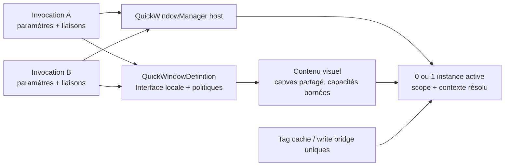
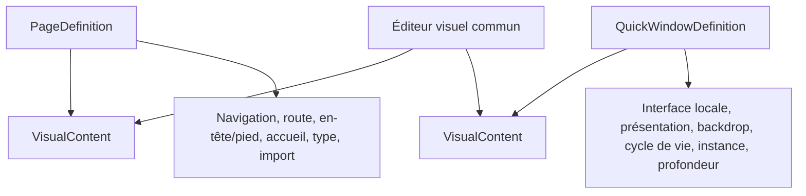
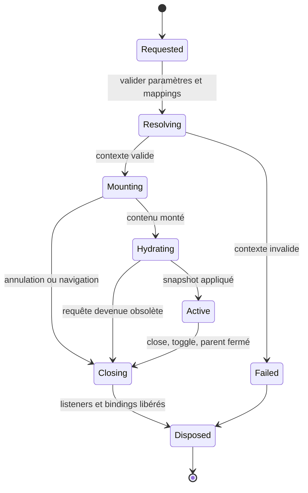

# Fenêtres rapides paramétrées - Registre de décisions et spécification d’orientation

Date: 2026-08-10
Status: Approved - `DEC-0050`; phases 0 to 2 validated, phase 3 pending, all runtime capabilities blocked
Document version: `V2.1.5.0023`
Portée: SCADA Builder V2, runtime partagé `.sb2` et services host TF100Web
Dépendances: `docs/02_architecture/GLOBAL_ARCHITECTURE_V2.md`, `docs/03_runtime_contracts/PROJECT_MODEL_CONTRACT_V2.md`, `docs/03_runtime_contracts/PREVIEW_BUILD_EXPORT_CONTRACT_V2.md`, `docs/03_runtime_contracts/FT100_TF100WEB_PACKAGE_CONTRACT_V2.md`, `docs/04_editor/ACTIONS_EVENTS_CONTRACT_V2.md`, `docs/04_editor/STATE_MANAGEMENT_CONTRACT_V2.md`

## Historique des changements

| Date | Version | Commit | Changement |
| --- | --- | --- | --- |
| 2026-08-21 | `V2.1.5.0023` | `PENDING` | Fermeture des lacunes d’audit avant Phase 3 : composition header/pied, presse-papier inter-contextes, évolution d’Interface locale versionnée, duplication de définition, bibliothèque Element+, portée undo/redo et coexistence popup legacy (`FR-030..036`, `FR-UI-23..26`). |
| 2026-08-13 | `V2.1.5.0022` | `PENDING` | Phase 2 synchronisée : services Application, dépendances, historique workspace atomique et validation build/export fail-closed implémentés sans promotion de capacité runtime. |
| 2026-08-13 | `V2.1.5.0021` | `PENDING` | Statut synchronisé après audit : gate Phase 0 réel validé et contrats persistants Phase 1 corrigés; aucune capacité runtime, UI ou export promue. |
| 2026-08-10 | `V2.1.5.0018` | `PENDING` | Création du plan d’implémentation dérivé; sa phase 0 doit valider l’isolation DOM/CSS dans WebView2 et TF100Web avant toute modification de production. |
| 2026-08-10 | `V2.1.5.0017` | `PENDING` | Approbation formelle par `DEC-0050`; `DEC-0019`, `DEC-0020` et `DEC-0022` sont supersédées. La spécification est complète et peut maintenant produire un plan dont la phase 0 d’isolation demeure bloquante. |
| 2026-08-10 | `V2.1.5.0016` | `PENDING` | Première tranche approuvée : verticale `win00054` couvrant modèle, authoring, preview, package 2.3, runtime partagé et TF100Web avec deux invocations moteur indépendantes. |
| 2026-08-10 | `V2.1.5.0015` | `PENDING` | Identité simplifiée : aucun `InstanceKey` distinct; `QuickWindowDefinitionKey`, `InvocationKey` et `RuntimeInstanceId` couvrent les trois niveaux. Réconciliation des formulations techniques déjà tranchées. |
| 2026-08-10 | `V2.1.5.0014` | `PENDING` | Séquencement corrigé : le plan est écrit après approbation de la spécification, puis commence par un prototype DOM/CSS bloquant avant toute implémentation de production. |
| 2026-08-10 | `V2.1.5.0013` | `PENDING` | Migration `ScadaCommandBinding` tranchée : retrait des kinds popup jamais complétés, ajout distinct de `OpenQuickWindow`/`CloseQuickWindow` et diagnostic fail-closed pour tout résidu sérialisé. |
| 2026-08-10 | `V2.1.5.0012` | `PENDING` | Correction du périmètre de migration : les actions popup legacy et `ScadaPopupOptions` sont phased-out et exclues du nouveau module; seule l’évolution des commandes modernes `ScadaCommandBinding` reste à formaliser. |
| 2026-08-10 | `V2.1.5.0011` | `PENDING` | Résolution de `FR-O12` : aucune commande Toggle moderne en V1; ouverture et fermeture restent explicites, tandis que `TogglePopup` demeure un mécanisme de lecture/compatibilité strictement legacy. |
| 2026-08-10 | `V2.1.5.0010` | `PENDING` | Résolution de `FR-O11` : liaisons explicites par invocation en V1, copie d’authoring autonome et réversible, sans preset persistant ni contexte d’équipement; l’équipement typé demeure une évolution séparée. |
| 2026-08-10 | `V2.1.5.0009` | `PENDING` | Résolution de `FR-O10` : extension additive du manifest 2.3 et du contrat runtime 1.0, capacités Fenêtre rapide granulaires, profils 2.1/2.2 fail-closed et promotion TF100Web avant activation de l’export Builder. |
| 2026-08-10 | `V2.1.5.0008` | `PENDING` | Résolution de `FR-O09` : racine DOM standard scoppée, namespace déterministe par définition, sélecteurs relatifs à la racine et `iframe` limité à l’adaptation legacy opaque; prototype d’isolation maintenu comme gate avant le plan. |
| 2026-08-10 | `V2.1.5.0007` | `PENDING` | Résolution de `FR-O08` : `PageDefinition` et `QuickWindowDefinition` composent un même `VisualContent` borné; leurs responsabilités propres restent séparées et aucun héritage de domaine n’est introduit. |
| 2026-08-10 | `V2.1.5.0006` | `PENDING` | Résolution de `FR-O02` : ports publics optionnels par défaut, propriété `Required` explicite, diagnostics authoring/preview et blocage du build/export pour toute liaison requise absente. |
| 2026-08-05 | `V2.1.5.0005` | `PENDING` | Approbation des 22 choix UI runtime et Builder : cadre host, titre, dimensions, placement, backdrop modal, fermeture, imbrication, réouverture, personnalisation bornée, arborescence, Interface locale, Liaisons, preview et suppression référentielle. |
| 2026-08-05 | `V2.1.5.0004` | `PENDING` | Consignation des décisions approuvées : entité Fenêtre rapide, Interface locale typée, onglet Liaisons, ports optionnels, instance unique, imbrication bornée, undo/redo, compilation partagée et backdrop configurable; séparation explicite des choix encore ouverts. |
| 2026-08-04 | `V2.1.5.0003` | `PENDING` | Première spécification d’orientation : audit du popup Fragment actuel, comparaison de cinq familles SCADA/HMI, options d’architecture, architecture hybride recommandée et décisions restant à approuver. |

---

## 1. Statut décisionnel

Ce document est la spécification propriétaire approuvée de la fonctionnalité par `DEC-0050`. Cette décision supersède `DEC-0019`, `DEC-0020` et `DEC-0022`. Les Phases 0 et 1 matérialisent le gate d’isolation et les contrats persistants inertes; la Phase 2 ajoute l’orchestration Application, les dépendances, l’historique et le gate de build. Aucun comportement QuickWindow n’est encore activé dans le preview, les packages `.sb2` ou TF100Web.

Il distingue explicitement :

1. les faits confirmés dans le code actuel;
2. les pratiques observées dans des produits SCADA/HMI modernes;
3. les invariants approuvés pour SCADA Builder V2;
4. les gates obligatoires du plan et de l’implémentation;
5. l’architecture retenue et ses alternatives rejetées.

La formalisation décisionnelle est terminée. Un plan d’implémentation séparé peut maintenant être dérivé de la présente spécification; sa phase 0 d’isolation DOM/CSS reste un gate bloquant avant toute modification de production.

### 1.1 Règle de lecture et conservation du contexte

La présente section est le registre canonique de la discussion produit. Elle distingue les décisions explicitement approuvées des hypothèses et questions restantes. En cas de contradiction avec une section exploratoire plus loin dans ce document, le registre ci-dessous prévaut jusqu’à la réconciliation de la spécification complète.

Le terme utilisateur approuvé est **Fenêtre rapide**. Le terme `popup` demeure seulement lorsqu’il décrit le mécanisme legacy existant ou un identifiant technique provisoire qui n’a pas encore été renommé.

### 1.2 Décisions approuvées

| Id | Décision approuvée |
| --- | --- |
| `FR-001` | Une Fenêtre rapide est une entité de projet distincte d’une page. Elle réutilise le moteur de canvas, les Element+, les états et les commandes, mais dans un environnement de conception balisé par ses propres capacités. |
| `FR-002` | Le workflow opérateur minimal est : clic sur un objet SCADA, ouverture de la Fenêtre rapide avec ses contrôles, fermeture par le `X`. |
| `FR-003` | Une Fenêtre rapide n’est ni un état ni une commande. `Ouvrir une fenêtre rapide` est une commande configurable sur un événement, notamment `OnClick`. |
| `FR-004` | Sur une Fenêtre rapide, l’onglet actuellement nommé `Catalogue Tag` devient `Interface locale`. Les éditeurs d’état, de commande, de binding et d’expression de son canvas ne proposent que les membres déclarés dans cette Interface locale. |
| `FR-005` | L’Interface locale possède cinq familles typées : données/états en lecture, commandes en écriture, paramètres publics, variables locales privées et constantes locales privées. Chaque membre possède un type explicite. |
| `FR-006` | Une constante locale est fixée par la définition et n’est pas liée par l’appelant. Une valeur différente selon l’appel, par exemple `MotorName`, est un paramètre public typé auquel l’invocation peut fournir un littéral ou une liaison. L’identifiant technique runtime reste distinct du nom affiché. |
| `FR-007` | Lorsque `Ouvrir une fenêtre rapide` est choisi dans le dialogue d’un élément, un onglet conditionnel `Liaisons` apparaît. Il présente les propriétés et ports publics de la définition cible et permet de créer les associations finales propres à cette invocation. |
| `FR-008` | La définition possède le contrat logique; l’invocation portée par l’élément déclencheur possède les liaisons concrètes. Une invocation compilée n’est pas encore une instance runtime. |
| `FR-009` | Un port peut exister sans liaison. Une absence de liaison est représentée explicitement et ne provoque aucune souscription ni écriture runtime. |
| `FR-010` | Un contrôle d’écriture dépendant d’un port non lié est désactivé et visuellement indisponible. Un affichage de lecture non lié présente une valeur neutre telle que `—` ou `Indisponible`, jamais une fausse valeur métier. |
| `FR-011` | Une Fenêtre rapide peut ouvrir une autre Fenêtre rapide, notamment pour un patron de boîte de dialogue ou de confirmation. |
| `FR-012` | Les références circulaires directes ou indirectes sont interdites. La première version accepte une profondeur maximale de deux Fenêtres rapides : la fenêtre ouverte depuis la page est au niveau 1 et son enfant au niveau 2. |
| `FR-013` | Une même définition de Fenêtre rapide ne peut posséder qu’une seule instance runtime active à la fois. Le modèle multi-instance simultané d’une même définition n’appartient pas à la première version. |
| `FR-014` | Supprimer un élément déclencheur supprime avec lui sa configuration `Ouvrir une fenêtre rapide` et ses liaisons. L’opération est atomique dans l’historique; undo restaure l’élément, l’événement et toutes les liaisons. Supprimer la définition elle-même est un cas référentiel distinct qui ne doit pas casser silencieusement ses appelants. |
| `FR-015` | La définition visuelle est compilée une seule fois comme module, template, descripteur ou factory. Chaque invocation compile un petit descripteur de liaisons; chaque ouverture crée un contexte runtime léger administré par un gestionnaire générique. |
| `FR-016` | Les Fenêtres rapides partagent le runtime, le cache de tags, le poller et le pont d’écriture existants. Elles ne créent aucune connexion PLC, cache ou dispatcher parallèle. |
| `FR-017` | L’affichage du fond obscurci, nommé `backdrop` dans le contrat technique provisoire, est une propriété configurable de la Fenêtre rapide. Cette propriété indique si son ouverture active ou non le backdrop. |
| `FR-018` | Tout port public est optionnel par défaut et peut être marqué `Required`. Un port optionnel non lié conserve le comportement indisponible approuvé. Un port requis non lié est affiché en rouge et produit un diagnostic dans l’authoring et le preview; la sauvegarde intermédiaire reste permise, mais le build/export est bloqué. Variables et constantes privées ne possèdent pas `Required`. Une liaison présente mais incompatible reste une erreur indépendamment de `Required`. |
| `FR-019` | Le partage visuel entre pages et Fenêtres rapides utilise la composition. `PageDefinition` et `QuickWindowDefinition` possèdent chacune un `VisualContent` commun limité aux dimensions et au fond du canvas, à l’arbre Element+, aux styles, aux assets et aux données nécessaires au rendu. Les responsabilités de page — navigation, route, en-tête/pied, accueil, type et import — restent dans la page. L’Interface locale, la présentation, le backdrop, le cycle de vie, la politique d’instance et la profondeur restent dans la Fenêtre rapide. Le domaine n’introduit aucun héritage entre page et Fenêtre rapide; l’éditeur consomme le contenu commun par composition ou adaptateur. Un adaptateur de migration peut préserver le JSON de page existant jusqu’à une conversion explicite. |
| `FR-020` | Le contenu moderne d’une Fenêtre rapide est monté dans une racine DOM standard appartenant à son instance. Le compilateur applique un namespace stable dérivé de `QuickWindowDefinitionKey` aux ids, règles CSS et références internes; le gestionnaire inscrit `RuntimeInstanceId` sur la racine, limite toutes les recherches à cette racine et libère listeners et souscriptions à la fermeture. La politique `SinglePerDefinition` rend ce namespace unique parmi les fenêtres actives. `ShadowRoot`, l’`iframe` généralisé et la réécriture arbitraire de tous les sélecteurs à chaque ouverture ne font pas partie du contenu moderne de la première version. Un `iframe` peut uniquement adapter un Fragment legacy opaque; il doit déléguer au runtime, au cache de tags et au pont d’écriture du host sans créer de poller, cache ou dispatcher parallèle. Le plan d’implémentation doit commencer par un prototype d’isolation bloquant. |
| `FR-021` | Les Fenêtres rapides étendent de façon additive `ManifestVersion = 2.3` et conservent `RuntimeContract.Version = 1.0`. Le manifest transporte des registres déterministes de définitions et d’invocations; une commande d’ouverture référence une `InvocationKey`. Des capacités `quick-window.*` et `command.*-quick-window` granulaires négocient chaque variante persistante. Elles entrent `Blocked` et ne deviennent `Supported` qu’avec les preuves Builder, package/runtime partagé et TF100Web exigées par `DEC-0047`. Les profils 2.1/2.2 refusent tout projet contenant une Fenêtre rapide et ne la convertissent jamais implicitement en Fragment. L’ordre de promotion est : contrat et fixture, implémentation/conformance cross-runtime, déploiement TF100Web, puis activation de l’export Builder. |
| `FR-022` | La première version ne crée ni preset de liaisons persistant ni contexte d’équipement. Chaque invocation possède son descripteur explicite et indépendant. L’éditeur peut copier les liaisons d’une invocation compatible ou dupliquer l’élément appelant; cette action produit une copie autonome, atomique dans l’historique et sans référence partagée. Toute évolution future vers un contexte d’équipement typé constitue une décision distincte et doit se résoudre vers le même descripteur d’invocation normalisé avant validation/export, sans imposer un second chemin runtime. |
| `FR-023` | La première version ne possède aucune commande moderne `Toggle` pour les Fenêtres rapides. `Ouvrir une fenêtre rapide` remet la même invocation au premier plan ou remplace proprement une autre invocation active de la même définition selon `FR-UI-10`; `Fermer la fenêtre rapide` cible explicitement `Self`, en plus du `X` et de `Escape`. Les valeurs popup/Toggle existantes ne peuvent cibler une `QuickWindowDefinition` et leur disposition relève exclusivement de leur chemin d’origine. Aucune capacité `command.toggle-quick-window` n’est créée. |
| `FR-024` | Le système `ScadaActionDefinition` popup — `MountFragment`, `ClosePopup`, `TogglePopup` et `ScadaPopupOptions` — est phased-out. Il ne constitue ni une surface d’authoring, ni un contrat runtime, ni une source de migration du module Fenêtre rapide. Le nouveau module ne l’étend pas, ne le convertit pas, ne crée aucun adaptateur d’action vers `QuickWindowDefinition` et n’utilise pas ses tests ou capacités comme preuve. Les résidus sérialisés et leur retrait relèvent du chantier de décommissionnement legacy. |
| `FR-025` | Les valeurs `ScadaCommandKind.OpenPopup`, `TogglePopup` et `ClosePopup` sont retirées plutôt que conservées, car elles n’ont jamais constitué une fonctionnalité popup bout en bout acceptée. Le nouveau contrat ajoute uniquement `OpenQuickWindow` et `CloseQuickWindow`. `OpenQuickWindow` exige `QuickWindowInvocationKey`; `CloseQuickWindow` cible implicitement `Self` et n’accepte aucune cible page/définition. Les anciens cases runtime, capacités et surfaces d’authoring sont supprimés. Un résidu sérialisé portant un ancien kind est refusé avec un diagnostic précis et le fichier original demeure inchangé; aucune conversion ou suppression silencieuse n’est permise. |
| `FR-026` | Le plan d’implémentation est écrit seulement après approbation formelle de la présente spécification. Sa phase 0 est le prototype d’isolation défini par `FR-020`; aucune modification du modèle, de l’authoring, du compilateur, du package ou du runtime de production ne peut commencer avant la réussite documentée de ce gate. Un échec arrête l’exécution du plan et remet la stratégie d’isolation en discussion dans la spécification. |
| `FR-027` | Aucun `InstanceKey` fonctionnel distinct n’est ajouté. `QuickWindowDefinitionKey` identifie la définition persistante, `InvocationKey` identifie la configuration persistante d’ouverture et `RuntimeInstanceId` identifie le montage runtime temporaire. Aucun quatrième identifiant ni politique `SinglePerInstanceKey` ne doit apparaître dans le domaine, le manifest, l’authoring ou le runtime. |
| `FR-028` | La première tranche est une verticale fonctionnelle fondée sur `win00054` comme référence de contrôle moteur. Elle couvre le modèle et la persistance, l’arborescence et l’éditeur de Fenêtre rapide, l’Interface locale, les Liaisons, undo/redo, le preview, le manifest 2.3, le runtime partagé et TF100Web. Deux invocations de la même définition utilisent des mappings moteur différents sans coexistence simultanée ni écriture croisée. La tranche inclut le cadre minimal, le backdrop configurable, `X`, `Escape` et `Self`. L’imbrication de production, la conversion de Fragment, l’adaptateur `iframe`, la copie de liaisons et la personnalisation avancée du cadre sont reportés aux tranches suivantes. |
| `FR-029` | `DEC-0050` formalise la présente spécification et supersède `DEC-0019`, `DEC-0020` et `DEC-0022`. Leurs contenus demeurent historiques; ils ne constituent plus un contrat actif ni une preuve de prise en charge des Fenêtres rapides. Le retrait physique de leurs résidus reste une tâche explicite du chantier de décommissionnement. |
| `FR-030` | Un Element+ situé sur une page `Header` ou `Footer` peut porter une invocation `OpenQuickWindow`. L’instance runtime appartient toujours à la racine host de la page composée, jamais au fragment header/pied. Toute navigation de page ferme la chaîne complète de Fenêtres rapides actives, y compris celles ouvertes depuis un header ou un pied persistant; aucune instance ne survit à une navigation avec des liaisons résolues sur l’ancienne page. |
| `FR-031` | Le presse-papier et la duplication d’Element+ franchissant la frontière page ↔ Fenêtre rapide sont validés fail-closed. Un contenu collé sur un canvas de Fenêtre rapide ne peut référencer ni tag/mapping du catalogue projet, ni membre d’une autre Interface locale; un contenu collé sur une page ne peut référencer un membre d’Interface locale. Le collage est refusé par défaut avec un diagnostic listant les références fautives. Une variante explicitement confirmée `Coller sans liaisons` dépouille ces références, laisse chaque propriété concernée `Non lié` et reste une opération atomique et undoable. Aucun dépouillement silencieux et aucune promotion automatique en membre d’Interface locale ne sont permis. |
| `FR-032` | L’évolution de l’Interface locale est versionnée et n’est jamais migrée silencieusement. Renommer un membre conserve sa clé stable et ne casse aucune invocation. Supprimer un membre public, changer son type, son accès ou son `Required` incrémente `InterfaceVersion`, exige une confirmation affichant les usages, puis marque chaque invocation désormais incompatible `Outdated`. Une invocation `Outdated` produit un diagnostic d’authoring et bloque build/export jusqu’à réparation explicite; aucune reliaison automatique n’est produite. |
| `FR-033` | `Dupliquer la fenêtre rapide` produit une nouvelle `QuickWindowDefinitionKey`, une copie complète du `VisualContent`, de l’Interface locale et des `PresentationDefaults`, un `Code` unique dérivé, et aucune référence partagée avec la source. La duplication ne copie aucune invocation existante et le namespace DOM/CSS de la copie dérive de sa propre clé. |
| `FR-034` | Les composants de bibliothèque Element+ (`.sep`) peuvent être instanciés sur un canvas de Fenêtre rapide; ils demeurent des contenus visuels de portée projet et ne deviennent pas des entités de portée Fenêtre rapide. Toute liaison transportée par le composant vers le catalogue projet suit exactement `FR-031`. La bibliothèque n’expose ni ne consomme d’Interface locale. |
| `FR-035` | Les Fenêtres rapides ne créent aucun second service d’historique. Le workspace conserve une pile undo/redo unique dont chaque action porte son `EditorHistoryTarget`; l’édition du contenu d’une définition utilise une portée `QuickWindow` identifiée par `QuickWindowDefinitionKey`, tandis que les mutations référentielles (création/suppression de définition, invocation supprimée avec son appelant) restent de portée `Project`. Annuler une action dont la cible n’est pas le contexte actif active d’abord ce contexte de façon déterministe, puis applique l’annulation; l’historique n’est ni vidé ni fusionné au basculement page ↔ Fenêtre rapide. |
| `FR-036` | Tant que des popups `Fragment` legacy demeurent déployés, une Fenêtre rapide et un popup legacy ne partagent ni backdrop, ni bande de z-order, ni chemin de fermeture. Le gestionnaire de Fenêtres rapides possède sa propre couche overlay au-dessus du contenu legacy. Aucun contenu de Fenêtre rapide ne peut ouvrir un popup legacy et aucun popup legacy ne peut ouvrir une Fenêtre rapide. Le host doit prouver l’absence d’interférence de focus, de backdrop et de `dispose` lorsque les deux mécanismes coexistent sur une même page. |

### 1.3 Décisions UI approuvées

| Id | Décision approuvée |
| --- | --- |
| `FR-UI-01` | Le runtime host fournit toujours la barre de titre et le bouton `X`; ils ne sont pas dessinés dans le canvas. |
| `FR-UI-02` | Les dimensions du canvas représentent uniquement la zone de contenu. Le host ajoute la barre de titre et le cadre à l’extérieur de ces dimensions. |
| `FR-UI-03` | Le titre utilise le nom de la définition par défaut. Une invocation peut le surcharger explicitement. |
| `FR-UI-04` | La position initiale est une propriété de la définition et sa valeur par défaut est `Centrée`. L’invocation ne possède pas de position libre dans la première version. |
| `FR-UI-05` | La Fenêtre rapide est déplaçable par sa barre de titre et n’est pas redimensionnable. |
| `FR-UI-06` | La fenêtre reste confinée au viewport. Si son contenu dépasse l’espace disponible, le host limite sa taille et fournit un défilement interne; il ne met pas le contenu à l’échelle et ne le coupe pas silencieusement. |
| `FR-UI-07` | Lorsque le backdrop est actif, il bloque les interactions avec la page. Un clic sur le backdrop ne ferme pas la fenêtre. Son opacité appartient au thème global du produit et non à chaque définition. |
| `FR-UI-08` | `Escape` demande la fermeture par le même chemin sécurisé que le `X`. Une opération protégée, une confirmation ou une écriture en cours ne peut pas être contournée par `Escape`. |
| `FR-UI-09` | Une fenêtre enfant est centrée au-dessus de sa parente, demeure au premier plan et partage le backdrop de la chaîne de fenêtres plutôt que d’en empiler un second. |
| `FR-UI-10` | Si la même invocation est déjà ouverte, une nouvelle demande la remet au premier plan. Si une autre invocation cible la même définition, l’instance active est fermée proprement puis recréée avec le nouveau contexte; ses liaisons ne sont jamais remplacées silencieusement en place. |
| `FR-UI-11` | Le cadre runtime possède une personnalisation bornée par définition : couleur de barre de titre, bordure et ombre. Le `X`, sa géométrie, les comportements, le backdrop et les garde-fous restent contrôlés par le thème et le host. |
| `FR-UI-12` | L’arborescence du projet possède un groupe distinct `Fenêtres rapides`; elles ne sont mélangées ni aux pages ni à la bibliothèque Element+. |
| `FR-UI-13` | `Nouvelle fenêtre rapide` crée un canvas vide. La conversion ou l’import depuis une page existante est un workflow séparé et ultérieur. |
| `FR-UI-14` | L’édition réutilise l’éditeur existant avec une icône, un badge et un titre `Fenêtre rapide`. Les commandes non autorisées sont masquées plutôt que laissées actives ou ambiguës. |
| `FR-UI-15` | `Interface locale` est un tableau unique regroupé en `Interface publique` et `Données privées`, avec filtres par famille. |
| `FR-UI-16` | Les propriétés courantes d’un membre sont modifiables directement dans le tableau; un panneau ou dialogue commun expose les contraintes et propriétés avancées. |
| `FR-UI-17` | Chaque membre affiche son nombre d’utilisations. L’utilisateur peut naviguer vers ces utilisations et une suppression référencée exige une confirmation explicite. |
| `FR-UI-18` | L’onglet `Liaisons` est une grille contenant au minimum : nom, famille, type, source, valeur ou référence et statut. |
| `FR-UI-19` | Chaque liaison choisit d’abord un type de source parmi `Tag`, `Littéral`, `Expression` ou `Port parent`, puis présente un sélecteur contextuel adapté; aucun champ libre unique ne remplace cette validation typée. |
| `FR-UI-20` | Un port optionnel non lié apparaît en gris avec le statut `Non lié`. Un port requis non lié apparaît en rouge. Le preview montre également le comportement runtime indisponible. |
| `FR-UI-21` | Un panneau de test intégré permet de fournir des valeurs, littéraux et liaisons temporaires puis d’ouvrir une instance de prévisualisation. Ces données de test sont editor-only et ne sont jamais exportées. |
| `FR-UI-22` | La suppression d’une définition référencée est bloquée. Le dialogue affiche la liste des éléments appelants et permet d’y naviguer; aucune suppression en cascade ou référence cassée silencieuse n’est produite. |
| `FR-UI-23` | Un collage refusé par `FR-031` affiche un dialogue listant chaque référence fautive avec son objet et sa propriété, et propose uniquement `Annuler` ou `Coller sans liaisons`. Aucun collage partiel silencieux n’est proposé. |
| `FR-UI-24` | Une surface de réparation liste les invocations `Outdated` d’une définition avec leur page, leur élément appelant et le motif d’incompatibilité; elle permet d’y naviguer et de relier port par port. Les invocations `Outdated` apparaissent en rouge dans la grille `Liaisons` et dans les usages du membre. |
| `FR-UI-25` | L’arborescence `Fenêtres rapides` expose `Dupliquer`, qui crée immédiatement une définition indépendante au nom unique dérivé et la sélectionne. |
| `FR-UI-26` | Les commandes `Annuler`/`Rétablir` du ruban agissent sur la pile unique du workspace et affichent le contexte cible de la prochaine action. Lorsque cette action vise un autre contexte, l’éditeur bascule visiblement vers ce contexte avant de l’appliquer. |

### 1.4 Conséquences approuvées pour l’authoring

1. Le projet expose une famille d’entités `Fenêtres rapides`, distincte des pages.
2. Le même moteur d’édition graphique est réutilisé, mais les commandes non pertinentes aux Fenêtres rapides sont masquées ou interdites par une politique de capacités.
3. Le canvas d’une Fenêtre rapide ne référence jamais directement un tag physique du projet; il référence un membre de son Interface locale.
4. L’onglet `Liaisons` résout ensuite les ports publics vers un tag, un littéral typé, une expression autorisée ou, dans une fenêtre enfant, un port public du parent.
5. Les variables et constantes privées restent invisibles dans `Liaisons`.
6. Une commande système locale permet de fermer l’instance courante sans nécessiter de port de mapping.

### 1.5 Choix `FR-Oxx`

Tous les choix techniques `FR-O02`, `FR-O08`, `FR-O09`, `FR-O10`, `FR-O11` et `FR-O12` ont maintenant été tranchés. Les travaux de formalisation encore requis avant le plan sont énumérés à la section 17; ils ne doivent pas être confondus avec une autorisation d’implémenter.

### 1.6 Distinctions de modèle à conserver

```text
Définition de Fenêtre rapide
  contenu + Interface locale + présentation par défaut

Invocation Ouvrir une fenêtre rapide
  définition cible + liaisons + paramètres d’appel

Instance runtime
  identité technique + contexte résolu + cycle de vie temporaire
```

Ces trois niveaux ne doivent pas être fusionnés. En particulier, la configuration stockée sur un bouton n’est pas appelée « instance » dans le modèle persistant.

## 2. Problème à résoudre

Le popup actuel est fondé sur une page `Fragment` possédant ses propres dimensions de canevas. Cette base permet de composer une surface de détail, mais elle ne définit pas encore un véritable modèle de popup réutilisable et instanciable.

La capacité cible doit permettre :

1. de concevoir une seule définition de Fenêtre rapide pour un type d’équipement ou de sous-ensemble;
2. de déclarer l’Interface locale typée dont cette définition a besoin;
3. de réutiliser cette définition depuis plusieurs éléments avec des paramètres et mappings différents;
4. de garantir qu’une seule instance de cette définition est active à la fois;
5. d’identifier, fermer et diagnostiquer l’instance sans ambiguïté;
6. de permettre une fenêtre enfant d’une autre définition, sans cycle et jusqu’à une profondeur de deux;
7. de préserver l’isolation d’état, de DOM, de focus et de cycle de vie;
8. de rester compatible avec le cache de tags, les droits d’écriture et le runtime partagé TF100Web;
9. de conserver la parité entre aperçu, build et export;
10. de faire évoluer plus tard le contenu vers des faceplates ou composants sans réécrire le gestionnaire de fenêtres.

Le point central n’est donc pas seulement « afficher une petite page ». Il faut séparer la définition réutilisable, le contrat de données, l’appel configuré, l’instance runtime et sa présentation.

## 3. Vocabulaire approuvé et identifiants techniques provisoires

Pour éviter de confondre page, popup et instance :

| Terme | Rôle |
| --- | --- |
| `Fenêtre rapide` | Terme approuvé dans l’interface utilisateur pour l’entité et sa surface runtime. |
| `QuickWindowDefinition` | Identifiant technique provisoire de la définition durable : contenu, Interface locale, présentation par défaut et politiques. Le nom C# exact reste ouvert. |
| `QuickWindowContent` | Contenu visuel réutilisant le moteur de canvas commun sans devenir une page navigable. |
| `QuickWindowInvocation` | Configuration d’un élément et de sa commande d’ouverture avec les liaisons et paramètres déterminés. |
| `QuickWindowInstance` | Contexte runtime temporaire produit par une invocation; une seule instance active est permise par définition. |
| `LocalInterfaceMember` | Membre typé de l’Interface locale, public ou privé selon sa famille. |
| `PortBinding` | Association d’un port public à un mapping/tag, littéral, expression ou port parent concret. |
| `RuntimeInstanceId` | Identité technique unique créée à chaque montage runtime. |
| `PresentationProfile` | Règles de taille, position, modalité, redimensionnement, fermeture et ancrage, séparées du contenu. |

Dans ce document, « la Fenêtre rapide gère ses propres mappings » signifie que sa définition possède l’Interface locale et que chaque invocation possède les liaisons concrètes de ses ports publics. Elle ne doit pas créer un second poller, contourner le catalogue projet ou posséder une connexion PLC indépendante.

## 4. Audit confirmé de l’existant

### 4.1 Modèle projet et scènes

Le modèle actuel fournit déjà :

1. `ScadaPageType.Fragment`;
2. un `CanvasSize` propre à chaque scène et à chaque référence de page;
3. des actions legacy `MountFragment`, `ClosePopup` et `TogglePopup` ciblant `TargetPageId` ou `TargetPageKey`;
4. `ScadaPopupOptions` avec `Position`, `SizePreset`, `AllowMultiple`, `ResetOnOpen` et `HostRegionId`;
5. une validation des cibles absentes, non-Fragment, exclues du build et des `HostRegionId` absents;
6. des valeurs de commande `OpenPopup`, `TogglePopup` et `ClosePopup` dans `ScadaCommandBinding`, sans fonctionnalité popup bout en bout acceptée.

### 4.2 Écart entre l’ancien modèle d’action et les commandes modernes

`ScadaCommandBinding`, utilisé par l’onglet moderne `Commande`, ne possède actuellement ni paramètres, ni bindings de mappings, ni clé d’invocation. `ElementCommandDialog` sélectionne une page cible, mais ne configure pas un contrat de Fenêtre rapide. Les trois kinds popup présents dans l’enum sont des surfaces incomplètes à retirer, pas un contrat moderne à migrer.

Le dialogue d’événements legacy peut encore apparaître dans le code et cibler les Fragments, mais son chemin est phased-out. `ScadaActionDefinition` popup et `ScadaPopupOptions` sont des résidus d’implémentation et de sérialisation, pas une architecture à prolonger. Leur éventuel retrait physique doit être traité par le chantier de décommissionnement legacy et non par la présente fonctionnalité.

### 4.3 Runtime partagé

`CommandDispatcher` et `ActionDispatcher` contiennent des branches qui normalisent les valeurs popup vers des intents host `openPopup`, `closePopup` et `togglePopup`. Ces branches et l’overlay observé dans TF100Web ne constituent pas une fonctionnalité bout en bout acceptée et seront retirés avec leurs anciens kinds/capacités.

La nouvelle architecture conserve uniquement le principe de séparation : les règles de définition, de validation et d’identité appartiennent au modèle/runtime partagé; le host possède le DOM, le focus, la fenêtre, la navigation et les services de tags. Les nouveaux intents `openQuickWindow` et `closeQuickWindow` ne sont pas des alias des anciens intents popup.

### 4.4 TF100Web audité

Le fichier `F:\Projet\Git\TF100Web\static\asset\js\station\visualisation_import.js`, branche `codex/adding-table-cell-numeric-input`, commit local `05832f7`, a été audité pour cette spécification. Le comportement ci-dessous est un résidu technique observé, non un contrat produit à préserver.

Le service courant :

1. reçoit bien `pageId` et `options`, mais n’interprète pas les options;
2. charge le corps de la page Fragment;
3. construit un overlay centré et un panneau fixe à `80 %`, plafonné à `960 x 720`;
4. initialise le même runtime partagé et le même cache de tags;
5. repère les popups par `data-scada-popup-page-id = pageId`;
6. ferme la première occurrence trouvée pour ce `pageId`;
7. ferme tous les popups au remplacement de la page de corps;
8. ne transporte aucun paramètre ou mapping d’instance dans le contenu.

Conséquences confirmées :

1. les dimensions personnalisées du Fragment ne gouvernent pas directement la fenêtre;
2. `Position`, `SizePreset`, `AllowMultiple`, `ResetOnOpen` et `HostRegionId` ne sont pas appliqués par ce host;
3. plusieurs montages de la même page sont possibles physiquement, mais leur fermeture/toggle est ambiguë;
4. plusieurs occurrences de la même page peuvent répéter les mêmes ids DOM page-scopés dans le même document;
5. une page Fragment porte actuellement des références de mappings concrètes, donc elle ne peut pas changer proprement de contexte par instance;
6. le cycle de focus, le retour de focus, `Escape`, le focus trap modal et l’empilement ne sont pas contractuels;
7. l’aperçu Builder ne possède pas encore un gestionnaire host popup équivalent.

### 4.5 Contrats à préserver

La refonte ne doit pas perdre les acquis suivants :

1. pages et objets identifiés par clés durables;
2. package `.sb2` et négociation de capacités;
3. runtime sémantique partagé unique;
4. cache et pont d’écriture TF100Web uniques;
5. validation fail-closed avant déploiement;
6. namespace de page et absence de collision DOM/CSS;
7. preview, build et export consommant le même modèle;
8. exclusion totale des overlays, poignées et autres artefacts d’éditeur.

## 5. Comparaison des approches SCADA/HMI modernes

Cette comparaison ne cherche pas à reproduire un produit. Elle identifie les concepts convergents utiles à SCADA Builder V2 à partir de documentation officielle consultée le 2026-08-04.

### 5.1 Ignition Perspective

Ignition traite le popup comme une instance d’une `View` réutilisable. L’appel fournit une identité de popup distincte du chemin de la vue, un dictionnaire de paramètres, une position et des options de présentation : titre, fermeture, déplacement, redimensionnement, modalité, fermeture par overlay et confinement au viewport. Les vues peuvent aussi être embarquées simultanément et réutiliser les mêmes paramètres.

Sources :

1. [Popup Views](https://www.docs.inductiveautomation.com/docs/8.1/ignition-modules/perspective/views-in-perspective/popup-views)
2. [system.perspective.togglePopup](https://www.docs.inductiveautomation.com/docs/8.3/appendix/scripting-functions/system-perspective/system-perspective-togglePopup)
3. [Embedded Views](https://www.docs.inductiveautomation.com/docs/8.1/ignition-modules/perspective/views-in-perspective/embedded-views)

Leçons pertinentes :

1. l’identité de l’instance est indépendante de la définition visuelle;
2. les paramètres sont un contrat normal de vue, pas une substitution textuelle spéciale au popup;
3. la présentation est fournie à l’appel et reste séparée du contenu;
4. la même définition peut être utilisée comme page, contenu embarqué ou popup.

### 5.2 Siemens WinCC Unified

WinCC Unified utilise des types de faceplate versionnés possédant une interface de tags et de propriétés. `OpenFaceplateInPopup` reçoit le type/version, le titre et les données d’interface. L’ouverture retourne un handle permettant de positionner et fermer l’instance. Le cycle peut être lié à l’écran parent ou indépendant.

Source : [Configure faceplate as pop-up - WinCC Unified V20](https://docs.tia.siemens.cloud/r/en-us/v20/configuring-screens-rt-unified/configuring-faceplates-rt-unified/using-faceplates-rt-unified/configure-faceplate-as-pop-up-rt-unified)

Leçons pertinentes :

1. la définition expose une interface explicite et versionnée;
2. les tags et propriétés sont fournis lors de l’instanciation;
3. le handle d’instance résout la fermeture sans dépendre uniquement du nom du type;
4. la relation au parent fait partie du cycle de vie.

Limite à éviter : l’orchestration ne doit pas dépendre d’un script global ou d’une variable globale de handle pour chaque bouton. SCADA Builder V2 doit produire un modèle déclaratif validable.

### 5.3 FactoryTalk Optix

FactoryTalk Optix distingue un widget/dialogue de son contexte de données. Un alias est typé par `Kind`, pointe vers une instance du modèle d’information et permet au même faceplate d’afficher des moteurs différents. `OpenDialog` reçoit le dialogue et un `AliasNode` qui identifie le modèle de données du contenu.

Sources :

1. [Aliases](https://www.rockwellautomation.com/en-se/docs/factorytalk-optix/1-4-4/contents-ditamap/creating-projects/aliases.html)
2. [Global methods for UI - OpenDialog](https://www.rockwellautomation.com/en-dk/docs/factorytalk-optix/1-4-4/contents-ditamap/creating-projects/events/types-of-methods/types-of-methods1/global-methods--ui.html)
3. [Aliases in widgets](https://www.rockwellautomation.com/en-us/docs/factorytalk-optix/1-3-0/contents-ditamap/creating-projects/aliases/aliases-in-widgets.html)

Leçons pertinentes :

1. un contexte d’équipement typé vaut mieux qu’une collection de chemins de tags libres;
2. le faceplate possède des références logiques et chaque instance reçoit une source différente;
3. le conteneur de présentation et le modèle métier restent distincts.

### 5.4 AVEVA OMI/System Platform

AVEVA OMI s’appuie sur des symboles réutilisables, des propriétés personnalisées, un `OwningObject`/alias pour changer le contexte d’objet et des contenus placés dans des panes. Le `Graphic Repeater` illustre aussi la répétition d’un même graphique avec des valeurs différentes.

Sources :

1. [Operations Management Interface 2023 R2](https://docs-be.aveva.com/bundle/sp-omi-2023-r2-p01/raw/resource/enus/sp-omi-2023-r2-p01.pdf)
2. [AVEVA Graphic Repeater OMI App](https://www.aveva.com/en/products/graphic-repeater-omi-app/)

Leçons pertinentes :

1. les propriétés publiques appartiennent au symbole réutilisable;
2. le contexte d’objet peut remplacer les références internes de toute une instance;
3. les règles de placement appartiennent à la composition du layout, pas au symbole seul;
4. une définition peut être répétée avec des contextes distincts.

### 5.5 COPA-DATA zenon

zenon conserve une approche plus centrée sur les écrans et frames. Le runtime documente le positionnement relatif à l’élément déclencheur, des points de référence de frame et le maintien de la fenêtre dans les limites visibles.

Sources :

1. [zenon Runtime - positionnement relatif des écrans](https://download.copadata.com/fileadmin/user_upload/Downloads/Dokumentation/750SP0/ENGLISH/Manual/Runtime.pdf)
2. [zenon Functions and scripts - Screen switch/Close screen](https://download.copadata.com/fileadmin/user_upload/Downloads/Dokumentation/800SP0/ENGLISH/Manual/Functions_and_scripts.pdf)

Leçons pertinentes :

1. l’ancrage à l’élément déclencheur est une présentation utile en HMI;
2. le host doit garantir que la fenêtre reste visible;
3. les frames confirment la valeur d’un gestionnaire de surfaces, mais un modèle fondé seulement sur « page + frame » est moins adapté aux mappings typés et aux instances modernes.

### 5.6 Convergence observée

Les produits comparés convergent vers cinq idées :

1. un contenu ou faceplate réutilisable;
2. une interface publique de paramètres ou d’alias;
3. un contexte fourni à l’instance;
4. une identité de fenêtre/instance distincte du type de contenu;
5. une présentation et un cycle de vie gérés par le host.

SCADA Builder V2 doit adopter cette convergence sans dupliquer les moteurs de tags ou les règles métier dans TF100Web.

## 6. Invariants approuvés et invariants candidats

Les invariants approuvés sont :

1. Une définition peut produire zéro ou une instance runtime active, jamais deux simultanément.
2. Plusieurs invocations persistantes peuvent réutiliser la même définition avec des paramètres et mappings différents.
3. Chaque montage possède une identité technique et un scope DOM/CSS déterministes.
4. Le contenu déclare des membres d’Interface locale; l’invocation fournit les références concrètes des ports publics.
5. Une définition peut ouvrir une définition enfant différente; la profondeur maximale est deux et tout cycle est interdit.
6. Les mappings concrets sont validés contre le catalogue projet avant build/export.
7. Le host conserve un seul cache/poller et déduplique les souscriptions par mapping réel.
8. Les écritures passent uniquement par le pont protégé, avec droits, type, qualité et readback existants.
9. Un port non lié n’émet aucune souscription ou écriture et rend ses contrôles dépendants indisponibles.
10. Les paramètres ne peuvent pas injecter du HTML, du JavaScript, un sélecteur ou un chemin de fichier arbitraire.
11. Le preview Builder et TF100Web exécutent le même contrat de définition/invocation/instance.
12. Tout état d’éditeur reste hors du modèle runtime et de la géométrie exportée.
13. Une capacité Fenêtre rapide non prise en charge par le host est bloquée avant déploiement, conformément à la négociation de capacités.

Les choix UI de cadre, dimensions, modalité, déplacement, fermeture et imbrication sont fixés par `FR-UI-01` à `FR-UI-11`. Le contrat de port requis est fixé par `FR-018`. La composition du contenu visuel commun est fixée par `FR-019` et son isolation DOM/CSS par `FR-020`.

## 7. Options d’architecture évaluées

### Option A - Étendre directement `ScadaPageType.Fragment`

Ajouter paramètres, mappings, clé d’instance et présentation directement à la page Fragment et aux commandes popup.

Avantages :

1. migration courte;
2. réutilisation immédiate de l’éditeur de pages et du pipeline d’export;
3. peu de nouveaux concepts visibles.

Risques :

1. la page devient à la fois contenu, définition popup, contrat de données et présentation;
2. un Fragment utilisé en embed ou popup transporte des propriétés non pertinentes;
3. l’évolution vers d’autres contenus, comme un faceplate Element+, devient difficile;
4. les règles d’instance risquent de rester dispersées dans les actions.

### Option B - Créer un type de page `Popup`

Introduire `ScadaPageType.Popup` avec dimensions, mappings et règles propres.

Avantages :

1. intention claire dans la liste de pages;
2. validation et UI spécifiques faciles à découvrir;
3. compatibilité conceptuelle avec les écrans popup traditionnels.

Risques :

1. duplication du modèle `Fragment`;
2. couplage durable entre contenu et présentation;
3. même contenu difficile à réutiliser comme embed, dock ou popup;
4. migration et composition supplémentaires sans résoudre à elles seules l’identité d’instance.

### Option C - Faire du popup une instance de composant/faceplate Element+

Le contenu popup devient un composant réutilisable, potentiellement empaqueté dans la librairie `.sep`, avec interface publique.

Avantages :

1. excellente réutilisation industrielle;
2. proximité avec les faceplates Siemens, AVEVA et Optix;
3. versionnement et bibliothèque naturelle;
4. mappings logiques cohérents avec le composant.

Risques :

1. les pages popup complexes peuvent dépasser la vocation actuelle d’un `.sep`;
2. le contrat `.sep` devrait évoluer fortement;
3. la première livraison serait plus longue et couplerait deux chantiers majeurs;
4. les Fragments actuels nécessiteraient une migration de contenu.

### Option D - Entité Fenêtre rapide distincte réutilisant le moteur visuel commun

Créer un registre projet de définitions de Fenêtres rapides. Chaque définition possède par composition un contenu visuel commun, une Interface locale et des politiques par défaut. Elle réutilise le moteur de document/canvas et les Element+ communs, sans devenir une page navigable ni hériter d’une page.

Avantages :

1. séparation nette entre contenu, contrat, invocation, instance et présentation;
2. migration progressive des Fragments;
3. mappings et paramètres typés;
4. réutilisation de la même définition par plusieurs invocations tout en imposant une seule instance active;
5. extension future vers faceplates, panes ou embeds;
6. tests unitaires possibles sans WPF ni DOM.

Risques :

1. nouveau registre projet et nouvelle UI d’authoring;
2. plus de clés et de diagnostics à gérer;
3. adaptation nécessaire du manifest et du host TF100Web.

### 7.5 Matrice de décision

Échelle : 1 = faible, 5 = forte. Pour `Coût initial`, 5 signifie le coût le plus élevé.

| Critère | A - Fragment étendu | B - Page Popup | C - Faceplate | D - Définition séparée |
| --- | ---: | ---: | ---: | ---: |
| Migration depuis l’existant | 5 | 3 | 1 | 4 |
| Séparation des responsabilités | 2 | 3 | 4 | 5 |
| Paramètres et mappings typés | 3 | 3 | 5 | 5 |
| Réutilisation avec contextes variables | 3 | 3 | 5 | 5 |
| Réutilisation hors popup | 2 | 1 | 5 | 5 |
| Évolutivité du contenu | 2 | 2 | 4 | 5 |
| Testabilité | 3 | 3 | 4 | 5 |
| Coût initial | 2 | 3 | 5 | 4 |

Direction approuvée : **D**, sous la forme d’une entité Fenêtre rapide distincte qui partage l’infrastructure de canvas. L’utilisation d’un `Fragment` comme adaptateur de migration legacy demeure une option technique et non le modèle produit cible.

## 8. Architecture consolidée à ce stade

### 8.1 Séparation en cinq objets



### 8.2 Modèle conceptuel de définition et composition visuelle

Le nom exact des records C# reste à fixer pendant la conception détaillée, mais leur frontière est approuvée :

```text
PageDefinition
  ...responsabilités propres à la page
  VisualContent

QuickWindowDefinition
  Key
  Code
  DisplayName
  InterfaceVersion
  VisualContent
  LocalInterfaceMembers[]
  PresentationDefaults
  InstancePolicy
  LifecyclePolicy
```



Chaque propriétaire possède son propre objet `VisualContent`; il ne s’agit pas d’un contenu partagé par référence entre une page et une Fenêtre rapide. Le type commun est limité à :

1. dimensions et fond du canvas;
2. arbre Element+ et ordre visuel;
3. styles et assets de rendu;
4. données strictement nécessaires à la compilation et au rendu visuels.

Il ne contient aucune route, règle de navigation, Interface locale, présentation de fenêtre, backdrop, politique d’instance ou état d’éditeur. Le domaine ne définit ni `QuickWindowDefinition : PageDefinition`, ni base polymorphe portant toutes les propriétés des deux entités. L’application et l’éditeur utilisent un service ou adaptateur commun centré sur `VisualContent`, avec une politique de capacités fournie par le propriétaire.

Une définition de Fenêtre rapide est stockée au niveau projet. Son identité durable est une clé GUID; son `Code` est lisible et modifiable sous validation. Pour les projets existants, un adaptateur de persistance peut exposer le contenu d’une scène/page sous la forme commune en mémoire sans réécrire son JSON. La conversion en Fenêtre rapide explicite demeure une action d’authoring distincte, contrôlée et réversible.

### 8.3 Interface locale typée

Chaque membre de l’Interface locale déclare au minimum :

1. une clé stable;
2. un nom d’authoring;
3. un type : `Boolean`, `Integer`, `Decimal`, `String`, `Enum` ou référence durable;
4. sa famille et sa visibilité publique ou privée;
5. son accès `Read`, `Write` ou interne lorsqu’applicable;
6. une valeur par défaut optionnelle;
7. des contraintes de validation;
8. une description.

Les cinq familles approuvées sont :

1. données/états en lecture;
2. commandes en écriture;
3. paramètres publics;
4. variables locales privées;
5. constantes locales privées.

Un port public possède `Required`, dont la valeur par défaut est `false`. Une constante locale ne varie pas entre les invocations. Un nom tel que `MotorName`, lorsqu’il varie selon le moteur, est un paramètre public `String` lié à un littéral ou à une source typée.

### 8.4 Ports publics, liaisons et contexte d’invocation

Chaque port public déclare :

1. une clé logique, par exemple `RunFeedback`;
2. le datatype attendu;
3. l’accès requis : `Read`, `Write` ou `ReadWrite`;
4. `Required`, à `false` par défaut;
5. sa finalité opérateur;
6. éventuellement une politique de qualité manquante.

L’invocation associe ensuite ces ports à des ids de mappings/tags existants, à des littéraux typés, à des expressions autorisées ou aux ports publics d’un parent. Le modèle ne duplique ni la valeur PLC ni la configuration protocolaire.

Exemple :

| Port de `MotorFaceplate` | Invocation `M101` | Invocation `M102` |
| --- | --- | --- |
| `RunFeedback` | `tf100.mapping.210` | `tf100.mapping.310` |
| `StartCommand` | `tf100.mapping.211` | `tf100.mapping.311` |
| `SpeedSetpoint` | `tf100.mapping.212` | `tf100.mapping.312` |
| Paramètre `AssetName` | `Moteur M101` | `Moteur M102` |

La définition possède ainsi son Interface locale, tandis que chaque invocation possède ses liaisons. TF100Web résout ces liaisons vers son catalogue, déduplique les ids réels et alimente le runtime partagé.

### 8.5 Réutilisation des liaisons en première version

Le seul modèle persistant de la première version est le descripteur explicite porté par chaque invocation. Il n’existe ni `QuickWindowBindingPreset`, ni référence partagée vers un jeu de liaisons, ni `EquipmentContext` dans le projet ou le manifest.

Pour accélérer l’authoring, l’éditeur peut proposer :

1. `Copier les liaisons depuis…`, limité à une invocation de la même définition et d’une version d’Interface locale compatible;
2. la duplication normale d’un élément appelant avec sa commande et ses liaisons;
3. une copie profonde des sources, valeurs typées, expressions et références de ports;
4. une opération atomique dans l’historique, annulable et rétablissable;
5. une validation immédiate laissant explicitement `Non lié` tout port absent ou devenu incompatible.

Après la copie, les deux invocations sont entièrement indépendantes : modifier la source ne change jamais la copie. Aucun identifiant de preset ou lien caché n’est exporté.

Un futur modèle d’équipement typé est préféré à des patrons de chemins de tags libres, mais il fera l’objet d’une spécification distincte. Son résolveur devra produire le même `QuickWindowInvocation` normalisé avant le validateur et le compilateur; le runtime ne connaîtra pas un second mode d’exécution.

### 8.6 Identité et multiplicité

Les identités conceptuelles sont :

1. `QuickWindowDefinitionKey` : quelle définition;
2. `InvocationKey` : quelle configuration persistante d’ouverture;
3. `RuntimeInstanceId` : quel montage technique précis.

La politique approuvée pour la première version est `SinglePerDefinition`. Aucun mode par `InstanceKey` n’existe; les politiques multi-instances ne font pas partie de cette version.

Lorsqu’une demande cible une définition déjà active :

1. la même `InvocationKey` remet l’instance au premier plan sans la recréer;
2. une autre `InvocationKey` ferme proprement l’instance active puis crée une nouvelle instance avec le nouveau contexte;
3. aucune liaison n’est remplacée silencieusement dans une instance active.

La fermeture depuis le contenu cible `Self`. La première version ne possède aucun Toggle moderne. Les sélecteurs `Close/Toggle by pageId` et leurs anciens intents ne font pas partie du nouveau runtime.

### 8.7 Présentation séparée du contenu

`CanvasSize` indique la taille intrinsèque du contenu. Le host ajoute à l’extérieur la barre de titre, le `X`, la bordure et l’ombre. Le contrat de présentation approuvé est :

1. titre issu du nom de la définition avec surcharge optionnelle par invocation;
2. position portée par la définition, valeur par défaut `Center`;
3. déplacement par la barre de titre;
4. redimensionnement interdit;
5. confinement au viewport;
6. réduction de la boîte externe au viewport avec défilement interne lorsque le contenu est trop grand;
7. aucune mise à l’échelle automatique et aucun clipping silencieux;
8. `BackdropEnabled` porté par la définition;
9. backdrop bloquant les interactions de page, sans fermeture au clic extérieur;
10. opacité du backdrop issue du thème global;
11. fermeture par `X` ou `Escape` au travers du même cycle sécurisé;
12. personnalisation par définition limitée à la couleur de barre de titre, la bordure et l’ombre.

La géométrie et le comportement du `X`, le backdrop, ses garde-fous et les autres éléments de chrome restent host-owned. Les presets legacy `Small/Medium/Large`, les régions host arbitraires, l’ancrage à un élément et le redimensionnement ne constituent pas le contrat de la première version.

### 8.8 Cycle de vie

Le gestionnaire host possède la machine d’état :



Invariants de cycle :

1. au plus une instance active par définition;
2. un montage annulé ne devient jamais actif;
3. aucune instance n’accepte une hydratation destinée à une génération précédente;
4. `disposePage` et les souscriptions d’instance sont appelés exactement une fois;
5. fermer une fenêtre parente ferme son enfant;
6. aucune chaîne de propriétaires ne dépasse deux Fenêtres rapides et aucun cycle n’est accepté;
7. la navigation du parent ferme la chaîne de Fenêtres rapides qui lui appartient;
8. la fermeture passe par le même garde-fou pour le `X`, `Escape` et la commande locale `Self`;
9. une confirmation ou écriture protégée ne peut pas être contournée par un raccourci de fermeture;
10. une réouverture après fermeture crée une instance fraîche; seule une instance déjà active de la même invocation est remise au premier plan.

La persistance d’état après fermeture n’est pas approuvée pour la première version.

### 8.9 Isolation DOM/CSS

La politique approuvée pour le contenu moderne est une racine DOM standard correctement scoppée. La politique d’instance unique élimine le cas de deux montages simultanés d’une même définition; plusieurs définitions peuvent néanmoins coexister lors d’une imbrication.

Le contrat d’isolation est :

1. chaque montage possède une racine host avec `QuickWindowDefinitionKey`, `InvocationKey` et `RuntimeInstanceId`;
2. le compilateur dérive un namespace DOM/CSS stable de `QuickWindowDefinitionKey` et l’applique aux ids exportés, sélecteurs, références SVG/CSS et cibles d’action;
3. les sélecteurs runtime sont résolus relativement à la racine active et non globalement dans `document`;
4. les styles de la définition sont préfixés par la racine ou le namespace compilé et ne peuvent cibler la page, le chrome host ou une autre définition;
5. les listeners, observers, timers et souscriptions sont inscrits dans le cycle de l’instance puis libérés exactement une fois;
6. les composants modernes doivent respecter cette frontière; aucun script ou style global arbitraire n’est accepté;
7. `ShadowRoot` n’est pas utilisé par les Fenêtres rapides modernes de la première version;
8. aucune réécriture générale et fragile des ids ou sélecteurs n’est exécutée à chaque ouverture;
9. un `iframe` est permis uniquement comme adaptateur d’un Fragment legacy opaque;
10. cet adaptateur communique avec le host et réutilise son runtime, son cache de tags et son pont d’écriture; il ne démarre aucun service PLC parallèle.

La phase 0 du plan d’implémentation doit produire un prototype isolé démontrant :

1. `Page -> A -> B` avec deux définitions actives et des ids auteur identiques sans collision;
2. isolation des styles, références SVG/CSS, états, tableaux, inputs et cibles de commandes;
3. focus, ordre modal, `X`, `Escape` et retour du focus au propriétaire;
4. fermeture du parent entraînant le démontage de l’enfant;
5. absence de listener, observer, timer ou souscription résiduelle après ouvertures répétées;
6. utilisation du cache de tags et du pont d’écriture partagés, sans second poller;
7. comportement équivalent dans le preview Builder et dans le host TF100Web ciblé.

### 8.10 Services du gestionnaire host

Le gestionnaire host, nommé provisoirement `QuickWindowManager`, doit être le seul propriétaire runtime des opérations suivantes :

1. `open(request) -> instance handle/result`;
2. `close(selector)`;
3. remise au premier plan ou fermeture/recréation selon l’`InvocationKey`;
4. application de la politique `SinglePerDefinition`;
5. montage/démontage et z-order;
6. focus, clavier, modalité et viewport;
7. résolution des mappings via le host;
8. enregistrement des dépendances dans le cache global;
9. diagnostics sans valeur PLC;
10. invalidation sur navigation, déploiement ou changement de session.

Le runtime partagé ne doit pas créer directement des overlays HTML. TF100Web et le preview Builder doivent chacun fournir un adaptateur du même contrat host de Fenêtre rapide.

### 8.11 Composition de page, header/pied et coexistence legacy

Le host TF100Web compose une page active avec ses pages `Header` et `Footer`. Le contrat approuvé pour les Fenêtres rapides dans cette composition est :

1. une invocation `OpenQuickWindow` peut être portée par un Element+ d'une page normale, d'un header ou d'un pied;
2. le gestionnaire de Fenêtres rapides est unique par racine host composée; il n'existe pas d'instance possédée par un fragment header/pied;
3. la racine de montage est toujours la racine host de la page composée, au-dessus du header, du contenu et du pied;
4. la navigation ferme la chaîne complète des Fenêtres rapides actives, quelle que soit l'origine de leur invocation, avant de résoudre la nouvelle page;
5. une invocation portée par un header persistant est recompilée avec la nouvelle génération de page; aucune instance ne survit à la navigation avec des liaisons résolues sur la génération précédente;
6. l'invalidation de session ou de déploiement ferme également la chaîne, sans écriture ni mutation d'historique.

La coexistence avec les popups `Fragment` legacy encore déployés obéit à `FR-036` :

1. le gestionnaire de Fenêtres rapides possède sa propre couche overlay et sa propre bande de z-order, réservées au-dessus du contenu legacy;
2. les deux mécanismes ne partagent ni backdrop, ni piège de focus, ni chemin `dispose`;
3. aucune traversée n'est autorisée : un contenu de Fenêtre rapide n'ouvre pas de popup legacy et l'inverse est refusé;
4. le host doit prouver par test qu'une page portant les deux mécanismes ne produit ni fuite de focus, ni backdrop orphelin, ni `dispose` croisé.

## 9. Authoring proposé dans SCADA Builder V2

### 9.1 Module `Fenêtres rapides`

La surface projet approuvée est :

1. groupe d’arborescence distinct `Fenêtres rapides`, séparé des pages et de la bibliothèque Element+;
2. commande `Nouvelle fenêtre rapide` créant un canvas vide;
3. conversion ou import depuis une page existante traité comme workflow séparé et ultérieur;
4. édition de l’Interface locale typée;
5. présentation et politiques par défaut;
6. liste des invocations et dépendances;
7. diagnostics de liaisons manquantes;
8. prévisualisation d’une instance et d’un enfant éventuel.

La surface réutilise le moteur d’éditeur existant avec une icône, un badge et un titre distincts. Les capacités propres aux pages sont masquées. Sur ce canvas, `Catalogue Tag` est remplacé par `Interface locale` et seules ses références locales sont offertes aux états, commandes, bindings et expressions.

`Interface locale` utilise un tableau unique avec groupes `Interface publique` et `Données privées`, filtres par famille, édition inline des propriétés courantes et panneau/dialogue commun pour les propriétés avancées. Chaque membre présente son nombre d’utilisations et permet d’y naviguer. Une suppression référencée exige une confirmation explicite.

### 9.2 Éditeur de commande

Pour `Ouvrir une fenêtre rapide`, l’éditeur moderne doit afficher :

1. définition cible;
2. un onglet conditionnel `Liaisons`;
3. une grille avec nom, famille, type, source, valeur ou référence et statut;
4. un choix initial de source `Tag`, `Littéral`, `Expression` ou `Port parent`;
5. un sélecteur contextuel typé correspondant à la source choisie;
6. état lié/non lié/incompatible;
7. port optionnel non lié en gris `Non lié`;
8. port requis non lié en rouge avec diagnostic bloquant pour le build/export;
9. aperçu du comportement indisponible pour un port non lié;
10. diagnostic final.

Les variables et constantes privées n’apparaissent pas dans cette grille. Une commande d’authoring peut copier les liaisons d’une invocation compatible, mais le résultat devient immédiatement indépendant et aucun preset persistant n’est créé. Pour la fermeture depuis le contenu, la cible primaire est l’instance courante `Self`.

### 9.3 Banc d’essai d’instance

Le preview contient un panneau de test intégré permettant de fournir des valeurs, littéraux et liaisons temporaires puis d’ouvrir une instance. Il doit permettre d’ouvrir successivement la même définition avec deux jeux de liaisons différents, sans jamais conserver deux instances simultanées. Il vérifie aussi une chaîne parent/enfant de profondeur deux et le refus des cycles. Toutes les données de test restent editor-only et ne sont jamais exportées comme mappings réels.

La suppression d’une définition référencée est bloquée. Le dialogue affiche la liste des éléments appelants et permet d’y naviguer; il ne propose ni cascade silencieuse ni maintien de références cassées.

### 9.4 Contextes d'édition, presse-papier et évolution d'interface

Cette section ferme les cas d'authoring franchissant la frontière page vers Fenêtre rapide.

**Presse-papier et duplication (`FR-031`, `FR-034`, `FR-UI-23`).** Le canvas d'une Fenêtre rapide ne référence jamais un tag physique du projet et une page ne référence jamais un membre d'Interface locale. Une opération de collage ou de duplication franchissant cette frontière est donc validée avant application :

1. l'analyse liste chaque référence non résoluble dans le contexte cible : mapping/tag projet, membre d'Interface locale, port d'une autre définition, invocation dont la cible est absente;
2. si la liste n'est pas vide, le collage est refusé avec un diagnostic nommant l'objet et la propriété fautifs;
3. l'auteur peut confirmer explicitement `Coller sans liaisons`; le contenu visuel est alors collé, chaque référence fautive est retirée et la propriété correspondante devient `Non lié`;
4. l'opération est atomique et undoable dans l'historique du contexte cible;
5. aucune référence n'est convertie, devinée ou promue automatiquement en membre d'Interface locale;
6. un composant de bibliothèque `.sep` instancié sur un canvas de Fenêtre rapide suit exactement la même validation.

**Évolution de l'Interface locale (`FR-032`, `FR-UI-24`).** `InterfaceVersion` est comparée par égalité entre la définition et chaque invocation. Les transitions approuvées sont :

| Modification | Effet sur `InterfaceVersion` | Effet sur les invocations existantes |
| --- | --- | --- |
| Renommer le nom d'authoring d'un membre | inchangée | aucune; la clé stable porte la liaison |
| Ajouter un membre public optionnel | incrémentée | invocations valides, nouveau port `Non lié` |
| Ajouter un membre public `Required` | incrémentée | invocations `Outdated`, build/export bloqué |
| Supprimer un membre public | incrémentée | invocations `Outdated`, liaison orpheline signalée |
| Changer type, accès ou `Required` d'un membre | incrémentée | invocations `Outdated` si la liaison n'est plus compatible |
| Modifier une variable ou constante privée | inchangée | aucune; les membres privés sont invisibles des invocations |

Une invocation `Outdated` conserve ses liaisons persistées, reste sauvegardable, produit un diagnostic d'authoring et de preview, et bloque le build/export. La réparation est une action explicite de l'auteur port par port; aucune reliaison automatique, aucune suppression en cascade et aucune valeur par défaut fabriquée ne sont permises.

**Duplication d'une définition (`FR-033`, `FR-UI-25`).** `Dupliquer` produit une définition indépendante avec sa propre clé, son propre namespace DOM/CSS et son propre `Code`; elle ne copie aucune invocation et ne partage aucune référence avec la source.

**Portée undo/redo (`FR-035`, `FR-UI-26`).** Le workspace conserve une pile unique. Chaque action porte sa cible :

1. `Scene` pour le contenu d'une page;
2. `QuickWindow`, identifiée par `QuickWindowDefinitionKey`, pour le contenu d'une définition;
3. `Project` pour les mutations référentielles : création/suppression de définition, suppression d'un élément appelant avec sa commande et ses liaisons, modification d'interface impactant plusieurs invocations.

Annuler une action ciblant un contexte inactif active d'abord ce contexte, puis applique l'annulation. Le basculement page vers Fenêtre rapide ne vide, ne tronque et ne fusionne jamais la pile.

## 10. Package et runtime

### 10.1 Version et forme du manifest

La première version des Fenêtres rapides conserve :

```text
ManifestVersion = "2.3"
RuntimeContract.Version = "1.0"
```

Le système de capacités 2.3 constitue la frontière de compatibilité : un host 2.3 plus ancien rencontre des capacités inconnues et refuse le package avant remplacement de son package actif. Une nouvelle version 2.4 n’est donc pas créée pour cette extension additive. Le contrat runtime reste 1.0 puisque la forme de l’enveloppe `Version + RequiredCapabilities + RuntimeSha256` ne change pas.

Le manifest ajoute, lorsqu’elles sont nécessaires, deux collections ordonnées :

1. `QuickWindows[]` : définitions, clés stables, code, version d’Interface locale, schéma public typé, présentation et référence vers le contenu compilé;
2. `QuickWindowInvocations[]` : clé d’invocation, propriétaire, élément source, définition cible, éventuelle surcharge de titre et liaisons normalisées.

La commande `Ouvrir une fenêtre rapide` exportée référence uniquement son `InvocationKey`; elle ne duplique pas le descripteur complet dans le DOM. Le contenu compilé d’une définition est stocké sous un chemin déterministe namespacé par `QuickWindowDefinitionKey`, avec sa feuille CSS sœur. Les tableaux du manifest, membres d’interface et liaisons utilisent un ordre ordinal stable afin de préserver un package byte-déterministe.

Le package transporte uniquement des clés de mappings, littéraux typés autorisés, AST d’expression validés et références de ports parents. Il ne transporte aucune valeur PLC courante, permission utilisateur, donnée du banc d’essai, chemin de poste ou secret.

### 10.2 Capacités approuvées

Les identifiants suivants sont approuvés pour la première version :

| Capacité | Propriétaire sémantique | Déclencheur d’analyse |
| --- | --- | --- |
| `quick-window.definition` | Package transport | Au moins une définition exportée. |
| `quick-window.local-interface.typed` | Runtime partagé | Une définition possède une Interface locale. |
| `quick-window.port-binding` | Runtime partagé | Une invocation possède au moins une liaison, y compris une absence explicite. |
| `quick-window.instance.single-per-definition` | Host TF100Web | Au moins une définition exportée. |
| `quick-window.lifecycle.host-owned` | Host TF100Web | Au moins une définition exportée. |
| `quick-window.dom.scoped-root` | Host TF100Web | Au moins une définition moderne exportée. |
| `command.open-quick-window` | Runtime partagé | Une commande d’ouverture référence une invocation. |
| `command.close-quick-window` | Runtime partagé | Une commande locale `Self` de fermeture est utilisée. |
| `quick-window.port.required` | Runtime partagé | Au moins un port public possède `Required = true`. |
| `quick-window.binding.parent-port` | Runtime partagé | Une invocation enfant lie un port à un port parent. |
| `quick-window.nesting.depth-2` | Host TF100Web | Une définition ouvre une autre définition. |
| `quick-window.presentation.backdrop` | Host TF100Web | Une définition active le backdrop. |
| `quick-window.legacy-fragment-adapter` | Host TF100Web | Un contenu legacy opaque exige l’adaptateur `iframe`. |

Les capacités du système d’actions legacy, notamment `action.mount-fragment`, `action.close-popup`, `action.toggle-popup` et `popup.options`, sont phased-out et ne peuvent pas servir de preuve pour les nouvelles Fenêtres rapides. `command.open-popup`, `command.close-popup` et `command.toggle-popup` sont retirées avec leurs kinds incomplets. La première version ne crée aucune capacité `command.toggle-quick-window`.

Chaque nouvel identifiant entre dans le registre canonique avec le statut `Blocked`. Sa promotion à `Supported` exige une preuve distincte et exécutable dans le Builder, le package/runtime partagé et TF100Web, plus un probe de conformance portant exactement cet identifiant. Un identifiant parapluie `quick-window.v1` est interdit.

### 10.3 Ordre de développement et de promotion

L’ordre contractuel est :

1. figer le schéma 2.3 additif, les identifiants et une fixture de conformance sans données industrielles;
2. implémenter sur branches le modèle/compiler Builder, le runtime partagé et le host TF100Web, les capacités restant `Blocked` tant que les preuves ne sont pas complètes;
3. exécuter la conformance Builder/package/runtime/TF100Web, incluant le hash exact du runtime et les rejets de chaque capacité absente;
4. déployer TF100Web avec son registre de capacités et vérifier le runtime effectivement servi;
5. seulement ensuite activer et livrer l’export Builder 2.3 des Fenêtres rapides;
6. conserver le rejet explicite si un profil 2.1/2.2 ou un host 2.3 non compatible est ciblé.

Le Builder ne doit jamais livrer en premier un repli automatique vers les Fragments legacy. L’authoring peut être développé avant la promotion du host, mais son build/export demeure fail-closed tant que le profil de déploiement ne prouve pas les capacités requises.

## 11. Validation fail-closed

Le build/export doit refuser au minimum :

1. définition absente ou contenu absent;
2. contenu exclu du build;
3. version d’interface incompatible;
4. paramètre ou port `Required` sans liaison ni valeur valide;
5. paramètre de type ou contrainte invalide;
6. profil manifest 2.1/2.2 lorsqu’une définition ou invocation de Fenêtre rapide fait partie du build;
7. mapping absent, désactivé, de mauvais datatype ou non inscriptible;
8. seconde instance active de la même définition;
9. dépendance circulaire directe ou indirecte;
10. chaîne d’imbrication dépassant deux Fenêtres rapides;
11. sélecteur de fermeture non déterministe;
12. surcharge de présentation interdite;
13. capacité Fenêtre rapide requise non supportée par le profil de déploiement;
14. stratégie d’isolation incapable de garantir l’unicité/scope DOM.

## 12. Migration et compatibilité

Le périmètre approuvé est :

1. les actions `ScadaActionDefinition` popup et `ScadaPopupOptions` sont exclues de la migration Fenêtre rapide;
2. aucune définition implicite, invocation ou liaison n’est construite à partir d’une action legacy;
3. aucune action `MountFragment`, `ClosePopup` ou `TogglePopup` ne peut cibler une `QuickWindowDefinition`;
4. les diagnostics, tests et capacités de ces actions ne prouvent aucun comportement du nouveau module;
5. la conservation ou suppression physique de leurs résidus JSON/code est gouvernée par le chantier de décommissionnement legacy;
6. la conversion visuelle éventuelle d’une page ou d’un Fragment vers une définition explicite demeure un workflow d’authoring séparé et ultérieur selon `FR-UI-13`, sans conversion automatique de logique ou de mappings;
7. l’ouverture d’un ancien projet ne crée pas silencieusement de Fenêtre rapide et ne réécrit pas son JSON;
8. `ScadaCommandKind.OpenPopup`, `TogglePopup` et `ClosePopup`, leurs branches runtime et leurs capacités sont retirés sans conversion automatique;
9. le nouveau `ScadaCommandKind.OpenQuickWindow` exige une `QuickWindowInvocationKey` valide et ne possède aucune cible page;
10. le nouveau `ScadaCommandKind.CloseQuickWindow` est permis uniquement dans une Fenêtre rapide, cible `Self` et ne possède aucune cible page, définition ou invocation;
11. tout ancien kind popup trouvé dans un JSON produit un diagnostic incluant projet, scène, élément et commande; l’ouverture ou le build concerné échoue sans réécrire le fichier;
12. les décisions `DEC-0019`, `DEC-0020` et `DEC-0022` sont `Superseded` par `DEC-0050`; leurs textes historiques restent conservés et leur retrait physique demeure soumis à l’audit de décommissionnement.

## 13. Sécurité et sûreté opérateur

1. Une instance ne peut accéder qu’aux mappings résolus par son contrat.
2. Un binding `Write` doit être validé comme inscriptible au build et au runtime.
3. Les permissions et la protection CSRF restent host-owned.
4. Une valeur de paramètre ne peut jamais devenir du script, du HTML ou un nom de méthode dynamique.
5. Les diagnostics exposent définition, invocation, instance, port et mapping id, jamais la valeur PLC sensible.
6. La fermeture d’une Fenêtre rapide contenant une écriture en attente applique la politique d’édition existante : commit explicite, annulation ou readback; aucune écriture implicite sur dispose.
7. Une Fenêtre rapide modale ne contourne pas les confirmations de commande.
8. Un contenu non fiable ou legacy opaque peut être forcé en isolation `iframe` ou refusé comme contenu moderne jusqu’à validation.

## 14. Tests et critères d’acceptation

### 14.1 Domaine et persistance

1. définition, Interface locale, présentation et invocations sauvegardées/rechargées;
2. clés stables lors du renommage des codes/pages;
3. migration non destructive des anciens projets;
4. validation exhaustive des types, droits et cibles;
5. analyse des dépendances lors de suppression/duplication d’une définition, invocation, port ou mapping;
6. copie des liaisons limitée aux invocations compatibles, indépendante après copie et entièrement couverte par undo/redo;
7. aucune action popup legacy ni `ScadaPopupOptions` transformée en définition, invocation ou liaison de Fenêtre rapide;
8. anciens kinds popup refusés avec chemin diagnostique et sans mutation du JSON;
9. `OpenQuickWindow` invalide sans `QuickWindowInvocationKey`, et `CloseQuickWindow` invalide hors d’une Fenêtre rapide ou avec une cible explicite.

### 14.2 Runtime d’instance

1. la même définition ouverte successivement avec les mappings M101 puis M102 affiche toujours le contexte actif exact;
2. aucune seconde instance simultanée de cette définition n’est créée;
3. une écriture dans `M101` ne cible jamais `M102` et inversement;
4. `Self` ferme l’instance qui émet la commande;
5. aucun id DOM/CSS ne collisionne entre une fenêtre parente et sa fenêtre enfant;
6. ouverture/fermeture répétée ne laisse aucun listener ou binding;
7. réponse stale de fetch/snapshot rejetée;
8. un cycle `A -> A` ou `A -> B -> A` est refusé;
9. `Page -> A -> B` est accepté et toute profondeur supplémentaire est refusée;
10. fermer A ferme B;
11. la barre de titre, le `X`, la surcharge de titre, le déplacement, le confinement, le scroll interne, le backdrop bloquant et `Escape` respectent `FR-UI-01` à `FR-UI-11`;
12. un port de commande non lié désactive le contrôle et n’émet aucune écriture;
13. un port de lecture non lié affiche l’état indisponible approuvé.

### 14.3 Cache, mappings et performance

1. le même mapping utilisé par la page et une Fenêtre rapide est demandé une seule fois par cycle de cache;
2. les dépendances sont retirées après dispose lorsqu’elles ne sont plus utilisées;
3. une qualité manquante reste locale au slot concerné;
4. droits et datatypes sont revérifiés après révision de catalogue;
5. les temps d’ouverture sont mesurés en froid et en chaud;
6. un stress test répète les ouvertures/fermetures et teste une paire parent/enfant sans fuite croissante;
7. aucun second poller, dispatcher ou cache de valeurs n’est créé.

### 14.4 Parité et package

1. même définition et mêmes bindings dans le preview et TF100Web;
2. manifest 2.3, `RuntimeContract` 1.0 et capacités granulaires exhaustifs;
3. fixture de conformance avec réouverture successive de la même définition et imbrication de deux définitions différentes;
4. rejet strict par un host ne supportant pas la capacité;
5. aucune géométrie ou donnée de banc d’essai de l’éditeur dans `.sb2`;
6. package déterministe et diagnostics sans secret;
7. refus explicite des profils 2.1/2.2 sans production de Fragment de substitution;
8. déploiement TF100Web capable vérifié avant activation de l’export Builder.

## 15. Première tranche fonctionnelle

### 15.1 Référence verticale

`win00054` sert de référence d’acceptation pour un contrôle moteur; son identifiant n’est pas imposé comme nom technique du modèle générique. La tranche livre un parcours complet :

1. créer une `QuickWindowDefinition` depuis un canvas vide;
2. éditer et recharger son `VisualContent` avec quatre boutons, quatre affichages d’état et un contrôle local de fermeture;
3. déclarer une Interface locale typée comprenant au minimum une lecture booléenne, une commande d’écriture, un paramètre public `String` tel que `MotorName` et un paramètre numérique tel que `Precision`;
4. configurer deux éléments appelants avec deux `QuickWindowInvocation` distinctes visant la même définition et des mappings moteur différents;
5. ouvrir successivement ces invocations dans le preview puis dans TF100Web;
6. compiler le même modèle vers le manifest 2.3 et le runtime partagé sans chemin popup historique parallèle.

### 15.2 Surfaces incluses

La tranche comprend :

1. modèle Domaine, validation, persistance et clés stables;
2. groupe projet `Fenêtres rapides`, création, sélection et éditeur visuel balisé;
3. tableau `Interface locale` et familles typées nécessaires à la référence;
4. `OpenQuickWindow`, `CloseQuickWindow` et onglet conditionnel `Liaisons`;
5. suppression/restauration atomique d’un élément appelant, de sa commande et de ses liaisons;
6. preview avec valeurs et mappings de test editor-only;
7. gestionnaire runtime à instance unique, cadre minimal et backdrop configurable;
8. compilation déterministe, registres `QuickWindows[]`/`QuickWindowInvocations[]` et capacités 2.3;
9. runtime partagé et intégration host TF100Web;
10. retrait des anciens kinds, branches runtime et capacités popup incomplets;
11. validation fail-closed du presse-papier et de la duplication franchissant la frontière page vers Fenêtre rapide;
12. versionnement de l'Interface locale, statut `Outdated` et surface de réparation des invocations;
13. duplication d'une définition;
14. portée undo/redo `QuickWindow` dans la pile unique du workspace;
15. invocation depuis une page `Header`/`Footer` et fermeture de chaîne à la navigation;
16. isolation de z-order et de backdrop vis-à-vis des popups `Fragment` legacy encore déployés.

### 15.3 Critères de sortie

La tranche est terminée uniquement si :

1. la définition, son Interface locale, sa présentation et ses deux invocations survivent à une sauvegarde/réouverture;
2. les ports lecture/écriture, `MotorName` et `Precision` sont validés selon leur type et leur accès;
3. un port optionnel non lié reste explicitement indisponible et un port requis non lié bloque le build/export;
4. ouvrir deux fois la même invocation remet au premier plan sans recréer;
5. ouvrir l’autre invocation ferme proprement la première et crée un contexte neuf;
6. aucune valeur, qualité, souscription ou écriture du moteur A ne fuit vers le moteur B;
7. `X`, `Escape` et `CloseQuickWindow(Self)` utilisent le même chemin de fermeture sécurisé;
8. backdrop activé et désactivé correspondent à la propriété de définition;
9. supprimer l’appelant puis undo/redo supprime et restaure exactement sa commande et ses liaisons;
10. preview et TF100Web utilisent la même définition compilée et produisent les mêmes effets observables;
11. le manifest 2.3 déclare les capacités exactes, le hash du runtime et des registres déterministes;
12. les profils 2.1/2.2 et un host 2.3 sans capacités requises refusent le package;
13. `OpenPopup`, `TogglePopup`, `ClosePopup` et leurs capacités ne subsistent ni dans l’authoring, ni dans le modèle actif, ni dans la fixture;
14. les tests de fuite, de stale hydration, de mappings croisés et de package byte-déterministe réussissent;
15. TF100Web capable est déployé et vérifié avant activation de l’export Builder;
16. un collage franchissant la frontière page vers Fenêtre rapide est refusé ou explicitement dépouillé, sans référence orpheline;
17. une modification incompatible d'Interface locale marque ses invocations `Outdated`, bloque le build/export et se répare explicitement;
18. une définition dupliquée possède sa propre clé, son propre namespace et aucune invocation héritée;
19. undo/redo traverse page et Fenêtre rapide dans une pile unique en activant le contexte cible;
20. une Fenêtre rapide ouverte depuis un header se ferme à la navigation et ne coexiste jamais avec le backdrop d'un popup legacy.

### 15.4 Reporté aux tranches suivantes de la première version

1. imbrication de production `Page -> A -> B`, même si son isolation est prouvée par la phase 0;
2. conversion ou import d’une page/Fragment vers une Fenêtre rapide;
3. adaptateur `iframe` pour contenu legacy opaque;
4. commande d’authoring `Copier les liaisons depuis…`;
5. couleur de barre de titre, bordure et ombre personnalisées par définition;
6. options de placement supplémentaires au-delà du comportement centré de référence;
7. raffinements avancés de déplacement, confinement et très grands contenus.

### 15.5 Hors périmètre de la première version

1. scripts utilisateur arbitraires;
2. création dynamique de tags ou mappings PLC;
3. persistance serveur de l’état interne après fermeture;
4. synchronisation bidirectionnelle générique de paramètres entre parent et Fenêtre rapide;
5. détachement dans une fenêtre native Windows séparée;
6. multi-moniteur natif avancé;
7. marketplace de faceplates;
8. conversion automatique de toutes les pages Fragment en composants `.sep`;
9. édition de la logique PLC;
10. maintien de deux runtimes de Fenêtres rapides concurrents;
11. ouverture simultanée de plusieurs instances d’une même définition;
12. imbrication au-delà de deux Fenêtres rapides;

## 16. État des décisions produit

Les décisions générales approuvées sont enregistrées dans `FR-001` à `FR-036`. Les 26 décisions UI approuvées sont enregistrées dans `FR-UI-01` à `FR-UI-26`. Les décisions `FR-030` à `FR-036` et `FR-UI-23` à `FR-UI-26` ferment les lacunes relevées à l'audit du 2026-08-21 avant l'exécution de la Phase 3; elles étendent `DEC-0050` sans en modifier les invariants antérieurs.

Aucune question `FR-Oxx` ne reste ouverte. `DEC-0050` formalise la spécification; aucune décision produit ou architecture ne bloque la rédaction du plan.

## 17. Passage au plan et gate de production

La condition formelle de passage au plan est satisfaite :

1. `DEC-0050` est ajoutée au registre;
2. `DEC-0019`, `DEC-0020` et `DEC-0022` sont marquées `Superseded`;
3. la première tranche `win00054` est approuvée.

Le plan est créé dans `docs/superpowers/plans/2026-08-10-parameterized-quick-window-management.md`. Il commence par une phase 0 consacrée au prototype d’isolation DOM validant `FR-020` dans le preview Builder et le host TF100Web ciblé. Cette phase possède un gate explicite :

1. réussite : les preuves sont consignées et les tâches de production peuvent commencer;
2. échec : le plan s’arrête, aucune tâche de production ne commence et la spécification est rouverte sur la stratégie d’isolation.
